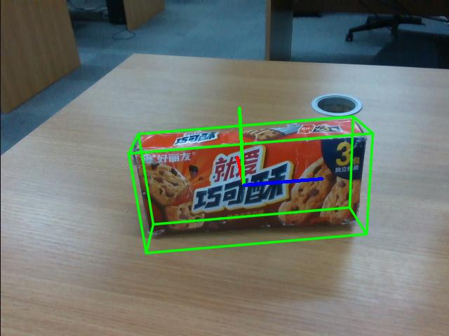

# <p class="hidden">SDK开发指南: </p>任意物品姿态

位姿估计技术是一种先进的计算机视觉方法，它能够根据物品的二维图像和深度信息来推断出物品在三维空间中的位置和方向。这项技术的应用前景广泛，特别是在自动化零售和物品抓取等领域，具有重要的实际应用价值。

根据物品mask图和CAD的3D模板来对物品进行位姿估计。它的输入是一张RGB图像和一张深度图、一张mask、CAD模板以及相机的内参，输出的是物品的姿态。
这一过程无需额外的训练步骤，可以直接利用预先提供的模型权重来进行计算。

这种方法可以有效应用于实际操作中，比如在新零售环境中实现自动化物品抓取，确保机器人能够精准地识别并处理货架上的商品。

**功能价值和特性**

FoundationPose 是一种先进的6D对象姿态估计和跟踪模型：

1. 统一的基础模型：FoundationPose 采用统一的基础模型架构，支持基于模型和无模型的设置。这使得它可以在提供对象的CAD模型或少量参考图像的情况下立即应用于新的对象，而无需进行额外的微调。
2. 神经隐式表示：该模型利用神经隐式表示来实现新视图合成，从而在同一框架下保持姿态估计模块的一致性。这种方法有效地弥合了基于模型和无模型设置之间的差距。
3. 强大的泛化能力：通过大规模的合成训练，FoundationPose 展现出强大的泛化能力。其训练过程结合了大语言模型、基于Transformer的架构以及对比学习公式，使其在多个公共数据集上的表现优异，特别是在处理具有挑战性的场景和对象时表现突出
4. 即时应用：FoundationPose 允许在测试时即时应用于新对象，无需微调。这使得用户可以快速部署和应用该模型，从而节省了大量的时间和资源

如果想要了解更多信息，请访问：[FoundationPose](https://github.com/NVlabs/FoundationPose)

本SDK对FoundationPose进行了封装与特异性适配，使用此功能，可以搭配识别/分割/追踪功能得到的Mask，生成对应物体的姿态，从而控制机械臂进行抓取，增强机械臂的操作性。

**使用场景**

FoundationPose 的应用场景广泛且多样。

1. 在工业机器人领域，FoundationPose 可以用于精确的对象定位和抓取，提升自动化生产线的效率和准确性。在自动驾驶和导航系统中，它可以用于识别和跟踪路标、障碍物及其他车辆，从而提高驾驶安全性。
2. 在增强现实（AR）和虚拟现实（VR）应用中，FoundationPose 可以实现精确的对象定位和交互，为用户提供更为沉浸式的体验。
3. 在医疗领域，FoundationPose 可以辅助医疗设备进行精确的手术操作和诊断，例如定位手术器械或识别医学图像中的病变区域。在视频监控和安全系统中，它可以用于实时对象跟踪和行为分析，增强安全监控的智能化水平。
4. 在学术研究中，FoundationPose 可以用于研究对象的动态姿态变化和3D重建，推动计算机视觉和机器人学领域的研究进展。

**目标用户**

- 视觉识别开发工程师
- 机器人开发工程师

## 1. 快速入门

### 代码目录结构

```
Foundationpose/
│
├── README.md        <- 项目的核心文档
├── requirements.txt    <- 项目的依赖列表
├── setup.py        <- 项目的安装脚本
│
├── FoundationPose/     <- 项目的源代码
│  ├── config           <- yaml配置文件夹
│  ├── debug            <- debug日志入口
│  ├── kaolin           <- 渲染功能依赖库
│  ├── learning         <- 数据处理与模型模块
│  ├── mycpp            <- 依赖库
│  ├── nvdiffrast       <- 高性能渲染依赖库
│  ├── datareader.py    <- 预测数据读取功能
│  ├── estimater11.py   <- 评估函数
│  ├── Utils.py         <- 解码部分
│  └── foundationpose_main.py    <- 核心功能接口函数
├── predict.py       <- 预测程序的主入口
└── tests/      <- 功能测试目录
```

### 基础环境准备

| 项目     | 版本              |
| :--------- | :------------------ |
| 操作系统 | ubuntu20.04       |
| 架构     | x86               |
| 显卡驱动 | nvidia-driver-535 |
| Python   | 3.8               |
| pip      | 24.2              |

### Python环境准备


| 包            | 版本         |
| --------------- | -------------- |
| cuda          | 11.8         |
| cudnn         | 8.0          |
| torch         | 2.0.0+cu118  |
| torchvision   | 0.15.1+cu118 |
| opencv-python | 4.10.0.84    |
| matplotlib    | 3.7.5        |
| pandas        | 2.0.3        |
| Pillow        | 9.5.0        |
| scipy         | 1.10.1       |
| open3d        | 0.18.0       |
| cmake         | 3.30.1       |

1. 确保已经安装了基本环境

安装Nvidia驱动，详细参考[安装Nvidia显卡环境](../getStarted/nivdia.md)

安装conda包管理工具和python对应环境，详细参考[安装conda和python环境](../getStarted/environment.md)

2. 构建python环境

创建conda虚拟环境

```bash
conda create --name [conda_env_name] python=3.8 -y
```

激活虚拟环境

```bash
conda activate [conda_env_name]
```

查看python版本

```bash
python -V
```

查看pip版本

```bash
pip -V
```

更新pip到最新版本

```bash
pip install -U pip
```

3. 安装python环境三方包依赖（按顺序安装）

安装pytorch的gpu版本和cuda等深度学习加速环境

```bash
pip install torch==2.0.0+cu118 torchvision==0.15.1+cu118 torchaudio==2.0.1 --index-url https://download.pytorch.org/whl/cu118
```

安装 pytorch3d 库，用于 3D 计算的 PyTorch 扩展

> 注意<br>
> 若编译失败，应该是内存不足或系统资源耗尽引起的。<br>
> 解决办法：在当前环境下输入export MAX_JOBS=4（限制编译时使用的并行工作线程,4可以换成内核数量的70%的值），再重新运行下面编译指令

```bash
pip install "git+https://github.com/facebookresearch/pytorch3d.git@stable"
```

安装用于科学计算、计算机视觉和3D处理类的库

```bash
pip install scipy joblib scikit-learn ruamel.yaml trimesh pyyaml opencv-python imageio open3d transformations warp-lang einops kornia pyrender pysdf
```

安装 Segment Anything 模型的最新代码及依赖项

```bash
pip install git+https://github.com/facebookresearch/segment-anything.git
```

克隆 NVlabs/nvdiffrast 仓库到本地，并作为 python 包安装

```bash
git clone https://github.com/NVlabs/nvdiffrast

cd nvdiffrast && pip install .
```

安装了一系列用于图像处理、机器学习、3D 可视化和数据科学的 Python 库

```bash
pip install scikit-image meshcat webdataset omegaconf pypng Panda3D simplejson bokeh roma seaborn pin opencv-contrib-python openpyxl torchnet Panda3D bokeh wandb colorama GPUtil imgaug Ninja xlsxwriter timm albumentations xatlas rtree nodejs jupyterlab objaverse g4f ultralytics==8.0.120 pycocotools py-spy pybullet videoio numba
```

安装或更新 PyTurboJPEG 的 Python 包

```bash
pip install -U git+https://github.com/lilohuang/PyTurboJPEG.git
```

安装依赖库（h5py、libeigen3-de和pybind11-dev）和构建一个项目

```bash
conda install -y -c anaconda h5py
sudo apt-get install libeigen3-dev -y
sudo apt-get install pybind11-dev -y
sudo apt-get install libboost-all-dev -y
cd FoundationPose/ && bash build_all.sh
```

克隆NVIDIA GameWorks组织下的Kaolin项目到本地，安装Kaolin项目作为一个可编辑的安装（editable install）到Python环境中

```bash
git clone https://github.com/NVIDIAGameWorks/kaolin.git
cd kaolin/
git switch -c v0.15.0
pip install -e .
cd ..
```

编译打包：在与 setup.py 文件相同的目录下执行以下命令：

```bash
python setup.py bdist_wheel
```

安装：在 dist 文件夹中找到 .wheel 文件，例如：dist/foundationpose-0.1.0-py3-none-any.whl。

```bash
pip install foundationpose-0.1.0-py3-none-any.whl
```

### 资源准备

下载训练好的【refine_ckpt.pth】权重：[下载refine_ckpt权重](https://pan.baidu.com/s/1i_7fKFHB2jXfU7hP9_hLpg?pwd=1234)

下载训练好的【predict_ckpt.pth】权重：[下载predict_ckpt权重](https://pan.baidu.com/s/1jARFDZGuSuICV00Pdjw8ww?pwd=1234)

### 代码获取

代码可以在[GitHub: 任意物品姿态](https://github.com/xialunhao0508/foundationpose)获取最新代码。

### 快速开始示例

```python
import copy
import json
import os.path
from types import SimpleNamespace
import cv2
import pyrealsense2 as rs
from FoundationPose.estimater11 import *
from FoundationPose.datareader import *
from FoundationPose.foundationpose_main import Detect_foundationpose


def main():
    # 读取图片
    image_path = "tests/demo_data/test_img"
    color_path = os.path.join(image_path, "rgb.png")
    depth_path = os.path.join(image_path, "depth.png")
    mask_path = os.path.join(image_path, "mask.png")

    # 指定物体模版
    mesh_path = "tests/demo_data/haoliyou/mesh/textured_mesh.obj"

    # 指定物体权重
    predict_ckpt_dir = "tests/weights/predict_ckpt/predict_ckpt.pth"
    refine_ckpt_dir = "tests/weights/refine_ckpt/refine_ckpt.pth"

    # 获取相机内参
    json_file = os.path.join(image_path, "intrinsics.json")
    with open(json_file, 'r+') as fp:
        intrinsics = json.load(fp, object_hook=lambda d: SimpleNamespace(**d))

    # 图片转化
    color_img = cv2.imread(color_path)
    depth_img = cv2.imread(depth_path, cv2.IMREAD_UNCHANGED)
    mask = cv2.imread(mask_path, cv2.IMREAD_GRAYSCALE)

    # 调用加载mesh和相关的资源
    est, reader, bbox, debug, to_origin = Detect_foundationpose.load_model(mesh_path, intrinsics, predict_ckpt_dir, refine_ckpt_dir)

    # 根据mesh进行位姿估计
    pose, color, to_origin = Detect_foundationpose.pose_est(color_img, depth_img, mask, reader, est,to_origin, bbox,show=True)

    # 位姿估计的可视化
    color = cv2.cvtColor(color, cv2.COLOR_BGR2RGB)
    cv2.imshow("pose", color)
    cv2.waitKey(0)


if __name__ == '__main__':
    main()

```

## 2. API参考

### 加载模版和模型 Detect_foundationpose.load_model

```python
est, reader, bbox, debug, to_origin = Detect_foundationpose.load_model(mesh_path, intrinsics, predict_ckpt_dir, refine_ckpt_dir)
```

根据不同的模版加载不同的姿态模型

- 函数输入：
  1. 模版文件
  2. 相机内参
  3. 姿态估计权重文件路径
  4. 姿态矫正微调权重文件路径
- 函数输出：
  1. 姿态估计模型
  2. 加载数据流对象
  3. 模版包围盒
  4. 调试模式
  5. 3D模版大小参数

### 运行推理 Detect_foundationpose.pose_est

根据mesh进行位姿估计，给定彩色和深度图像、mask信息，输出对应的物体的模版匹配的姿态信息。

```python
pose, color, to_origin = Detect_foundationpose.pose_est(color_img, depth_img, mask, reader, est,to_origin, bbox,show=True)
```

- 函数输入：
  1. 彩色图像
  2. 深度图像
  3. 物体识别的mask
  4. 加载数据流对象
  5. 姿态估计模型
  6. 3D模版大小参数
  7. 模版包围盒
  8. 是否可视化
- 函数输出：
  1. 3D模版到场景点云下的位姿还原估计
  2. 2D可视化图片
  3. 3D模版大小参数

## 3. 功能介绍

### 功能详解

输入目标图片可以输出识别结果，包含物品分割信息、位置信息、种类信息、置信度信息等等。



- 目标姿态

目标姿态将输出一个

### 功能参数

- 识别准确率：95%
- 识别错误率：1%
- 模型参数：320M
- 识别精度：1像素

## 4. 开发指南

### 图像输入规范

一般采用640x480x3通道的图片作为整个项目的输入，并使用BGR作为主要的通道顺序。一般推荐使用opencv方式读取的图片并传到模型中。

### 相机内参规范

相机内参规范为：

```python
{   
    "fx": 606.9906005859375, 
    "fy": 607.466552734375, 
    "ppx": 325.2737121582031, 
    "ppy": 247.56326293945312, 
    "height": 480, 
    "width": 640, 
    "depth_scale": 0.0010000000474974513
}
```

### 部署设备

推荐使用cuda平台，纯CPU形式的推理速度会比较慢，基本无法满足现实场景需求。

## 5.见问题解答（FAQ）

**1. 图像识别的速度主要受那些因素影响？**

主要受到硬件算力的影响，算力越高，推理时间越短。

**2. 如果我用的不是realsense摄像头，我可以用这个模型吗？**

当然可以，但是首先要将摄像头的彩色图像画面和深度画面转化为numpy数据对象，其次收集摄像头的内参，转化为相机内参规范的对象。即可以正常使用。

**3. 在机器人开发过程中我应该怎么使用该模型？**

首先使用物体识别或分割等等模型，拿到待识别物体的mask信息之后，输入到该模型内推理，并最终拿到物体的6D姿态信息，6D姿态可以经过计算得到一系列的下爪位姿，抓取方向等等。输入给到机械臂并完成抓取。

## 6. 更新日志

| 更新日期   | 更新内容 | 版本 |
| :----------- | :--------- | :----- |
| 2024.08.16 | 新增内容 | V1.0 |

## 7. 版权和许可协议

- 本项目遵循MIT许可证。
