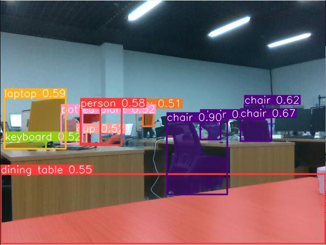

# <p class="hidden">SDK开发指南: </p>多模态识别

本项目是一种基于深度补偿的RGBD融合目标检测方法，主要使用RGB和深度双模态信息识别进行物品识别和物品分割。

**功能价值和特性**  

其中方法包括如下步骤：

1. 获取待检测目标的RGB图和深度图；
2. 基于编码器‑解码器网络，对RGB图进行处理，得到深度重建图；
3. 基于RGB图和深度重建图，通过Yolo_RGBD（YOLOV8改进版，增加了深度通道信息）改进模型对待检测目标进行识别，得到待检测目标的识别图像。通过结合高质量深度重建图，采用一种深度补偿后注入的解决思路，在做到精准识别的同时，实时性没有受到影响；
4. 在基于识别物体的图像分割位置后，得到物体的轮廓、中心点等信息，通过相机的内参 —+ 深度信息，转换将图像坐标点转化为相机坐标系下的三维点。三维点并可以进一步通过相机与机械臂的手眼标定结果转化为机械臂坐标系点位，实现定位转换。

**使用场景**  
常见使用场景包括自动驾驶中的行人和车辆检测、安防监控中的入侵者识别、零售行业的货物管理和顾客行为分析、医疗影像中的病灶检测、无人机导航以及工业自动化中的缺陷检测。

## 1. 快速入门

### 基础环境准备

| 项目     | 版本              |
| :------- | :---------------- |
| 操作系统 | ubuntu20.04       |
| 架构     | x86               |
| 显卡驱动 | nvidia-driver-535 |
| Python   | 3.8               |
| pip      | 24.2              |

### Python环境准备

| 包            | 版本     |
| ------------- | -------- |
| cuda          | 11.3     |
| cudnn         | 8.0      |
| torch         | 1.12.0   |
| torchvision   | 0.13.0   |
| opencv-python | 4.9.0.80 |
| pyyaml        | 5.4.1    |
| matplotlib    | 3.7.2    |
| pandas        | 1.5.3    |
| Pillow        | 9.5.0    |

1. 确保已经安装了基本环境

安装Nvidia驱动，详细参考[安装Nvidia显卡环境](../getStarted/nivdia.md)

安装conda包管理工具和python对应环境，详细参考[安装conda和python环境](../getStarted/environment.md)

2. 构建python环境

创建conda虚拟环境

```bash
conda create --name [conda_env_name] python=3.8 -y
```

激活conda虚拟环境

```bash
conda activate [conda_env_name]
```

查看python版本

```bash
python -V
```

查看pip版本

```bash
pip -V
```

更新 pip 到最新版本

```bash
pip install -U pip
```

3. 安装python环境三方包依赖

安装pytorch的gpu版本和cuda等深度学习加速环境

```bash
conda install pytorch==1.12.0 torchvision==0.13.0 torchaudio==0.12.0 cudatoolkit=11.3 -c pytorch -y
```

如果conda安装失败或时间过长 换成下面代码

```bash
pip install torch==1.12.0+cu113 torchvision==0.13.0+cu113 torchaudio==0.12.0 --extra-index-url https://download.pytorch.org/whl/cu113 -i https://pypi.tuna.tsinghua.edu.cn/simple
```

安装opencv

```bash
pip install opencv-python==4.9.0.80
```

安装pyyaml

```bash
pip install pyyaml==5.4.1
```

安装matplotlib

```bash
pip install matplotlib==3.7.2
```

安装pandas

```bash
pip install pandas==1.5.3
```

安装pillow

```bash
pip install Pillow==9.5.0
```

### 资源准备

下载训练好的【coco.pt】权重：[下载coco权重](https://pan.baidu.com/s/1PcBmpTTKZkkrnyO9mO320A?pwd=1234)

下载训练好的【CDNet.pth】权重：[下载CDNet权重](https://pan.baidu.com/s/1TDpGgA7FGXbigDhdiZapVA?pwd=1234)

### 代码获取

代码可以在[GitHub: 多模态识别](https://github.com/xialunhao0508/yolo-rgbd)获取最新代码。

### 快速开始示例

1. **识别推理**

    ```python
    from yolo_rgbd.interface import YoloRGBD
    from yolo_rgbd.solver import Solver

    yolo_weights = r'coco.pt'
    solver_weights = r'CDNet.pth'

    # 实例化类，加载模型框架，加载一些初始配置
    solver = Solver()
    rgbd = YoloRGBD()

    # 加载模型，写入权重
    model, solver_weights = rgbd.gen_model(yolo_weights=yolo_weights, solver=solver,
                                        solver_weights_path=solver_weights)

    # opencv方式读取图片信息
    color_image = cv2.imread("xxx.png")

    # 将彩色图片转化为深度图片信息
    deep_data_depth_esi = solver.test(color_image)

    # 将得到的深度图片信息转化为BGR信息
    deep_data = cv2.cvtColor(deep_data_depth_esi, cv2.COLOR_GRAY2BGR)

    # 将原RGB图和深度图片全部输入到模型内执行推理，并指定置信度
    results = rgbd.detect(model, color_image, deep_data, 0.5)

    # 将拿到的数据结果解包，获取到最终推理识别的所有的物品名词，识别置信度，分割最大外接矩形
    annotated_frame, names, rates, xyxys, masks = rgbd.backward_handle_output(results, color_image, depth_image, None)

    # 可视化
    cv2.imshow("annotated_frame", annotated_frame)
    cv2.waitKey(1)
    ```

2. **训练模型**

    ```python
    from ultralytics import YOLO

    # 从预设的网络文件新建一个新的模型对象
    model = YOLO(r"ultralytics/cfg/models/my-seg.yaml").load(
                "bus/models/pre_weights.pt") 

    # 设置为梯度变化
    torch.set_grad_enabled(True)

    # 输入对应的参数，开始训练
    model.train(data=data_path,
                epochs=epochs,
                batch=batch,
                optimizer='SGD',
                device=0 if torch.cuda.is_available() else "cpu")
    ```

## 2. API参考

### 转化为深度图 solver.test

将彩色图片转化为深度图片信息

```python
deep_data_depth_esi = solver.test(color_image)
```

将RGB转化为深度图片

- 函数输入：rgb图像
- 函数输出：单通道图像

### 目标检测 rgbd.detect

将原RGB图和深度图片全部输入到模型内执行推理，并指定置信度

```python
results = rgbd.detect(model, color_image, deep_data, 0.5)
```

识别目标图片内的物品

- 函数输入：
  1. 模型对象
  2. 彩色图像
  3. 由深度图像转化得到的彩色图像，用于辅助识别
  4. 置信度
- 函数输出：推理结果。ndarray对象。

### 结果转换 rgbd.backward_handle_output

将拿到的数据结果解包，获取到最终推理识别的所有的物品名词，识别置信度，分割最大外接矩形

```python
annotated_frame, names, rates, xyxys, masks = rgbd.backward_handle_output(results, color_image, depth_image, None)
```

将推理结果转化为具体的识别结果数据，比如识别种类、位置、mask（掩膜或轮廓）等等。

- 函数输入：
  1. 推理结果。ndarray对象。
  2. 彩色图像。
  3. 深度图像。

- 函数输出：
  1. annotated_frame：标注好的图像
  2. names：所有识别对象的名称列表
  3. rates：所有识别对象的置信度
  4. xyxys：所有识别对象的boundbox
  5. masks：所有识别对象的mask（掩膜或轮廓）

### 模型训练 model.train

输入对应的参数，开始训练

```python
model.train(data=data_path,
            epochs=epochs,
            batch=batch,
            optimizer='SGD',
            device=0 if torch.cuda.is_available() else "cpu")
```

收集数据之后开启训练，指定训练的轮次和其他配置信息，训练出属于自己数据集的模型。

- 函数输入：
  1. data：输出的数据集的yaml文件。
  2. epochs：训练轮次
  3. batch：单次训练的批次
  4. optimizer：指定优化器
  5. device：指定运行设备
- 函数输出：其输出是在对应文件夹下的有模型和模型的参数指标信息。

## 3. 功能介绍

### 功能详解

输入目标图片可以输出识别结果，包含物品分割信息、位置信息、种类信息、置信度信息等等。



- **目标检测**

目标检测器的输出是一组包围图像中物体的边界框，以及每个框的类别标签和置信度分数。当你需要识别场景中的感兴趣物体，但不需要知道物体的确切位置或其确切形状时，目标检测是一个很好的选择。

- **目标分割**

实例分割比目标检测更进一步，涉及在图像中识别并分割出各个单独的物体。

实例分割模型的输出是一组掩膜或轮廓，用于描绘图像中每个物体的边界，同时还包括每个物体的类别标签和置信度分数。当你不仅需要知道图像中物体的位置，还需要了解它们的确切形状时，实例分割非常有用。

### 功能参数

- 识别准确率：95%
- 识别错误率：1%
- 模型参数：320M
- 识别精度：1像素

## 4. 开发指南

### 图像输入规范

一般采用640x480x3通道的图片作为整个项目的输入，并使用BGR作为主要的通道顺序。一般推荐使用opencv方式读取的图片并传到模型中。

### 模型预热

当我们第一次加载模型之后，需要给模型一个数据，可以是随机数据来运行一次模型以达到预热模型的效果，此举主要的目的是将一些可能用到的内存空间分配到位。

### 部署设备

推荐使用cuda平台，纯CPU形式的推理速度会比较慢，基本无法满足现实场景需求。同时若您选择在一些边设备上运行此模型，推荐转化为TensorRT引擎能加速整个推理过程。

## 5. 常见问题解答（FAQ）

**1. 如果我不想用推荐环境配置，自行安装环境版本的选择顺序是什么？**

操作系统 -> 显卡驱动版本 -> cudnn版本 -> cuda版本 -> torch版本 -> torchvision版本 -> python版本

按照以上顺序安装并适配。

**2. 图像识别的速度主要受那些因素影响？**

主要受到硬件算力的影响，算力越高，推理时间越短。

**3. 如何在机械臂调试的过程中使用该模型？**

该模型可以帮助在相机坐标系下进一步确认物体坐标信息，若需要在机械臂坐标系下得到计算结果，还需要进一步根据手眼标定结果转换坐标。

## 6. 更新日志

| 更新日期   | 更新内容 |版本 |
| :--------- | :------- |:------- |
| 2024.08.16 | 新增内容 |V1.0 |

## 7. 版权和许可协议

- 本项目遵循MIT许可证。
