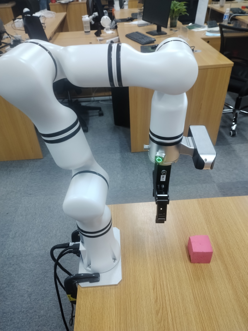

# <p class="hidden">SDK开发指南: </p>机械臂视觉垂直抓取

一种适用于RM机械臂结合视觉在桌面识别抓取物体的操作方法，最小能在桌面级抓取起小于等于1cm高度的物体。

**基本方法**<br>
其中方法包括如下步骤：

1. 识别物体的位置信息，按照位置信息将夹爪先行移动到物体正上方。
2. 识别物体的高度信息，按照高度信息确认夹爪下爪深度。
3. 识别物体的mask信息，按照物体mask信息确认夹爪偏转角度。
4. 一次检测即可实现全部信息的检测，无需多次检测。

**使用场景**<br>
机械臂视觉垂直抓取提高了从垂直或倾斜面抓取物体的效率，优化了自动化系统的工作流程。广泛应用于生产线装配、仓储物流、书籍管理、电子产品组装及医疗设备操作等场景。

**目标用户**  

- 集成开发者&机械臂应用开发者：基于本接口可以快速将机械臂结合视觉应用于生产线装配、仓储物流、书籍管理、电子产品组装及医疗设备操作等场景，提高自动化项目中的开发效率，减少开发周期。
- 科研用户：基于本接口可以扩展基于视觉功能的算法开发，大模型应用等。
- 教育用户：基于示例设计机器人学、机器人操作系统、机器视觉等相关课程的实验项目，使学生可以将理论知识进行实践应用。

## 1. 快速入门

### 基础环境准备

| 项目 | 版本 |
|:-----|:-----|
| 操作系统 | ubuntu20.04 |
| 架构 | x86 |
| Python | 3.8 |
| pip | 24.2 |

### Python环境准备

| 依赖 | 版本 |
|:-----|:-----|
| opencv-python | 4.9.0.80 |
| matplotlib | 3.7.5 |
| numpy | 1.24.4 |
| Pillow | 10.4.0 |
| scipy | 1.10.1 |

（1）确保已经安装了基本环境

安装conda包管理工具和python对应环境，详细参考[安装conda和python环境](../getStarted/environment.md)

（2）构建python环境

创建conda虚拟环境

```bash
conda create --name [conda_env_name] python=3.8 -y
```

激活conda虚拟环境

```bash
conda activate [conda_env_name]
```

查看python版本

```bash
python -V
```

查看pip版本

```bash
pip -V
```

更新 pip 到最新版本

```bash
pip install -U pip
```

3. 安装python环境三方包依赖

安装opencv

```bash
pip install opencv-python==4.9.0.80
```

安装matplotlib

```bash
pip install matplotlib==3.7.5
```

安装numpy

```bash
pip install numpy==1.24.4
```

安装pillow

```bash
pip install Pillow==10.4.0
```

安装scipy

```bash
pip install scipy==1.10.1
```

### 代码获取

代码可以在[GitHub: 垂直抓取](https://github.com/xialunhao0508/vertical_grab)获取最新代码。

### 运行代码

```python
# 获取视频帧
color_image = cv2.imread("xxx.png")
depth_image =  cv2.imread("xxx.png")
mask =  cv2.imread("xxx.png")

# 获取相机内参信息，以下为伪代码
color_intr = camere.get_intr()

# 获取当前的位姿信息，以下为睿尔曼机械臂SDK操作
_, joints, pose, _, _ = arm.Get_Current_Arm_State()

# 计算出垂直抓取的三个关键节点
above_object_pose, correct_angle_pose, finally_pose = vertical_catch(mask, depth_image, color_intr, pose, 165, [0, 0, -0.25], [], [])

# 移动到第一个位置，以下为睿尔曼机械臂SDK操作
arm.movej_p(above_object_pose)

# 移动到第二个位置，以下为睿尔曼机械臂SDK操作
arm.movej_p(above_object_pose)

# 夹爪夹取，以下为睿尔曼机械臂SDK操作
ret = arm.Set_Gripper_Pick_On(500, 500)

# 移动到第三个位置，以下为睿尔曼机械臂SDK操作
arm.movej_p(above_object_pose)
```

## 2. API参考

### 计算抓取位置 vertical_catch

```python
above_object_pose, correct_angle_pose, finally_pose = vertical_catch(mask, depth_image, color_intr, pose, 165, [0, 0, -0.25], [], [])
```

根据提供的信息，计算出垂直抓取必须经过的三个位置。

- 函数输入：
  1. mask: 物体轮廓信息
  2. depth_frame: 深度帧
  3. color_intr: 相机内参
  4. current_pose: 当前位姿
  5. arm_gripper_length: 夹爪长度
  6. vertical_rx_ry_rz: 预设的夹爪垂直的位姿
  7. rotation_matrix: 手眼标定结果的转换矩阵
  8. translation_vector: 手眼标定结果的平移矩阵
  9. use_point_depth_or_mean: 是否使用平均深度还是单点深度，True：使用单点深度
- 函数输出：
  1. above_object_pose：物体正上方约10cm的位置
  2. correct_angle_pose：夹爪或机械手按照物体位姿方向转动
  3. finally_pose：最终夹取的位置

## 3. 功能介绍

### 使用条件

- 机械臂需要正装在桌面上，抓取物品必须放在桌面以上位置且在摄像头检测范围内。如下图参考安装：



### 功能详解

根据环境和设备信息的参数输入计算出垂直方式抓取物体的三个关键步骤点位，根据三个点位即可以发送给机械臂SDK并实施移动和抓取。

- 输入参数：
  1. 当前环境的彩色图片、深度图片；
  2. 物体轮廓mask（需要使用其他AI SDK获取）；
  3. 收集机械臂当前位姿；
  4. 收集摄像头信息。

<video width="300px" autoplay loop muted height="300px" >
  <source src="../developerGuide/doc/verticalGrab.mp4" type="video/mp4">
</video>

- 输出参数：垂直抓取的三个点位。

三个点位是按照夹取物体并规避碰撞物体或桌面的形式计算而来，具体的点位信息是：

1. 物体正上方10cm左右，这将有力于机械臂下爪时不会触碰到物体。
2. 计算物体的长短边，判断夹取长边的转轴角度，根据机械臂当前位姿计算出转轴的最终位姿。
3. 真正抓取物体的位姿，通过桌面坐标系和物体高度计算出最终夹爪下移距离，并计算出最终位姿。

## 4. 开发指南

### 图像输入规范

一般采用640x480x3通道的图片作为整个项目的输入，并使用BGR作为主要的通道顺序。一般推荐使用opencv方式读取的图片并传到模型中。

一般采用了640x480x1通道的深度信息图片做为项目输入。

### 长度输入规范

本案例中所有的长度单位均是以mm为单位的。

### 相机内参规范

相机内参规范为：

```python
{   
    "fx": 606.9906005859375, 
    "fy": 607.466552734375, 
    "ppx": 325.2737121582031, 
    "ppy": 247.56326293945312, 
    "height": 480, 
    "width": 640, 
    "depth_scale": 0.0010000000474974513
}
```

### 手眼标定结果规范

手眼标定结果规范：

```python
hand_to_camera = np.array(
    [[0.012391991619246201, 0.9775253241173848, -0.21045350853076827, -0.06864240753156699],
    [-0.9998988955501277, 0.01358205757415265, 0.0042102719255664445, 0.0435019505437101],
    [0.006974039098208998, 0.21038005709014823, 0.9775948007008847, -0.0005546366642718483],
    [0, 0, 0, 1]])

```

## 5. 常见问题解答（FAQ）

**1. 垂直抓取会触碰到桌面吗？**

正常操作下不会，因为当机械臂在桌面安装之后，桌面相当于0坐标系，桌面抓取坐标会严格限制z>=0，所以不会触及到桌面。

**2. 抓取的时候最终的偏转角偏转方向不对，怎么调整？**

检查输入参数vertical_rx_ry_rz，这个值代表了静止状态下，夹爪与机械臂以及摄像头平行的情况下，夹爪自身的位姿的rx，ry，rz。

**3. 三个位姿机械臂一定要按顺序移动吗？**

不用按顺序移动。第三个位姿为物体的确切位姿，其他两个位姿为移动辅助位姿，移动辅助位姿是为了避免在移动过程中，夹爪触碰到物体导致物体移动而专门设置的。

**4. 一定要保证抓取的物品和机械臂安装的平台在同一高度吗？**

不用保证抓取的物品和机械臂安装的平台在同一高度。改变夹爪长度，即等同于修改抓取平台高度。
>转换关系为：增加夹爪长度 -> 抓取平面高于安装平台；减少夹爪长度 -> 抓取平面低于安装平台。

**5. 如果我抓取的时候夹爪会触碰到桌子，或者夹取的不够深，我应该怎么做？**

可以调整夹爪的末端长度进行解决。
>转化关系为：夹爪会触碰到桌子 -> 逐渐增加夹爪长度；夹爪夹取不够深 -> 逐渐减少夹爪长度。

## 6. 更新日志

|更新日期|更新内容|版本|
|:--|:--|:--|
|2024.08.16|新增内容|V1.0|

## 7. 版权和许可协议

- 本项目遵循MIT许可证。
