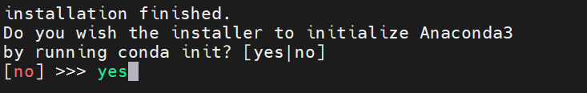

# <p class="hidden">快速开始：</p>安装conda和python环境 V1.0

文档详细介绍了如何安装AI算法的conda包管理工具的安装方法、基本的python环境安装方式、显卡加速驱动的安装方式。
<br>此教程的主要目的是构建基础的AI开发环境，并让读者能快速上手AI调试。

**目标用户**  

人工智能开发者

## 详细教程

### 基础环境准备

| 项目     | 版本        |
| :------- | ----------- |
| 操作系统 | ubuntu20.04 |
| 架构     | x86         |

#### 安装conda

算法环境大多需要conda源内的包支持，且不同算法之间的环境为避免冲突需要隔离，所以选择用conda来构建虚拟环境执行。
conda可以直接安装python、pip这些基础包，这减免了本身安装的耗时。

1. 下载conda安装包

```bash
wget https://mirrors.tuna.tsinghua.edu.cn/anaconda/archive/Anaconda3-2021.11-Linux-x86_64.sh
```

2. 增加可执行权限

```bash
chmod +x ./Anaconda3-2021.11-Linux-x86_64.sh
```

3. 执行sh文件安装

过程中输入安装位置等一些配置参数。可以直接使用【回车】使用默认配置，默认安装位置为当前用户的：~/anaconda3。

```bash
bash Anaconda3-2021.11-Linux-x86_64.sh
```

4. 执行conda的初始化操作

通过安装最后一步的交互：



或可安装完成后通过命令行

```bash
~/anaconda3/bin/conda init
```

5. 使conda环境生效

```bash
source ~/.bashrc
conda -V
```

6. 配置conda到国内源，推荐清华源

> 可以自定义其他源。

```bash
conda config --add channels https://mirrors.tuna.tsinghua.edu.cn/anaconda/pkgs/main/
conda config --add channels https://mirrors.tuna.tsinghua.edu.cn/anaconda/pkgs/r/
conda config --add channels https://mirrors.tuna.tsinghua.edu.cn/anaconda/pkgs/msys2/
conda config --add channels https://mirrors.tuna.tsinghua.edu.cn/anaconda/cloud/conda-forge/
conda config --set show_channel_urls yes
```

7. 使源配置生效

```bash
conda update -n base -c defaults conda
```

至此，conda环境安装完成，可以使用conda环境来配置和管理python环境。

#### 安装python

1. 确认conda安装完成，使用conda配置安装python

这里推荐使用python3.8版本

```bash
conda -V

conda create --name py38 python=3.8 -y
```

2. 切换到新建的python环境并检查python版本和pip版本。

```bash
conda activate py38
python -V
pip -V
```

3. 修改pip源为国内源，推荐清华源，以加速包下载的速度。

```bash
pip config set global.index-url https://pypi.tuna.tsinghua.edu.cn/simple
```
> 源可以自定义

4. 将python包管理工具pip升级到最新版本。

```bash
pip install -U pip
```
