# <p class="hidden">SDK developer guide: </p>Hand-eye Calibration

## Overview

The hand-eye calibration is usually used in the field of robot and computer vision, especially in the scene where the interaction between the robotic arm and the environment needs to be accurately controlled. It is intended to unify the frames of the end effector (two-finger gripper, etc.) of the robotic arm and the camera for the coordinate transformation relationship between the camera and the robotic arm so that the robotic arm can accurately grasp the target positioned by the camera.

The hand-eye system is the relationship between the hand (robotic arm) and the eye (camera). When the eye (camera) sees an object, it has to tell the hand (robotic arm) the position of the object. After the position of the object in the eye (camera) is determined, if the relationship between the eye (camera) and the hand (robotic arm) is established, the position of the object in the hand (robotic arm) is available.

The hand-eye calibration is required in multiple scenes such as robot grasping objects, dynamic environment interaction, precision measurement and detection, and visual servo control.

After hand-eye calibration, no recalibration is necessary unless the relative position of the camera and the robotic arm changes. The following calibration methods apply to upright, side, and flip mounting.

**Two types of hand-eye calibration:**

- Type 1: The eye (camera) is fixed in a hand (robotic arm)

Eye-in-hand system: The camera, mounted at the end of the robotic arm, moves with the robotic arm.

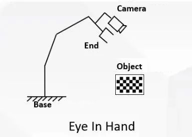

- Type 2: The eye (camera) is fixed outside the hand (robotic arm)

Eye-to-hand system: The camera is mounted outside the robotic arm.

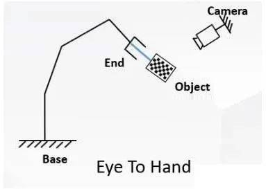

## Principle

### 1. Eye-in-hand

**For the eye-in-hand situation, the robot hand-eye calibration is to calibrate the coordinate transformation relationship between the camera and the end of the robotic arm:**

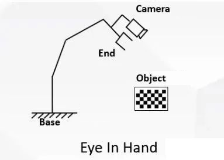

In the process of transforming the three-dimensional coordinates of the target point, the first problem is the position change relationship between frames of the end and the camera, that is, the hand-eye position relationship and the result of hand-eye calibration. The relationship is represented by the symbol X and solved by the equation AX=XB. Where A represents the **transformation relationship of the end** in two adjacent movements; and B represents the **relative motion of camera frame** in two adjacent movements.

As shown in the picture, it is the eye-in-hand. (It is for illustration purposes only, rather than a real experimental scene.) Fixed at the end of the robotic arm, the camera moves with the robotic arm.

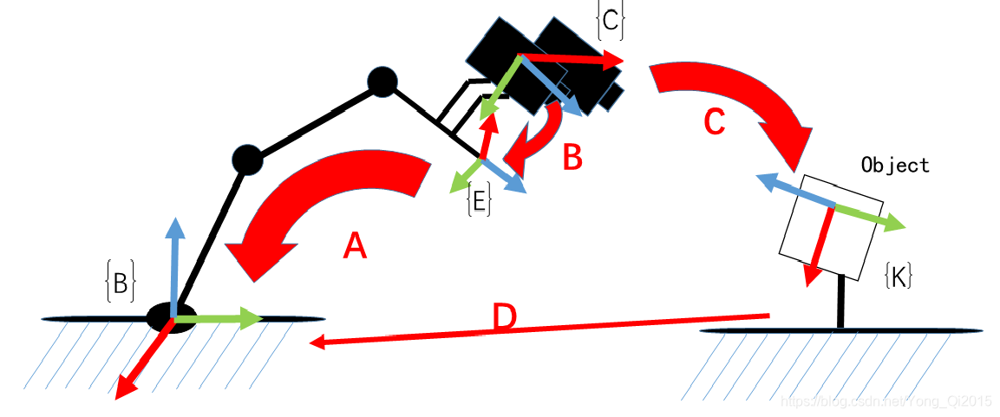

- A: Refers to the pose of the end in the robotic arm frame, which is obtained through the robotic arm API (known).

  $$
  ^{base}_{end}M
  $$

- B: Refers to the pose of the camera in the end frame. The transformation is fixed, and if it is known, the actual position of the camera is available at any time, so it is necessary (unknown, to be computed).

  $$
  ^{end}_{camera}M
  $$
  
- C: Refers to the pose of the camera in the object frame, which is the extrinsic parameter of the camera (computed by the camera calibration).

  $$
  ^{board}_{camera}M
  $$
  
- D: Refers to the pose of the object in the base frame. In the calibration process, if only the end of the robotic arm is moving, and the object and base is not moving, the pose relationship is fixed.
  $$
  ^{base}_{board}M
  $$

Therefore, if B is obtained, the pose D of the object in the robotic arm frame is available.

$$
^{base}_{board}M =^{base}_{end}M * ^{end}_{camera}M * ^{camera}_{board}M
$$

As shown in the figure, move the robotic arm to two positions, ensure that the object is seen under both positions, then construct the space transformation loop:

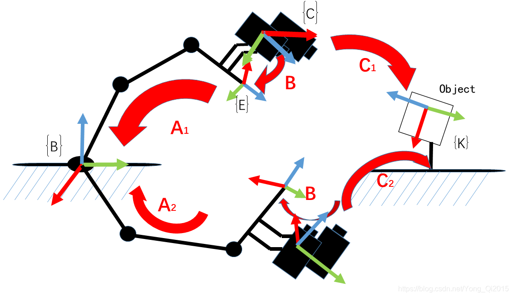

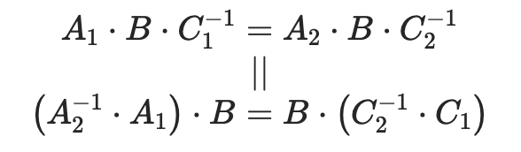

Then we can obtain the Cauchy-Schwarz Inequality:

$$
{M_1}^{end}_{base} \cdot  {M_1}^{base}_{camera} \cdot {M_1}^{camera}_{board} = ^{end}_{base}M_2 \cdot ^{base}_{camera}M_2 \cdot ^{camera}_{board}M_2 \\ \parallel \\\ 
^{end}_{base}M_2^{-1} \cdot ^{end}_{base}M_1 \cdot  ^{base}_{camera}M_1 =^{base}_{camera}M_2 \cdot ^{camera}_{board}M_2 \cdot ^{camera}_{board}M_1^{-1}\\  ......   \\ 
^{end}_{base}M_n^{-1} \cdot ^{end}_{base}M_{n-1} \cdot ^{base}_{camera}M_{n-1}=^{base}_{camera}M_n \cdot ^{camera}_{board}M_n \cdot ^{camera}_{board}M_{n-1}^{-1}
$$

It is a typical equation**AX=XB**, and by definition, where X is a 4×4 homogeneous transformation matrix:

$$
X=\left[\matrix{R &t \\0&1}\right]
$$

The purpose of hand-eye calibration is to compute `X`.

### 2. Eye-to-hand

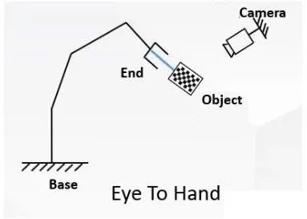

During **eye-to-hand** calibration, **fix the base and camera**, and **mount the object at the end of the robotic arm**, **so the relationship between the object and the end and between the camera and the base remains unchanged**.

**Calibration target:**

Frame transformation matrix from camera to base

$$^{base}_{camera}M$$

**Method:**

1. Mount the object at the end of the robotic arm.
2. Move the end of the robotic arm and use the camera to take n images (10−20) of the object under different robotic arm poses.

Each time the image and robotic arm pose are collected, the following equation is met:

$$^{end}_{board}M = ^{end}_{base}M* ^{base}_{camera}M*^{camera}_{board}M$$

Where,

- Transformation matrix from the object to the end (the object is fixed at the end of the robotic arm during the calibration, so the transformation matrix from the object to the end remains unchanged)
$$^{end}_{board}M$$

- Use the end pose to obtain
$$^{end}_{base}M $$

- Use the hand-eye calibration to obtain
$$^{base}_{camera}M$$

- Use the camera calibration to obtain
$$^{camera}_{board}M$$

Finally, the following equation is obtained:

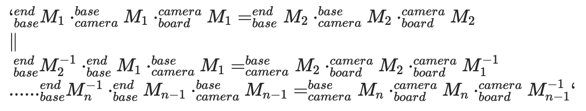

It is also a typical equation **AX=XB**, and by definition, where X is a 4×4 homogeneous transformation matrix, R is the rotation matrix from camera to base frame, and t is the translation vector from camera to base frame:

$$
X=\left[\matrix{R &t \\0&1}\right]
$$

The purpose of hand-eye calibration is to compute `X`.

## Key code interpretation

### Code access

Get the latest code in [github link](https://github.com/RealManRobot/hand_eye_calibration).

### Code directory

```
├── eye_hand_data  # Data collected during eye-in-hand calibration
├── libs
│   ├── auxiliary.py  # Auxiliary packages for the program
│   └── log_settings.py  # Log packages
├── robotic_arm_package  # Robotic arm python package
├── collect_data.py  # Hand-eye calibration data collection program
├── compute_in_hand.py # Eye-in-hand calibration computation program
├── compute_to_hand.py # Eye-to-hand calibration computation program
├── requirements.txt  # Environment dependency file
├── save_poses.py  # Computation dependency file
└── save_poses2.py  # Computation dependency file
```

### compute_in_hand.py | compute_to_hand.py Key code interpretation

#### 1. Main function `func()`

**compute_in_hand.py | compute_to_hand.py**  

```python
def func():

    path = os.path.dirname(__file__)

    # Subpixel corner point finding criteria
    criteria = (cv2.TERM_CRITERIA_MAX_ITER | cv2.TERM_CRITERIA_EPS, 30, 0.001)

    # Prepare the 3D point coordinates of the object
    objp = np.zeros((XX * YY, 3), np.float32)
    objp[:, :2] = np.mgrid[0:XX, 0:YY].T.reshape(-1, 2)
    objp = L * objp

    obj_points = []     # Save 3D points
    img_points = []     # Save 2D points

    images_num = [f for f in os.listdir(images_path) if f.endswith('.jpg')]

    for i in range(1, len(images_num) + 1):
        image_file = os.path.join(images_path, f"{i}.jpg")

        if os.path.exists(image_file):
            logger_.info(f'Read {image_file}')

            img = cv2.imread(image_file)
            gray = cv2.cvtColor(img, cv2.COLOR_BGR2GRAY)

            size = gray.shape[::-1]
            ret, corners = cv2.findChessboardCorners(gray, (XX, YY), None)

            if ret:
                obj_points.append(objp)
                corners2 = cv2.cornerSubPix(gray, corners, (5, 5), (-1, -1), criteria)
                if [corners2]:
                    img_points.append(corners2)
                else:
                    img_points.append(corners)

```

The above code iterates through the collected object images to obtain the checkerboard corner points one by one and put them into the array.

#### 2. Camera calibration

**compute_in_hand.py | compute_to_hand.py**

```python
# Calibrate and get the pose of the image in the camera frame
ret, mtx, dist, rvecs, tvecs = cv2.calibrateCamera(obj_points, img_points, size, None, None)

```

- `calibrateCamera` function of OpenCV is used to calibrate the camera and compute the intrinsic parameters and distortion coefficient of the camera.
- `rvecs` and `tvecs` are the rotation and translation vectors of each image respectively, representing *the pose of the object in the camera frame**.

#### 3. Processing of robotic arm pose data

**compute_in_hand.py**

```python
poses_main(file_path)
```

Convert the pose data of the robotic arm end into the rotation matrix and translation vector of the **end frame** against the **base frame**.

**compute_to_hand.py**

```python
poses2_main(file_path)
```

Convert the pose data of the robotic arm end into the rotation matrix and translation vector of the **base frame** against the **end frame**.

####  4. Hand-eye calibration computation

```python
R, t = cv2.calibrateHandEye(R_tool, t_tool, rvecs, tvecs, cv2.CALIB_HAND_EYE_TSAI)

return R,t

```

- Use the `calibrateHandEye` function of OpenCV for hand-eye calibration.

  1. In compute_in_hand.py, compute the rotation matrix **R_cam2end** and the translation vector **T_cam2end** of the **camera** against the **end**.

    ```C
    void
    cv::calibrateHandEye(InputArrayOfArrays R_end2base,
                         InputArrayOfArrays T_end2base,
                         InputArrayOfArrays R_board2cam,
                         InputArrayOfArrays T_board2cam,
                         OutputArray R_cam2end,
                         OutputArray T_cam2end,
                         HandEyeCalibrationMethod method = CALIB_HAND_EYE_TSAI)
    ```

  2. In compute_to_hand.py, compute the rotation matrix **R_cam2base** and the translation vector **T_cam2base** of the **camera** against the **base**.

    ```C
    void
    cv::calibrateHandEye(InputArrayOfArrays R_base2end
                         InputArrayOfArrays T_base2end
                         InputArrayOfArrays R_board2cam
                         InputArrayOfArrays T_board2cam
                         OutputArray R_cam2base
                         OutputArray T_cam2base
                         HandEyeCalibrationMethod method = CALIB_HAND_EYE_TSAI)
    ```

- Adopt the `CALIB_HAND_EYE_TSAI`, which is a common hand-eye calibration algorithm.

### `save_poses.py` Key code interpretation

#### 1. **Define a function that converts Euler angles into the rotation matrix**

```python
def euler_angles_to_rotation_matrix(rx, ry, rz):
    # Compute the rotation matrix
    Rx = np.array([[1, 0, 0],
                   [0, np.cos(rx), -np.sin(rx)],
                   [0, np.sin(rx), np.cos(rx)]])

    Ry = np.array([[np.cos(ry), 0, np.sin(ry)],
                   [0, 1, 0],
                   [-np.sin(ry), 0, np.cos(ry)]])

    Rz = np.array([[np.cos(rz), -np.sin(rz), 0],
                   [np.sin(rz), np.cos(rz), 0],
                   [0, 0, 1]])

    R = Rz @ Ry @ Rx

    return R
```

- Define a function that converts Euler angles (rotations around axes X, Y, and Z) into the rotation matrix.
- Rotate in the order Z-Y-X, and multiply the rotation matrix of each axis to obtain the final rotation matrix `R`.

#### 2. **Convert the pose to a homogeneous transformation matrix**

```python
def pose_to_homogeneous_matrix(pose):
    x, y, z, rx, ry, rz = pose
    R = euler_angles_to_rotation_matrix(rx, ry, rz)
    t = np.array([x, y, z]).reshape(3, 1)

    H = np.eye(4)
    H[:3, :3] = R
    H[:3, 3] = t[:, 0]

    return H
```

- Convert the pose (position and orientation) into a 4×4 homogeneous transformation matrix for matrix operations.
- Take the position `(x, y, z)` as the translation vector and the orientation `(rx, ry, rz)` as the rotational Euler angles.
- Use the resulting homogeneous transformation matrix `H` to indicate the **rotation transformation of the end against the base**.

#### 3. **Save multiple matrices to a CSV file**

```python
Copy codedef save_matrices_to_csv(matrices, file_name):
    rows, cols = matrices[0].shape
    num_matrices = len(matrices)
    combined_matrix = np.zeros((rows, cols * num_matrices))

    for i, matrix in enumerate(matrices):
        combined_matrix[:, i * cols: (i + 1) * cols] = matrix

    with open(file_name, 'w', newline='') as csvfile:
        csv_writer = csv.writer(csvfile)
        for row in combined_matrix:
            csv_writer.writerow(row)
```

- Concatenate multiple matrices horizontally into one large matrix and save it to a CSV file.

- Keep each matrix at a fixed number of columns, so that individual matrices can be split at fixed intervals when read.

## Calibration procedure

### 1. Environmental requirements

#### Basic environment preparation

| Item     | Version              |
| :------- | :------------- |
| Operating system | ubuntu/windows |
| Python   | 3.8 and above      |

#### Python environment preparation

| Package            | Version         |
| :------------ | :---------- |
| numpy         | 2.0.2       |
| opencv-python | 4.10.0.84   |
| pyrealsense2  | 2.55.1.6486 |
| scipy         | 1.13.1      |

Execute the following command to install the packages required for the hand-eye calibrator in a python environment:

```bash
pip install -r requirements.txt
```

#### Equipment preparation

- Robotic arm: RM75 RM65  RM63 GEN72
- Camera: Intel RealSense Depth Camera D435
- Special data cable for camera
- Network cable
- Object (1 or 2)

  1. Print a paper object.
     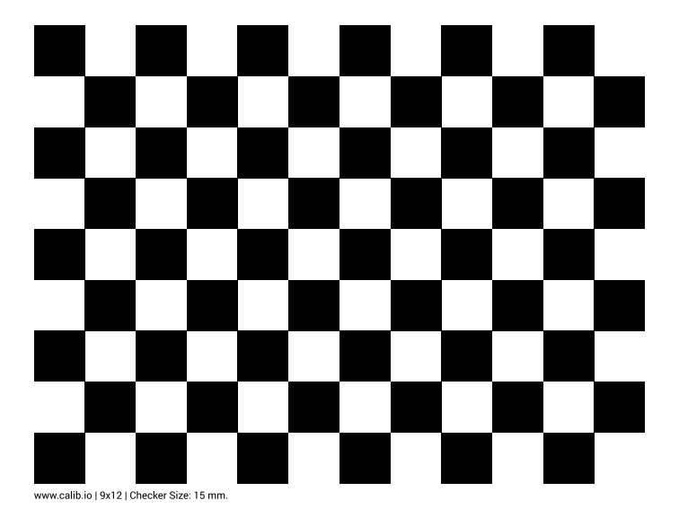
  2. Search "object checkerboard" and buy on Taobao.

#### The API version in the program corresponds to the controller version of the robotic arm

1. Open the teach pendant to view the controller version of the robotic arm.<br>
  Teach pendant: Configuration - Robotic arm configuration - Version information
  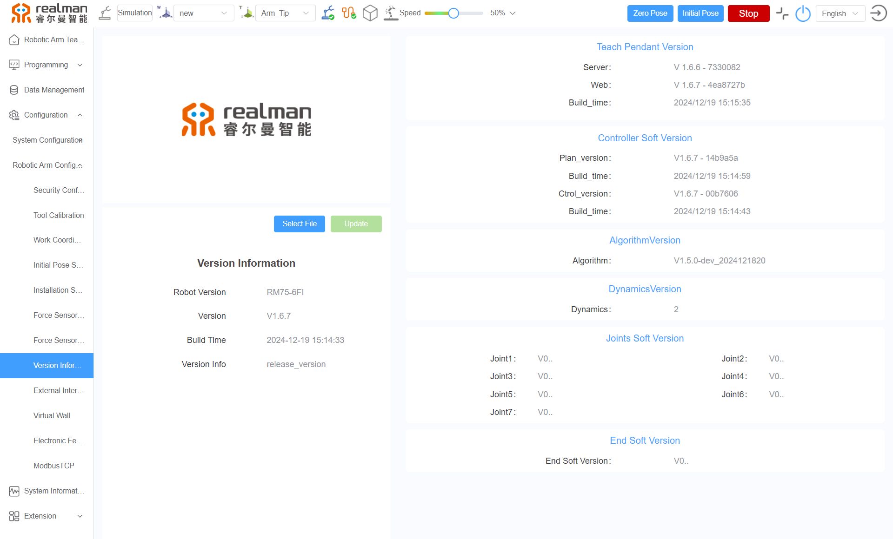

2. The API version of the robotic arm in the program is 4.3.3.<br>
  Check if the controller version corresponds to the API version in the current program. For detail, refer to the [Version Changelog](../../../robot/releaseNotes/releaseNotes/index.md).
3. According to the correspondence between the controller version and the API version, select a specific version of controller software or API for upgrade.<br>
  Method of upgrading the controller version [web-version user manual for teach pendant](../../../robot/download/userManual/index.md)

### 2. Calibration procedure

#### Parameter configuration

Set the object parameters and robotic arm type in the configuration file (config.yaml).

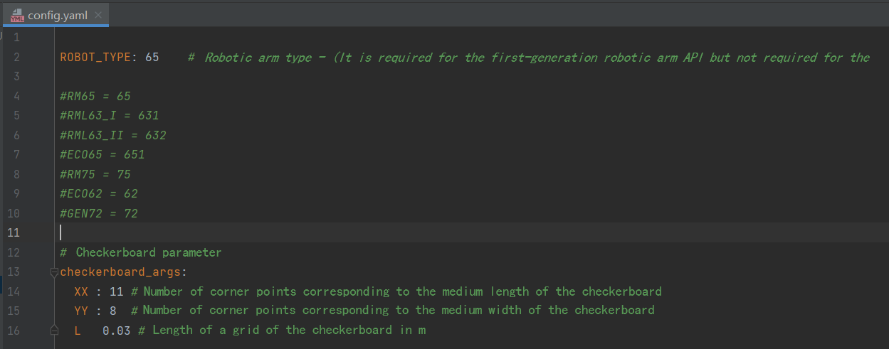

There are four parameters in config.yaml as follows.

1. ROBOT_TYPE: Refers to the robotic arm type. The default is 65, indicating the RM65 robotic arm.
2. xx: Refers to the horizontal corner points of the object (the number of long side grids minus 1). The default is 11, indicating that the corner points are 11 when the long side grids in the following figure are 12.
3. YY: Refers to the number of longitudinal corner points of the object (the number of short side grids minus 1). The default is 8, indicating that the corner points are 8 when the short side grids in the following figure are 9.
4. L: Refers to the actual size of a single grid of the object (in m). The default is 0.03.

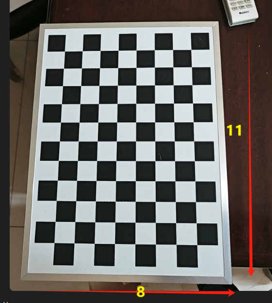

#### Eye-in-hand

##### Data collection

1. Use the camera cable to connect the **computer** and the D435 camera, and the network cable to connect the **computer** and the robotic arm.
2. Set the IP addresses of the computer and the robotic arm to the same network segment.
    - If the IP address of the robotic arm is 192.168.1.18, set the IP address of the computer to network segment 1.
    
    - If the IP address of the robotic arm is 192.168.10.18, set the IP address of the computer to network segment 10 (see settings above).
3. Place the object on the plane, fix the camera at the end of the robotic arm, and align the camera with the object.
    - During the calibration, the object is **fixed** in the working area of the robotic arm to ensure that it is observed by the **camera installed at the end of the robotic arm from different angles**. The exact position of the object is unimportant because it is not necessary to know its pose against the base. However, the object shall **remain stationary** during the calibration.
4. Run the script `collect_data.py`, and a pop-up window will appear.
5. Drag the end of the robotic arm until the object in the camera view is clear and complete, and place the cursor on the pop-up window.

**Note:**

- Keep the **object** in the camera view at **an angle** with the **camera mirror**.

  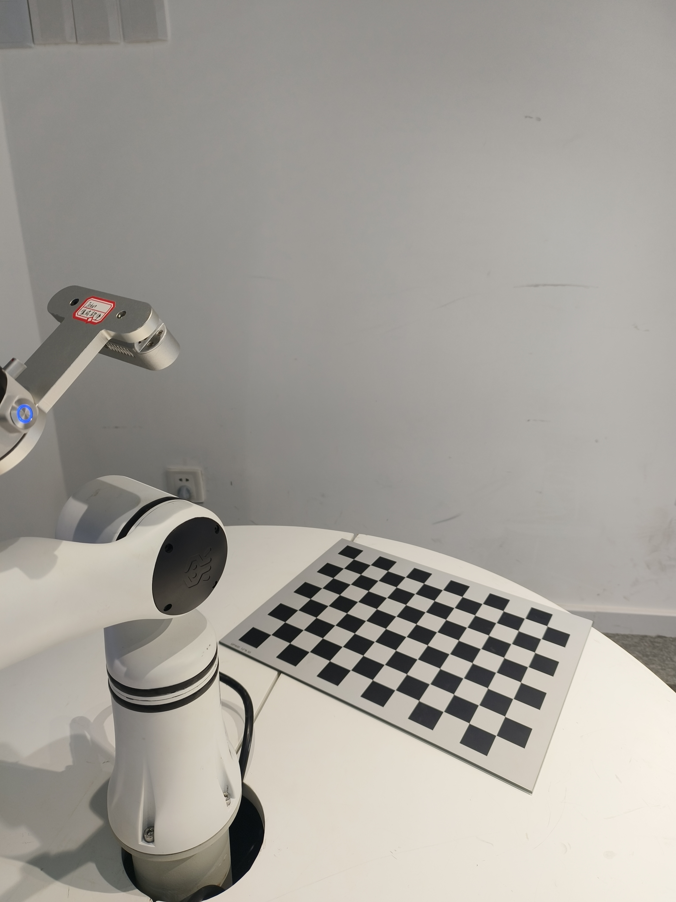

  The following pose is **wrong**:
  

6. Click `s` on the keyboard to collect data.
7. Move the robotic arm 15−20 times, repeat steps 5 and 6, and collect about 15−20 images of the object under different robotic arm poses.

**Note:**

Move the **rotation axis of the robotic arm end** for a rotation angle as large as possible (greater than 30°). Ensure enough rotation angle changes on all three axes (X, Y, Z). (Rotate around the Z-axis of the robotic arm end for multiple angles, take some images, and then rotate around the X-axis)


##### Calibration results

Run the script `compute_in_hand.py` to get the calibration results.

Get the **rotation matrix** and **translation vector** of the **camera frame** against the **end frame**.

#### Eye-to-hand

##### Data collection

1. Use the camera cable to connect the **computer** and the D435 camera, and the network cable to connect the **computer** and the robotic arm.
2. Set the IP addresses of the computer and the robotic arm to the same network segment.
    - If the IP address of the robotic arm is 192.168.1.18, set the IP address of the computer to network segment 1.
    - If the IP address of the robotic arm is 192.168.10.18, set the IP address of the computer to network segment 10.
3. Fix the object (**print a smaller paper object for easy fixing**) **at the end of the robotic arm, keep the camera stationary**, and move the end of the robotic arm until the object appears in the camera view.
    - During the calibration, the object, **mounted on the end effector of the robotic arm**, moves with the robotic arm. It is either fixed directly on the flange or fixed by the fixture. The exact position is unimportant because **it is unnecessary to know the relative pose of the object and the end effector**. Importantly, the object must not **shift relative to the flange or fixture** during movement, so it must be fixed in place well or held tightly by the fixture. Mounting brackets made of rigid materials are recommended.
4. Run the script `collect_data.py`, and a pop-up window will appear.
5. Drag the end of the robotic arm until the object in the camera view is clear and complete, and place the cursor on the pop-up window.
6. Click "s" on the keyboard to collect data.
7. Move the robotic arm 15−20 times, repeat steps 5 and 6, and collect about 15−20 images of the object under different robotic arm poses.
    - Move the **rotation axis of the robotic arm end** for a rotation angle as large as possible (greater than 30°).
    - Ensure enough rotation angle changes on all three axes (X, Y, Z).

##### Calibration results

Run the script `compute_to_hand.py` to get the calibration results.

Get the **rotation matrix** and **translation vector** of the **camera frame** against the **base frame**.

#### Error range

Affected by the quality of collected images, the error between the translation vector in the calibration results and the actual value is within 1 cm.

## Possible problems during calibration

### Problem 1

When computing the collected data

When executing the following script:

```bash
python compute_in_hand.py
```

Or

```bash
python compute_to_hand.py
```

**The following problems may occur**

**Problem description:** [ERROR:0@1.418] global calibration_handeye.cpp:335 calibrateHandEyeTsai Hand-eye calibration failed! Not enough informative motions--include larger rotations.

**Causes:** Insufficient rotation of the collected images, including larger rotations.

The hand-eye calibration requires the robot to perform motions in space to obtain an exact relationship between the camera and the end. If there is not enough rotation change in the robot's motions, especially larger rotation on each axis, the calibration algorithm cannot accurately compute the hand-eye relationship.

**Solution:**

1. **Increase rotations:**

- During the data collection, keep the robot performing larger rotations. Ensure enough rotation angle changes on all three axes (X, Y, Z).
- For example, the rotation angle is better than 30°, because enough motion information is available.

2. **Diversify motion poses:**

- During the data collection, ensure that the robot end performs various poses, including translation and rotation.
- Avoid moving only in a small area or on an axis.

3. **Increase the number of data collection:**

- Collect more sample data, generally speaking, at least 10 sets of different pose data.
- Collect more data to improve the stability and accuracy of calibration.

### Problem 2

**Problem description:** The data collection program (python collect_data.py) always fails due to an exception (crash).

**Causes:** The API version in the current program is inconsistent with the controller version of the robotic arm.

**Solution:**

1. Open the teach pendant to view the controller version of the robotic arm.<br>
    Teach pendant: Configuration - Robotic arm configuration - Version information
  
2. View the API version of the robotic arm (4.3.3).<br>
    Check if the controller version corresponds to the API version in the current program. For details, please refer to [Version Change Description](../../../robot/releaseNotes/releaseNotes/index.md).
3. According to the correspondence between the controller version and the API version, select a specific version of controller software or API for upgrade.<br>
    Method of upgrading the controller version [web-version user manual for teach pendant](../../../robot/download/userManual/index.md)

## Application of hand-eye calibration results

How do robotic arms pick up objects?

### Eye-in-hand

#### Theory

Start with the robotic arm **without a camera**. Its two main frames are as follows:

1. Robotic arm base frame
2. End effector frame


To pick up an object, the robotic arm needs to know the pose of the **object against the base frame**. Based on such information and the robot geometry, the joint angle at which the end effector/fixture moves toward the object is available.


The **pose of the object against the camera frame** is obtained through the **model recognition**. For the robotic arm to pick up the object, it is required to convert the object pose from the **camera frame** to the **base frame**.

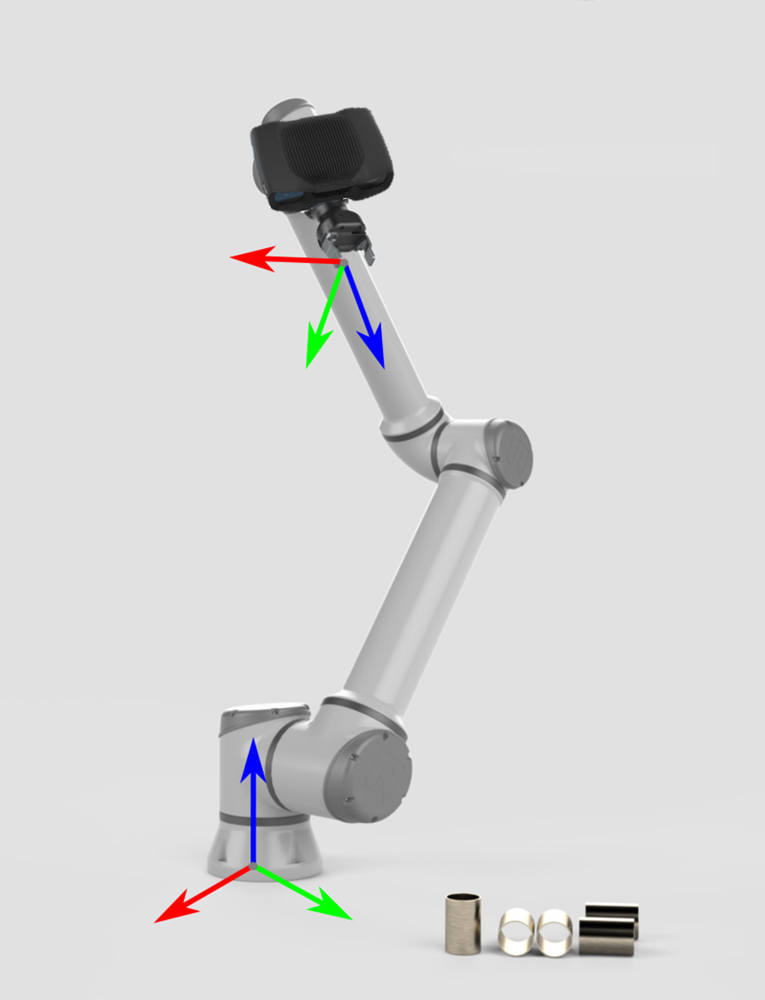

In this case, the coordinate transformation is done indirectly: $`H^{ROB}_{OBJ} = H^{ROB}_{EE} \cdot  H^{EE}_{CAM} \cdot H^{CAM}_{OBJ}`$

The pose $`H^{ROB}_{EE}`$ of the end effector against the base is known and obtained through the robotic arm API, and the pose $`H^{EE}_{CAM}`$ of the camera against the end effector is obtained by hand-eye calibration.


If the object is a 3D point or pose in the camera frame, the following describes the mathematical transformation theory of the object **from the camera frame to the base frame**.


The pose of the robotic arm is represented by a homogeneous transformation matrix.

The following equation describes how to convert a single 3D point from the camera frame to the base frame:

$`p^{ROB}=H^{ROB}_{EE} \cdot H^{EE}_{CAM} \cdot p^{CAM}`$

​                      $` \begin{bmatrix} x^r \\ y^r \\ z^r \\ 1 \end{bmatrix} = \begin{bmatrix} R_e^r & t_e^r \\ 0 & 1 \end{bmatrix} \cdot \begin{bmatrix} R_c^e & t_c^e \\ 0 & 1 \end{bmatrix} \cdot \begin{bmatrix} x^c \\ y^c \\ z^c \\ 1 \end{bmatrix} `$

The object pose is converted from the camera frame to the base frame.

$`H^{ROB}_{OBJ}=H^{ROB}_{EE} \cdot H^{EE}_{CAM} \cdot H^{CAM}_{OBJ}`$

​                      $`\begin{bmatrix} R_o^r & t_o^r \\ 0 & 1 \end{bmatrix}=\begin{bmatrix} R_e^r & e_e^r \\ 0 & 1 \end{bmatrix} \cdot  \begin{bmatrix} R_c^e & t_c^e \\ 0 & 1 \end{bmatrix} \cdot \begin{bmatrix} R_o^c & t_o^c \\ 0 & 1 \end{bmatrix}`$

The resulting pose is the pose that the center of the robotic arm's current tool frame should reach for picking up. (The pose of the robotic arm collected during calibration is also the pose of the current tool frame against the base frame)

#### Code

- The object is a 3D point (x, y, z) in the camera frame

  ```python
  
  import numpy as np
  from scipy.spatial.transform import Rotation as R
  
  # Rotation matrix and translation vector from the camera frame to the end frame (obtained from hand-eye calibration)
  rotation_matrix = np.array([[-0.00235395 , 0.99988123 ,-0.01523124],
                              [-0.99998543, -0.00227965, 0.0048937],
                              [0.00485839, 0.01524254, 0.99987202]])
  translation_vector = np.array([-0.09321419, 0.03625434, 0.02420657])
  
  def convert(x ,y ,z ,x1 ,y1 ,z1 ,rx ,ry ,rz):
      """
  
      Convert the rotation matrix and translation vectors obtained from hand-eye calibration into a homogeneous transformation matrix, and then use the object coordinates (x, y, z) and the end pose (x1, y1, z1, rx, ry, rz) recognized by the depth camera to compute the pose (x, y, z) of the object against the base
  
      """

      # Recognize object coordinates by the depth camera
      obj_camera_coordinates = np.array([x, y, z])
  
      # End pose, in radians
      end_effector_pose = np.array([x1, y1, z1,
                                    rx, ry, rz])
  
      # Convert the rotation matrix and the translation vector into a homogeneous transformation matrix
      T_camera_to_end_effector = np.eye(4)
      T_camera_to_end_effector[:3, :3] = rotation_matrix
      T_camera_to_end_effector[:3, 3] = translation_vector
  
      # Convert the end pose into a homogeneous transformation matrix
      position = end_effector_pose[:3]
      orientation = R.from_euler('xyz', end_effector_pose[3:], degrees=False).as_matrix()
  
      T_base_to_end_effector = np.eye(4)
      T_base_to_end_effector[:3, :3] = orientation
      T_base_to_end_effector[:3, 3] = position
  
      # Compute the pose of the object against the base
      obj_camera_coordinates_homo = np.append(obj_camera_coordinates, [1])  # Convert object coordinates to homogeneous coordinates
  
      obj_end_effector_coordinates_homo = T_camera_to_end_effector.dot(obj_camera_coordinates_homo)
  
      obj_base_coordinates_homo = T_base_to_end_effector.dot(obj_end_effector_coordinates_homo)
  
      obj_base_coordinates = list(obj_base_coordinates_homo[:3])  # Extract coordinates x, y, z of the object from the homogeneous coordinates
  
      return obj_base_coordinates
  
  ```

- The object is a pose in the camera frame

  ```python
  
  import numpy as np
  from scipy.spatial.transform import Rotation as R
  
  # Rotation matrix and translation vector from the camera frame to the end frame (obtained from hand-eye calibration)
  rotation_matrix = np.array([[-0.00235395 , 0.99988123 ,-0.01523124],
                              [-0.99998543, -0.00227965, 0.0048937],
                              [0.00485839, 0.01524254, 0.99987202]])
  translation_vector = np.array([-0.09321419, 0.03625434, 0.02420657])
  
  def decompose_transform(matrix):
      """
      Convert the matrix to pose
      """
  
      translation = matrix[:3, 3]
      rotation = matrix[:3, :3]
  
      # Convert rotation matrix to euler angles (rx, ry, rz)
      sy = np.sqrt(rotation[0, 0] * rotation[0, 0] + rotation[1, 0] * rotation[1, 0])
      singular = sy < 1e-6
  
      if not singular:
          rx = np.arctan2(rotation[2, 1], rotation[2, 2])
          ry = np.arctan2(-rotation[2, 0], sy)
          rz = np.arctan2(rotation[1, 0], rotation[0, 0])
      else:
          rx = np.arctan2(-rotation[1, 2], rotation[1, 1])
          ry = np.arctan2(-rotation[2, 0], sy)
          rz = 0
  
      return translation, rx, ry, rz
  
  def convert(x,y,z,rx,ry,rz,x1,y1,z1,rx1,ry1,rz1):
  
      """
  
   
     Convert the rotation matrix and translation vectors obtained from hand-eye calibration into a homogeneous transformation matrix, and then use the end pose (x, y, z, rx, ry, rz) and the object coordinates (x1, y1, z1, rx1, ry1, rz1) recognized by the depth camera to compute the pose of the object against the base
  
      """
  
      # Recognize object coordinates by the depth camera
      obj_camera_coordinates = np.array([x1, y1, z1,rx1,ry1,rz1])
  
      # End pose, in radians
      end_effector_pose = np.array([x, y, z,
                                    rx, ry, rz])
  
      # Convert the rotation matrix and the translation vector into a homogeneous transformation matrix
      T_camera_to_end_effector = np.eye(4)
      T_camera_to_end_effector[:3, :3] = rotation_matrix
      T_camera_to_end_effector[:3, 3] = translation_vector
  
      # Convert the end pose into a homogeneous transformation matrix
      position = end_effector_pose[:3]
      orientation = R.from_euler('xyz', end_effector_pose[3:], degrees=False).as_matrix()
  
      T_end_to_base_effector = np.eye(4)
      T_end_to_base_effector[:3, :3] = orientation
      T_end_to_base_effector[:3, 3] = position
  
      # Compute the pose of the object against the base
  
      # Convert the pose of the object against the camera into a homogeneous transformation matrix
      position2 = obj_camera_coordinates[:3]
      orientation2 = R.from_euler('xyz', obj_camera_coordinates[3:], degrees=False).as_matrix()
  
      T_object_to_camera_effector = np.eye(4)
      T_object_to_camera_effector[:3, :3] = orientation2
      T_object_to_camera_effector[:3, 3] = position2
  
      obj_end_effector_coordinates_homo = T_camera_to_end_effector.dot(T_object_to_camera_effector)
  
      obj_base_effector = T_end_to_base_effector.dot(obj_end_effector_coordinates_homo)
  
      result = decompose_transform(obj_base_effector)
  
      return result
  ```

The rotation_matrix and translation_vector in the code are obtained by **eye-in-hand** and **hand-eye calibration** respectively

### Eye-to-hand

#### Theory

The pose of the object in the camera frame is available by the camera through the model. The **pose of the object against the robotic arm** is obtained by multiplying the pose of the camera against the base frame by the pose of the object against the camera frame:

$` H_{OBJ}^{ROB} = H_{CAM}^{ROB} \cdot H_{OBJ}^{CAM}`$


If the object is a 3D point or pose, the following describes the mathematical transformation theory of the object **from the camera frame to the base frame**.

The following equation describes how to convert a single 3D point from the camera frame to the base frame:

$`p^{ROB}=H^{ROB}_{CAM} \cdot p^{CAM}`$

$` \begin{bmatrix} x^r \\ y^r \\ z^r \\ 1 \end{bmatrix} = \begin{bmatrix} R_c^r & t_c^r \\ 0 & 1 \end{bmatrix} \cdot \begin{bmatrix} x^c \\ y^c \\ z^c \\ 1 \end{bmatrix} `$

The object pose is converted from the camera frame to the base frame.

$`H^{ROB}_{OBJ}=H^{ROB}_{CAM} \cdot H^{CAM}_{OBJ}`$

$`\begin{bmatrix} R_o^r & t_o^r \\ 0 & 1 \end{bmatrix}=\begin{bmatrix} R_c^r & e_c^r \\ 0 & 1 \end{bmatrix} \cdot \begin{bmatrix} R_o^c & t_o^c \\ 0 & 1 \end{bmatrix}`$

#### Code

- The object is a 3D point (x, y, z) in the camera frame

  ```python
  
  import numpy as np

  # Rotation matrix and translation vector from the camera frame to the base frame (obtained from hand-eye calibration)
  rotation_matrix = np.array([[-0.00235395 , 0.99988123 ,-0.01523124],
                              [-0.99998543, -0.00227965, 0.0048937],
                              [0.00485839, 0.01524254, 0.99987202]])
  translation_vector = np.array([-0.09321419, 0.03625434, 0.02420657])
  
  def convert(x ,y ,z):
      """
      
      Convert the rotation matrix and translation vectors into a homogeneous transformation matrix, and then use the object coordinates (x, y, z) recognized by the depth camera and the calibrated homogeneous transformation matrix from the camera to the base to compute the pose (x, y, z) of the object against the base
  
      """

      # Recognize object coordinates by the depth camera
      obj_camera_coordinates = np.array([x, y, z])
  
      # Convert the rotation matrix and the translation vector into a homogeneous transformation matrix
      T_camera_to_base_effector = np.eye(4)
      T_camera_to_base_effector[:3, :3] = rotation_matrix
      T_camera_to_base_effector[:3, 3] = translation_vector

      # Compute the pose of the object against the base
      obj_camera_coordinates_homo = np.append(obj_camera_coordinates, [1])  # Convert object coordinates to homogeneous coordinates
  
      obj_base_effector_coordinates_homo = T_camera_to_base_effector.dot(obj_camera_coordinates_homo)
      obj_base_coordinates = obj_base_effector_coordinates_homo[:3]  # Extract coordinates x, y, z of the object from the homogeneous coordinates

      # Combine results
  
      return list(obj_base_coordinates)
  
  ```

- The object is a pose in the camera frame

  ```python
  
  import numpy as np
  from scipy.spatial.transform import Rotation as R
  
  # Rotation matrix and translation vector from the camera frame to the base frame (obtained from hand-eye calibration)
  rotation_matrix = np.array([[-0.00235395 , 0.99988123 ,-0.01523124],
                              [-0.99998543, -0.00227965, 0.0048937],
                              [0.00485839, 0.01524254, 0.99987202]])
  translation_vector = np.array([-0.09321419, 0.03625434, 0.02420657])
  
  def decompose_transform(matrix):
      """
      Convert the matrix to pose
      """
  
      translation = matrix[:3, 3]
      rotation = matrix[:3, :3]
  
      # Convert rotation matrix to euler angles (rx, ry, rz)
      sy = np.sqrt(rotation[0, 0] * rotation[0, 0] + rotation[1, 0] * rotation[1, 0])
      singular = sy < 1e-6
  
      if not singular:
          rx = np.arctan2(rotation[2, 1], rotation[2, 2])
          ry = np.arctan2(-rotation[2, 0], sy)
          rz = np.arctan2(rotation[1, 0], rotation[0, 0])
      else:
          rx = np.arctan2(-rotation[1, 2], rotation[1, 1])
          ry = np.arctan2(-rotation[2, 0], sy)
          rz = 0
  
      return translation, rx, ry, rz
  
  def convert(x ,y ,z,rx,ry,rz):
      """
      
      Convert the rotation matrix and translation vectors into a homogeneous transformation matrix, and then use the object pose (x, y, z, rx, ry, rz) recognized by the depth camera and the calibrated homogeneous transformation matrix from the camera to the base to compute the pose (x, y, z, rx, ry, rz) of the object against the base
  
      """

      # Recognize object coordinates by the depth camera
      obj_camera_coordinates = np.array([x, y, z,rx,ry,rz])
  
      # Convert the rotation matrix and the translation vector into a homogeneous transformation matrix
      T_camera_to_base_effector = np.eye(4)
      T_camera_to_base_effector[:3, :3] = rotation_matrix
      T_camera_to_base_effector[:3, 3] = translation_vector
  
      # Compute the pose of the object against the base
      # Convert the pose of the object against the camera into a homogeneous transformation matrix
      position2 = obj_camera_coordinates[:3]
      orientation2 = R.from_euler('xyz', obj_camera_coordinates[3:], degrees=False).as_matrix()
  
      T_object_to_camera_effector = np.eye(4)
      T_object_to_camera_effector[:3, :3] = orientation2
      T_object_to_camera_effector[:3, 3] = position2
  
      obj_base_effector = T_camera_to_base_effector.dot(T_object_to_camera_effector)
  
      result = decompose_transform(obj_base_effector)
  
      # Combine results
  
      return result
  
  ```

The rotation_matrix and translation_vector in the code are obtained by **eye-to-hand** and **hand-eye calibration** respectively
