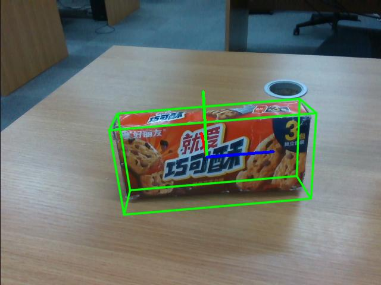

# <p class="hidden">SDK developer guide: </p>Item Pose

Pose estimation, as a kind of advanced computer vision, is intended to infer the position and orientation of items in three-dimensional space based on two-dimensional images and depth information. It has wide application prospects and important practical value, especially in the field of automated retail and item grasping.

The pose of the item is estimated according to the mask image and the 3D template of CAD. The input is an RGB image, a depth image, a mask image, a CAD template, and intrinsic camera parameters, and the output is the item pose.
This approach does not require extra training but performs direct computations using the pre-provided model weights.

This approach is available effectively in practical applications, such as automated item grasping in new retail environments, ensuring that robots accurately identify and handle items on shelves.

**Functional values and characteristics**

FoundationPose is an advanced 6D object pose estimation and tracking model:

1. Unified foundation model: FoundationPose uses a unified foundation model architecture that supports both model-based and model-free setups. Therefore, it can be instantly applied to a novel object without fine-tuning, as long as its CAD model is given, or a few reference images are captured.
2. Implicit neural representations: The model uses implicit neural representations for new view synthesis, thereby maintaining the consistency of the pose estimation module under the same framework. This approach effectively bridges the gap between model-based and model-free setups.
3. Strong generalization: Through large-scale synthetic training, FoundationPose obtains strong generalizability. The training combines a large language model, a novel transformer-based architecture, and a contrastive learning formulation to make it perform well on multiple common data sets, especially when dealing with challenging scenarios and objects.
4. Real-time application: FoundationPose can be instantly applied at test time to a novel object without fine-tuning. Therefore, users can quickly deploy and apply the model, saving a lot of time and resources.

For more details, please visit [FoundationPose](https://github.com/NVlabs/FoundationPose).

This SDK encapsulates and adapts FoundationPose specifically, and the FoundationPose generates the pose of the object with the Mask obtained by the recognition/segmentation/tracking function to control the robotic arm for grasping, such its maneuverability is enhanced.

**Application scenarios**

FoundationPose is widely applied in various scenarios.

1. In industrial robots, FoundationPose is available for precise object location and grasping, increasing the efficiency and accuracy of automatic production lines. In autonomous driving and navigation systems, it is intended to identify and track road signs, obstacles, and other vehicles to improve driving safety.
2. In augmented reality (AR) and virtual reality (VR) applications, FoundationPose enables precise object location and interaction, providing users with an immersive experience.
3. In the medical field, FoundationPose assists medical devices in precise surgical operations and diagnoses, such as locating surgical instruments or identifying diseased areas in medical images. In video surveillance and security systems, it is available for real-time object tracking and behavior analysis to enhance the intelligence of security monitoring.
4. In academic research, FoundationPose is intended to study dynamic pose changes and conduct 3D reconstruction of objects, promoting research progress in the fields of computer vision and robotics.

**Target user**

- Visual identity development engineer
- Robot development engineer

## 1. Quick start

### Code directory

```
Foundationpose/
│
├── README.md        <- Core project document
├── requirements.txt    <- List of project dependencies
├── setup.py        <- Project installation script
│
├── FoundationPose/     <- Project source code
│  ├── config           <- yaml configuration folder
│  ├── debug            <- debug log entry
│  ├── kaolin           <- Rendering dependency
│  ├── learning         <- Data processing and modeling
│  ├── mycpp            <- Dependency
│  ├── nvdiffrast       <- High-performance rendering dependency
│  ├── datareader.py    <- Predicted data reading
│  ├── estimater11.py   <- Evaluation function
│  ├── Utils.py         <- Decoding part
│  └── foundationpose_main.py    <- Core interface function
├── predict.py       <- Main prediction procedure entry
└── tests/      <- Functional test directory
```

### Basic environment preparation

| Item     | Version              |
| :--------- | :------------------ |
| Operating system | ubuntu20.04       |
| Architecture     | x86               |
| GPU driver | nvidia-driver-535 |
| Python   | 3.8               |
| pip      | 24.2              |

### Python environment preparation

| Package            | Version         |
| --------------- | -------------- |
| cuda          | 11.8         |
| cudnn         | 8.0          |
| torch         | 2.0.0+cu118  |
| torchvision   | 0.15.1+cu118 |
| opencv-python | 4.10.0.84    |
| matplotlib    | 3.7.5        |
| pandas        | 2.0.3        |
| Pillow        | 9.5.0        |
| scipy         | 1.10.1       |
| open3d        | 0.18.0       |
| cmake         | 3.30.1       |

1. Make sure the basic environment is installed

Install the Nvidia driver. For details, please refer to [Install Nvidia GPU driver](../../getStarted/nivdia/index.md)

Install the conda package management tool and the python environment. For details, please refer to [Install Conda and Python environment](../../getStarted/environment/index.md)

2. Build a python environment

Create the conda virtual environment

```bash
conda create --name [conda_env_name] python=3.8 -y
```

Activate virtual environment

```bash
conda activate [conda_env_name]
```

View the python version

```bash
python -V
```

View the pip version

```bash
pip -V
```

Update pip to the latest version

```bash
pip install -U pip
```

3. Install third-party package dependencies for the python environment (in sequence)

Install the GPU version of pytorch and a deep learning acceleration environment such as cuda

```bash
pip install torch==2.0.0+cu118 torchvision==0.15.1+cu118 torchaudio==2.0.1 --index-url https://download.pytorch.org/whl/cu118
```

Install the pytorch3d library, a pytorch extension for 3D computing

::: warning
If the compilation fails, the causes may be insufficient memory or exhaustion of system resources. <br>
**Workaround**: Enter export MAX_JOBS=4 in the current environment (limit the number of parallel worker threads used at compile time, and replace 4 with 70% of the number of cores), and rerun the following compiler directive.
:::

```bash
pip install "git+https://github.com/facebookresearch/pytorch3d.git@stable"
```

Install libraries for scientific computing, computer vision, and 3D processing

```bash
pip install scipy joblib scikit-learn ruamel.yaml trimesh pyyaml opencv-python imageio open3d transformations warp-lang einops kornia pyrender pysdf
```

Install the latest code and dependencies for the Segment Anything model

```bash
pip install git+https://github.com/facebookresearch/segment-anything.git
```

Clone the NVlabs/nvdiffrast repository locally and install it as a python package

```bash
git clone https://github.com/NVlabs/nvdiffrast

cd nvdiffrast && pip install .
```

Install python libraries for image processing, machine learning, 3D visualization, and data science

```bash
pip install scikit-image meshcat webdataset omegaconf pypng Panda3D simplejson bokeh roma seaborn pin opencv-contrib-python openpyxl torchnet Panda3D bokeh wandb colorama GPUtil imgaug Ninja xlsxwriter timm albumentations xatlas rtree nodejs jupyterlab objaverse g4f ultralytics==8.0.120 pycocotools py-spy pybullet videoio numba
```

Install or update the python package for PyTurboJPEG

```bash
pip install -U git+https://github.com/lilohuang/PyTurboJPEG.git
```

Install dependencies (h5py, libeigen3-de, and pybind11-dev) and build a project

```bash
conda install -y -c anaconda h5py
sudo apt-get install libeigen3-dev -y
sudo apt-get install pybind11-dev -y
sudo apt-get install libboost-all-dev -y
cd FoundationPose/ && bash build_all.sh
```

Clone the Kaolin project from the NVIDIA GameWorks organization locally and install it as an editable install into the python environment

```bash
git clone https://github.com/NVIDIAGameWorks/kaolin.git
cd kaolin/
git switch -c v0.15.0
pip install -e .
cd ..
```

Compile and pack: Execute the following command in the same directory as the setup.py file:

```bash
python setup.py bdist_wheel
```

Install: Find the .wheel file in the dist folder, for example, dist/foundationpose-0.1.0-py3-none-any.whl.

```bash
pip install foundationpose-0.1.0-py3-none-any.whl
```

### Resources preparation

Download the pre-trained [refine_ckpt.pth] weights: [download refine_ckpt weight](https://pan.baidu.com/s/1i_7fKFHB2jXfU7hP9_hLpg?pwd=1234)

Download the pre-trained [predict_ckpt.pth] weights: [download predict_ckpt weight](https://pan.baidu.com/s/1jARFDZGuSuICV00Pdjw8ww?pwd=1234)

### Code access

Get the latest code in [GitHub: Item Pose](https://github.com/RealManRobot/rm-pose).

### Quick start example

```python
import copy
import json
import os.path
from types import SimpleNamespace
import cv2
import pyrealsense2 as rs
from FoundationPose.estimater11 import *
from FoundationPose.datareader import *
from FoundationPose.foundationpose_main import Detect_foundationpose


def main():
    # Read image
    image_path = "tests/demo_data/test_img"
    color_path = os.path.join(image_path, "rgb.png")
    depth_path = os.path.join(image_path, "depth.png")
    mask_path = os.path.join(image_path, "mask.png")

    # Specify object template
    mesh_path = "tests/demo_data/haoliyou/mesh/textured_mesh.obj"

    # Specify object weight
    predict_ckpt_dir = "tests/weights/predict_ckpt/predict_ckpt.pth"
    refine_ckpt_dir = "tests/weights/refine_ckpt/refine_ckpt.pth"

    # Get intrinsic camera parameters
    json_file = os.path.join(image_path, "intrinsics.json")
    with open(json_file, 'r+') as fp:
        intrinsics = json.load(fp, object_hook=lambda d: SimpleNamespace(**d))

    # Convert images
    color_img = cv2.imread(color_path)
    depth_img = cv2.imread(depth_path, cv2.IMREAD_UNCHANGED)
    mask = cv2.imread(mask_path, cv2.IMREAD_GRAYSCALE)

    # Call to load the mesh and associated resources
    est, reader, bbox, debug, to_origin = Detect_foundationpose.load_model(mesh_path, intrinsics, predict_ckpt_dir, refine_ckpt_dir)

    # Conduct pose estimation based on mesh
    pose, color, to_origin = Detect_foundationpose.pose_est(color_img, depth_img, mask, reader, est,to_origin, bbox,show=True)

    # Visualize pose estimation
    color = cv2.cvtColor(color, cv2.COLOR_BGR2RGB)
    cv2.imshow("pose", color)
    cv2.waitKey(0)


if __name__ == '__main__':
    main()

```

## 2. API reference

### Load templates and models Detect_foundationpose.load_model

```python
est, reader, bbox, debug, to_origin = Detect_foundationpose.load_model(mesh_path, intrinsics, predict_ckpt_dir, refine_ckpt_dir)
```

Load different pose models according to different templates

- Function input:
  1. Template file
  2. Intrinsic camera parameters
  3. Pose estimation weight file path
  4. Pose correction fine-tuning weight file path
- Function output:
  1. Pose estimation model
  2. Load data stream object
  3. Template bounding box
  4. Debug mode
  5. 3D template size parameters

### Run inference Detect_foundationpose.pose_est

Conduct the pose estimation according to mesh. With given color and depth images and mask information, the pose information of the object template is output.

```python
pose, color, to_origin = Detect_foundationpose.pose_est(color_img, depth_img, mask, reader, est,to_origin, bbox,show=True)
```

- Function input:
  1. Color image
  2. Depth image
  3. Mask of recognized objects
  4. Load data stream object
  5. Pose estimation model
  6. 3D template size parameters
  7. Template bounding box
  8. Visualization or not
- Function output:
  1. Pose recovery estimation of the 3D template under the scene point cloud
  2. 2D visual image
  3. 3D template size parameters

## 3. Function introduction

### Function information

Input target images, and recognition results, including item segmentation, position, type, confidence, etc. will be output.



- Target pose

A target pose will be output

### Function parameters

- Recognition accuracy: 95%
- Recognition error: 1%
- Model parameter: 320M
- Recognition precision: 1 pixel

## 4. Developer guide

### Image input specification

Generally, an image of a 640×480×3 channel is used as input for the entire project, and BGR is used as the main channel sequence. It is recommended to use opencv mode to read the image and load it to the model.

### Intrinsic camera parameter specification

Intrinsic camera parameter specification:

```python
{   
    "fx": 606.9906005859375, 
    "fy": 607.466552734375, 
    "ppx": 325.2737121582031, 
    "ppy": 247.56326293945312, 
    "height": 480, 
    "width": 640, 
    "depth_scale": 0.0010000000474974513
}
```

### Equipment deployment

It is recommended to use the cuda platform, because the inference speed of the CPU only is slow, which basically cannot meet the requirements of realistic scenes.

## 5. Frequently asked question (FAQ)

**1. What factors affect the speed of image recognition?**

The main factor is the hardware computing power, the higher the computing power, the shorter the inference time.

**2. Can I use this model if I'm not using a realsense camera?**

Of course, you can, but you should first convert the color image and depth image of the camera into numpy data objects, and then collect the intrinsic parameters of the camera and convert them into the objects of intrinsic camera parameter specification before using the model. 

**3. How to use this model during robot development?**

Firstly, use the item recognition or segmentation model to obtain the mask of the item to be recognized, then input it into the model for inference to get the 6D pose of the item, and finally obtain the gripper pose, grasping direction, etc. after the computation of the 6D pose. Send the input to the robotic arm for completing the grasping.

## 6. Update log

| Update date   |  Update content | Version |
| :----------- | :--------- | :----- |
| 2024.08.16 | New content | V1.0 |

## 7. Copyright and license agreement

- This project is subject to the MIT license.
