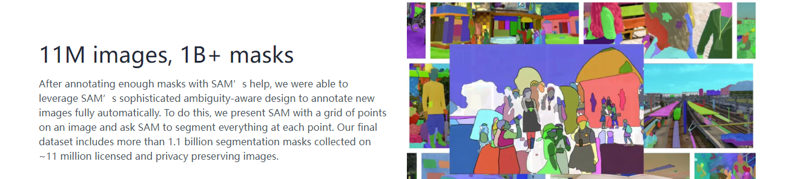
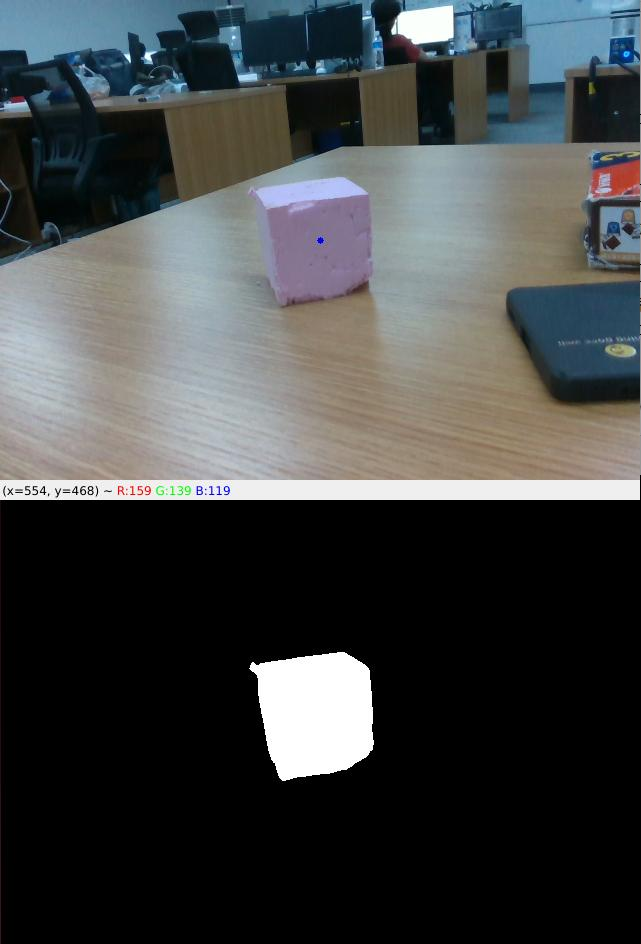

# <p class="hidden">SDK developer guide: </p>Item Segmentation

This function enables the segmentation of arbitrary items within an image, extracting their masks.

**Functional values and characteristics**

- Promptable segmentation tasks: The model is designed to handle promptable segmentation tasks, allowing it to generate valid segmentation masks based on any given cues (such as spatial or textual clues for identifying objects). Typically, segmentation is achieved by providing pixel coordinate information within the image for object segmentation at specific locations.
- Advanced architecture: The Segment Anything Model (SAM) uses a powerful image encoder, prompt encoder, and lightweight mask decoder. This unique architecture enables flexible prompting, real-time mask computation, and blur perception in segmentation tasks.
- This code wraps and adapts SAM specifically, allowing you to generate segmentation masks without training. Combined with orientation generation algorithms, it enables rapid grasping of any object.

For more details, please visit: [segment](https://segment-anything.com/)


**Application scenario**<br>
Common application scenarios include automatic annotation, object segmentation, mask extraction, etc.

## 1. Quick start

### Basic environment preparation

| Item     | Version              |
| :------- | :---------------- |
| Operating system | ubuntu20.04       |
| Architecture     | x86               |
| GPU driver | nvidia-driver-535 |
| Python   | 3.8               |
| pip      | 24.2              |

### Python environment preparation

| Package            | Version     |
| ------------- | -------- |
| cuda          | 11.3     |
| cudnn         | 8.0      |
| torch         | 1.12.0   |
| torchvision   | 0.13.0   |
| opencv-python | 4.9.0.80 |
| pyyaml        | 5.4.1    |
| matplotlib    | 3.7.2    |
| pandas        | 1.5.3    |
| Pillow        | 9.5.0    |

1. Make sure the basic environment is installed

Install the Nvidia driver. For details, please refer to [Install Nvidia GPU driver](../../getStarted/nivdia/index.md)

Install the conda package management tool and the python environment. For details, please refer to [Install Conda and Python environment](../../getStarted/environment/index.md)

2. Build a python environment

Create the conda virtual environment

```bash
conda create --name [conda_env_name] python=3.8 -y
```

Activate virtual environment

```bash
conda activate [conda_env_name]
```

View the python version

```bash
python -V
```

View the pip version

```bash
pip -V
```

Update pip to the latest version

```bash
pip install -U pip
```

3. Install third-party package dependencies for the python environment

Install the GPU version of pytorch and a deep learning acceleration environment such as cuda

```bash
conda install pytorch==1.12.0 torchvision==0.13.0 torchaudio==0.12.0 cudatoolkit=11.3 -c pytorch -y
```

If the conda installation fails or takes too long, use the following code instead

```bash
pip install torch==1.12.0+cu113 torchvision==0.13.0+cu113 torchaudio==0.12.0 --extra-index-url https://download.pytorch.org/whl/cu113 -i https://pypi.tuna.tsinghua.edu.cn/simple
```

Install opencv

```bash
pip install opencv-python==4.10.0.84
```

Install pyyaml

```bash
pip install pyyaml==5.4.1
```

Install matplotlib

```bash
pip install matplotlib==3.7.5
```

Install pandas

```bash
pip install pandas==1.5.3
```

Install pillow

```bash
pip install Pillow==10.4.0
```

Install scipy

```bash
pip install scipy==1.10.1
```

Install ultralytics

```bash
pip install ultralytics==8.2.66
```

### Resources preparation

Download the trained sam model weights: [sam.pt](https://pan.baidu.com/s/17pGgkZBsZu-5uVlSi7CdRg?pwd=1234)

### Code access

Get the latest code in [GitHub: Item Segmentation](https://github.com/RealManRobot/rm-sam).

### Quick start example

```python
from rm_sam.interface import DetectBase

# Instantiate the segmentation object
sam_seg = DetectBase()

# Load the corresponding model
predictor = sam_seg.gen_model()

# Read the image in opencv; the image is in RGB mode
color_image = cv2.imread("xxx.png")

# Pre-process the image
color_frame = sam_seg.forward_handle_input(color_image)

# Perform inference
results = sam_seg.detect(color_frame, predictor=predictor, point=TARGET_POINT, bboxes=None)

# Post-process the inference data
center, mask = sam_seg.backward_handle_output(results)

# Visualize the content
cv2.imshow("mask", mask)
cv2.waitKey(1)
```

## 2. API reference

### Input data conversion sam_seg.forward_handle_input

```python
# Pre-process the image
color_frame = sam_seg.forward_handle_input(color_image)
```

Convert the image into a format that SAM can process, which helps speed up the segmentation process.

- Function input: RGB image
- Function output: pre-processed image, which can be directly input into the inference interface for execution, in the form of an ndarray object.

### Inference sam_seg.detect

```python
# Perform inference
results = sam_seg.detect(color_frame, predictor=predictor, point=TARGET_POINT, bboxes=None)
```

Perform inference: recognize the mask of a specified point in the image and output the processed result

- Function input:
  1. color_frame: pre-processed color image data
  2. predictor: inference model, which allows for different inference speeds and results by loading models with varying weight sizes
  3. point: given auxiliary point
  4. bboxes: given auxiliary image coordinate bounding box, where either point or bboxes should be provided (choose one)
- Function output: inference result, in the form of an ndarray object.

### Output data conversion sam_seg.backward_handle_output

```python
# Post-process the inference data
center, mask = sam_seg.backward_handle_output(results)
```

Perform subsequent data processing to convert the inferred data into the corresponding object's mask and center point information. The center point is the center of the largest bounding rectangle.

- Function input: inference result, in the form of an ndarray object. 
- Function output:
  1. mask: mask information for the specified location. 
  2. center: center point of the largest bounding rectangle of the mask information, which is generally considered the most suitable grasping point.

## 3. Function introduction

### Function information

Given a color image and specified point coordinates, the segmentation information for the object at the specified point can be obtained. As shown in the image, the blue dot represents the specified point, and the lower image shows the segmentation content.



- Target segmentation<br>
Given an auxiliary point at a specified point in the image (x and y frame points), the model infers and provides the mask information of the object at that point for localization, tracking, and shape recognition.

The output of the SAM segmentation model is a set of masks that outline the boundaries of each object in the image.

### Function parameters

- Segmentation accuracy: 95%
- Segmentation speed: 10 HZ (measured on a 3090TI)
- Model parameter: 632M + 4M
- Segmentation accuracy: 1 pixel

## 4. Developer guide

### Image input specification

Generally, an image of a 640×480×3 channel is used as input for the entire project, and RGB is used as the main channel sequence. It is recommended to use opencv mode to read the image and load it to the model.

### Model warm-up

After loading the model for the first time, it’s necessary to provide some data, which can be random data, to run the model once to "warm up" the model. The primary purpose of this is to allocate any potentially required memory space.

### Equipment deployment

It is recommended to use the cuda platform, because the inference speed of the CPU only is slow, which basically cannot meet the requirements of realistic scenes.
Performance metrics: On a 3090TI GPU, the runtime is approximately 100 ms per frame, with a memory usage of about 4 GB video memory.

## 5. Frequently asked question (FAQ)

**1. If the recommended environment configuration is not used, the order of selecting the installation environment version.**

Operating system -> GPU driver version -> cudnn version -> cuda version -> torch version -> torchvision version -> python version

Perform installation and adaptation in the order listed above.

**2. What are the main factors that affect the speed of image segmentation?**  

The main factor is the hardware computing power, the higher the computing power, the shorter the inference time.

**3. What should I do if the image segmentation result is incomplete?**

You can perform segmentation at multiple specified locations and then stitch all the masks together to form a complete mask of the object.

**4. How can this model be used during the development of a robotic arm?**

By specifying a point, the mask information of the target object can be obtained. From the mask, the minimum and maximum bounding rectangles of the object can be calculated, along with additional information such as the center point, center of gravity, and rotation angle. On the basis of such information, together with the depth image and camera intrinsic parameters, the object's point in the camera frame can be calculated, which can then be transformed into the robot frame based on the hand-eye calibration results.

**5. The model is too large**  

This SDK primarily uses the Sam_b model, which is recommended to run on a GPU of at least the 3060 series. If your hardware does not meet the requirements, you can opt for Fastsam or other segmentation models with lower resource demands. However, to ensure the overall solution's accuracy, it is recommended to upgrade your hardware to meet higher accuracy requirements.

## 6. Update log

| Update date   | Update content |Version |
| :--------- | :------- |:------- |
| 2024.08.16 | New content |V1.0 |

## 7. Copyright and license agreement

- This project is subject to the MIT license.
