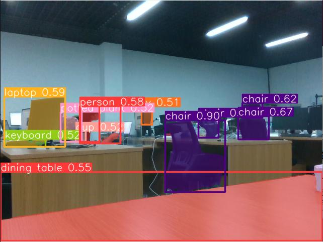

# <p class="hidden">SDK developer guide: </p>Multi-modal Recognition

This project refers to an RGBD fusion target detection method based on depth compensation, which mainly uses RGB and depth dual-modal information recognition for item identification and segmentation.

**Functional values and characteristics**

The method includes the following steps:

1. Obtain the RGB image and depth image of the target to be detected;
2. Process the RGB image to generate the depth-enhanced image based on the encoder decoder network;
3. Identify the targets to be detected via the improved model Yolo_RGBD (an upgraded version of YOLOV8 with added depth channel information), and generate their recognition images based on the RGB image and the depth-enhanced image. Achieve precise recognition while maintaining real-time performance by integrating high-quality depth-enhanced images and adopting a depth compensation injection approach;
4. After determining the segmentation position of the recognized object in the image, obtain information such as the object's mask and center point, and use the camera's intrinsic parameters depth information to convert the image coordinate points into 3D points in the camera frame. These 3D points can then be further transformed into points in the robotic arm frame through the hand-eye calibration results between the camera and the robotic arm, achieving position transformation.

**Application scenarios**<br>
Common application scenarios include pedestrian and vehicle detection in autonomous driving, intruder recognition in security monitoring, inventory management and customer behavior analysis in the retail industry, lesion detection in medical imaging, drone navigation, and defect detection in industrial automation.

## 1. Quick start

### Basic environment preparation

| Item     | Version              |
| :------- | :---------------- |
| Operating system | ubuntu20.04       |
| Architecture     | x86               |
| GPU driver | nvidia-driver-535 |
| Python   | 3.8               |
| pip      | 24.2              |

### Python environment preparation

| Package            | Version     |
| ------------- | -------- |
| cuda          | 11.3     |
| cudnn         | 8.0      |
| torch         | 1.12.0   |
| torchvision   | 0.13.0   |
| opencv-python | 4.9.0.80 |
| pyyaml        | 5.4.1    |
| matplotlib    | 3.7.2    |
| pandas        | 1.5.3    |
| Pillow        | 9.5.0    |

1. Make sure the basic environment is installed

Install the Nvidia driver. For details, please refer to [Install Nvidia GPU driver](../../getStarted/nivdia/index.md)

Install the conda package management tool and the python environment. For details, please refer to [Install Conda and Python environment](../../getStarted/environment/index.md)

2. Build a python environment

Create the conda virtual environment

```bash
conda create --name [conda_env_name] python=3.8 -y
```

Activate the conda virtual environment

```bash
conda activate [conda_env_name]
```

View the python version

```bash
python -V
```

View the pip version

```bash
pip -V
```

Update pip to the latest version

```bash
pip install -U pip
```

3. Install third-party package dependencies for the python environment

Install the GPU version of pytorch and a deep learning acceleration environment such as cuda

```bash
conda install pytorch==1.12.0 torchvision==0.13.0 torchaudio==0.12.0 cudatoolkit=11.3 -c pytorch -y
```

If the conda installation fails or takes too long, use the following code instead

```bash
pip install torch==1.12.0+cu113 torchvision==0.13.0+cu113 torchaudio==0.12.0 --extra-index-url https://download.pytorch.org/whl/cu113 -i https://pypi.tuna.tsinghua.edu.cn/simple
```

Install opencv

```bash
pip install opencv-python==4.9.0.80
```

Install pyyaml

```bash
pip install pyyaml==5.4.1
```

Install matplotlib

```bash
pip install matplotlib==3.7.2
```

Install pandas

```bash
pip install pandas==1.5.3
```

Install pillow

```bash
pip install Pillow==9.5.0
```

### Resources preparation

Download the pre-trained [coco.pt] weights: [download coco weights](https://pan.baidu.com/s/1PcBmpTTKZkkrnyO9mO320A?pwd=1234)

Download the pre-trained [CDNet.pth] weights: [download CDNet weights](https://pan.baidu.com/s/1TDpGgA7FGXbigDhdiZapVA?pwd=1234)

### Code access

Get the latest code in [GitHub: Multi-modal Recognition](https://github.com/RealManRobot/yolo-rgbd).

### Quick start example

1. **Recognition and inference**

    ```python
    from yolo_rgbd.interface import YoloRGBD
    from yolo_rgbd.solver import Solver

    yolo_weights = r'coco.pt'
    solver_weights = r'CDNet.pth'

    # Instantiate classes, load model framework, and initialize some configurations
    solver = Solver()
    rgbd = YoloRGBD()

    # Load the model and assign weights
    model, solver_weights = rgbd.gen_model(yolo_weights=yolo_weights, solver=solver,
                                        solver_weights_path=solver_weights)

    # Use opencv to read image information
    color_image = cv2.imread("xxx.png")

    # Convert the color image to depth image information
    deep_data_depth_esi = solver.test(color_image)

    # Convert the obtained depth information into BGR format
    deep_data = cv2.cvtColor(deep_data_depth_esi, cv2.COLOR_GRAY2BGR)

    # Feed the original RGB image and depth image information into the model for inference and specify the confidence
    results = rgbd.detect(model, color_image, deep_data, 0.5)

    # Unpack the obtained data results to extract the final inference outputs, including all item names, confidence, and the largest bounding rectangle for segmentation
    annotated_frame, names, rates, xyxys, masks = rgbd.backward_handle_output(results, color_image, depth_image, None)

    # Visualize the content
    cv2.imshow("annotated_frame", annotated_frame)
    cv2.waitKey(1)
    ```

2. **Model training**

    ```python
    from ultralytics import YOLO

    # Create a new model object from the predefined network configuration file
    model = YOLO(r"ultralytics/cfg/models/my-seg.yaml").load(
                "bus/models/pre_weights.pt") 

    # Enable gradient computation
    torch.set_grad_enabled(True)

    # Input corresponding parameters and start training
    model.train(data=data_path,
                epochs=epochs,
                batch=batch,
                optimizer='SGD',
                device=0 if torch.cuda.is_available() else "cpu")
    ```

## 2. API reference

### Conversion to depth image solver.test

Convert a color image into depth image information

```python
deep_data_depth_esi = solver.test(color_image)
```

Convert RGB to depth image

- Function input: RGB image
- Function output: single-channel image

### Target detection rgbd.detect

Input the original RGB image and depth image into the model for inference, and specify the confidence

```python
results = rgbd.detect(model, color_image, deep_data, 0.5)
```

Recognize items in the target image

- Function input:
  1. Model object
  2. Color image
  3. Color image converted from the depth image for assist recognition
  4. Confidence
- Function output: Inference result, in the form of an ndarray object. 

### Result conversion rgbd.backward_handle_output

Unpack the obtained data results to extract the final inference outputs, including all item names, confidence, and the largest bounding rectangle for segmentation

```python
annotated_frame, names, rates, xyxys, masks = rgbd.backward_handle_output(results, color_image, depth_image, None)
```

Convert inference results into specific recognition result data, such as recognized categories, positions, and masks.

- Function input:
  1. Inference result, in the form of an ndarray object. 
  2. Color image.
  3. Depth image.

- Function output:
  1. annotated_frame: annotated image
  2. names: list of names of all recognized objects
  3. rates: confidence of all recognized objects
  4. xyxys: boundbox of all recognized objects
  5. masks: mask of all recognized objects

### Model training model.train

Input the corresponding parameters to start training

```python
model.train(data=data_path,
            epochs=epochs,
            batch=batch,
            optimizer='SGD',
            device=0 if torch.cuda.is_available() else "cpu")
```

After collecting data, start training by specifying the number of epochs and other configuration details to train a model tailored to your dataset.

- Function input:
  1. data: yaml file of the output dataset
  2. epochs: number of training epochs
  3. batch: batch size for each training iteration
  4. optimizer: optimizer to be specified
  5. device: equipment to be used
- Function output: output that includes the model and its parameter metrics saved in the corresponding folder.

## 3. Function introduction

### Function information

Input target images, and recognition results, including item segmentation, position, type, confidence, etc. will be output.



- **Target detection**

The output of the object detector includes a set of bounding boxes around objects in the image, as well as the class labels and confidence scores for each box. When you need to identify objects of interest in a scene without requiring exact locations or precise shapes, object detection is a great choice.

- **Target segmentation**

Instance segmentation goes a step beyond object detection by identifying and segmenting each unique object in the image.

The output of the instance segmentation model is a set of masks, used to draw the borders of each object in the image. Additionally, it includes the class label and confidence score for each object. When you not only need to know the position of objects in the image but also their precise shapes, instance segmentation is extremely helpful.

### Function parameters

- Recognition accuracy: 95%
- Recognition error: 1%
- Model parameter: 320M
- Recognition precision: 1 pixel

## 4. Developer guide

### Image input specification

Generally, an image of a 640×480×3 channel is used as input for the entire project, and BGR is used as the main channel sequence. It is recommended to use opencv mode to read the image and load it to the model.

### Model warm-up

After loading the model for the first time, it’s necessary to provide some data, which can be random data, to run the model once to "warm up" the model. The primary purpose of this is to allocate any potentially required memory space.

### Equipment deployment

It is recommended to use the cuda platform, because the inference speed of the CPU only is slow, which basically cannot meet the requirements of realistic scenes. If you choose to run this model on certain edge devices, it is recommended that you convert it to the TensorRT engine to accelerate the entire inference process.

## 5. Frequently asked question (FAQ)

**1. If I don’t want to use the recommended environment configuration, what is the order for selecting versions when manually installing the environment?**

Operating system -> GPU driver version -> cudnn version -> cuda version -> torch version -> torchvision version -> python version

Perform installation and adaptation in the order listed above.

**2. What factors primarily affect the speed of image recognition?**

The main factor is the hardware computing power, the higher the computing power, the shorter the inference time.

**3. How is this model used during robotic arm calibration?**

The model can assist in further confirming the coordinates of the object in the camera frame. If the calculation results in the robotic arm frame are required, additional transformations based on hand-eye calibration results are needed.

## 6. Update log

| Update date   | Update content |Version |
| :--------- | :------- |:------- |
| 2024.08.16 | New content |V1.0 |

## 7. Copyright and license agreement

- This project is subject to the MIT license.
