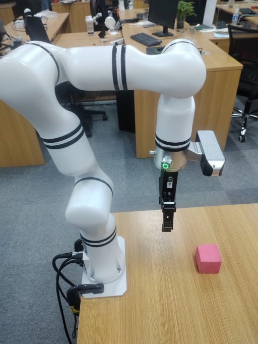

# <p class="hidden">SDK developer guide: </p>Visual Vertical Grasping of Robotic Arms

A method applicable to RM robotic arms combined with vision to identify and grasp objects on a desktop, capable of grasping objects with a height of less than or equal to 1 cm at the desktop level.

**Basic method**<br>
The method includes the following steps:

1. Identify the object's position information, and move the gripper directly above the object based on the position data.
2. Identify the object's height information, and determine the gripper's downward depth based on the height data.
3. Identify the object's mask information, and adjust the gripper's angle based on the mask data.
4. A single detection is sufficient to capture all the necessary information, without requiring multiple detections.

**Application scenario**<br>
Visual vertical grasping of robotic arms enhances the efficiency of object handling from vertical or inclined surfaces, streamlining the workflow of automated systems. It is widely applied in scenarios such as production line assembly, warehousing logistics, book management, electronics assembly, and medical equipment operation.

## 1. Quick start

### Basic environment preparation

| Item | Version |
|:-----|:-----|
| Operating system | ubuntu20.04 |
| Architecture | x86 |
| Python | 3.8 |
| pip | 24.2 |

### Python environment preparation

| Dependency | Version |
|:-----|:-----|
| opencv-python | 4.9.0.80 |
| matplotlib | 3.7.5 |
| numpy | 1.24.4 |
| Pillow | 10.4.0 |
| scipy | 1.10.1 |

1. Ensure the basic environment is installed

Install the conda package management tool and the python environment. For details, please refer to [Install Conda and Python environment](../../getStarted/environment/index.md)

2. Create a python environment

Create the conda virtual environment

```bash
conda create --name [conda_env_name] python=3.8 -y
```

Activate the conda virtual environment

```bash
conda activate [conda_env_name]
```

View the python version

```bash
python -V
```

View the pip version

```bash
pip -V
```

Update pip to the latest version

```bash
pip install -U pip
```

3. Install third-party package dependencies for the python environment

Install opencv

```bash
pip install opencv-python==4.9.0.80
```

Install matplotlib

```bash
pip install matplotlib==3.7.5
```

Install numpy

```bash
pip install numpy==1.24.4
```

Install pillow

```bash
pip install Pillow==10.4.0
```

Install scipy

```bash
pip install scipy==1.10.1
```

### Code access

Get the latest code in [GitHub: vertical grasping](https://github.com/RealManRobot/vertical-grasp).

### Code execution

```python
# Obtain video frames
color_image = cv2.imread("xxx.png")
depth_image =  cv2.imread("xxx.png")
mask =  cv2.imread("xxx.png")

# Retrieve camera intrinsic parameters (the following is pseudocode)
color_intr = camere.get_intr()

# Get current pose information (the following is SDK operation for the RealMan robotic arm)
_, joints, pose, _, _ = arm.Get_Current_Arm_State()

# Calculate the three key points for vertical grasping
above_object_pose, correct_angle_pose, finally_pose = vertical_catch(mask, depth_image, color_intr, pose, 165, [0, 0, -0.25], [], [])

# Move to the first position (the following is SDK operation for the RealMan robotic arm)
arm.movej_p(above_object_pose)

# Move to the second position (the following is SDK operation for the RealMan robotic arm)
arm.movej_p(above_object_pose)

# Close the gripper (the following is SDK operation for the RealMan robotic arm)
ret = arm.Set_Gripper_Pick_On(500, 500)

# Move to the third position (the following is SDK operation for the RealMan robotic arm)
arm.movej_p(above_object_pose)
```

## 2. API reference

### Calculate grasping positions vertical_catch

```python
above_object_pose, correct_angle_pose, finally_pose = vertical_catch(mask, depth_image, color_intr, pose, 165, [3.14, 0, 0], [rotation matrix], [translation matrix])
```

Based on the provided information, calculate the three positions necessary for vertical grasping.

- Function input:
  1. mask: object mask information; the mask source can be diverse, and it must be a single-channel image of the same size as the depth image
  2. depth_frame: depth frame
  3. color_intr: camera intrinsic parameters
  4. current_pose: current pose
  5. arm_gripper_length: length of the gripper
  6. vertical_rx_ry_rz: predicted vertical grasping pose, retrievable from the teach pendant
  7. rotation_matrix: transformation matrix for hand-eye calibration results
  8. translation_vector: translation matrix for hand-eye calibration results
  9. use_point_depth_or_mean: whether to use average depth or single-point depth. True: use single-point depth
- Function output:
  1. above_object_pose: position approximately 10 cm directly above the object.
  2. correct_angle_pose: rotation of the gripper or robotic arm to align with the object's pose direction
  3. finally_pose: final grasping pose

## 3. Function introduction

### Application condition

- The robotic arm must be installed upright on a desktop, and the object to be grasped must be placed above the desktop within the camera's detection range. Refer to the image below for installation:



### Function information

Based on the parameters inputted about the environment and equipment, the three key step points for vertical object grasping are calculated. These three points can then be sent to the robotic arm SDK for execution of movement and grasping.

- Input parameters:
  1. Depth image of the current environment;
  2. Object mask (it requires retrieval via other AI SDKs, and it is recommended to use RealMan’s [Item Segmentation](../itemSegmentation/index.md), [Multi-modal Recognition](../multimodalRecognition/index.md), and [Item Tracking](../itemTracking/index.md));
  3. Current pose of the robotic arm;
  4. Camera intrinsic parameters. Retrieval methods vary and require SDK or software provided by the camera manufacturer;
  5. Gripper length information;
  6. Pose information of the robotic arm's final axis, which is vertical to the desktop, including rx, ry, and rz. This can be manually adjusted on the RealMan robotic arm and read from the teach pendant;
  7. Hand-eye calibration matrix information for the robotic arm with an attached camera, which can be retrieved using hand-eye calibration software provided by RealMan.

<video width="300px" autoplay loop muted height="300px" >
  <source src="../doc/verticalGrab.mp4" type="video/mp4">
</video>

- Output parameters: the three points for vertical grasping.

The three points are calculated based on grasping the object while avoiding collisions with the object or the desktop. The specific point information is as follows:

1. A position approximately 10 cm directly above the object, ensuring the robotic arm's downward movement will not collide with the object.
2. Calculating the object's longer and shorter sides, determining the rotation axis angle for grasping the longer side, and computing the final pose of the rotation axis based on the current pose of the robotic arm.
3. An actual grasping pose of the object, determined by calculating the final downward movement distance of the gripper using the desktop frame and the object's height, and computing the final pose.

## 4. Developer guide

### Image input specification

Generally, an image of a 640×480×3 channel is used as input for the entire project, and BGR is used as the main channel sequence. It is recommended to use opencv mode to read the image and load it to the model.

Generally, a depth information image of a 640×480×1 channel is used as input for the project.

### Length input specification

In this case, all length units are in mm.

### Intrinsic camera parameter specification

Intrinsic camera parameter specification:

```python
{   
    "fx": 606.9906005859375, 
    "fy": 607.466552734375, 
    "ppx": 325.2737121582031, 
    "ppy": 247.56326293945312, 
    "height": 480, 
    "width": 640, 
    "depth_scale": 0.0010000000474974513
}
```

### Hand-eye calibration result specification

The hand-eye calibration result specification:

```python
hand_to_camera = np.array(
    [[0.012391991619246201, 0.9775253241173848, -0.21045350853076827, -0.06864240753156699],
    [-0.9998988955501277, 0.01358205757415265, 0.0042102719255664445, 0.0435019505437101],
    [0.006974039098208998, 0.21038005709014823, 0.9775948007008847, -0.0005546366642718483],
    [0, 0, 0, 1]])

```

## 5. Frequently asked question (FAQ)

**1. Will vertical grasping collide with the desktop?**

Normally, it will not happen. When the robotic arm is installed on the desktop, the desktop acts as the zero frame, and the desktop grasping frame strictly enforces the constraint z >= 0, ensuring it does not touch the desktop.

**2. How to adjust if the final tilt angle or tilt direction during grasping is incorrect?**

You should check the input parameter vertical_rx_ry_rz. This value represents the rx, ry, and rz of the gripper itself in a static state, where the gripper, robotic arm, and camera are parallel.

**3. Does the robotic arm have to move sequentially between the three poses?**

No, it does not have to move sequentially. The third pose represents the exact pose of the object, while the other two poses are auxiliary poses for movement. These auxiliary poses are specifically designed to prevent the gripper from touching the object during movement, which could cause the object to shift.

**4. Is it necessary to ensure that the item to be grasped and the platform where the robotic arm is installed are at the same height?**

It is not necessary to ensure that the item and the platform of the robotic arm are at the same height. You can adjust the gripper length to effectively modify the height of the grasping platform.

::: tip
Conversion relationship: increasing the gripper length -> The grasping plane is higher than the installation platform; decreasing the gripper length -> The grasping plane is lower than the installation platform.
:::

**5. What should I do if the gripper touches the desktop during grasping, or if the gripper does not go deep enough?**

You can resolve the issue by adjusting the length of the gripper's end.

:::tip
Conversion relationship: Gripper touches the desktop -> gradually increasing the gripper length; Gripper does not go deep enough -> gradually decreasing the gripper length.
:::

## 6. Update log

|Update date|Update content|Version|
|:--|:--|:--|
|2024.08.16|New content|V1.0|

## 7. Copyright and license agreement

- This project is subject to the MIT license.
