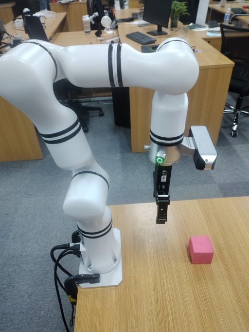

# <p class="hidden">SDK developer guide: </p>Visual Servo of Robotic Arms

A function designed for RM robotic arms, enabling the integration of vision to achieve visual servo capabilities. The visual servo controls the robotic arm through visual feedback for precise localization and automatic operation in dynamic environments.

**Basic method**<br>
The method includes the following steps:

1. Use any solution to determine the xyz coordinate information of the object to be tracked under the camera.
2. Input the coordinate information into the visual servo instance, which will automatically initiate the servo process.

**Application scenario**<br>
Visual servo is applied in scenarios such as automatic production lines, warehousing logistics, robot grasping, and precision assembly. It relies on real-time visual feedback to adjust robotic arm movements, allowing high-accuracy operations and autonomous tasks in dynamic environments.
**Target user**

- System integrators & robotic arm application developers: The visual servo system can integrate robotic arms with vision systems, making it applicable to the production line assembly, intelligent warehousing, etc., enhancing automation accuracy and shortening development cycles.

- Scientific researchers: It supports researchers in exploring cutting-edge fields such as algorithm optimization and large-scale model testing in robot vision and control, driving advancements in intelligent applications.

- Educational users: It is used for teaching robot vision and control experiments, enabling students to apply theoretical knowledge to design and complete related experimental projects.

## 1. Quick start

### Basic environment preparation

| Item     | Version                 |
|:-------|:-------------------|
| Operating system   | ubuntu20.04        |
| Architecture     | x86                |
| GPU driver   | nvidia-driver-535  |
| Python | 3.8                |
| pip    | 24.9.1             |

### Python environment preparation

| Dependency                     | Version        |
|:-----------------------|:----------|
| opencv-python          | 4.10.0.84 |
| loguru                 | 0.7.2     |
| spatialmath-python     | 1.1.8     |
| roboticstoolbox-python | 1.1.0     |

1. Ensure the basic environment is installed

Install the conda package management tool and the python environment. For details, please refer to [Install Conda and Python environment](../../getStarted/environment/index.md)

2. Create a python environment

Create the conda virtual environment

```bash
conda create --name [conda_env_name] python=3.8 -y
```

Activate virtual environment

```bash
conda activate [conda_env_name]
```

View the python version

```bash
python -V
```

View the pip version

```bash
pip -V
```

Update pip to the latest version

```bash
pip install -U pip
```

3. Install third-party package dependencies for the python environment

Install dependencies related to opencv, which will also install related packages like numpy

```bash
pip install opencv-python==4.10.0.84
```

Install dependencies related to logging

```bash
pip install loguru==0.7.2  
```

Install dependencies related to spatialmath, which will also install related packages like Pillow and scipy

```bash
pip install spatialmath-python==1.1.8
```

Install the robotics development package roboticstoolbox-python

```bash
pip install roboticstoolbox-python==1.1.0
```

If you encounter errors during the installation of roboticstoolbox-python or the package is unusable after installation, you can uninstall it and download the source code to reinstall.

```bash
git clone https://github.com/petercorke/robotics-toolbox-python.git
cd robotics-toolbox-python
pip3 install -e .
```

### Code access

Get the latest code in [github link](https://github.com/RealManRobot/visual-servo).

### Code execution

```python
# Instantiate the visual servo object and pass in relevant parameters. Parameter details are as follows:
ibvs = ImageBaseVisualServo(
    ip="192.168.1.18",  # IP address of the robotic arm
    port=8080,  # Pass-through port of the robotic arm
    init_joint=[-2.288, -8.908, 97.424, -0.788, 88.872, -0.019],  # Initial position of the robotic arm
    center=[320, 240, 250],  # Visual servo tracking point alignment position: The first two values represent image pixel coordinates, indicating the position where the object will be fixed.
    # The last value represents the distance from the robotic arm's end-effector to the object, in mm
    hand_to_camera=np.array([[-0.013, 1, -0.0004, -0.092],  # Hand-eye calibration matrix
                             [-1, -0.013, 0.01, 0.03],
                             [0.009, 0.004, 1, 0.034],
                             [0, 0, 0, 1]])
)

# Define and start the thread
thread2 = threading.Thread(target=ibvs.run)
thread2.start()

while True:
    """
    The following simulates sending one coordinate every second. The actual frequency can be higher, up to a maximum of 200 HZ
    """
    time.sleep(1)
    ibvs.center = [280, 200, 250]
    time.sleep(1)
    ibvs.center = [360, 200, 250]
    time.sleep(1)
    ibvs.center = [360, 280, 250]
    time.sleep(1)
    ibvs.center = [280, 280, 250]
```

Alternatively, use the following example, which is based on arbitrary object recognition.

```python
# Instantiate the visual servo object and pass in relevant parameters. Parameter details are as follows:
ibvs = ImageBaseVisualServo(
    ip="192.168.1.18",  # IP address of the robotic arm
    port=8080,  # Pass-through port of the robotic arm
    init_joint=[-2.288, -8.908, 97.424, -0.788, 88.872, -0.019],  # Initial position of the robotic arm
    center=[320, 240, 250],  # Visual servo tracking point alignment position: The first two values represent image pixel coordinates, indicating the position where the object will be fixed.
    # The last value represents the distance from the robotic arm's end-effector to the object, in mm
    hand_to_camera=np.array([[-0.013, 1, -0.0004, -0.092],  # Hand-eye calibration matrix
                             [-1, -0.013, 0.01, 0.03],
                             [0.009, 0.004, 1, 0.034],
                             [0, 0, 0, 1]])
)

# Define and start the thread
thread2 = threading.Thread(target=ibvs.run)
thread2.start()

# Pseudocode, load the video stream object
camera = RealSenseCamera()
# Pseudocode, load the recognition model
model = detect.gen_model()
# Specify the object to be tracked
input = "Fang_Kuai"

while True:
    # Pseudocode, retrieve the video stream
    color_img, depth_img, _, _, _aligned_depth_frame = camera.read_align_frame(False, False)
    
    # Pseudocode, perform recognition and inference, and return the center point of the object "Fang_Kuai," with the center point calculated based on the mask
    annotated_frame, center, _ = model(color_img, object_name=input)  # Perform inference
    
    # Retrieve the depth value
    z = depth_img[int(center[1])][int(center[0])]
    
    # Construct the normalized center value
    center.append(z)
    
    # Assign the value
    ibvs.center = center
    
    # Visualize the content
    cv2.imshow("annotated_frame", annotated_frame)
    if cv2.waitKey(1) & 0xFF == ord("q"):
        break
```

## 2. API reference

### Visual servo initialization

```python
ibvs = ImageBaseVisualServo(
    ip="192.168.1.18",  # IP address of the robotic arm
    port=8080,  # Pass-through port of the robotic arm
    init_joint=[-2.288, -8.908, 97.424, -0.788, 88.872, -0.019],  # Initial position of the robotic arm
    center=[320, 240, 250],  # Visual servo tracking point alignment position: The first two values represent image pixel coordinates, indicating the position where the object will be fixed.
    # The last value represents the distance from the robotic arm's end-effector to the object, in mm
    hand_to_camera=np.array([[-0.013, 1, -0.0004, -0.092],  # Hand-eye calibration matrix
                             [-1, -0.013, 0.01, 0.03],
                             [0.009, 0.004, 1, 0.034],
                             [0, 0, 0, 1]])
)

# Define and start the thread
thread2 = threading.Thread(target=ibvs.run)
thread2.start()

# Input data
ibvs.center = [xxx, xxx, xxx]
```

Instantiate the visual servo class, start the thread after instantiation, and begin inputting data. The thread will automatically move the robotic arm to the specified points.

- Instantiation input:
  1. ip: IP address of the robotic arm
  2. ort: pass-through port of the robotic arm
  3. init_joint: initial position of the robotic arm
  4. center: visual servo tracking point alignment position: The first two values represent image pixel coordinates, indicating the position where the object will be fixed. The last value represents the distance from the robotic arm's end-effector to the object, in millimeters (mm)
  5. hand_to_camera: hand-eye calibration matrix
- Function input:
  center: object mask information
- Function output:
  None, primarily controlling the movement of the robotic arm.

## 3. Function introduction

### Application condition

- The robotic arm must be installed upright on a desktop, and the servo position must fall within the camera's detection range. Refer to the image below for installation:



### Function information

By employing various visual methods (such as image recognition, and corner tracking), the point information to be detected is obtained, providing the object's xy coordinates relative to the image along with the current depth information. This forms a point based on the camera frame. Input this point into an instantiated visual servo class, and the code will automatically drive the robotic arm to start tracking the point. It is also recommended that the input points be sufficiently dense and smooth to ensure the robotic arm moves more fluidly during operation.

- Instantiation parameters<br>
  IP of the robotic arm, typically 192.168.1.18 by default <br>
  Pass-through port of the robotic arm, typically 8080 by default <br>
  Initial position, initial position of the robotic arm<br>
  Initial servo alignment position, such as the center point of the image, which must comply with the point specifications and align with the robotic arm's current hand-eye calibration data
  
- Input parameters<br>
  The object point information calculated from the image must adhere to the point specifications

### Function parameters

- Servo frequency: up to 200 HZ
- Servo accuracy: 1 pixel in the planar direction, and 1 mm in the depth direction

## 4. Developer guide

### Length input specification

In this case, all length units are in mm.

### Point specification

The point specification:

```bash
center=[320, 240, 250]
```

The first two values of center represent the x and y positions in the image frame, in pixels. The third value indicates the distance from the robotic arm's end-effector to the object, in mm.

### Hand-eye calibration result specification

The hand-eye calibration result specification:

```python
hand_to_camera = np.array(
    [[0.012391991619246201, 0.9775253241173848, -0.21045350853076827, -0.06864240753156699],
     [-0.9998988955501277, 0.01358205757415265, 0.0042102719255664445, 0.0435019505437101],
     [0.006974039098208998, 0.21038005709014823, 0.9775948007008847, -0.0005546366642718483],
     [0, 0, 0, 1]])

```

## 5. Frequently asked question (FAQ)

**(1) Do I need to set the speed for the visual servo motion process?**

There is no need to set the motion speed. The robotic arm will automatically perform trajectory planning based on the calculated joint values, achieving smooth movement.

**(2) How do I generally obtain the input value center?**

The first two values of the input value center represent the x and y coordinates in the camera image, which can be obtained through recognition, segmentation, or tracking to generate the object's mask. The center point can then be calculated from the mask to determine the x and y coordinates. After confirming the point, the object's x and y positions in the image can be tracked via optical flow or corner tracking. The third value of center represents range information, which is typically derived from the depth information at the camera's x and y positions.

**(3) Does it currently support robotic arms other than the RM65 model?**

Yes, visual servo for other robotic arms can be implemented by configuring the robot parameters. For specific robotic arm models, please contact RealMan's technical support.

**(4) Is the current setup limited to the configuration where the robotic arm is installed upright on a desktop with the vision system facing the desktop?**

Yes, as other configurations require coordinate transformation adjustments. If you have specific requirements, additional adaptations will be needed.

## 6. Update log

|Update date|Update content|Version|
|:--|:--|:--|
|2024.10.12|New content|V1.0|

## 7. Copyright and license agreement

- This project is subject to the MIT license.
