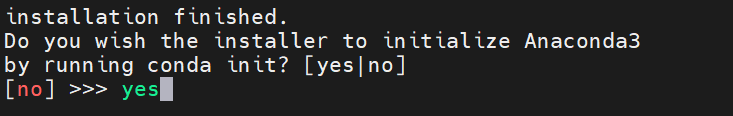

# <p class="hidden">Quick start: </p>Install Conda and Python Environment

This document describes the installation method of the AI algorithm's conda package management tool, basic python environment, and GPU driver.
<br>
It is intended to build a basic AI development environment and enable the reader to quickly start AI commissioning.

**Target user**

AI developer

## Detailed course

### Basic environment

| Project     | Version        |
| :------- | ----------- |
| Operating system | ubuntu20.04 |
| Architecture     | x86         |

#### Install conda

Most algorithm environments require package support from conda sources, and environments among different algorithms need to be isolated to avoid conflicts, so conda is used to build virtual environments.
Basic packages such as python and pip can be installed directly through conda, which reduces the installation time.

1. Download the conda package.

```bash
wget https://mirrors.tuna.tsinghua.edu.cn/anaconda/archive/Anaconda3-2021.11-Linux-x86_64.sh
```

2. Add the executable permission.

```bash
chmod +x ./Anaconda3-2021.11-Linux-x86_64.sh
```

3. Install the sh file.

During the process, you will be prompted to enter configuration parameters such as the installation location. You can simply press [Enter] to use the default settings, which will install in the ~/anaconda3 directory for the current user.

```bash
bash Anaconda3-2021.11-Linux-x86_64.sh
```

4. Initialize the conda.

By the last installation step of the interaction:



Or by the command line after the installation is complete

```bash
~/anaconda3/bin/conda init
```

5. Activate the conda environment.

```bash
source ~/.bashrc
conda -V
```

6. Configure conda to a domestic source, such as the Tsinghua source.

::: tip
Other sources can be customized.
:::

```bash
conda config --add channels https://mirrors.tuna.tsinghua.edu.cn/anaconda/pkgs/main/
conda config --add channels https://mirrors.tuna.tsinghua.edu.cn/anaconda/pkgs/r/
conda config --add channels https://mirrors.tuna.tsinghua.edu.cn/anaconda/pkgs/msys2/
conda config --add channels https://mirrors.tuna.tsinghua.edu.cn/anaconda/cloud/conda-forge/
conda config --set show_channel_urls yes
```

7. Activate the source configuration.

```bash
conda update -n base -c defaults conda
```

At this point, the conda is installed successfully, and it is available to configure and manage the python.

#### Install python

1. After the conda installation is complete, configure and install the python through conda.

python3.8 is recommended.

```bash
conda -V

conda create --name py38 python=3.8 -y
```

2. Switch to the new python environment and check the python version and pip version.

```bash
conda activate py38
python -V
pip -V
```

3. Modify the pip source as a domestic source, such as the Tsinghua source to speed up the package download.

```bash
pip config set global.index-url https://pypi.tuna.tsinghua.edu.cn/simple
```

::: tip
Other sources can be customized.
:::

4. Upgrade the management tool pip for the python package to the latest version.

```bash
pip install -U pip
```
