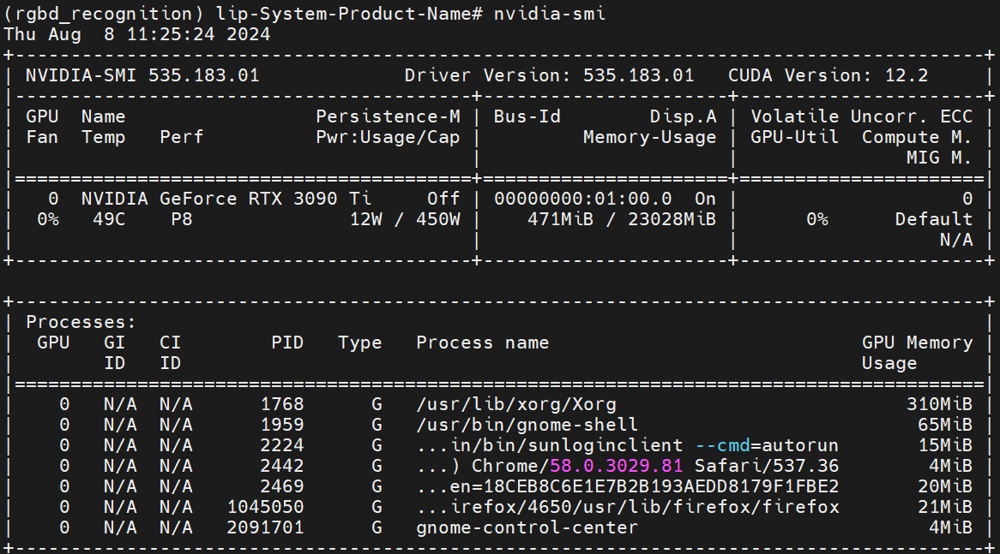

# <p class="hidden">Quick start:</p>Install Nvidia GPU Driver

This document describes how to install the Nvidia GPU driver in Ubuntu20.04, with the aim of speeding up the AI inference procedure through Nvidia cuda.

**Target user**

AI developer

## Detailed course

### Basic environment

| Project     | Version        |
| :------- | ----------- |
| Operating system | ubuntu20.04 |
| Architecture     | x86         |

#### Install cuda

1. View the information on the local GPU.

```bash
lspci | grep -i vga
```

If the Nvidia is displayed, the Nvidia accelerator card is installed. Otherwise, the cuda cannot be installed.


2. Check the GPU driver suitable for the computer.

```bash
sudo ubuntu-drivers devices
```

All recommended driver versions available for installation are displayed.

3. Select the proper driver in the list and install it.

It is recommended to use a high-version GPU driver, such as 535, which is compatible with low versions.

```bash
apt-get install nvidia-driver-535 -y
```

4. Wait until the installation is complete, and then restart the computer to activate the GPU driver.

```bash
reboot
```

5. Verify whether the GPU driver is installed successfully.

```bash
nvidia-smi
```

If the details shown in the figure are displayed, the installation is complete, and the GPU is available.


