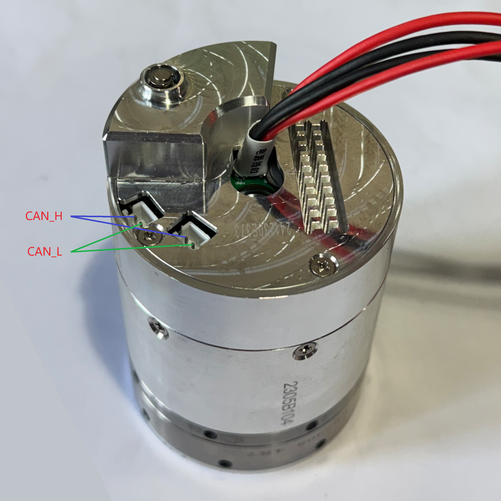
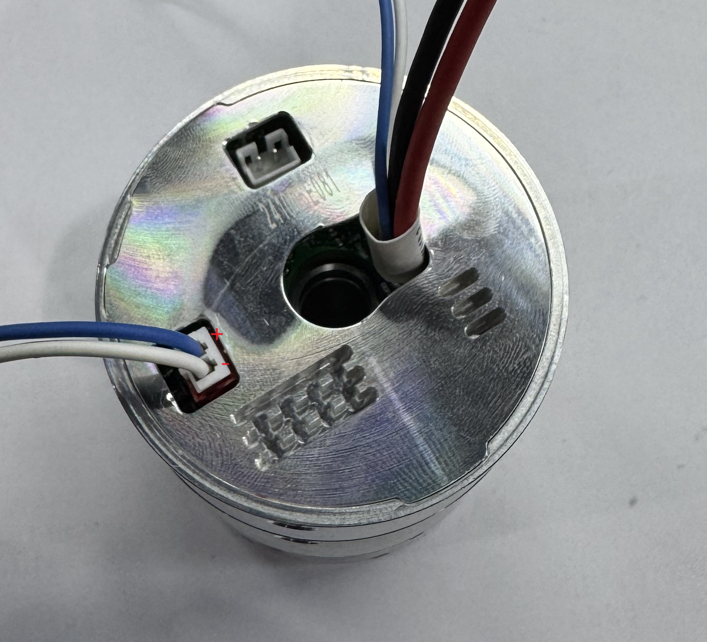
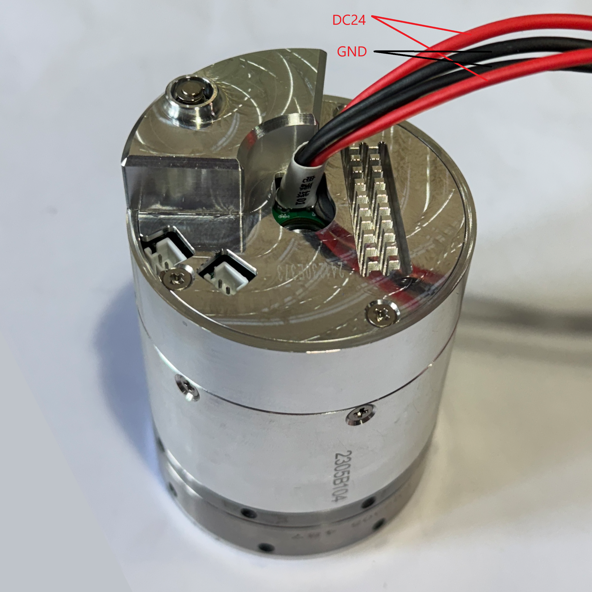
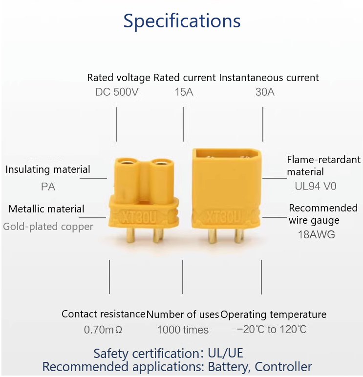
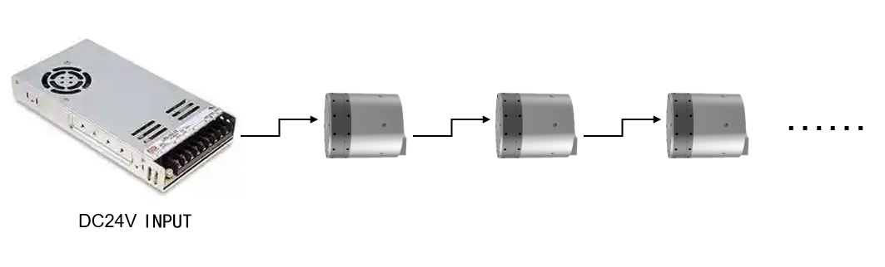
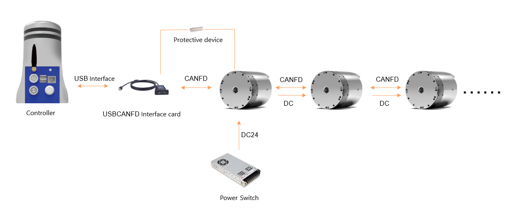
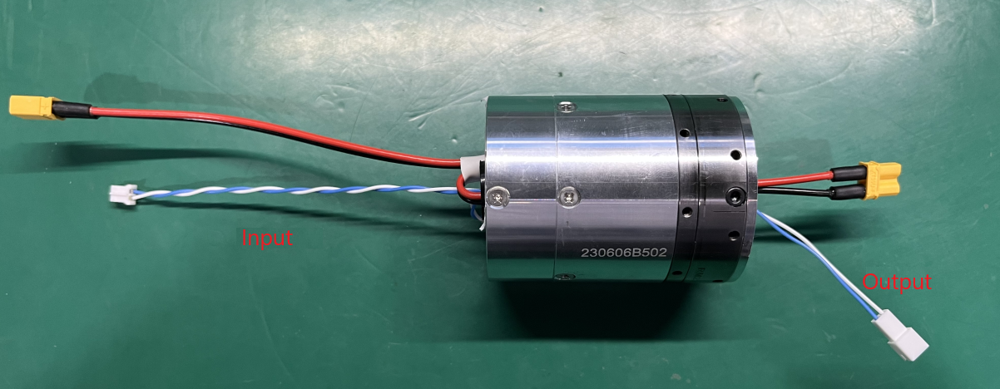
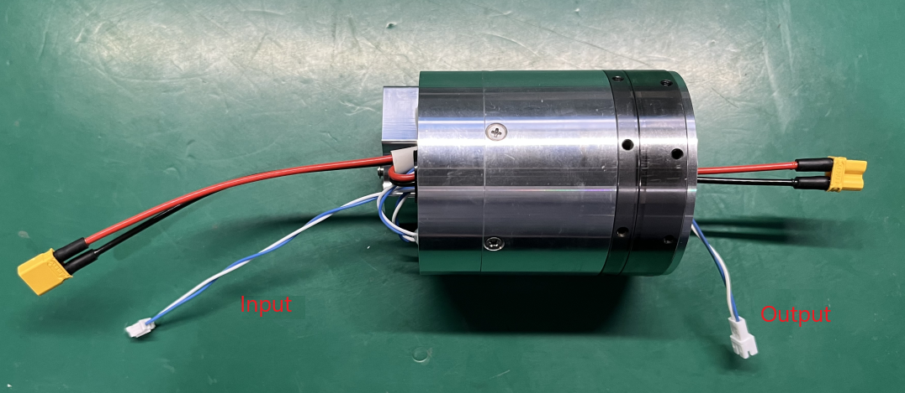
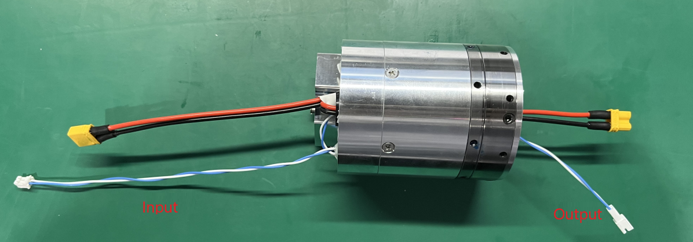
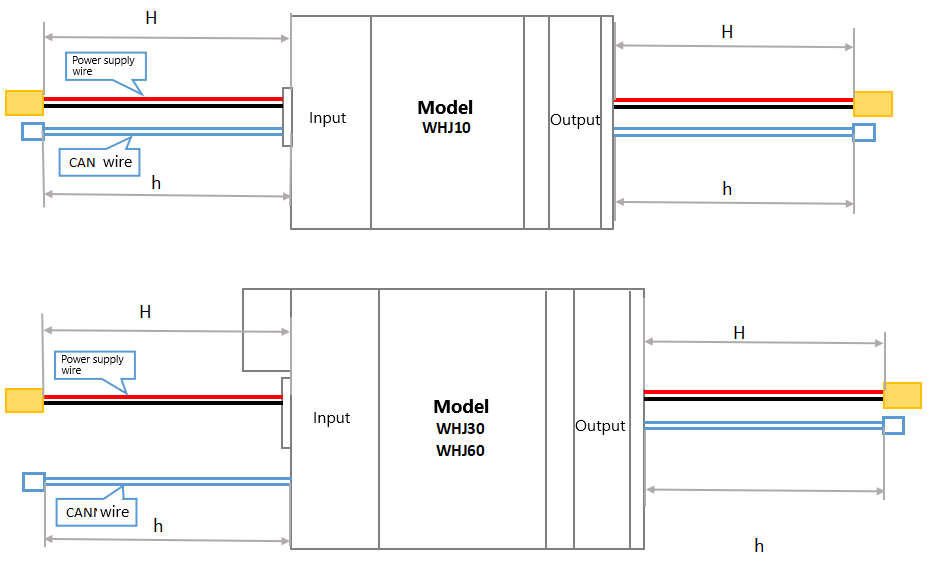

# 
Getting Started: 
 Joint Electrical Instructions

## Joint Input Power Instructions

### Power Voltage and Rated Power

The power supply uses 24VDC (the factory-set minimum allowable bus voltage is 20V, and the recommended maximum bus voltage is 30V). The driver will trigger an overvoltage fault when detecting a voltage exceeding 35V, and an under-voltage alarm will occur when detecting a voltage below 20V.

|Model|Voltage|Power|
|-|-|-|
|WHJ10-80|24V|63W|
|WHJ30-80|24V|188W|
|WHJ60-100|24V|292W|

### Limit Values of Joint Voltage

The maximum voltage that the joint power interface can withstand is DC38V. An input voltage exceeding 38V may easily lead to driver failure. When using a switch to control the joint power supply, there may be an overvoltage impact (＞38V) at the moment of power-on. For this power supply method, a polarized capacitor (reference specification: 820uF, 50V) should be connected in parallel after the switch and before the joint power input to suppress the overvoltage phenomenon at the moment of power-on.

When using a 24V switch-mode power supply, it is necessary to connect the protective device provided by our company to protect the switch-mode power supply and absorb the counter electromotive force.

When using a battery for power supply, there is no need to consider the influence of counter electromotive force, because the counter electromotive force of the joint will directly charge the battery; if the battery power is small, the protective device provided by our company can also be connected to make the system more reliable.

## Joint Positive Rotation Direction

Facing the output end of the reducer, the positive rotation direction of the joint is counterclockwise. This direction cannot be modified. The rotation direction of the joint is determined by the direction of the target command, which is issued by the controller end.

  

Positive Rotation Direction

## Electrical Interface Instructions

### CAN Communication Interface

The terminal model is PH2.0-2A, as shown in the figure below:

  

CAN Communication Interface

### Multi-turn Power Supply Battery Interface

The terminal model is PH2.0-2A. The positive and negative poles of the interface are shown in the figure below (red for positive and black for negative):

  

Multi-turn Power Supply Battery Interface

### 24V Power Supply Interface

The positive and negative poles of the power line interface are shown in the figure below (red for positive and black for negative):

  

24V Power Supply Interface

Specifications

## Cable Connection between Multi-joint Modules

### Power Wiring Method Instructions

Chain topology connection; if the power of a single joint is large, it can also be connected directly.

Chain Topology

### CANFD Communication Wiring Diagram

1. CANFD communication lines use twisted pair cables, with a data transmission rate of 5Mbps, and chain topology connection;
2. A 120Ω terminal resistor (very important) needs to be connected in parallel at the CAN interface of the controller end and the end servo;
3. Ensure that the CAN ID of each joint module is set uniquely;

CANFD Communication Wiring Diagram

### Length Instructions of CANFD Line and Power Line

WHJ10:

WHJ30:

WHJ60:

### Cable and Terminal Specifications

<table>
<tr>
    <th colspan="2" rowspan="2"> </th>
    <th rowspan="2">Number of Interfaces</th>
    <th colspan="2">Joint Input End Wire Type</th>
    <th colspan="2">Joint Output End Wire Type</th>
    <th colspan="2">Wire Material</th>
    <th rowspan="2">Overcurrent (A)</th>
</tr>
<tr>
    <th>Terminal</th>
    <th>Wire Length (mm)</th>
    <th>Terminal</th>
    <th>Wire Length (mm)</th>
    <th>Cross-sectional Area (mm²)</th>
    <th>AWG</th>
</tr>
<tr>
    <th rowspan="3">Power</th>
    <td>WHJ60 Single Joint Power Interface</td>
    <td>2P*2</td>
    <td>XT30U-M</td>
    <td>140-150</td>
    <td>XT30U-F</td>
    <td>35-45</td>
    <td>0.75 (150 strands/0.08)</td>
    <td>Approximately 16-18 based on current</td>
    <td>Rated 15/Maximum 30</td>
</tr>
<tr>
    <td>WHJ30 Single Joint Power Interface</td>
    <td>2P*2</td>
    <td>XT30U-M</td>
    <td>110-120</td>
    <td>XT30U-F</td>
    <td>40-50</td>
    <td>0.75 (150 strands/0.08)</td>
    <td>Approximately 16-18 based on current</td>
    <td>Rated 15/Maximum 30</td>
</tr>
<tr>
    <td>WHJ10 Single Joint Power Interface</td>
    <td>2P*2</td>
    <td>XT30U-M</td>
    <td>110-120</td>
    <td>XT30U-F</td>
    <td>45-55</td>
    <td>0.75 (150 strands/0.08)</td>
    <td>Approximately 16-18 based on current</td>
    <td>Rated 15/Maximum 30</td>
</tr>
<tr>
    <th rowspan="6">Signal CAN</th>
    <td rowspan="2">WHJ60 Single Joint Power Interface</td>
    <td rowspan="2">2P*2</td>
    <td>BX-PH2.0-2PJK Housing</td>
    <td rowspan="2">155-165</td>
    <td>A2001HM-2P Air Docking</td>
    <td rowspan="2">50-60</td>
    <td rowspan="2">0.5 (30 strands/0.08)</td>
    <td rowspan="2">26</td>
    <td rowspan="2">Rated 3/Maximum 6</td>
</tr>
<tr>
    <td>Press-fit Terminal: A2001-TP/BX-PH2.0-DZ</td>
    <td>Press-fit Terminal: A2001M-TP</td>
</tr>
<tr>
    <td rowspan="2">WHJ30 Single Joint Power Interface</td>
    <td rowspan="2">2P*2</td>
    <td>BX-PH2.0-2PJK Housing</td>
    <td rowspan="2">155-165</td>
    <td>A2001HM-2P Air Docking</td>
    <td rowspan="2">55-65</td>
    <td rowspan="2">0.5 (30 strands/0.08)</td>
    <td rowspan="2">26</td>
    <td rowspan="2">Rated 3/Maximum 6</td>
</tr>
<tr>
    <td>Press-fit Terminal: A2001-TP/BX-PH2.0-DZ</td>
    <td>Press-fit Terminal: A2001M-TP</td>
</tr>
<tr>
    <td rowspan="2">WHJ10 Single Joint Power Interface</td>
    <td rowspan="2">2P*2</td>
    <td>BX-PH2.0-2PJK Housing</td>
    <td rowspan="2">125-135</td>
    <td>A2001HM-2P Air Docking</td>
    <td rowspan="2">40-50</td>
    <td rowspan="2">0.5 (30 strands/0.08)</td>
    <td rowspan="2">26</td>
    <td rowspan="2">Rated 3/Maximum 6</td>
</tr>
<tr>
    <td>Press-fit Terminal: A2001-TP/BX-PH2.0-DZ</td>
    <td>Press-fit Terminal: A2001M-TP</td>
</tr>
</table>

Cable and Terminal Specifications

Due to different product configurations and different joint positions, the length requirements for CAN lines and power lines vary. Both CAN lines and power lines are of default length. If there are special length requirements, please contact us to make notes on the product order.

## Multi-turn Power Supply Battery Instructions

### Battery Function

To power the multi-turn encoder and save the multi-turn count of the joint, preventing the loss of the equipment's zero position.

### Battery-related Error Handling

Reset the zero position, and a soft reset can be performed.
