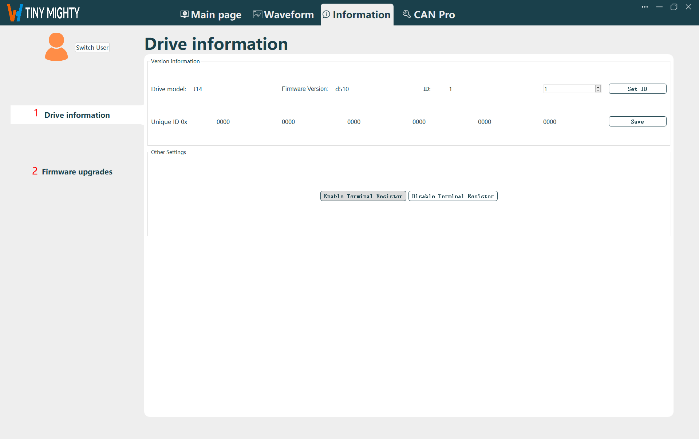
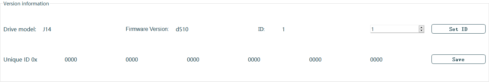
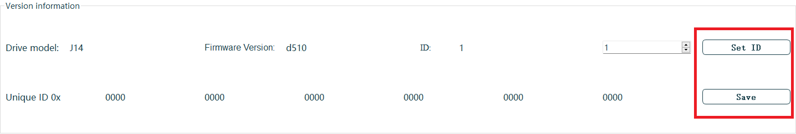
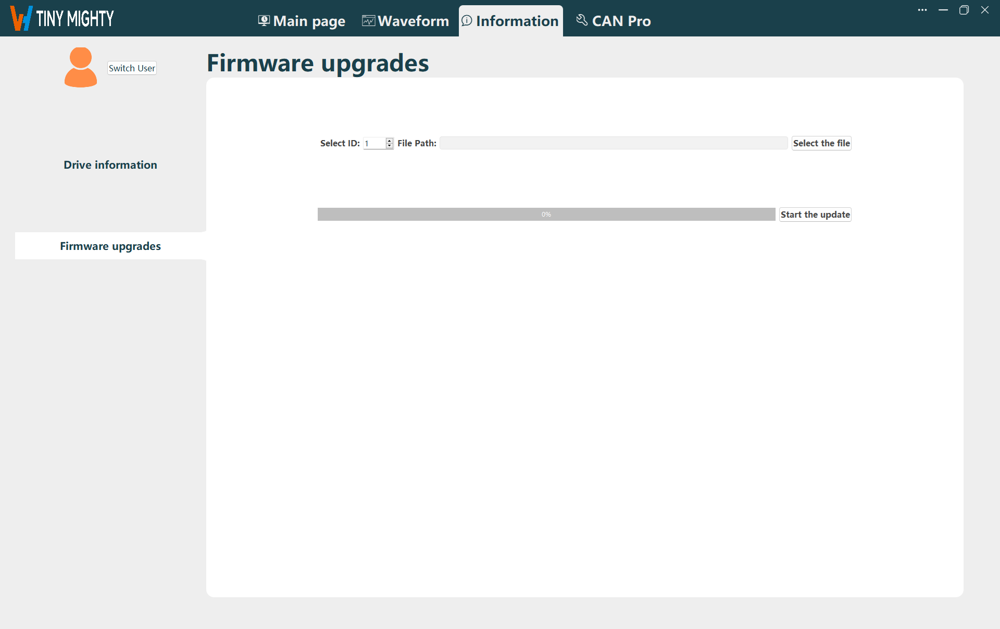
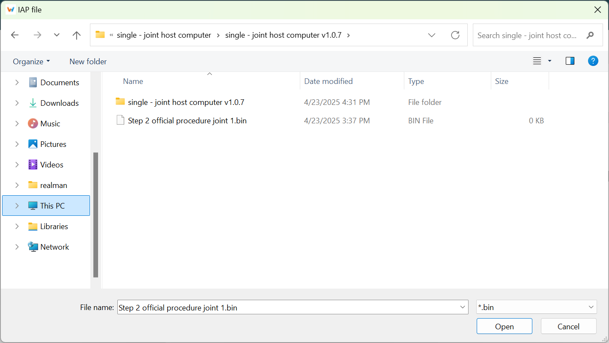
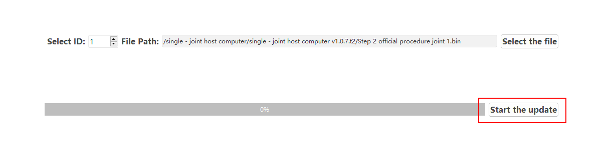

# 
Getting Started: 
 Information Navigation

**Information navigation includes**: Driver information, firmware upgrade, as shown in the figure below.

Driver Information Navigation Page
 

## Driver Information

### Driver Information Display

**Driver Information Display**: Driver model, Firmware version, Joint ID, Unique ID. 

Driver Information
 

### Function Buttons

- **ID Setting**:
    Set the joint ID. After setting, click `Save` and restart the joint to activate.
    
    
Joint ID Setting
 
- **Enable/Disable Terminal Resistance**:
    Set the terminal resistor for the CAN Module to Enable or Disable.
    
    
Terminal Resistor Setting
 

## Firmware Upgrades

Upgrade the firmware version of the joint. A restart is required after upgrading for the changes to take effect.

Firmware Upgrades
 

::: warning
CANOpen joints cannot be upgraded on this page. Please contact our technical support for assistance.
:::

1. Enter the joint ID to be upgraded.
     
    
Joint Selection
 
2. Click `Select the File`, navigate to the firmware file path, choose the correct firmware file, and click `Open` to select the firmware file. 
    Firmware files have a .bin extension.
     
    
File Selection
 
3. Click `Start the Update` to begin the firmware upgrade.
    
    
Start Update
 
4. After the upgrade is complete, restart the joint to activate the new firmware version.
