# 
Getting Started: 
 Main page Navigation

## Device Connection Class

Device connection can only be established when the hardware status is normal. 
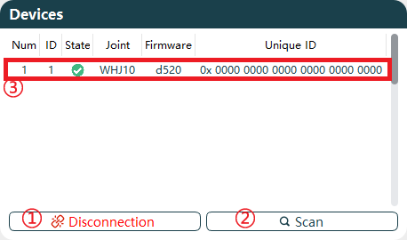 

Connection Page
 

The functions of the device selection buttons are shown in the table below.

|No.|Name|
|-|-|
|1|CAN Connection|
|2|Joint Device Scanning|
|3|Joint Basic Information|

### CAN Connection

- **Connection**:

    1. When the hardware device connection status is normal, click the function button `CAN Connection` to pop up the parameter settings page.
    2. Supports setting `Protocol`, `Channel`, `Arbitration`, and `Data`. 
        Different protocol configurations are as follows:

        |Protocol|Channel|Arbitration|Data|
        |:-:|:-:|:-:|:-:|
        |CANFD_ZLG/CANFD_HK|0|1Mbps|5Mbps|
        |CANOPEN_ZLG/CANOPEN_HK|0|1Mbps|Default 1Mbps, adjustable to 500HZ, 250HZ|

        The corresponding protocol descriptions are as follows. Different protocols correspond to different joint versions. For specific version details, please contact our technical support.

        |Protocol|Description|
        |:-:|:-:|
        |CANFD_ZLG|Compatible with ZLG brand CANFD protocol|
        |CANOPEN_ZLG|Compatible with ZLG brand CANOPEN protocol|
        |CANFD_HK|Compatible with HK brand CANFD protocol|
        |CANOPEN_HK|Compatible with HK brand CANOPEN protocol|

    3. After completing the CAN card communication configuration, click `Confirm` to connect the CAN card device. When the host prompts "Connection Successful," the function button changes to `Disconnection`. 
- **Disconnection**: Click the function button `Disconnection`. The host will prompt "Device Disconnected," and the function button will revert to `CAN Connection`.

    |Connect|Disconnection|
    |:-:|:-:|
    |||

### Scan

After a successful device connection, click `Scan` to begin scanning joints. The system scans connected joints in real-time. Once the scan is complete, joint device information will be displayed in the device dialog box. 

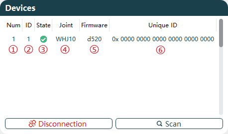 

Device Information Display

The device information display is explained as follows:

|No.|Name|
|-|-|
|1|Connected Device Serial Number|
|2|Joint ID|
|3|Enable Status|
|4|Driver Model|
|5|Firmware Version|
|6|Globally Unique ID|

**Parameter Explanation**:

- **Device Serial Number**: When multiple joints are connected, the serial number increments based on the number of joints.
- **Joint ID**: Displays the set Joint ID number based on real-time scanning.
- **Enable Status**: Shows the current enable status of the joint, with different colors indicating different statuses based on real-time scanning.

    |Disabled|Enabled|
    |:-:|:-:|
    |||

- **Driver Model**: Displays the current joint model based on real-time scanning.
- **Firmware Version Number**: Displays the current joint firmware version based on real-time scanning.
- **Globally Unique ID**: Displays the unique ID of the current joint based on real-time scanning. This ID cannot be modified after factory settings.

## Real-time Display

When the host connection is normal, the basic information of the currently selected joint can be viewed. 

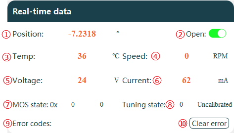 

Real-time Display
 

**Explanation of Data Display Areas:**

|No.|Name|
|-|-|
|1|Current Joint Angle Position|
|2|Enable/Disable Real-time Data Display|
|3|Current Joint Internal Temperature|
|4|Current Joint Speed|
|5|Current Joint Detection Voltage|
|6|Current Joint Power Loss Current|
|7|Current Joint MOS State|
|8|Current Joint Tuning State|
|9|Current Joint Error Codes Display|
|10|Clear Current Error|

### Enable Real-time Data

Real-time data is disabled by default. To view joint real-time information, click `Open` to start uploading current joint data information, as shown in the figure below.

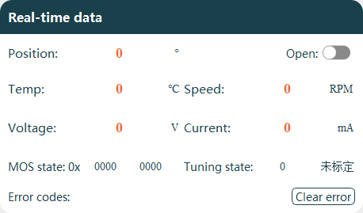

Default State

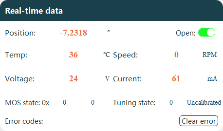

Enabled State

### Clear Errors

When a joint error occurs, the error code prints a description of the current error and the joint status turns to disabled.

1. Identify and resolve the cause of the joint error.
2. Click `Clear error` to remove the error information.
3. Click `Enabled` to restore the joint to an enabled state.

    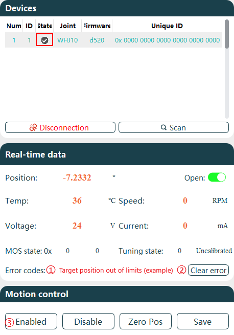
    
Error Clearing Process

## Motion Contorl

Joint control operations allow for joint state control and related motion settings.

### Joint State Settings

The joint state settings function buttons enable corresponding joint operations. 

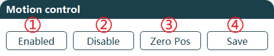 

Joint State Settings
 

**Function descriptions:**

|No.|Name|
|-|-|
|1|Enabled Joint|
|2|Disable Joint|
|3|Set Joint Zero Position|
|4|Save Parameter Settings|

**Detailed function button descriptions:**

- **Enabled:**
    After connecting the device, the joint is in an enabled state by default, allowing motion control. When disabled, the host cannot control joint motion.
- **Disable:**
    When the device is enabled, it can only be controlled via software. To manually control the joint, perform a disable operation first. In the disabled state, the device status bar appears gray.
- **Zero Position Setting:**
    Click the `Zero Pos` button to set the current joint position as the zero position (0 degrees). Settings must be saved to take effect.
- **Save Settings:**
    All joint parameters must be saved by clicking the `Save` button. Failure to save settings will result in the joint reverting to previous parameters after power cycling.

### Motion Control

Multiple modes for joint motion control are supported, including joint limit settings. 

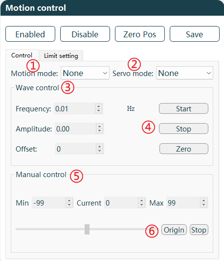 

Motion Control
 

**Function area descriptions:**

|No.|Name|
|-|-|
|1|Motion Mode|
|2|Servo Mode|
|3|Waveform Control|
|4|Start/Stop/Zero Settings|
|5|Manual Control|
|6|Origin/Stop|

**Function area/button descriptions:**

- **Motion Mode:**
    Motion modes include square wave, sinusoid, and manual modes, which can be set according to requirements.

    |Waveform Mode Options|Square Wave|sinusoid |
    |:-:|:-:|:-:|
    |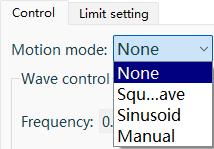||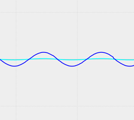|

- **Servo Mode:**
    Servo modes include Target current, Target speed, Target position, and Test Mode, which can be set according to requirements.

    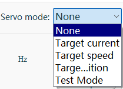
    
Servo Mode Selection
 

    ::: warning 注意
    Test mode is only for no-load testing (using with a load poses a risk of joint damage due to inertia at limit positions). In this mode, only manual motion mode is supported with adjustable speed. It is recommended to set joint limits to maximum (-214748～214748) to allow joint movement between the maximum and minimum position limits.
    :::

- **Waveform Control:**
    Configure waveform frequency and amplitude to control joint speed and angle. Parameters such as frequency, amplitude, and bias can be set. 
    The following example uses position servo with sine wave motion mode:
  - Setting frequency to 0.1HZ results in a 10-second sine wave period.
  - Amplitude set to 90 corresponds to the sine wave amplitude.
  - Bias set to 100 means the sine wave equilibrium position deviates from y=0° by 100°.

    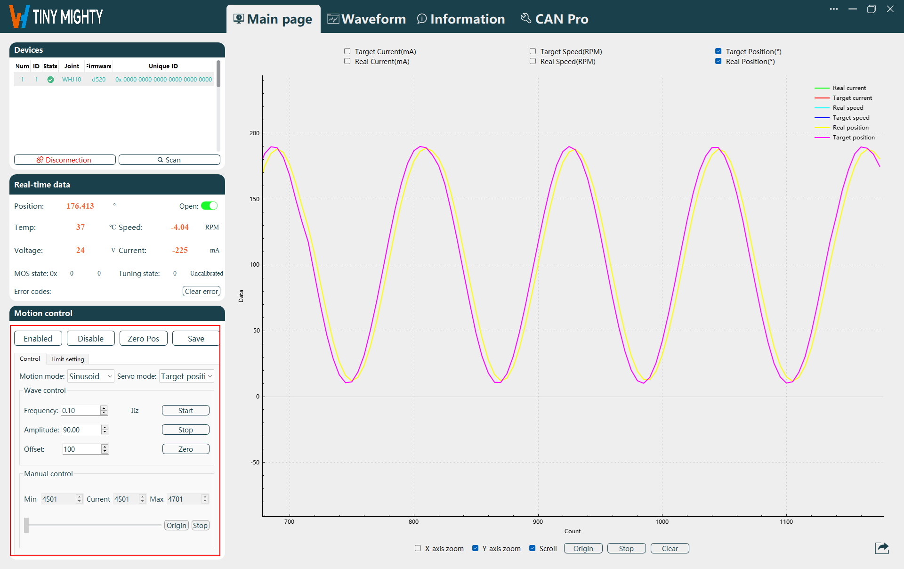
    
Waveform Control Selection
 

- **Manual Control:**
    Manual control allows individual joint operation based on servo mode settings.

  - Adjust parameters via mouse in manual control.
  - Switch to manual mode and perform calibration first. Motion automatically adjusts to a controllable range.
  - In target position mode, calibration sets the adjustable range to ±100°.
  - In target speed or target current modes, it is recommended to manually adjust the slider to zero speed under normal operating conditions.
  - In case of abnormal or dangerous situations, click the `Stop` button to halt joint motion.

    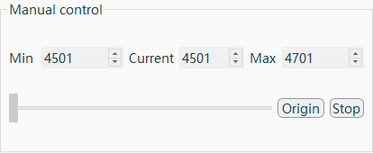
    
Manual Motion Control
 

### Limit Settings

**Limit Settings:** Set the maximum and minimum joint angle limits. After configuration, click `Save` to store settings in the joint and restart for activation. The minimum limit can be set to -214748°, and the maximum limit to 214748°.

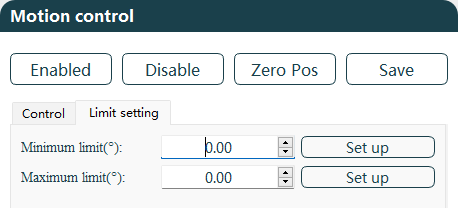

Limit Settings
 

## Real-time Waveform

Joint data is displayed via waveforms, including Real Current, Target Current, Real Speed, Target Speed, Real Position, Target Position, and supports data export. 

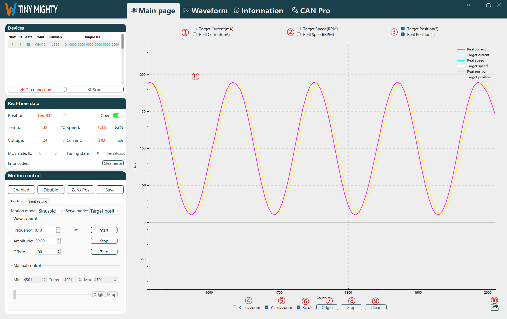 

Waveform Display
 

**Function Area Descriptions:**

|No.|Name|
|-|-|
|1|Current Waveform Display Selection|
|2|Speed Waveform Display Selection|
|3|Position Waveform Display Selection|
|4|Independent X-axis Zoom|
|5|Independent Y-axis Zoom|
|6|Scroll Display|
|7|Waveform Origin|
|8|Start/Pause Waveform|
|9|Clear Waveform|
|10|Data Export|
|11|Waveform Display|

**Function Area/Button Descriptions:**

- **Waveform Display Options:**
    To view current, speed, or position waveforms, select the corresponding option and click `Start`. The waveform will be displayed in the graph.
    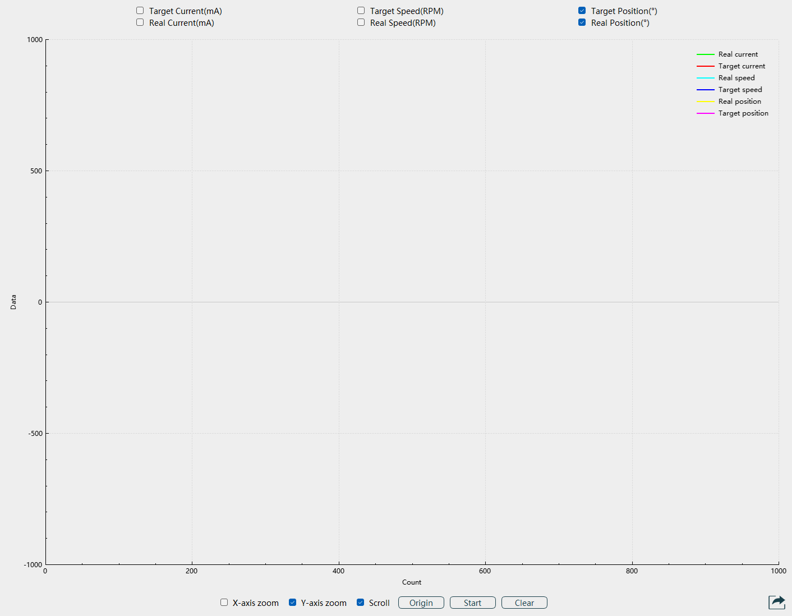
    
Before Selection
 

    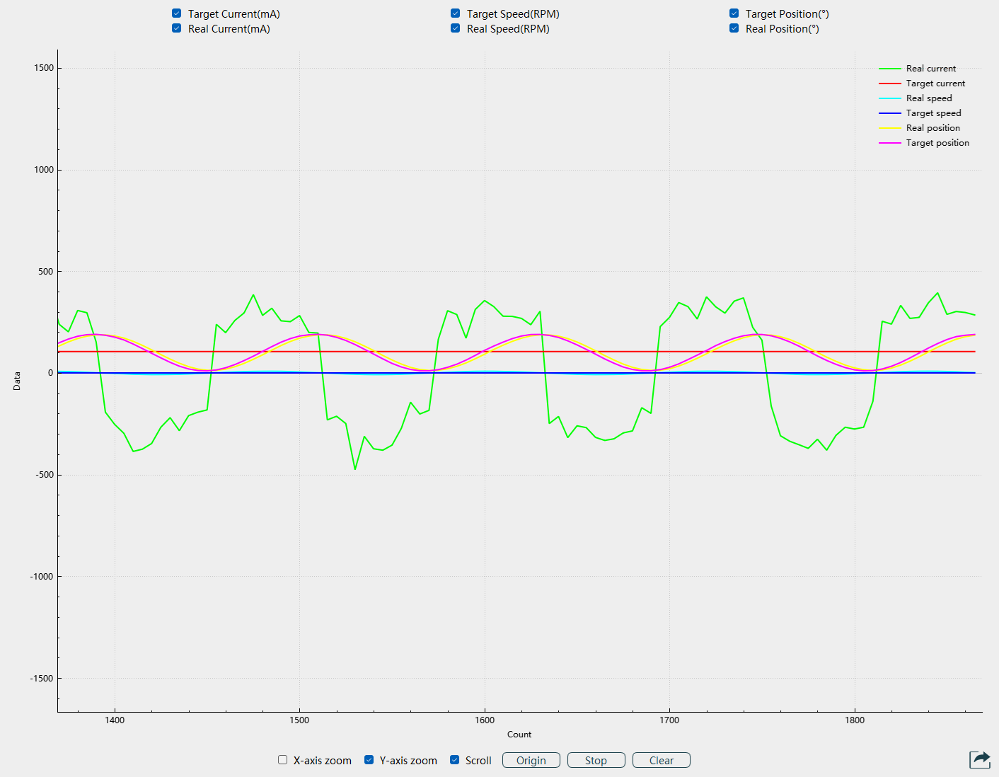
    
After Selection
 

- **Function Buttons:**
    Control and view waveforms as needed.
  - **X-axis Zoom:**
      When selected, adjust the mouse scroll wheel to modify the X-axis scale of the waveform. Unchecking disables this function.
  - **Y-axis Zoom:**
      When selected, adjust the mouse scroll wheel to modify the Y-axis scale of the waveform. Unchecking disables this function.
  - **Scroll:**
      When selected, the waveform scrolls in real-time. Unchecking fixes the waveform on the page, allowing axis adjustment for data viewing.
  - **Origin:**
      When scroll display is stopped, click the `Origin` button to reset the waveform display to the X-axis origin.
  - **Start:**
      Click `Start` to display the selected waveform. The button changes to `Pause`. Click `Pause` to stop waveform display.

      |Start Button|Pause Button|
      |:-:|:-:|
      |||

  - **Clear:**
      Click the `Clear` button to remove the waveform displayed on the host.

  - **Data Export:**

    - Export Types: Export image and Export doc.
    - Export Targets: All waveform, Current wave, Pos wave, Speed wave, Torque wave.
    - Image export allows selection of file storage location and name, with default png format as shown below.

      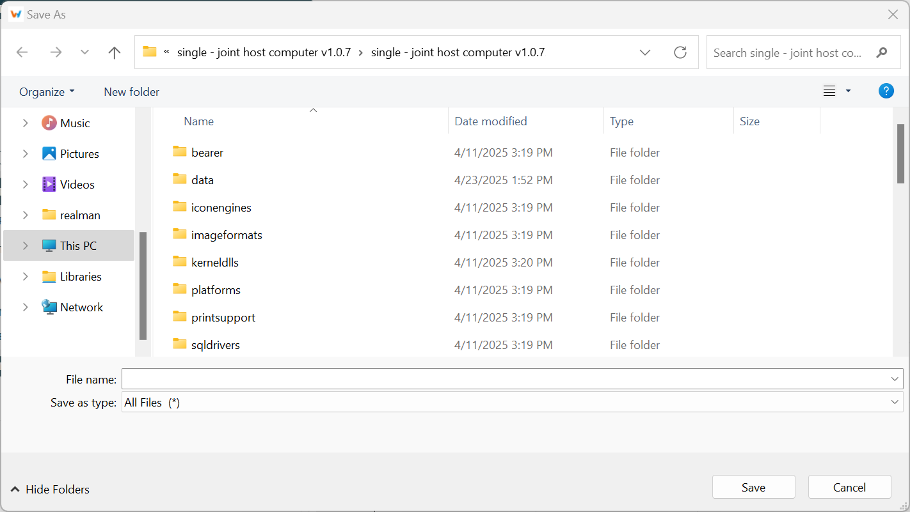 
      
Image Save Path
 

    - Document export has fixed file names and paths. A prompt "File Write Successful" appears upon export. Files are in txt format and stored in the host's date file directory as shown below.

      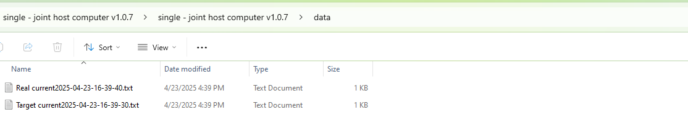 
      
Document Export Path
 
