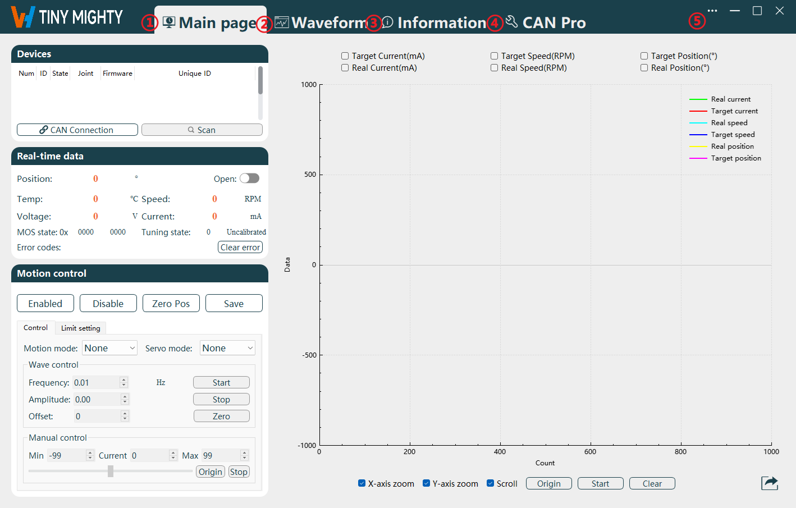

# 
Getting Started: 
 Environmental Preparation

## Hardware Environment Configuration

### Wiring Instructions

This joint features three external terminal connectors and one electromagnetic lock connector.

Joint Hardware Schematic

The hardware description of the joint is shown in the table below.

|No.|Name|
|--|--|
|1|24V DC Power Input|
|2|CAN0 Communication Interface|
|3|CAN1 Communication Interface|
|4|Electromagnetic Lock (Hard Limit Module)|

#### Power Input

The red and black wire harnesses are for power input, with the red being the positive terminal and the black being the ground (GND). The external power supply for the joint is 24V DC.

#### Joint Communication

There are two pairs of communication interface terminals, designated as CAN0 and CAN1. The blue wire harness is for CANH, and the white wire harness is for CANL.

### CAN Communication Device Configuration

1. The ZLG USBCANFD-100U-mini CAN-to-USB tool is used (optional), as shown in the figure below.

    
    
CAN Module

2. Click [Driver Tool](https://ik.imagekit.io/Realman/Files/USBCANFD-100(200)-U.rar?updatedAt=1745407278687) to download the CAN to USB driver tool.
3. Extract the driver tool package to your local machine, and run the installation by double - clicking `USBCANFD_AllInOne_x86_x64_1.0.0.2.exe` to complete the installation of the driver tool.
4. Confirm whether the test computer has the VC++ environment installed. If not, please contact technical support to obtain the driver package and install it; otherwise, communication will not be successful.

::: warning

- To meet the needs of interface card integration, Realman offers a unified programming interface that supports both CAN and CANFD.
- In addition to a simple and easy-to-use interface, example routines and documentation for interface usage are provided.
- The following Microsoft Visual C++ Runtime Library versions are required (and must be present): 2005, 2008, 2010, 2012, 2013.
- Before initiating motion, ensure that the joint is securely fixed.
- If you encounter issues with opening the device, please check whether the operating environment on your computer is missing any necessary components based on the software structure provided.

:::

## Introduction to the Single-Joint Host Computer

1. Click [Single - Joint Host Computer](https://ik.imagekit.io/Realman/ik-archive-4dbd7303a796afcf88ac95dd6a6382af/ik-download-a43d1f3b-ee87-4f0d-aad8-d996caed1c1a.zip) to download the single - joint host computer software.
2. Extract the software package to your local machine, and run the single - joint host computer tool by double - clicking `WHJoint.exe`.
3. The Single-Joint Host Computer is designed for joint configuration and monitoring, enabling users to adjust joint parameters, query joint driver information, configure and upgrade firmware, and observe joint data in real-time. 

      
    
Navigation Page
 

**Function Area Names**:

|No.|Name|
|-|-|
|1|Main page Navigation|
|2|Waveform Navigation|
|3|Information Navigation|
|4|CAN Pro Navigation|
|5|Function Menu|

 Below is a detailed explanation of each area/button in the order presented in the table above:

- **Main page Navigation**: Internal functional categories, including Devices, Real-time data, Motion control, and Real-time waveform classes.
- **Waveform Navigation**: Generates waveforms for current, speed, and position for easy viewing.
- **Information Navigation**: Internal functional categories for querying and setting driver information, and firmware upgrade functions.
- **CAN Pro Navigation**: Real-time display of CAN command transmission and reception.
- **Function Menu**: Supports switching between Chinese and English. As shown in the figure below, select `Language` > `Chinese/English` from the drop-down menu to switch to a Chinese/English interface.

    
