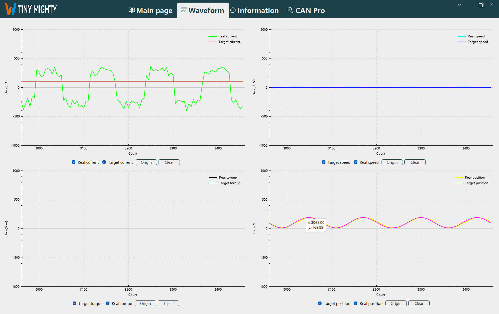
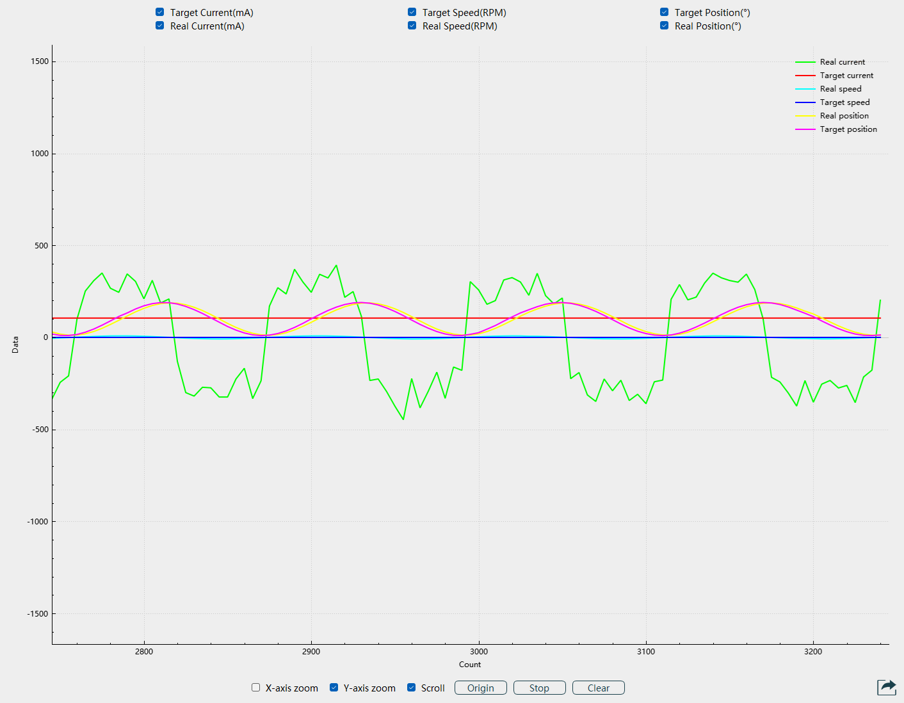
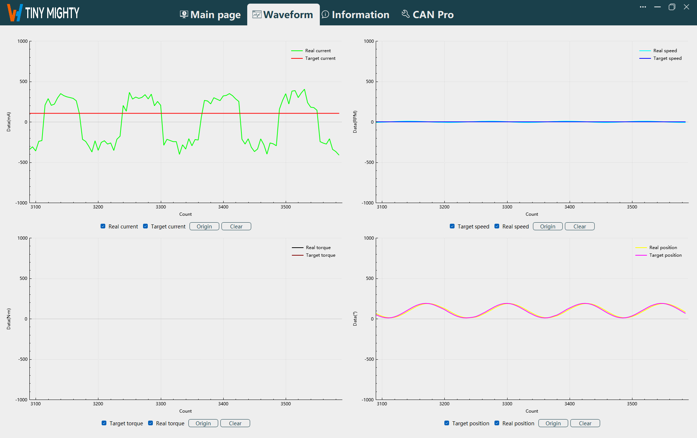

# 
Getting Started: 
 Waveform Navigation

You can display different types of waveforms separately. Currently, it supports current, speed, and position waveforms. Torque waveform output is not supported yet. You can view the coordinates of a point in real-time by hovering the mouse over the curve.

Waveform Navigation

## Waveform Display

After starting the waveform display in the real-time page, the waveform is displayed normally in this navigation, as shown in the figure below.

Waveform Display
 

## Function Buttons

**Page Function Buttons:** Waveform display options, origin, and clear.

- **Waveform Display:**
    After starting the waveform display in the real-time page, the waveform is displayed normally after selecting the waveform type.

    
    
Waveform Display

- **Origin:**
    When the waveform is not scrolling, switch to the waveform navigation and click the `Origin` button to reset the waveform display to start from the 0 position on the x-axis.
- **Clear:**
    Click the `Clear` button to clear the waveform displayed on the host.
