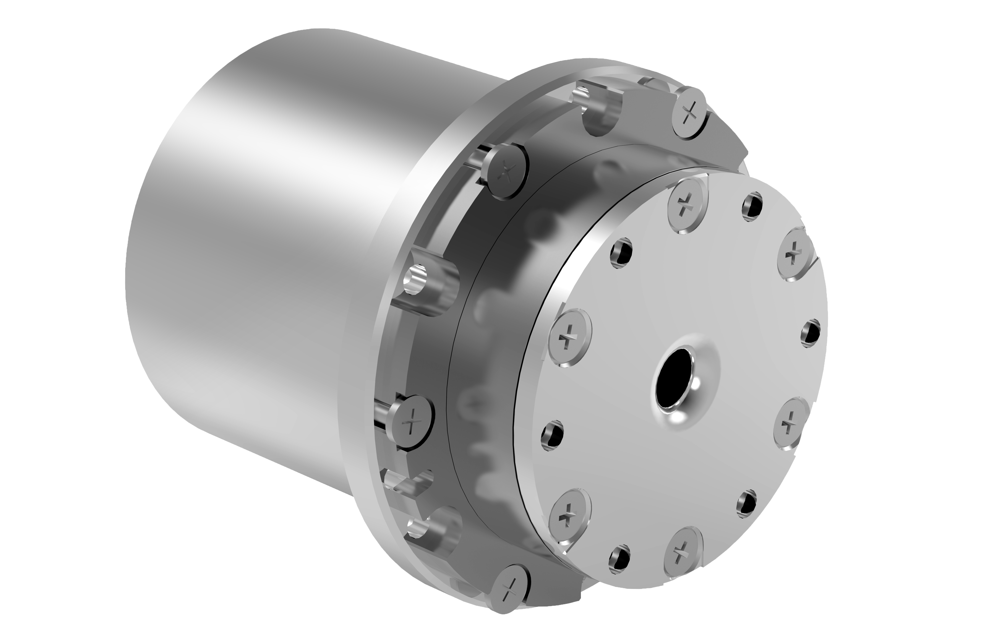

# 
Getting Started: 
Specification Parameters of WHJ03 Series

## Model: WHJ03-M-D33-100-N

### Illustration

  

### Performance parameters

| Parameter | Value |
| --- | --- |
| Reduction ratio | 100 |
| Weight | 170 g |
| Diameter of reducer mm | 33 |
| Size (D × L mm) | 33*48 |
| Rated torque N.m | 3 |
| Maximum torque density | 52.9 |
| Repeatability | ±15 arc-seconds |
| Peak speed (RPM) | 30 |
| Moment of inertia (kg*m^2) | 1.52*10^-6 |
| Hollow aperture | 4 mm |
| Working temperature | 0 to 50°C |
| Rated power | 20 W |
| Rated voltage | 24 V |
| Rated current | 0.8 A |
| Type of brake | Soft brake |
| Incremental encoder | 16 bits |
| Absolute position encoder | 18 bits |
| Communication interface | CANFD |
| Examples of scenarios | Desktop robotic arm, gripper, specialized tool, precision turntable, industrial module, etc. |

### Detailed dimensions

