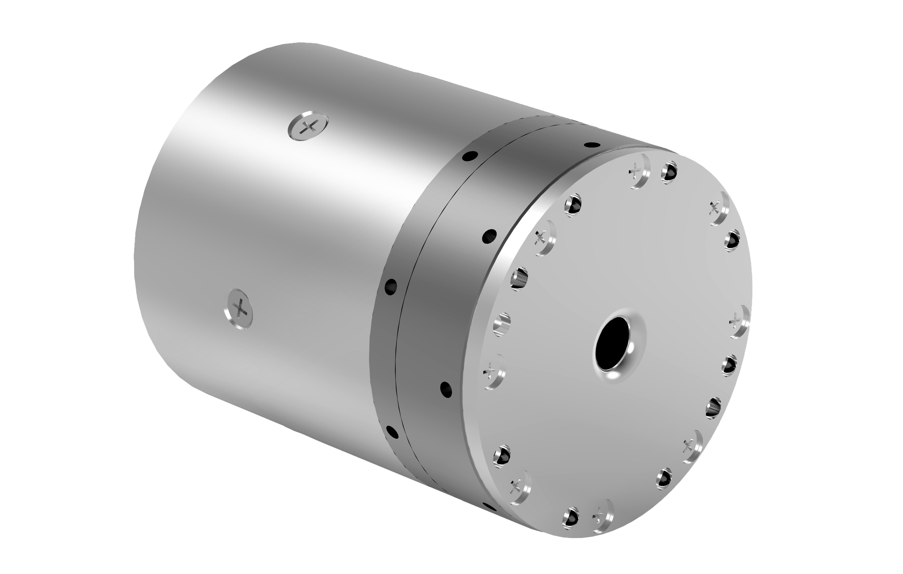
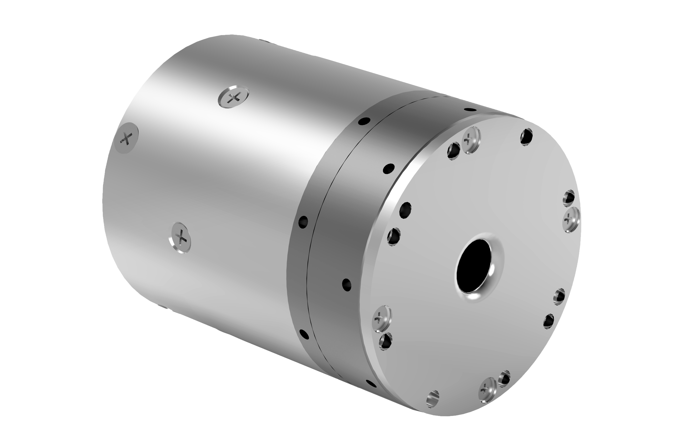

# 
Getting Started: 
Specification Parameters of WHJ10 Series

## Model: WHJ10-M-D50-80-B

### Illustration

  

### Performance parameters

| Parameter | Value |
| --- | --- |
| Reduction ratio | 80 |
| Weight | 445 g |
| Diameter of reducer mm | 50 |
| Size (D × L mm) | 50 * 72.8 |
| Rated torque N.m | 10 |
| Maximum torque density | 67.4 |
| Repeatability | ±15 arc-seconds |
| Peak speed (RPM) | 37.5 |
| Moment of inertia (kg*m^2) | 1.13*10^-5 |
| Hollow aperture | 6 mm |
| Working temperature | 0 to 50°C |
| Rated power | 63 W |
| Rated voltage | 24 V |
| Rated current | 2.6 A |
| Type of brake | Latch brake |
| Incremental encoder | 16 bits |
| Absolute position encoder | 18 bits |
| Communication interface | CANFD |
| Examples of scenarios | Lightweight robotic arm, surgical robot, neck joint and wrist joint of humanoid robot, Service robot, precision turntable, etc. |

### Detailed dimensions

## Model: WHJ10-M-D50-80-N

### Illustration

  

### Performance parameters

| Parameter | Value |
| --- | --- |
| Reduction ratio | 80 |
| Weight | 400 g |
| Diameter of reducer mm | 50 |
| Size (D × L mm) | 50 * 64 |
| Rated torque N.m | 10 |
| Maximum torque density | 75 |
| Repeatability | ±15 arc-seconds |
| Peak speed (RPM) | 37.5 |
| Moment of inertia (kg*m^2) | 1.09*10^-5 |
| Hollow aperture | 8 mm |
| Working temperature | 0 to 50°C |
| Rated power | 63 W |
| Rated voltage | 24 V |
| Rated current | 2.6 A |
| Type of brake | Soft brake |
| Incremental encoder | 16 bits |
| Absolute position encoder | 18 bits |
| Communication interface | CANFD |
| Examples of scenarios | Lightweight robotic arm, neck joint of humanoid robot, intelligent travel products, etc. |

### Detailed dimensions

