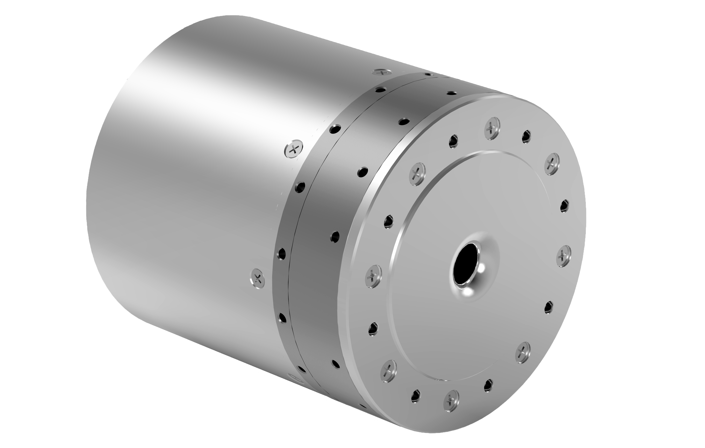

# 
Getting Started: 
Specification Parameters of WHJ120 Series

## Model: WHJ120-M-D88-100-B

### Illustration

  

### Performance parameters

| Parameter | Value |
| --- | --- |
| Reduction ratio | 100 |
| Weight | 1800 g |
| Diameter of reducer mm | 88 |
| Size (D × L mm) | 88*99.75 |
| Rated torque N.m | 120 |
| Maximum torque density | 200 |
| Repeatability | ±15 arc-seconds |
| Peak speed (RPM) | 30 |
| Moment of inertia (kg*m^2) | 1.37*10^-4 |
| Hollow aperture | 9 mm |
| Working temperature | 0 to 50°C |
| Rated power | 628W |
| Rated voltage | 24 V |
| Rated current | 26 A |
| Type of brake | Latch brake |
| Incremental encoder | 16 bits |
| Absolute position encoder | 18 bits |
| Communication interface | CANFD |
| Examples of scenarios | Robotic arm, shoulder joint, waist joint, hip joint and knee joint of humanoid robot, aerospace heavy turntable, etc. |

### Detailed dimensions

