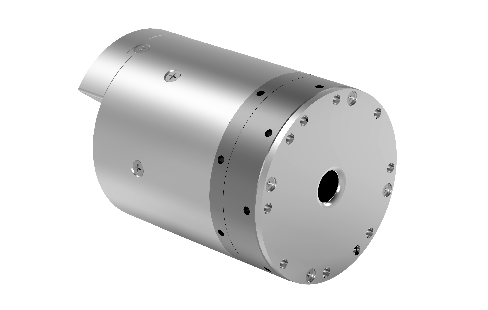

# 
Getting Started: 
Specification Parameters of WHJ30 Series

## Model: WHJ30_S_D60_80_B

### Illustration

  

### Performance parameters

| Parameter | Value |
| --- | --- |
| Reduction ratio | 80 |
| Weight | 730 g |
| Diameter of reducer mm | 60 |
| Size (D × L mm) | 60 * 83.8 |
| Rated torque N.m | 30 |
| Maximum torque density | 123 |
| Repeatability | ±15 arc-seconds |
| Peak speed (RPM) | 37.5 |
| Moment of inertia (kg*m^2) | 2.98*10^-5 |
| Hollow aperture | 9 mm |
| Working temperature | 0 to 50°C |
| Rated power | 188 W |
| Rated voltage | 24 V |
| Rated current | 7.8 A |
| Type of brake | Latch brake |
| Incremental encoder | 16 bits |
| Absolute position encoder | 18 bits |
| Communication interface | CANFD |
| Examples of scenarios | Robotic arm, surgical robot, and elbow joint, ankle joint, neck joint and shoulder joint of humanoid robot, etc. |

### Detailed dimensions

