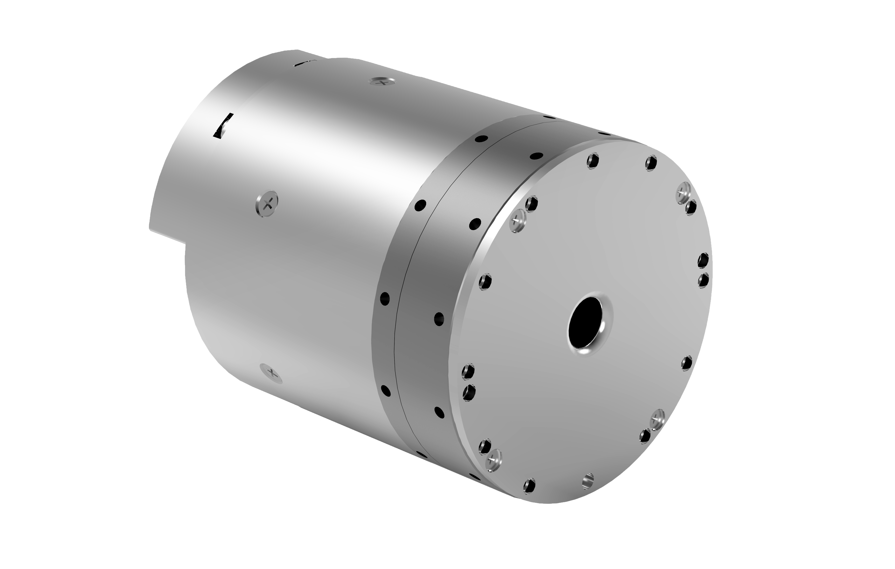

# 
Getting Started: 
Specification Parameters of WHJ60 Series

## Model: WHJ60_S_D70_100_B

### Illustration

  

### Performance parameters

| Parameter | Value |
| --- | --- |
| Reduction ratio | 100 |
| Weight | 1000 g |
| Diameter of reducer mm | 70 |
| Size (D × L mm) | 70 × 87.35 |
| Rated torque N.m | 60 |
| Maximum torque density | 180 |
| Repeatability | ±15 arc-seconds |
| Peak speed (RPM) | 30 |
| Moment of inertia (kg*m^2) | 5.51*10^-5 |
| Hollow aperture | 9 mm |
| Working temperature | 0 to 50°C |
| Rated power | 292 W |
| Rated voltage | 24 V |
| Rated current | 12 A |
| Type of brake | Latch brake |
| Incremental encoder | 16 bits |
| Absolute position encoder | 18 bits |
| Communication interface | CANFD |
| Examples of scenarios | Robotic arm, and shoulder joint, waist joint, vertical hip joint and ankle joint of humanoid robot, heavy turntable, etc. |

### Detailed dimensions

