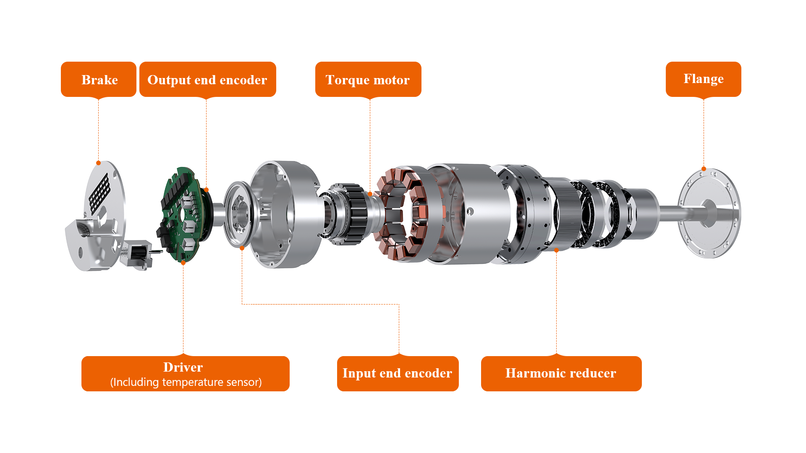
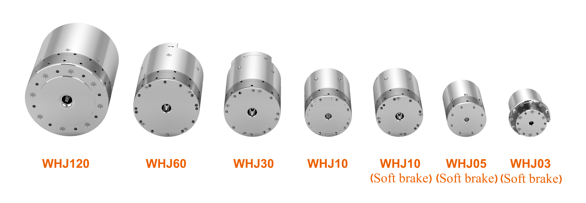
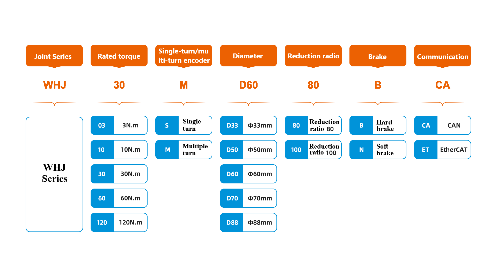

# 
Getting Started: 
Introduction of WHJ Series Joint

The WHJ series joint modules are featured with a compact structure and rich control functions. They are easy to install. They integrate the main components, including the servo driver, motor end absolute value encoder, output end absolute value encoder, frameless torque motor, brake and precision harmonic reducer, which will greatly save the manpower and time for developers in the selection, integrated design, procurement, assembly, and testing of the reducer, encoder, motor and driver, and allow users to push their universal robots, exoskeletons, medical equipment and industrial automation equipment to market in a short time and focus on terminal application.

All key components of the WHJ series joints, including the drive servo, motor and harmonic reducer, are independently developed and manufactured by WHJ. In particular, the independently developed harmonic reducer has a tinier size and lighter weight. Its weight is about 30%−50% less than that of the most traditional harmonic reducers on the market with the same performance specifications, while its torque is twice that of similarly sized products on the market. The WHJ series joint modules are of diverse models, including WHJ03-100, WHJ10-80, WHJ30-80, WHJ60-100 and WHJ120-100. Their maximum output torque is 360 N.m, while their minimum diameter is merely 33 mm.

The WHJ series joints allow users to select the models according to the actual scenarios, with the selection items reflected in the specific models. The following explains the meanings of various models:

