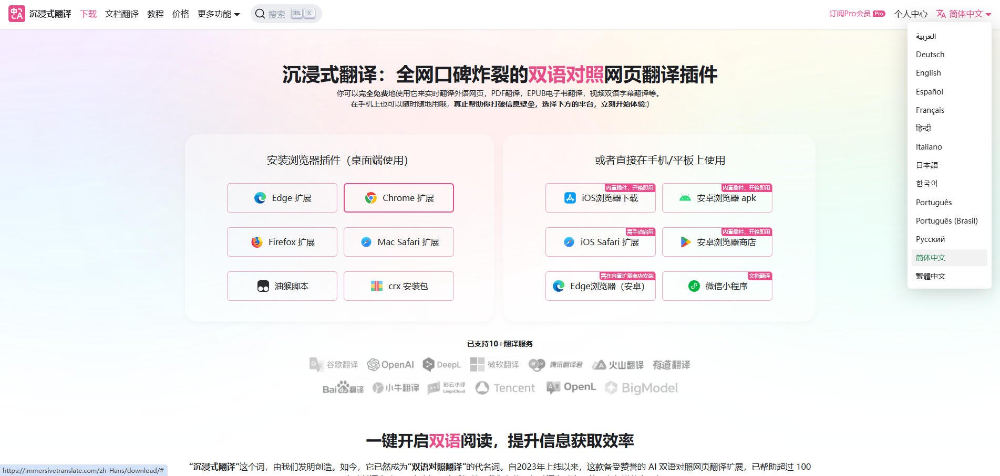
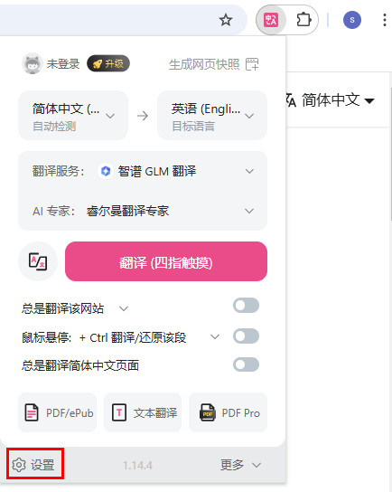
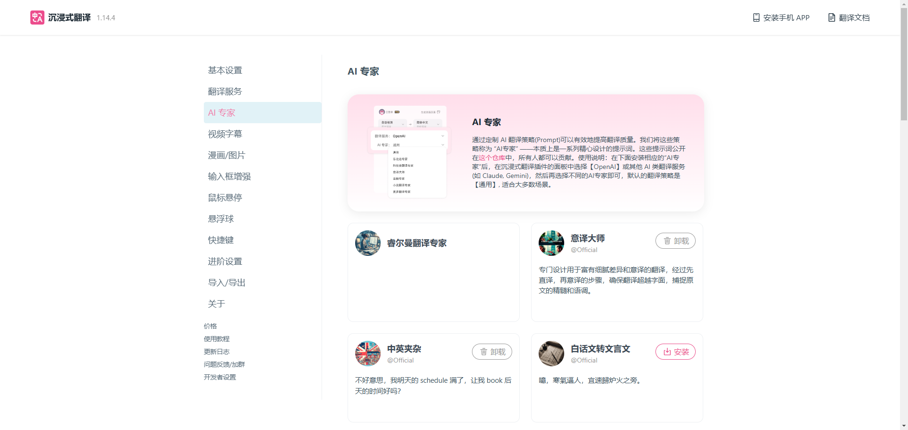
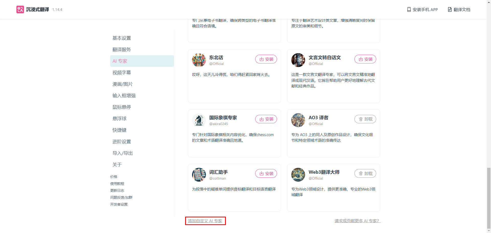
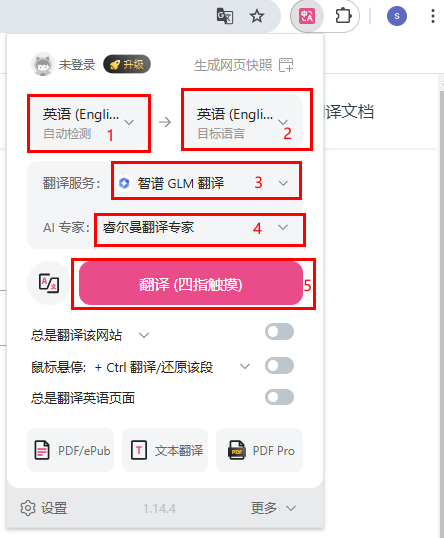

# 沉浸式翻译插件

## 简介

- 为保证海外客户能够快速阅读睿尔曼官网资料以及开发者中心，推荐安装此插件以便进行阅读。
- 海外用户可访问[https://immersivetranslate.com/zh-Hans/](https://immersivetranslate.com/zh-Hans/)网站后，点击右上角的语言切换按钮，并在下拉菜单中选择对应的语言类型。



## 下载安装包

请选择目标下载扩展包，支持Edge、Chrome、Firefox以及Mac Safari浏览器扩展，同时支持脚本和CRX安装包下载。<br>
本文以谷歌浏览器为例，进行安装配置指导。


## 安装及使用

### 安装

请访问[https://immersivetranslate.com/zh-Hans/docs/installation/](https://immersivetranslate.com/zh-Hans/docs/installation/)，参照教程中的安装指导完成插件的安装。

### 配置术语

1. 在插件安装完成后，请在浏览器扩展插件区域，点击沉浸式翻译图标，弹出沉浸式翻译基本参数设置页面。
2. 点击“设置”，进入设置页面。
    
3. 在左侧菜单栏，选择“AI专家”，进入AI专家管理页面。
    
4. 选择页面下方的“添加自定义AI专家”，进入自定义AI专家页面。
    

5. 设置如下参数后，单击页面其他任意位置保存设置：

    - AI专家名称：睿尔曼翻译专家。
    - System Prompt：填写如下参数。

    ```bash
    以下这些词按照我给的术语表翻译，在遇到这些词的话，单独将这些词按照下列术语表进行翻译，不考虑前后词的影响：
    睿尔曼   Realman
    六维力   6-DoF   
    一维力   1-DoF   
    微焊动力   WHJ
    ©2021 睿尔曼智能科技（北京）有限公司 版权所有   Copyright ©2021 Realman Intelligent Technology (Beijing) Co., Ltd. All Right Reserved
    京ICP备20031630号-1   Jing ICP Record No. 20031630-1


    单臂复合机器人   Single Arm Collaborative Robot
    复合升降机器人   Autonomous Lifting Robot
    双臂复合机器人   Dual Arm Collaborative Robot
    双臂复合升降机器人   Humanoid Dual Arm Lifting Robot
    AI理疗机器人   AI Massage Therapy Robot (Gen 3.0)
    具身智能双臂开发平台   Embodied AI Dual Arm Development Platform
    具身双臂升降平台   Autonomous Dual Arm Lifting Robot Solution
    ```

6. 返回待翻译页面， 并再次点击扩展插件区域的沉浸式翻译插件。

7. 完成如下设置并点击“翻译”开始翻译。

    - 选择本地语言和目标语言；
    - 翻译服务：选择“智谱GLM翻译”；
    - AI专家：选择自定义的睿尔曼翻译专家；
    

## 其他使用方法

其他详细使用方法，请访问[https://immersivetranslate.com/zh-Hans/docs/](https://immersivetranslate.com/zh-Hans/docs/)，参照教程使用。
