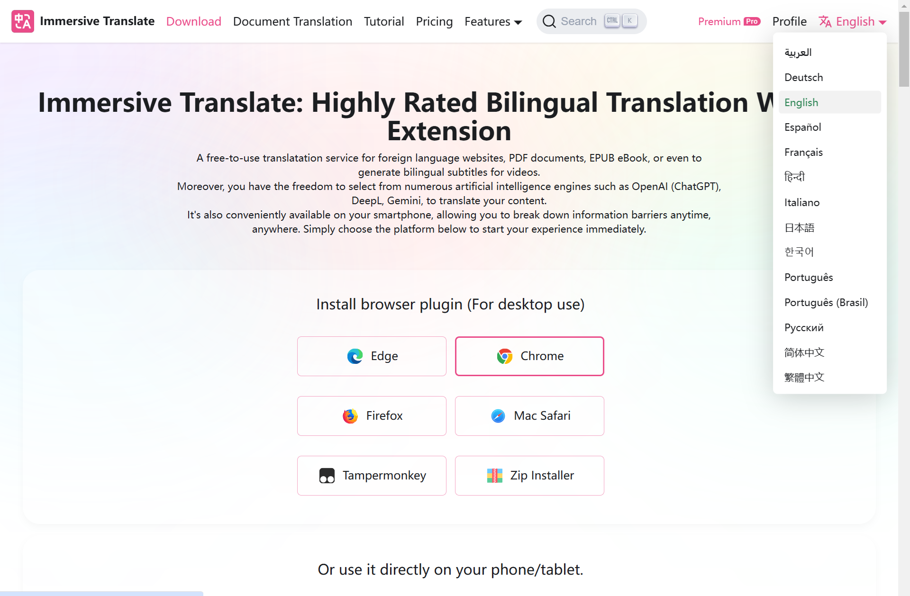
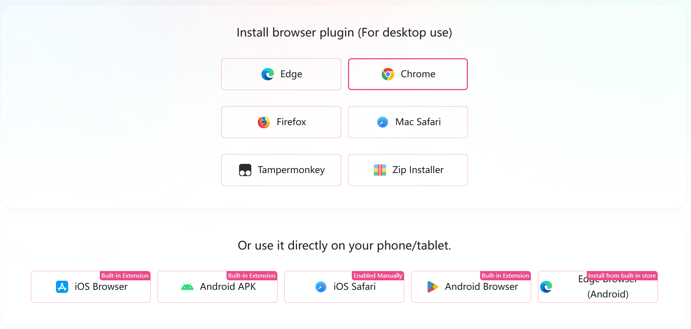
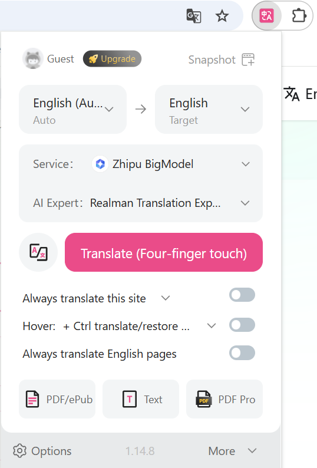
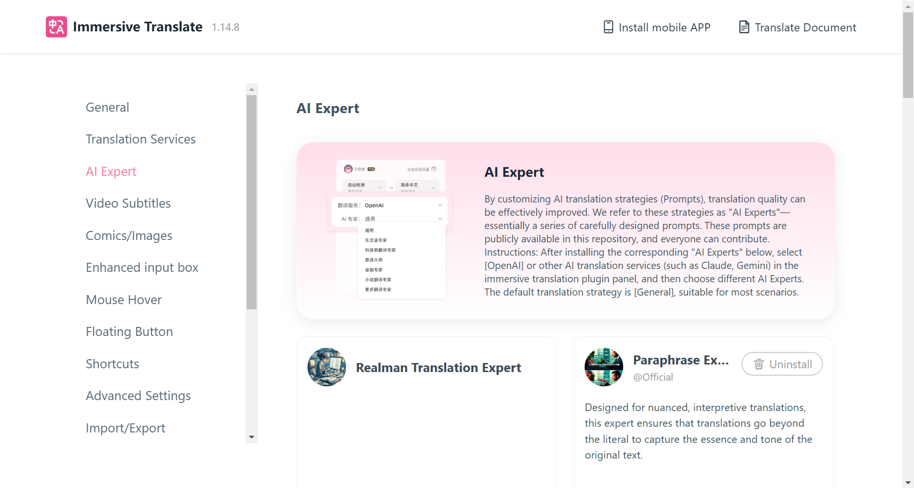
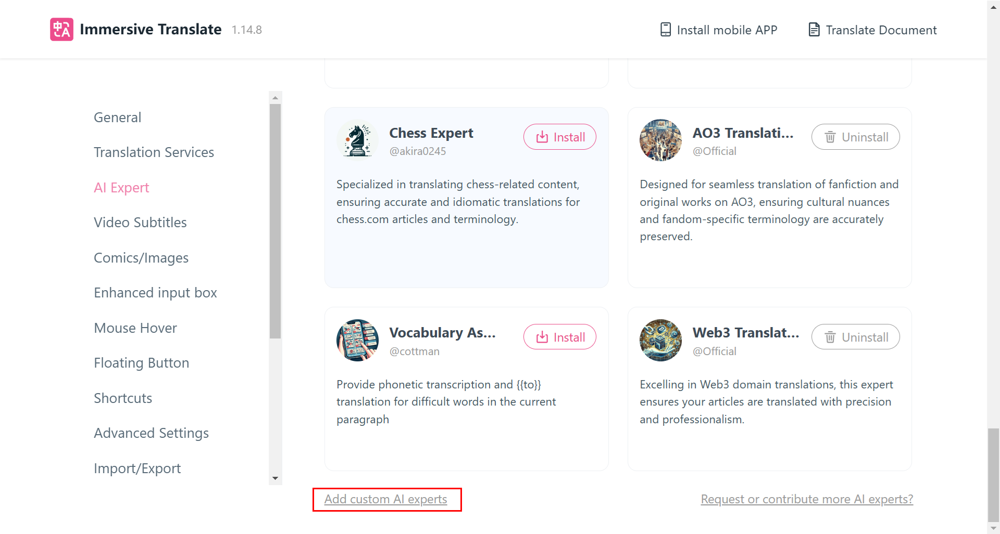
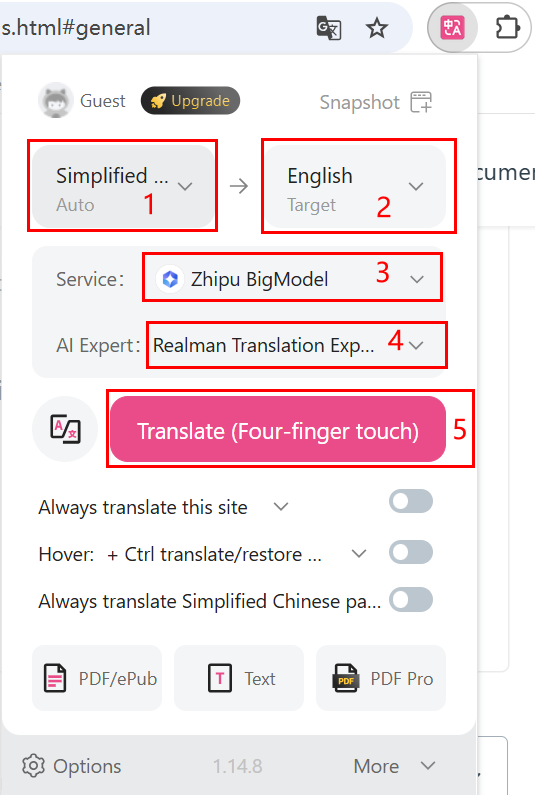

# Immersive Translation Plugin

## Introduction

- To ensure that international customers can easily access information on Realman's official website and Developer Center, we recommend installing this plug-in for convenient reading.
- Overseas users can visit the website [https://immersivetranslate.com/en/](https://immersivetranslate.com/en/), click on the language switch button in the top right corner, and select the appropriate language type from the dropdown menu.



## Download the Installation Package

Please select the target extension package for download. It supports Edge, Chrome, Firefox, and Mac Safari browser extensions, as well as script and CRX package downloads.<br>
This guide uses Google Chrome as an example to demonstrate installation and configuration guidance.



## Installation and Use

### Installation

Please visit [https://immersivetranslate.com/en/docs/installation/](https://immersivetranslate.com/en/docs/installation/) and follow the installation instructions in the tutorial to complete the plugin installation.

### Configure Terms

1. After the plugin installation is complete, please click the immersive translation icon in the browser extension area to open the basic settings page for immersive translation.
2. Click on "Options" to enter the settings page.
    
3. In the left menu bar, select "AI Expert" to enter the AI Expert management page.
    
4. Select "Add custom AI experts" at the bottom of the page to enter the custom AI expert page.
    
5. After setting the following parameters, click anywhere else on the page to save the settings:
    - AI Expert Name: Realman Translation Expert.
    - System Prompt: Fill in the following parameters.

    ```bash
    以下这些词按照我给的术语表翻译，在遇到这些词的话，单独将这些词按照下列术语表进行翻译，不考虑前后词的影响：
    睿尔曼   Realman
    六维力   6-DoF   
    一维力   1-DoF   
    微焊动力   WHJ
    ©2021 睿尔曼智能科技（北京）有限公司 版权所有   Copyright ©2021 Realman Intelligent Technology (Beijing) Co., Ltd. All Right Reserved
    京ICP备20031630号-1   Jing ICP Record No. 20031630-1


    单臂复合机器人   Single Arm Collaborative Robot
    复合升降机器人   Autonomous Lifting Robot
    双臂复合机器人   Dual Arm Collaborative Robot
    双臂复合升降机器人   Humanoid Dual Arm Lifting Robot
    AI理疗机器人   AI Massage Therapy Robot (Gen 3.0)
    具身智能双臂开发平台   Embodied AI Dual Arm Development Platform
    具身双臂升降平台   Autonomous Dual Arm Lifting Robot Solution
    ```

6. Return to the page to be translated and click the Immersive Translation plugin in the extension area again.
7. Complete the following settings and click "Translate" to start the translation.
    - Select local language and target language;
    - Service: Select "Zhipu BigModel";
    - AI Expert: Select the custom Realman Translation Expert;

    

## Other Usage Methods

For other detailed usage methods, please visit [https://immersivetranslate.com/en/docs/](https://immersivetranslate.com/en/docs/) and refer to the tutorial for use.
