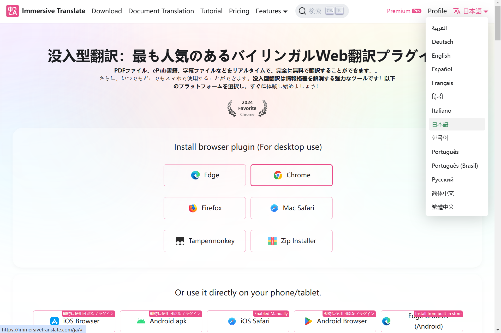
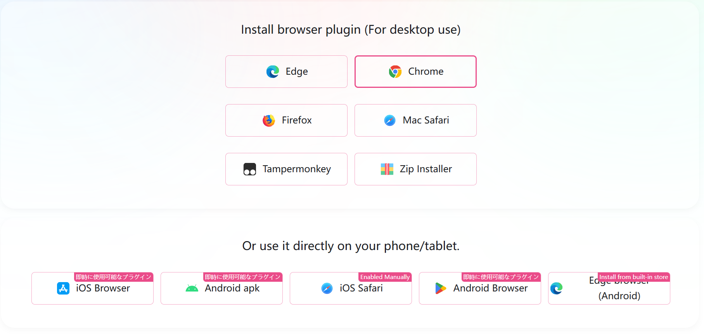
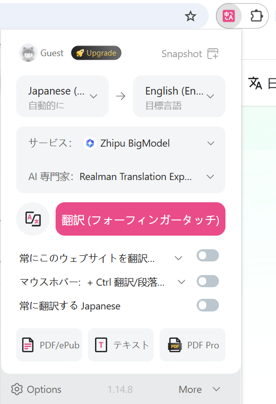
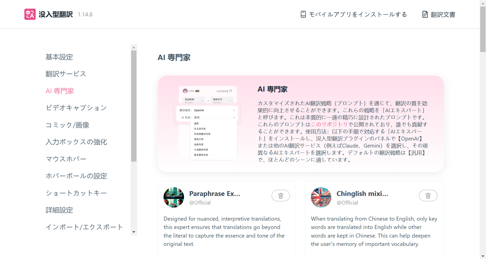
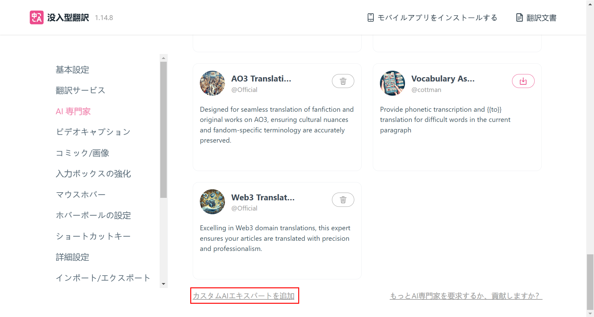
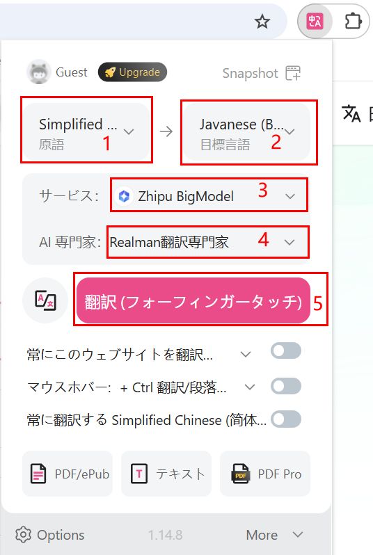

# 没入型翻訳プラグイン

## はじめに

- 海外のお客様が睿爾曼（Realman）の公式ウェブサイトの資料や開発者センターをスムーズに閲覧できるよう、このプラグインのインストールをお勧めします。
- 海外のお客様は、[https://immersivetranslate.com/ja/](https://immersivetranslate.com/ja/) のウェブサイトにアクセス後、右上の言語切り替えボタンをクリックして、表示されるドロップダウンメニューから希望の言語を選択してください。



## インストールパッケージのダウンロード

対象の拡張パッケージを選択してください。Edge、Chrome、Firefox、Mac Safariのブラウザ拡張機能に対応しており、スクリプト及びCRXインストールパッケージもダウンロード可能です。<br>
このガイドでは、Google Chromeを使用したインストール及び設定の手順について説明します。



## インストールと使用

### インストール

[https://immersivetranslate.com/ja/docs/installation/](https://immersivetranslate.com/ja/docs/installation/) にアクセスして、チュートリアルのインストールガイドの手順を参照して、プラグインをインストールしてください。

### 用語設定

1. プラグインのインストールが完了したら、ブラウザ拡張プラグインエリアの没入型翻訳アイコンをクリックし、没入型翻訳の基本設定ページが表示されます。
2. 「Options」をクリックして、設定ページに移動します。
    
3. 左側のメニューバーで「AI専門家」を選択して、AI専門家管理ページに移動します。
    
4. ページ下部の「カスタムAIエキスパートを追加」を選択して、カスタムAI専門家ページに移動します。
    
5. 次のパラメータを設定後、ページ内の別の場所をクリックして設定を保存します：
    - AI 専門家の名称：Realman翻訳専門家。
    - System Prompt：パラメータを以下のように設定してください。

    ```bash
    以下这些词按照我给的术语表翻译，在遇到这些词的话，单独将这些词按照下列术语表进行翻译，不考虑前后词的影响：

    六维力   6-DoF   
    一维力   1-DoF
    睿尔曼   Realman   
    微焊动力   WHJ
    ©2021 睿尔曼智能科技（北京）有限公司 版权所有   ©2021 睿爾曼智能科技（北京）有限公司 すべての権利を留保しています
    京ICP备20031630号-1   京ICP備番号20031630-1


    单臂复合机器人   複合型シングルアームロボット
    复合升降机器人   複合型リフトロボット
    双臂复合机器人   複合型デュアルアームロボット
    双臂复合升降机器人   複合型デュアルアームリフトロボット
    AI理疗机器人   AI理学療法ロボット
    具身智能双臂开发平台   エンボディドAIデュアルアーム開発プラットフォーム
    具身双臂升降平台   デュアルアームリフトロボット
    ```

6. 翻訳対象となるページに戻って、再度拡張プラグインエリアの没入型翻訳プラグインをクリックします。

7. 以下の設定を行い、「翻訳」をクリックして翻訳を開始します。

    - ソース言語とターゲット言語を選択します。
    - サービス：「Zhipu BigModel」を選択します。
    - AI専門家：カスタマイズしたRealman翻訳専門家を選択します。
    

## その他の使用方法

その他の詳細な使用方法については、[https://immersivetranslate.com/ja/docs/](https://immersivetranslate.com/ja/docs/) をご覧いただき、チュートリアルを参照してください。
