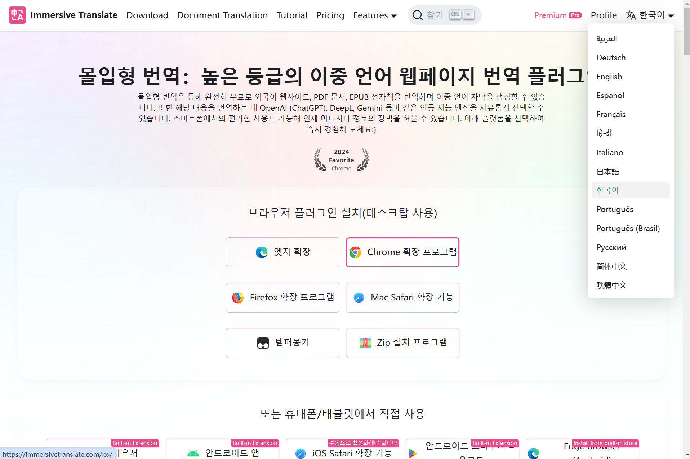
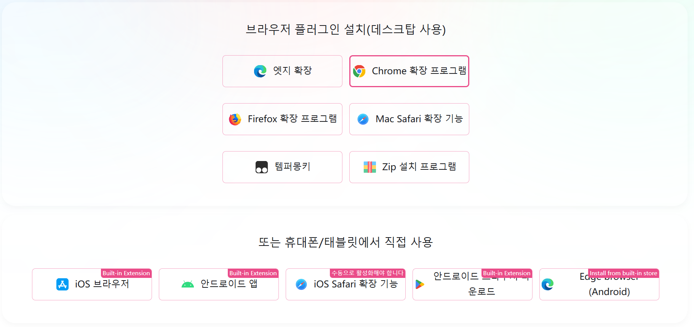
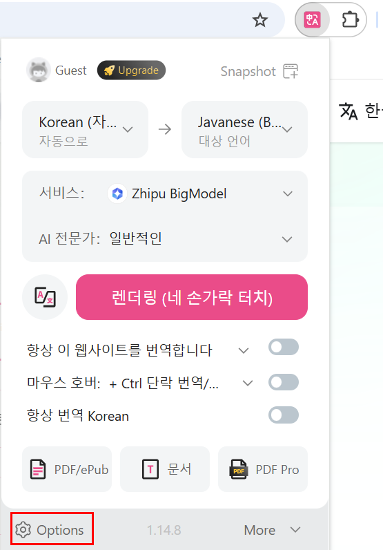
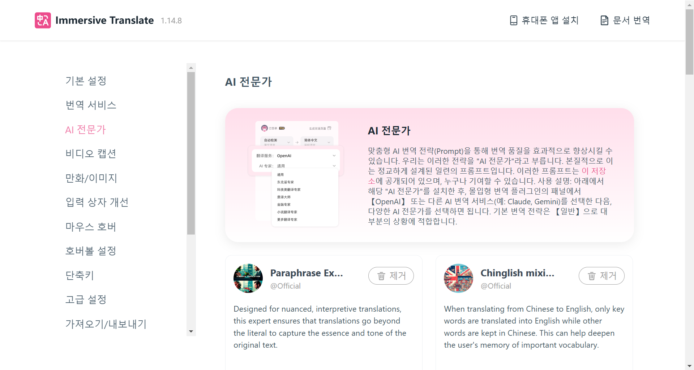
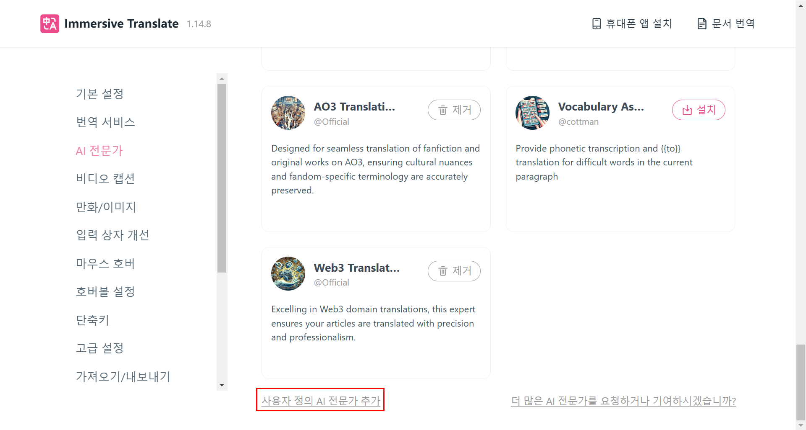
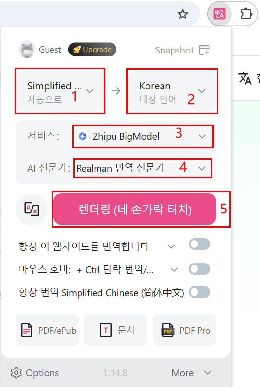

# 몰입형 번역 플러그인

## 개요

- 해외 고객이 Realman 공식 웹사이트 자료 및 개발자센터를 신속하게 읽을 수 있도록 해당 플러그인 설치를 권장합니다.
- 해외 사용자는 [https://immersivetranslate.com/ko/](https://immersivetranslate.com/ko/) 웹사이트에 접속한 후, 우측 상단의 언어 변경 버튼을 클릭하고 드롭다운 메뉴에서 원하는 언어를 선택할 수 있습니다.



## 설치 패키지 다운로드

대상 확장팩을 선택하여 다운로드하세요. Edge, Chrome, Firefox 및 Mac Safari 브라우저 확장을 지원하며, 스크립트 및 CRX 설치 패키지도 지원합니다.<br>
본 문서는 Google Chrome을 예시로 하여 설치 및 설정 방법을 안내합니다.



## 설치 및 사용 방법

### 설치

[https://immersivetranslate.com/ko/docs/installation/](https://immersivetranslate.com/ko/docs/installation/) 웹사이트를 방문하여 튜토리얼의 설치 안내를 참고하여 플러그인 설치를 완료하세요.

### 용어 설정

1. 플러그인 설치가 완료된 후, 브라우저 확장 프로그램 영역에서 몰입형 번역 아이콘을 클릭하여 기본 설정 페이지를 열어주세요.
2. 'Options'을 클릭하여 설정 페이지로 이동하세요.
    
3. 왼쪽 메뉴에서 'AI 전문가'를 선택하여 AI 전문가 관리 페이지로 이동하세요.
    
4. 페이지 하단에서 '사용자 정의 AI 전문가 추가'를 선택하여 사용자 정의 AI 전문가 페이지로 이동하세요.
    
5. 다음 매개변수를 입력한 후, 페이지의 아무 위치나 클릭하여 설정을 저장하세요:
    - AI 전문가 이름: Realman 번역 전문가.
    - System Prompt: 다음 매개변수를 입력하세요.

    ```bash
    以下这些词按照我给的术语表翻译，在遇到这些词的话，单独将这些词按照下列术语表进行翻译，不考虑前后词的影响：
    
    六维力   6차원 힘   
    一维力   1차원 힘   
    睿尔曼   Realman
    微焊动力   마이크로 용접 동력
    ©2021 睿尔曼智能科技（北京）有限公司 版权所有   © 2021 Realman Intelligent Technology (Beijing) Co., Ltd. 모든 권리 보유
    京ICP备20031630号-1   베이징 ICP 20031630호-1

    单臂复合机器人   단팔 복합 로봇
    复合升降机器人   복합 승강 로봇
    双臂复合机器人   양팔 복합 로봇
    双臂复合升降机器人   양팔 복합 승강 로봇
    AI理疗机器人   AI 물리치료 로봇
    具身智能双臂开发平台   체화 지능형 양팔 개발 플랫폼
    具身双臂升降平台   체화 양팔 승강 플랫폼
    ```

6. 번역할 페이지로 돌아간 후, 확장 프로그램 영역에서 몰입형 번역 플러그인을 다시 클릭하세요.
7. 다음 설정을 완료한 후, '번역' 버튼을 클릭하여 번역을 시작하세요.
    - 현지 언어와 목표 언어를 선택하세요.
    - 서비스: "Zhipu BigModel"을 선택하세요.
    - AI 전문가: 사용자 정의 Realman 번역 전문가를 선택하세요.

    

## 기타 사용 방법

기타 자세한 사용 방법은 [https://immersivetranslate.com/ko/docs/](https://immersivetranslate.com/ko/docs/)를 방문하여 튜토리얼을 참고하세요.
