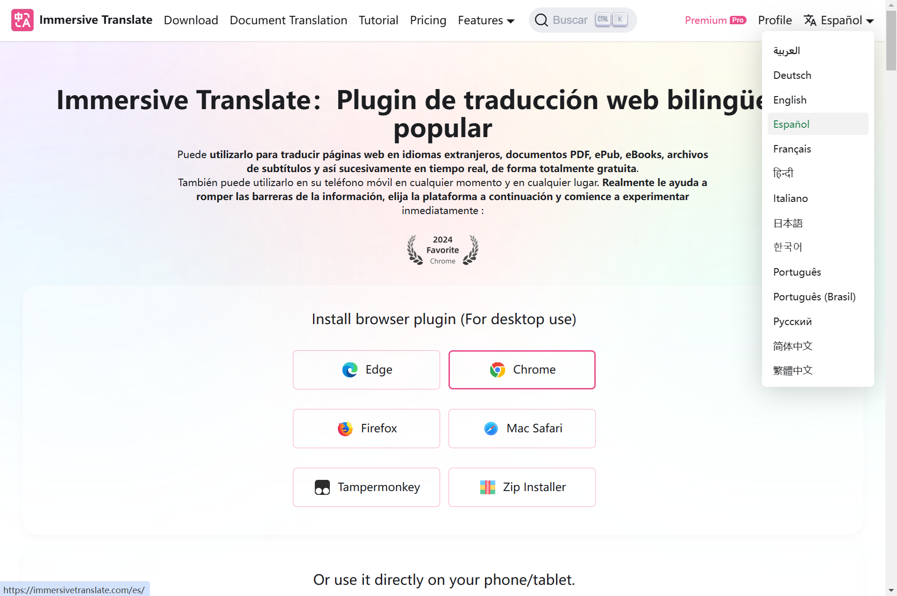
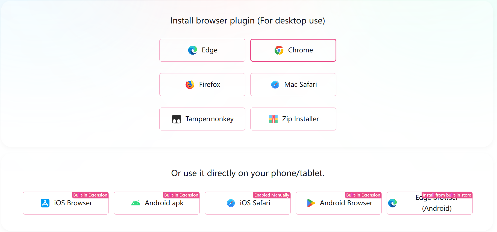
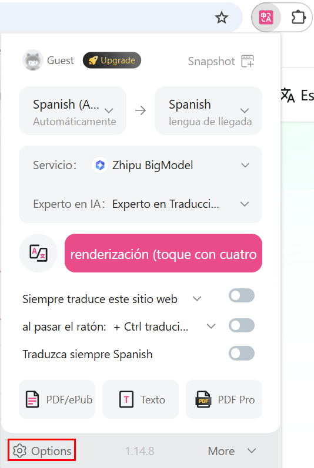
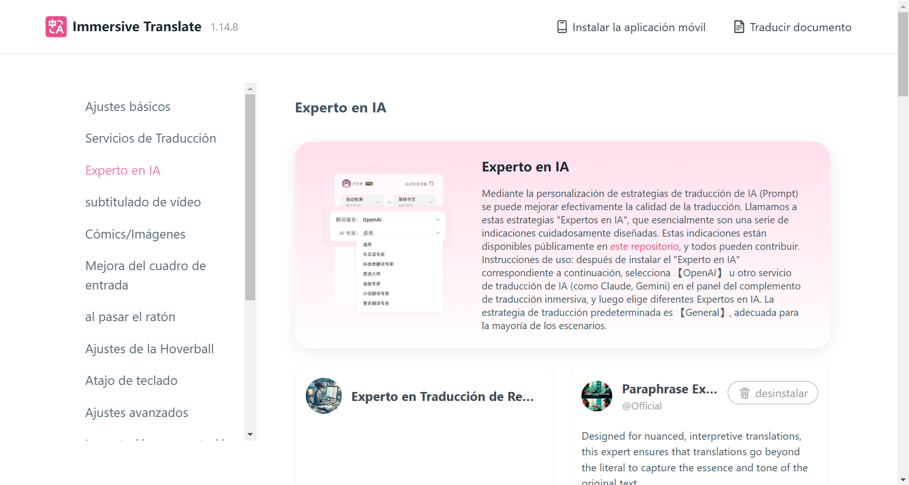
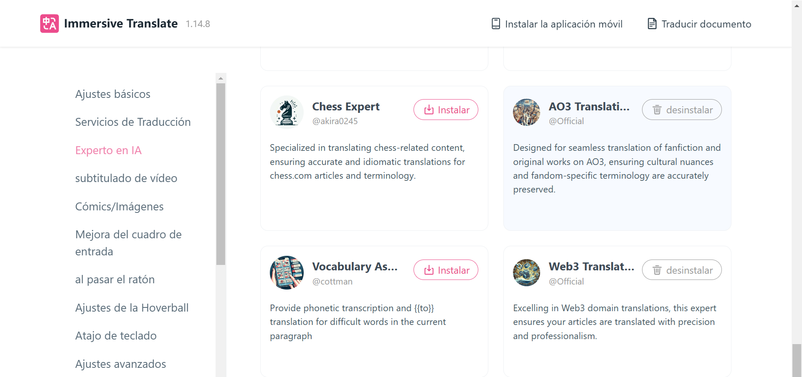
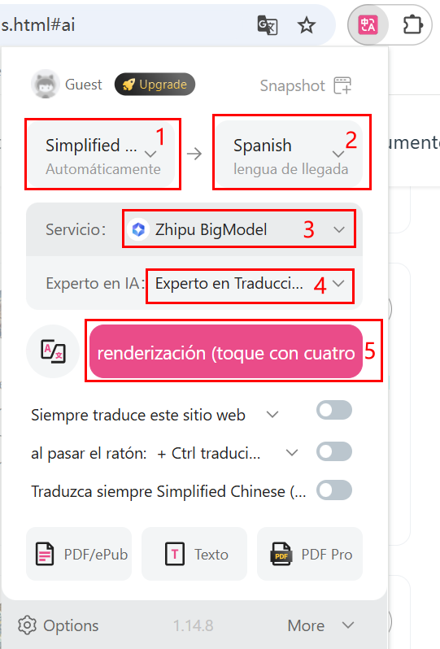

# Plugin de traducción inmersiva

## Introducción

- Para garantizar que los usuarios internacionales puedan leer rápidamente la información del sitio web de Realman y del Centro de Desarrolladores, se recomienda instalar este plugin para facilitar la lectura.
- Los usuarios internacionales pueden visitar el sitio web [https://immersivetranslate.com/es/](https://immersivetranslate.com/es/), y hacer clic en el botón de cambio de idioma en la esquina superior derecha para seleccionar el idioma correspondiente en el menú desplegable.



## Descarga del paquete de instalación

Seleccione el paquete de extensión de descarga deseado; admite las extensiones de los navegadores Edge, Chrome, Firefox y Safari de Mac, así como descargas de scripts e instaladores CRX.<br>
Este documento utiliza Google Chrome como ejemplo para guiar la instalación y configuración.



## Instalación y uso

### Instalación

Visite [https://immersivetranslate.com/es/docs/installation/](https://immersivetranslate.com/es/docs/installation/) y siga la guía de instalación del tutorial para completar la instalación del plugin.

### Configuración de terminología

1. Una vez completada la instalación del plugin, haz clic en el icono de traducción inmersiva en el área de plugins extendidos del navegador para abrir la página de configuración de los parámetros básicos de traducción inmersiva.
2. Haz clic en "Options" para acceder a la página correspondiente.
    
3. En la barra de menú a la izquierda, seleccione "Experto en IA" para acceder a la página de gestión del experto en IA.
    
4. Seleccione "Añadir un experto en IA personalizado" en la parte inferior de la página para acceder a la página correspondiente.
    
5. Después de configurar los siguientes parámetros, haga clic en cualquier otro lugar de la página para guardar la configuración:
    - Nombre de experto en IA: Experto en Traducción de Realman.
    - System Prompt: Rellene los siguientes parámetros.

    ```bash
    以下这些词按照我给的术语表翻译，在遇到这些词的话，单独将这些词按照下列术语表进行翻译，不考虑前后词的影响：
    
    六维力   Seis grados de libertad   
    一维力   Un grado de libertad  
    睿尔曼   Realman 
    微焊动力   Potencia de soldadora de microarco
    ©2021 睿尔曼智能科技（北京）有限公司 版权所有   ©2021 Realman Intelligent Technology (Beijing) Co., Ltd. Reservados todos los derechos.
    京ICP备20031630号-1   Jing ICP Registro No. 20031630-1


    单臂复合机器人   Robot compuesto de un solo brazo
    复合升降机器人   Robot elevador compuesto
    双臂复合机器人   Robot compuesto de doble brazo
    双臂复合升降机器人   Robot elevador compuesto de doble brazo
    AI理疗机器人   Robot de fisioterapia IA
    具身智能双臂开发平台   Plataforma de desarrollo de doble brazo con inteligencia artificial encarnada
    具身双臂升降平台   Plataforma elevadora de doble brazo con inteligencia artificial encarnada
    ```

6. Regrese a la página que desea traducir y haga clic de nuevo en el plugin de traducción inmersiva en el área de plugins extendidos.
7. Realice los siguientes ajustes y haga clic en "renderización" para comenzar la traducción
    - Seleccione el idioma local y el idioma objetivo;
    - Servicio: seleccione "Zhipu BigModel";
    - Experto en IA: seleccione un experto en traducción Realman personalizado;

    

## Otros métodos de uso

Para obtener más detalles sobre los métodos de uso, visite [https://immersivetranslate.com/es/docs/](https://immersivetranslate.com/es/docs/) y siga el tutorial disponible.
