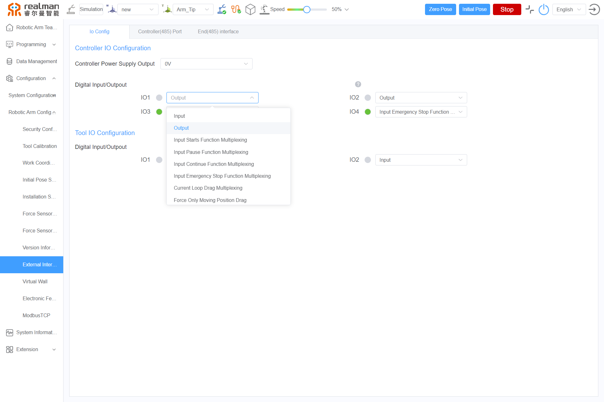

# 
FAQ:
 FAQs About Quick Use

## FAQs about basic use

### 1. What basic technical skills do users need to have if they want to carry out secondary development of control based on the robotic arm?

If users directly use our packaged API, they can only use C/C++/C#/Python/MATLAB to call it in Linux/Windows environment, or use the ROS operating system. If users use the JSON protocol, the flexibility will be much higher. There is no restriction on users' system and programming language, as long as a fixed string can be sent according to the protocol. The JSON protocol is often used in PLC, Android, IOS and other platforms.

### 2. Can the robotic arm be controlled through the Android platform/PLC?

The Gen 3 robotic arm supports the Web teach pendant. It can be accessed by opening a browser after establishing a network connection, and can be accessed in Android, IOS, WIN and LINUX systems.
The robotic arm can be controlled as long as it receives the string of JSON format. The string can be sent and received through the Ethernet port, WiFi, and RS485. Using an Android device, PLC, single chip microcomputer, etc., users can control the robotic arm by directly sending strings of JSON format. Users can also use MODBUS-RTU/TCP to control the robotic arm.

### 3. The system message interface prompts out-of-limit, and the error cannot be cleared. What should I do?

Solution: first drag the joint beyond the limit back to within the limit, and clear the joint error message. The specific steps are as follows:

- Check the current joint angle on the robotic arm teaching interface;
- Select the corresponding joint in the "Configuration-Robotic arm configuration-Safety configuration" interface, and adjust the joint limit to be greater than the current angle;
- Clear the joint error on the system message interface;
- Select the corresponding joint in the "Configuration-Robotic arm configuration-Safety configuration" interface, and click the "Enable" button;
- On the robotic arm teaching interface, control the joint to return to within the limit;
- Select the corresponding joint in the "Configuration-Robotic arm configuration-Safety configuration" interface, click the "Disable" button to restore the limit to the initial value, and click the "Enable" button.

## FAQs about the robotic arm system

### 1. Are the encoders of robotic arm single-coil ones or multi-coil ones?

Absolute dual encoders, each on the input end and output end, respectively. The encoder of the last joint is a multi-coil one, while others are single-coil encoders. The accuracy is 0.001°.

### 2. What is pass-through? What is the cycle of pass-through? What is pass-through for?

Pass-through means that users plan the trajectory themselves on the upper computer, and then sends the joint angles directly to the controller, and each joint runs directly without the processing by the controller. The operation results of robotic arm directly depend on the level of users' trajectory planning.

**Pass-through cycle of Gen 2 controllers:** As fast as 20 ms for WiFi, 20 ms for ordinary Ethernet ports, and 10 ms for USB interfaces. High-speed Ethernet ports now can achieve a pass-through cycle of 10 ms.

**Pass-through cycle of Gen 3 controllers:** as fast as 5 ms, or 2 ms if the real-timeliness of the upper computer is high enough.

It is mainly used to verify users' algorithms, or combine the vision to make dynamic trajectory planning in unstructured environment to achieve grasping or obstacle avoidance.

### 3. What's the difference between the RS485 interface of the robotic arm controller and the RS485 interface at the end?

The RS485 interface of the controller supports the control of the robotic arm. It can also, through command switching, support the standard MODBUS-RTU protocol, and control peripherals such as grippers and electric suckers. The RS485 interface at the end only supports external control and cannot control the robotic arm.

### 4. What types of effectors can be connected to the end of the robotic arm?

The end of robotic arm can output 12 V/24 V voltage, and the maximum current of 1.5 A. The end has a RS485 communication interface, which supports the standard MODBUS-RTU protocol.

### 5. What will be influenced by the setting of quality and center of mass parameters of tool frame?

Collision detection, and the feel of dragging the current loop.

### 6. What are the I/O multiplexing functions of Gen 3 controller?

The I/O in the 16-core cable has multiplexing functions, which can be switched to: through program commands or Web teach pendant. The specific steps are as follows: click the drop-down list on the I/O configuration interface and select the corresponding multiplexing function.

### 7. What are the DH parameters of robotic arm?

The DH parameters generally include four parameters: X-axis rotation, generally expressed by α; X-axis translation, generally expressed by a; Z-axis rotation, generally expressed by θ; and Z-axis translation, generally expressed by d. According to the sequence of axes, the parameters are divided into standard DH parameters and enhanced DH parameters.

Standard DH parameters: the transformation of two connecting rod frames is to rotate and translate around the Z axis first, and then rotate and translate around the X axis. That is the X-Z sequence, i.e. rotation first and then translation.

Enhanced DH parameters: the transformation of two connecting rod frames is to rotate and translate around the X axis first, and then rotate and translate around the Z axis. That is the Z-X sequence, i.e. rotation first and then translation.

### 8. What is the relationship between force control and current loop control?

There is no torque sensor inside the joints of robotic arm, and joint force control is realized through the current loop, that is, for our robotic arms, current loop control is equivalent to force control.

### 9. What is the service life of RM series robotic arms?

The service life of a robotic arm that continuously runs under the payload is 50 thousand hours. So far, we have passed the MTBF certification by Shanghai National Robot Testing Center.

## FAQs about electrical connection

### 1. What are the power supply voltage and current requirements of  robotic arm?

The power supply voltage can range from 20 V to 27 V, or up to 30 V at maximum. It is recommended that a switching power supply rated above 600 W supporting hiccup mode and with a constant current output of 1s be used. The power supplies that we use internally are listed on our website, and you can purchase a power supply if needed.

[https://detail.tmall.com/item.htm](https://detail.tmall.com/item.htm?spm=a1z10.3-b-s.w401123472802678.25.3a213f86ri07Gh&id=596551882593&rn=f8a9c269b5f7a4790419fa1a9258f052&abbucket=11&skuId=4359660664596)

### 2. How to deal with the situation where the externally connected relay does not respond when the robotic arm controls the output?

The digital output interface of the robotic arm controller has an output current of 2 mA, which is impossible to drive the relay and other loads. Therefore, the current needs to be converted through a module. To control high-power equipment, such as a motor, light bulb, relay, solenoid valve, etc., an FET module can be configured.

[https://item.taobao.com/item.htm](https://item.taobao.com/item.htm?spm=a21m98.27004841.0.0.2d6476b7Wy9VMp&id=600304290465&scm=20140619.rec.2882167263.600304290465)

## FAQs about communication configuration

### 1. How to modify the device IP and device connection?

**Gen 2 robotic arm:**

Use the software ZLVirCom for modification (please contact us for technical support if needed).

1. Turn on the robotic arm and connect the Ethernet port through the network cable.
2. Open the software ZLVirCom, and click "Device management > Edit device > Modify settings". Save the settings.

**Gen 3 robotic arm:**

The default IP address is `192.168.1.18`, which can be modified by sending JSON protocol or through the teach pendant.
