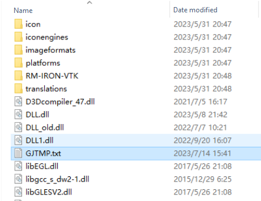
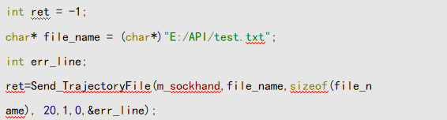
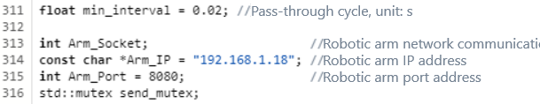

# 
FAQ:
 FAQs About Robotic Arm Secondary Development

## FAQs about development using APIs (C, C++, and Python)

### 1. How to set the cycle for cyclic query of the state of robotic arm?

For the cyclic query of the state of robotic arm, the query cycle shall be no shorter than 20 ms if the Gen 2 robotic arm is connected to WiFi through an ordinary Ethernet port, and can be as short as 10 ms when the Gen 2 robotic arm is connected through a high-speed Ethernet port, USB port, or RS485 port. A cycle longer than 50 ms is recommended. The Gen 3 robotic arm can use the UDP for back transmission, which can support a cycle of up to 5 ms.

### 2. When sending a movement command to control the robotic arm through API, there is an obvious pause between two points. How to diminish the pause?

1. Set the movement command to non-blocking mode, and send it to multiple points continuously. The robotic arm will execute it in sequence, thus reducing the pause between points. However, it is better to set the parameter for connecting the following trajectory.
2. Set the parameter for connecting the following trajectory. This parameter allows continuous planning.
3. Use moveit for planning, to combine the A-B trajectory and B-C trajectory into one, which can effectively avoid the acceleration and deceleration process and improve the operation efficiency.

::: warning
In the Gen 2 controller, the robotic arm movement command can be cached for at most 10 points; In the Gen 3 controller, the robotic arm movement command can be cached for at most 300 points. Remember to maintain balance when sending a movement command, so as not to exceed the cache limit.
:::

### 3. Abnormal exit occurs when the python calls the pass-through interface and the Linux issues a segment reporting error. How to investigate the problem?

Investigate the problem from the following three aspects:

1. The pass-through interface needs to use the callback function. Check whether the callback function is set.
2. Check whether the environment configuration is correct.
3. The memory does not match, or it may be concerned with the program written by the user. Issue in batch to check whether the program has any error.

### 4. Is the current pose queried with the get_current_arm_state command the xyz Euler angle or zyx Euler angle?

We use the expression of roll-pitch-yaw, which corresponds to the ZYX Euler angle.

### 5. What interfaces can be used to call the API to control the robotic arm to move along the tool end?

Call the interface to switch the teaching motion frame. After switching the teaching frame to the tool frame, the robotic arm can be controlled to move along the tool end by using the teaching or stepping command.

### 6. Python reports a 32-bit or 64-bit error.

There is something wrong with the demo library. When Python calls a C library, the demo library is 64 bits by default. Therefore, you need to check whether it corresponds to 32 or 64 bits of the current device.

### 7. What types of secondary development does the robotic arm support?

At present, the robotic arm supports four types of secondary development.

1. Through API: Currently six development environments are supported: C, C++, C#, python, JSON, and matlab.
2. Through ROS: the melodic and noetic versions of ROS1 and the humble and foxy versions of ROS2 are currently supported.
3. Through JSON protocol: No limit on the development language and system. Meanwhile, in JSON protocol, TCP and RS485 serial communication protocol are supported.
4. Through MODBUS-RTU/TCP.

### 8. Can ROS and API be used at the same time?

The algorithm interface of API can be called in ROS. For ROS1, refer to [Description of calling the robotic arm JSON protocol](../../ros/driverDetailDescription/index.md); for ROS2, refer to [Description of calling the API interface package in ROS2](../../ros2/ros2Description/index.md).

### 9. How to reference online programming files in API?

**Gen 2 robotic arm:**

1. Save the online programming file. If the online programming file contains the drag trajectory for teaching, connect the robotic arm to run it once, find the GJTMP.txt file in the teach pendant folder and save it.

    

2. Write the referenced online programming file path (including the file name) in the program. For a Gen 3 robotic arm, the interface supports setting the default online programming file and setting the single-step mode, as stated below:

    

**Gen 3 robotic arm:** Online programming files can be directly saved to the controller, and can be triggered by using JSON protocol, API, ROS, MODBUS-RTU/TCP and I/O.

## FAQs about development using ROS

### 1. Connection failure is prompted when ROS is used to control the robotic arm. How to deal with it?

1. Check whether the robotic arm is turned on and the communication cable is connected normally.
2. Ping the IP address of the robotic arm to see if the ping value is returned.
3. Check whether the default IP address of the robotic arm was changed (the default IP address is 192.168.1.18). If the IP address of the robotic arm has been changed, you need to redefine the new IP address in the rm_driver>>src>>rm_robot.h file in the ROS data package.

    

### 2. How to reference the forward and inverse solution function library in ROS?

1. Create a package or enter an existing ROS package, and create new "include" and "lib" folders (if they do not exist).
2. Copy the header files provided in the API to the "include" folder, and copy the so library files in the "Linux" folder to the "lib" folder.
3. Add the dependency on the referenced library in the CMakeLists.txt file in the ROS package.
4. Compile the package.
5. Reference the header file and use the algorithm interface of API library in the ROS code.
