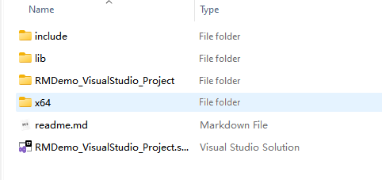
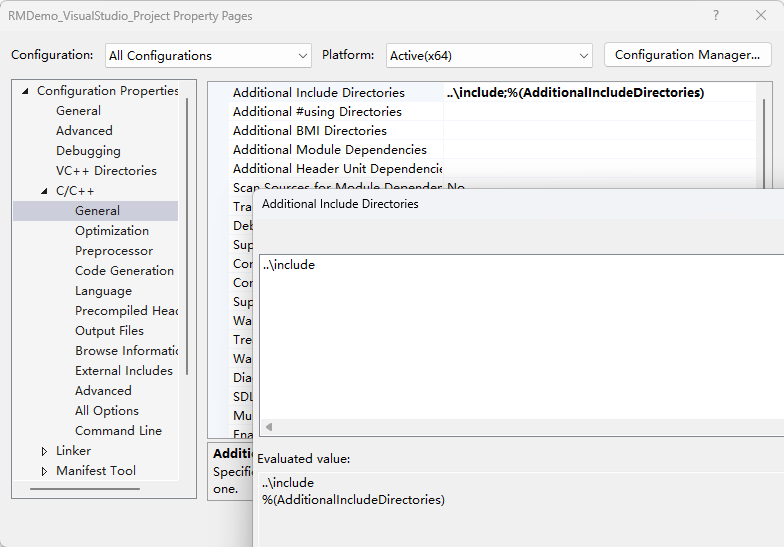
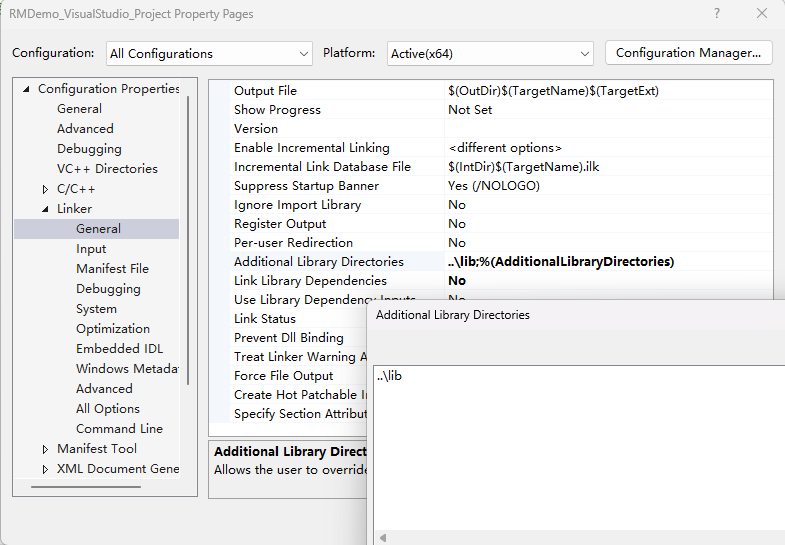
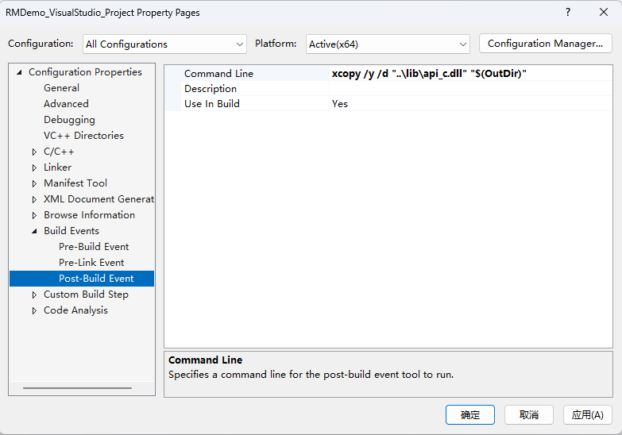
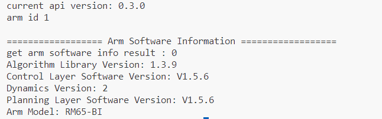
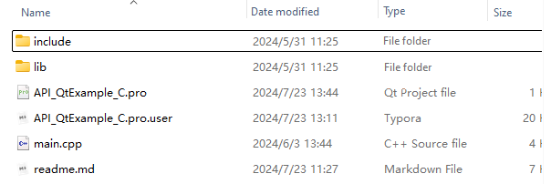

# RealMan robotic arm C/C++ API quick start

## 1. Introduction

The development package is designed to provide convenient interfaces for secondary development of the RealMan robotic arm. With this package, users can easily implement functions such as robotic arm control, path planning, and state monitoring, thereby accelerating the development process of robotic arm-related applications.

## 2. Target user

- **Robotic arm developers**: For developers who wish to program and debug the RealMan robotic arm via C/C++ languages, this development package provides a rich set of APIs and example codes, making it easy to get started quickly.
- **Automation system integrators**: When integrating the RealMan robotic arm into automation systems, this development package simplifies the integration process and improves development efficiency.
- **Researchers**: Researchers can use this development package to conduct studies and experiments related to RealMan robotic arm algorithms, such as path planning, and force control.
- **Educators**: For users in the field of robotics education, this development package can be used for teaching and experiments with the RealMan robotic arm, helping students better understand and apply robotic arm technology.

## 3. Instructions on use of development package

### 3.1 Instructions on use of Windows environment

#### 3.1.1 Supported compilers

- **MSVC2015 or higher**: Microsoft Visual C++ 2015 (MSVC2015) or newer versions are the recommended compilers, as they are highly compatible with the Windows system and support the latest C language standards. Using MSVC makes it easier to compile and debug C language-based control programs for the RealMan robotic arm.

#### 3.1.2 Development package description

- **Header file**: For C language development, the following header files are included:
  
  - `rm_define.h`: custom header file for the robotic arm, containing defined data types and structures.
  - `rm_interface_global.h`: custom header file for the robotic arm, defining export macros when compiling Windows C/C++ version libraries.
  - `rm_interface.h`: custom header file of the robotic arm, declaring the C language operation interface of the robotic arm.
  
  For C++ development, the following additional header file is included:
  
  - `rm_service.h`: custom header file of the robotic arm, declaring the C++ language operation interface of the robotic arm.
  
- **Dynamic link libraries (DLLs)**: The DLLs contain the functions and interfaces required to control the robotic arm. Users need to correctly configure the path and version of these DLLs in the project so that the compiler can locate and link them. The following versions are included:

  - `32bit`: correspond to the library used with the Windows 32-bit compiler (e.g., MSVC2017 32bit)
  - `64bit`: correspond to the library used with the Windows 64-bit compiler (e.g., MSVC2017 64bit)

### 3.2 Instructions on use of Linux environment

#### 3.2.1 Supported architectures

- **x86**: standard Intel and AMD processor architecture.
- **ARM**: support processors based on the ARM architecture.

#### 3.2.2 Compiler

- **GCC**: The GNU Compiler Collection (GCC) is a widely used open-source compiler collection for Linux. The required version is GCC 7.5 or higher to ensure optimal performance and compatibility.

#### 3.2.3 Development package description

- **Header file**: same as Windows header files, see the development package description of Windows environment for details
- **Shared library (.so file):**: It contains the functions and interfaces required to control the robotic arm. Users must ensure that these library files are accessible by the system during both compilation and runtime. The following versions of libraries are included:
  - `linux_x86_release` version
  - `linux_arm_release` version

## 4. Usage demo - MSVC

::: tip
Support MSVC2015 and above.
:::

This project is a C/C++ project developed via Microsoft Visual Studio, designed to demonstrate how to integrate the RealMan C language secondary development package into a Visual Studio project. <br>This Readme document will guide users on how to configure the environment, import library files, set project properties, and compile and run the project.

### 4.1 Code structure

```
RMDemo_VisualStudio_Project
├── RMDemo_VisualStudio_Project.sln # Solution file
├── include
│   ├── rm_define.h  # Header file of the robotic arm secondary development package, containing defined data types and structures
│   └── rm_interface.h # Header file of the robotic arm secondary development package, declaring all operation interfaces of the robotic arm
├── lib
│   ├── api_c.dll    # API library for Windows (default release 64bit)
│   └── api_c.lib    # API library for Windows (default release 64bit)
├── RMDemo_VisualStudio_Project #Source code folder
└── readme.md            # Project description document
```

### 4.2 Environment preparation

- **Visual Studio**：
  - Install a version of Visual Studio suitable for C/C++ development (e.g., Visual Studio Community), with the latest version recommended.
  - Select the "Desktop development with C++" during installation.
  - MSVC compiler version 2015 or higher is required.
- **RealMan secondary development package**: [download link](../../download/redevelopment/index.md)

### 4.3 Project steps

#### 4.3.1 Project configuration

1. **Create a new C/C++ project**:

   - Open Visual Studio, and select "Create a New Project".
   - In the "Create a New Project" dialog, choose "Console Application" or another C/C++ project type suitable for your needs, and click "Next".
   - Enter the project name, location, and other details, and click "Create".

2. **Include header files of the RealMan secondary development package**:

   - Copy the RealMan development package header files and dynamic library files into the project directory!

     

   - Right-click the project name, and open the "Properties" dialog.
   - In the left pane, select "Configuration Properties" > "C/C++" > "General".
   - In the "Additional Include Directories" dropdown, click "Edit". In the edit control, add the path to the RealMan header files. You can either use the ellipsis (...) control to browse to the correct folder, or manually enter a relative path.

   

3. **Add the DLL import library to the project**:

   - In the "Project Properties" window, navigate to "Linker" > "Input".
   - In "Additional Dependencies", add the name of the RealMan library: `api_c.lib`.
   - Select "Configuration Properties" > "Linker" > "General". Click the dropdown next to "Additional Library Directories", and select "Edit".
   - In the edit control, specify the path to the location of the `api_c.lib`.

   

4. **Copy DLL in post-build events**:

   Copy the DLL to the directory containing the client executable file as part of the build process.

   - In the "Project Properties" window, select "Configuration Properties" > "Build Events" > "Post-build Events".
   - In the "Command Line" field, click "Edit" to open the edit control, and enter the following command:

   `xcopy /y /d "..\lib\api_c.dll" "$(OutDir)"`

   

5. **Save and close the "Project Properties" window**.

#### 4.3.2 Example code

```c
#include "rm_interface.h"
#include <stdio.h>
#include <time.h>
#include <string.h>

int main(int argc,char **argv)
{
    rm_set_log_call_back(NULL,3);
    rm_init(RM_TRIPLE_MODE_E);

    char *version = rm_api_version();
    printf("current api version: %s\n", version);

    handle = rm_create_robot_arm("192.168.1.18",8080);
    if( handle->id  == -1)
    {
        rm_delete_robot_arm(handle);
        printf("arm connect err...\n");
    }
    else if(handle != NULL)
    {
        printf("arm id %d \n", handle->id);
    }
    
    int ret;
    rm_arm_software_version_t arm_software_version;
    ret = rm_get_arm_software_info(handle, &arm_software_version);
    printf("\n================== Arm Software Information ==================\n");
    printf("get arm software info result : %d\n", ret);
    printf("Algorithm Library Version: %s\n", arm_software_version.algorithm_info.version);
    printf("Control Layer Software Version: %s\n", arm_software_version.ctrl_info.version);
    printf("Dynamics Version: %s\n", arm_software_version.dynamic_info.model_version);
    printf("Planning Layer Software Version: %s\n", arm_software_version.plan_info.version);
    printf("Arm Model: %s\n", arm_software_version.product_version);
}
```

Output result as shown below:



#### 4.3.3 Compilation and running

- In Visual Studio, select "Build Solution" under the "Build" menu to compile the project.
- Ensure there are no compilation errors and the project is properly linked to the RealMan library.
- Select "Start Debugging" under the "Debug" menu or click the green play button on the toolbar to run your application.

### 4.4 Notes

This demo uses the RM65-B robotic arm as an example. Please modify the data in the code according to your actual situation.

### 4.5 License information

- This project is subject to the MIT license.

### 4.6 Frequently asked question (FAQ)

- **Link error**: check if the header files are properly included and libraries imported.
- **Runtime error**: ensure that the dll files are located in the application's search path.
- **Robotic arm connection failure**: check if the robotic arm's IP address has been modified.
- **Robotic arm movement failure**: check the robotic arm model. This example is written for the RM65-B model, and the motion points may not be applicable to other models.

## 5. Usage demo - Qt

This project is a cross-platform Qt application that supports both Linux and Windows operating systems. <br>This project aims to demonstrate how to use Qt's qmake build system to import and use the RealMan C language secondary development package to connect the robotic arm, retrieve the robotic arm version, control the robotic arm movement, and disconnect the robotic arm. This Readme document will explain the environment requirements and guide users through the process of creating a new project --> importing libraries --> calling APIs --> building and running the project.

### 5.2 Code structure

```
RMDemo_QtExample_C
├── API_QtExample_C.pro # Project file, containing project configuration information
├── include
│   ├── rm_define.h  # Header file of the robotic arm secondary development package, containing defined data types and structures
│   └── rm_interface.h # Header file of the robotic arm secondary development package, declaring all operation interfaces of the robotic arm
├── lib
│   ├── api_c.dll    # API library for Windows
│   ├── api_c.lib    # API library for Windows
│   └── libapi_c.so  # API library for Linux
├── main.c           # Main function
└── readme.md            # Example project description document
```

### 5.3 Environment requirements

- **Qt version**: download and install the appropriate version of Qt for your operating system (Qt 5 or Qt 6).
- **Operating system**: support Linux and Windows  
- **Compiler**:
  - On Windows, it must be MSVC 2015 or higher
  - On Linux, it must be GCC 7.5 or higher  
- **Other dependencies**: RealMan secondary development package (download link)
  
### 5.4 Project steps

#### 5.4.1 Project configuration

1. **Create a Qt project**:

   - Open Qt Creator and select "File" > "Create a New File or Project".
   - Choose a template under "Applications" (e.g., "Qt Console Application") and click "Choose" to continue.
   - Fill in the project name, location, and other details, select the "qmake" build system, and click "Next".
   - Select the MSVC compiler for the build kit (e.g., "MSVC2017 64bit" on Windows), click "Next" and continue through the wizard until it's completed.

2. **Configure qmake**:

   - Place the corresponding version of the RealMan secondary development package dynamic library files and header files into the project based on the selected compiler (for the MSVC2017 64bit compiler, choose the Windows 64bit library).

   - Open the project’s `.pro` file and add the RealMan library’s include paths and library files.

   The secondary development package file directory and `.pro` file configuration for this project are as follows (make adjustments based on your actual path):

   

   ```pro
   INCLUDEPATH += $$PWD/include
   LIBS += -L$$PWD/lib -lapi_c
   ```

   - Make sure to replace `$$PWD/include` and `$$PWD/lib` with the actual paths to the header files and library files.
   - In `-lapi_c`, `api_c` is the name of the library file (without the prefix or suffix).

3. **Modify project code**:

   - In your Qt project, add code that includes the RealMan header files.
   - Write code to call functions from the RealMan library to implement the desired functionality.

#### 5.4.2 Compilation and running

1. Compile a project:
   - In Qt Creator, click the green play button at the bottom left or use the shortcut key (usually F5) to build and run the project.
   - Ensure there are no compilation errors and the project is properly linked to the RealMan library.
2. Perform running and testing:
   - Run the application and test if it works as expected, particularly the parts that use functions from the RealMan library.

### 5.5 Notes

This demo uses the RM65-B robotic arm as an example. Please modify the data in the code according to your actual situation.

### 5.6 License information

- This project is subject to the MIT license.

### 5.7 Frequently asked question (FAQ)

- **Link error**:
  - Check if LIBS and INCLUDEPATH correctly point to the header files and library files of the RealMan library.
  - Check if the version of the pointed library files matches the environment.
- **Compiler or build error**: check the configuration settings in Qt Creator to ensure the correct Qt version and compiler are selected.
- **Runtime error**: ensure that the library files are in the system’s library path or in the same directory as the application's executable file.
- **Robotic arm connection failure**: check if the robotic arm's IP address has been modified.
- **Robotic arm movement failure**: check the robotic arm model. This example is written for the RM65-B model, and the motion points may not be applicable to other models.

## 6. Supported channels

- **Examples and documents**: [API C/C++demo](../../demo/c/simpleProcess/index.md).
- **SDKs and libraries**: [download the C/C++ SDK package](https://github.com/RealManRobot/RM_API2.git).
