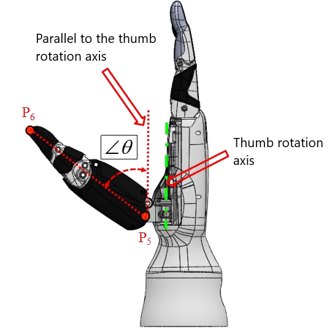
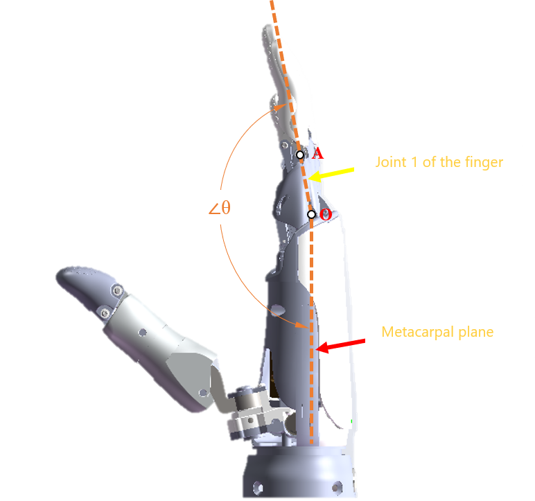
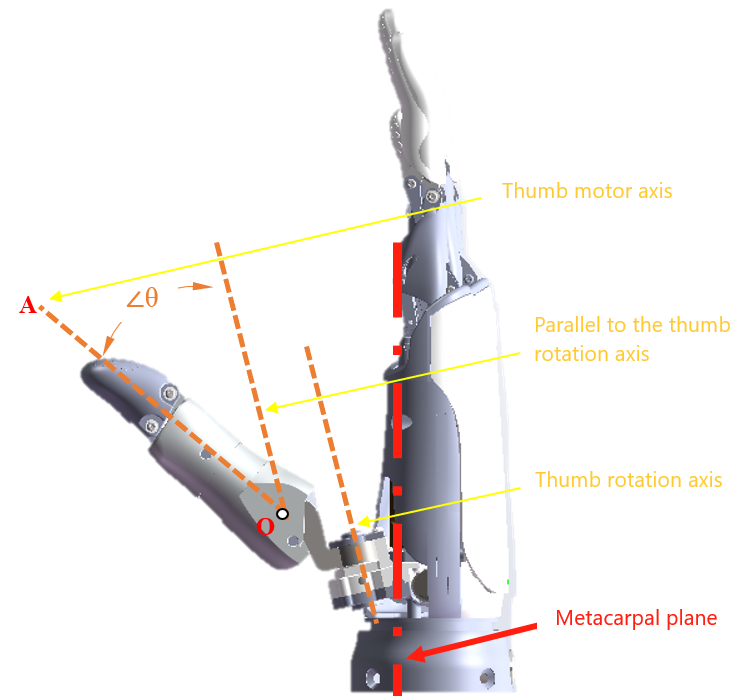

# <p class="hidden">Python: </p>Five-Fingered Dexterous Hand Configuration `HandControl`

It is used to set the five-fingered dexterous hand control. The following is a detailed description of the member functions of the five-fingered dexterous hand configuration `HandControl`, including the method prototype, parameter description, return value, and usage demo.

## <div id = '6258'>Run dexterous hand target gesture sequence number `rm_set_hand_posture()`</div>

- **Method prototype:**

```python
rm_set_hand_posture(self, posture_num: int, block: bool, timeout: int) -> int:
```

- **Parameter description:**

| Parameter        | Type    | Description                                   |
| :-------- | :---- | :----------------------------------- |
|  `posture_num`  |    `int`    |    Gesture sequence number pre-stored in the dexterous hand, range: 1−40    |
|  `block`  |    `bool`    |    true: blocking mode, return after the dexterous hand finishes its movement; <br>false: non-blocking mode, immediately return after sending the command   |
|   `timeout`  |    `int`    |    Timeout setting in blocking mode, in s   |

- **Return value:** <br>
State codes executed by functions:

|Parameter|Type|Description|Handling Suggestions|
|-|-|-|-|
|0|`int`|Success.|-|
|1|`int`|The controller returns false, indicating that the parameters are sent incorrectly or the robotic arm state is wrong.|- **Validate JSON Command**:<br> ① Enable DEBUG logs for the API to capture the raw JSON data.<br> ② Check JSON syntax: Ensure correct formatting of parentheses, quotes, commas, etc. (You can use a JSON validation tool).<br> ③ Verify against the API documentation that parameter names, data types, and value ranges comply with the specifications.<br> ④ After fixing the issues, resend the command and check if the controller returns a normal status code and business data.<br>- **Check Robot Arm Status**:<br> ① Check for real-time error messages in the robot arm controller or logs (such as hardware failures, over-limit conditions), and reset, calibrate, or troubleshoot hardware issues according to the prompts.<br> ② After fixing the issues, resend the command and check if the controller returns a normal status code and business data.|
|-1|`int`|The data transmission fails, indicating that a problem occurs during the communication.|**Check Network Connectivity**:<br> Use tools like ping/telnet to check if the communication link with the controller is normal.|
|-2|`int`|The data reception fails, indicating that a problem occurs during the communication, or the controller has a return timeout.|- **Check Network Connectivity**:<br> Use tools like ping/telnet to check if the communication link with the controller is normal.<br> - **Verify Version Compatibility**:<br> ① Check if the controller firmware version supports the current API functions. For specific version compatibility, refer to the [Version Description](../../../releaseNotes/releaseNotes/index.md).<br> ② If the version is too low, upgrade the controller or use an API version that is compatible.|
|-3|`int`|The return value parse fails, indicating that the received data format is incorrect or incomplete.|**Verify Version Compatibility**:<br> ① Check if the controller firmware version supports the current API functions. For specific version compatibility, refer to the [Version Description](../../../releaseNotes/releaseNotes/index.md).<br> ② If the version is too low, upgrade the controller or use an API version that is compatible.|
|-4|`int`|The current in-position equipment verification fails, indicating the current in-position equipment is not a dexterous hand.|- **Detect Concurrent Control by Multiple Devices**: Check if other devices are sending motion commands to the robot arm, including the motion of the robot arm, gripper, dexterous hand, and elevator.<br> - **Monitor Command Events in Real-Time**: Register the callback function `rm_get_arm_event_call_back`:<br> ① Capture device arrival events (such as motion completion, timeout, etc.).<br> ② Determine the specific device type that triggered the event through the device parameter in the callback.|
|  -5  |    `int`    |    Timeout, no response returns.    |- **Check Timeout Setting**: In blocking mode, it supports configuring the timeout for waiting for the device to complete its motion. Ensure that the timeout is set longer than the device's motion time.<br> - **Check Network Connectivity**:<br> Use tools like ping/telnet to check if the communication link with the controller is normal.|

- **Usage demo**
  
```python
from Robotic_Arm.rm_robot_interface import *

# Instantiate the RoboticArm class
arm = RoboticArm(rm_thread_mode_e.RM_TRIPLE_MODE_E)

# Create the robotic arm connection and print the connection ID
handle = arm.rm_create_robot_arm("192.168.1.18", 8080)
print(handle.id)

print(arm.rm_set_hand_posture(1, True, 10))

arm.rm_delete_robot_arm()
```

## <div id = '6260'>Run dexterous hand action sequence number `rm_set_hand_seq()`</div>

- **Method prototype:**

```python
rm_set_hand_seq(self, seq_num: int, block: bool, timeout: int) -> int:
```

- **Parameter description:**

| Parameter        | Type    | Description                                   |
| :-------- | :---- | :----------------------------------- |
|  `seq_num`  |    `int`    |    Gesture sequence number pre-stored in the dexterous hand, range: 1−40    |
|  `block`  |    `bool`    |    true: blocking mode, return after the dexterous hand finishes its movement; <br>false: non-blocking mode, immediately return after sending the command   |
|   `timeout`  |    `int`    |    Timeout setting in blocking mode, in s   |

- **Return value:** <br>
State codes executed by functions:

|Parameter|Type|Description|Handling Suggestions|
|-|-|-|-|
|0|`int`|Success.|-|
|1|`int`|The controller returns false, indicating that the parameters are sent incorrectly or the robotic arm state is wrong.|- **Validate JSON Command**:<br> ① Enable DEBUG logs for the API to capture the raw JSON data.<br> ② Check JSON syntax: Ensure correct formatting of parentheses, quotes, commas, etc. (You can use a JSON validation tool).<br> ③ Verify against the API documentation that parameter names, data types, and value ranges comply with the specifications.<br> ④ After fixing the issues, resend the command and check if the controller returns a normal status code and business data.<br>- **Check Robot Arm Status**:<br> ① Check for real-time error messages in the robot arm controller or logs (such as hardware failures, over-limit conditions), and reset, calibrate, or troubleshoot hardware issues according to the prompts.<br> ② After fixing the issues, resend the command and check if the controller returns a normal status code and business data.|
|-1|`int`|The data transmission fails, indicating that a problem occurs during the communication.|**Check Network Connectivity**:<br> Use tools like ping/telnet to check if the communication link with the controller is normal.|
|-2|`int`|The data reception fails, indicating that a problem occurs during the communication, or the controller has a return timeout.|- **Check Network Connectivity**:<br> Use tools like ping/telnet to check if the communication link with the controller is normal.<br> - **Verify Version Compatibility**:<br> ① Check if the controller firmware version supports the current API functions. For specific version compatibility, refer to the [Version Description](../../../releaseNotes/releaseNotes/index.md).<br> ② If the version is too low, upgrade the controller or use an API version that is compatible.|
|-3|`int`|The return value parse fails, indicating that the received data format is incorrect or incomplete.|**Verify Version Compatibility**:<br> ① Check if the controller firmware version supports the current API functions. For specific version compatibility, refer to the [Version Description](../../../releaseNotes/releaseNotes/index.md).<br> ② If the version is too low, upgrade the controller or use an API version that is compatible.|
|-4|`int`|The current in-position equipment verification fails, indicating the current in-position equipment is not a dexterous hand.|- **Detect Concurrent Control by Multiple Devices**: Check if other devices are sending motion commands to the robot arm, including the motion of the robot arm, gripper, dexterous hand, and elevator.<br> - **Monitor Command Events in Real-Time**: Register the callback function `rm_get_arm_event_call_back`:<br> ① Capture device arrival events (such as motion completion, timeout, etc.).<br> ② Determine the specific device type that triggered the event through the device parameter in the callback.|
|  -5  |    `int`    |    Timeout, no response returns.    |- **Check Timeout Setting**: In blocking mode, it supports configuring the timeout for waiting for the device to complete its motion. Ensure that the timeout is set longer than the device's motion time.<br> - **Check Network Connectivity**:<br> Use tools like ping/telnet to check if the communication link with the controller is normal.|

- **Usage demo**
  
```python
from Robotic_Arm.rm_robot_interface import *

# Instantiate the RoboticArm class
arm = RoboticArm(rm_thread_mode_e.RM_TRIPLE_MODE_E)

# Create the robotic arm connection and print the connection ID
handle = arm.rm_create_robot_arm("192.168.1.18", 8080)
print(handle.id)

print(arm.rm_set_hand_seq(1, True, 15))

arm.rm_delete_robot_arm()
```

## Set the angles of the dexterous hand’s degrees of freedom`rm_set_hand_angle()`

- **Method prototype:**

```python
rm_set_hand_angle(self, hand_angle: list[int]) -> int:
```

- **Parameter description:**

| Parameter        | Type    | Description                                   |
| :-------- | :---- | :----------------------------------- |
|  `seq_num`  |    `int`    |    Gesture sequence number pre-stored in the dexterous hand, range: 1−40    |
|  `block`  |    `bool`    |    true: blocking mode, return after the dexterous hand finishes its movement; <br>false: non-blocking mode, immediately return after sending the command   |
|   `timeout`  |    `int`    |    Timeout setting in blocking mode, in s   |

- **Return value:** <br>
State codes executed by functions:

0 represents success. For other error codes, please refer to the [API2 Error Codes](../../../apierrorList2/index.md).

- **Usage demo**
  
```python
from Robotic_Arm.rm_robot_interface import *

# Instantiate the RoboticArm class
arm = RoboticArm(rm_thread_mode_e.RM_TRIPLE_MODE_E)

# Create the robotic arm connection and print the connection ID
handle = arm.rm_create_robot_arm("192.168.1.18", 8080)
print(handle.id)

# Set the finger angles of the dexterous hand
print(arm.rm_set_hand_angle([-1,100,200,300,400,500]))

arm.rm_delete_robot_arm()
```

## Set the speed of the dexterous hand`rm_set_hand_speed()`

- **Method prototype:**

```python
rm_set_hand_speed(self, speed: int) -> int:
```

- **Parameter description:**

| Parameter        | Type    | Description                                   |
| :-------- | :---- | :----------------------------------- |
|  `speed`  |    `int`    |    Finger speed, range: 1−1,000   |

- **Return value:** <br>
State codes executed by functions:

0 represents success. For other error codes, please refer to the [API2 Error Codes](../../../apierrorList2/index.md).

- **Usage demo**
  
```python
from Robotic_Arm.rm_robot_interface import *

# Instantiate the RoboticArm class
arm = RoboticArm(rm_thread_mode_e.RM_TRIPLE_MODE_E)

# 创建机械臂连接，打印连接id
handle = arm.rm_create_robot_arm("192.168.1.18", 8080)
print(handle.id)

print(arm.rm_set_hand_speed(500))

arm.rm_delete_robot_arm()
```

## Set the force threshold of the dexterous hand`rm_set_hand_force()`

- **Method prototype:**

```python
rm_set_hand_force(self, force: int) -> int:
```

- **Parameter description:**

| Parameter        | Type    | Description                                   |
| :-------- | :---- | :----------------------------------- |
|  force  |    `int`    |    Finger force, range: 1−1,000   |

- **Return value:** <br>
State codes executed by functions:

0 represents success. For other error codes, please refer to the [API2 Error Codes](../../../apierrorList2/index.md).

- **Usage demo**
  
```python
from Robotic_Arm.rm_robot_interface import *

# Instantiate the RoboticArm class
arm = RoboticArm(rm_thread_mode_e.RM_TRIPLE_MODE_E)

# Create the robotic arm connection and print the connection ID
handle = arm.rm_create_robot_arm("192.168.1.18", 8080)
print(handle.id)

print(arm.rm_set_hand_force(500))

arm.rm_delete_robot_arm()
```

## Set the angle follow control of the dexterous hand `rm_set_hand_follow_angle()`

- Set the follow angles of the dexterous hand, which has 6 degrees of freedom: 1. Little finger, 2. Ring finger, 3. Middle finger, 4. Index finger, 5. Thumb bending, 6. Thumb rotation. The control frequency is up to 50 Hz.
- Definition of angles of the dexterous hand (int16):

   1. OYMotion: angle of joint 1 of the first finger *100. <br>
   2. INSPIRE-ROBOTS: 0-2,000, obtain the relationship table between the driver stroke and angle by contacting technical support.

::: warning Warning
To use this feature, you need to contact technical support to receive a customized firmware upgrade package for the dexterous hand (OYMotion or INSPIRE-ROBOTS).
:::

- **Method prototype:**

```python
rm_set_hand_follow_angle(self, hand_angle: list[int], block:int) -> int
```

- **Parameter description:**

| Parameter        | Type    | Description                                   |
| :-------- | :---- | :----------------------------------- |
|  `hand_angle`  |    `List[int]`    | Set the actions of each finger of the dexterous hand. hand_angle: array of finger angles, controlled according to the angles defined by the manufacturer of the dexterous hand. For example: <br>1. INSPIRE-ROBOTS has an angle range from 0 to +2,000; <br>2. OYMotion has an angle range from -32,768 to +32,767.  |
|  `block`  |    `int`    |    Set the timeout for waiting for the robotic arm's state return in ms. 0: non-blocking mode.  |

- **The angle definitions and motion ranges for each degree of freedom of INSPIRE-ROBOTS are as follows.**

| Angle | Legend |Range|
| :--- | :--- |:---|
| Little finger<br>Ring finger<br>Middle finger<br>Index finger |  |19°-176.7°|
| Thumb bending angle |  |-130-53.6°|
| Thumb rotation angle |  |90°-165°|

- **The angle definitions and motion ranges for each degree of freedom of OYMotion are as follows.**

| Angle | Legend |Range|
| :--- | :--- |:---|
| Index finger<br>Middle finger<br>Ring finger<br>Little finger |  |100.22°−178.37°<br>97.81°− 176.06°<br>101.38°−176.54°<br>98.84°−174.86°|
| Thumb bending angle |  |2.26° - 36.76°|
| Thumb rotation angle |  |0° - 90°|

- **Return value:** <br>
State codes executed by functions:

0 represents success. For other error codes, please refer to the [API2 Error Codes](../../../apierrorList2/index.md).

- **Usage demo**
  
```python
from Robotic_Arm.rm_robot_interface import *

# Instantiate the RoboticArm class
arm = RoboticArm(rm_thread_mode_e.RM_TRIPLE_MODE_E)

# Create the robotic arm connection and print the connection ID
handle = arm.rm_create_robot_arm("192.168.1.18", 8080)
print(handle.id)

# Set the angle follow control of the dexterous hand
print(arm.rm_set_hand_follow_angle([0,100,200,300,400,500], 100))

arm.rm_delete_robot_arm()
```

## Set the position follow control of the dexterous hand`rm_set_hand_follow_pos()`

::: warning Warning
To use this feature, you need to contact technical support to receive a customized firmware upgrade package for the dexterous hand (OYMotion or INSPIRE-ROBOTS).
:::

- **Method prototype:**

```python
rm_set_hand_follow_pos(self, hand_pos: list[int], block:int) -> int
```

- **Parameter description:**

| Parameter        | Type    | Description                                   |
| :-------- | :---- | :----------------------------------- |
|  `hand_pos`  |    `list[int]`    |    Set the actions of each finger of the dexterous hand. hand_pos: array of finger positions, controlled according to the angles defined by the manufacturer of the dexterous hand. For example: <br>1. INSPIRE-ROBOTS has a position range from 0 to 1,000; <br>2. OYMotion has a position range from 0 to 65,535.  |
|  `block`  |    `int`    |    Set the timeout for waiting for the robotic arm's state return in ms. 0: non-blocking mode.  |

- **Return value:** <br>
State codes executed by functions:

0 represents success. For other error codes, please refer to the [API2 Error Codes](../../../apierrorList2/index.md).

- **Usage demo**
  
```python
from Robotic_Arm.rm_robot_interface import *

# Instantiate the RoboticArm class
arm = RoboticArm(rm_thread_mode_e.RM_TRIPLE_MODE_E)

# Create the robotic arm connection and print the connection ID
handle = arm.rm_create_robot_arm("192.168.1.18", 8080)
print(handle.id)

# Set the position follow control of the dexterous hand
print(arm.rm_set_hand_follow_pos([0,100,200,300,400,500], 100))

arm.rm_delete_robot_arm()
```
