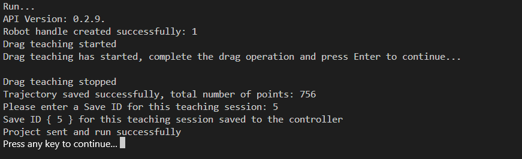

#  <p class="hidden">Demo (C, C++): </p>Usage Demo of Controller IO Port

## **1. Project introduction**

This project demonstrates the setup and usage of the controller's IO port multiplexing function to control the robotic arm's online programming file, including starting, pausing, resuming, and stopping its execution. It is built with CMake and utilizes the C language development package for the robotic arm provided by RealMan.

## **2. Code structure**

```bash
RMDemo_IOControl
├── build              # Output directory generated by CMake build (Makefile, build file, etc.)
├── data
│   ├── trajectory.txt  # Trajectory file saved during drag teaching (generated during execution)
│   └── project.txt     # Online programming file generated from the trajectory file saved during drag teaching (generated during execution)
├── include              # Custom header file storage directory
├── Robotic_Arm          # RealMan robotic arm secondary development package
│   ├── include
│   │   ├── rm_define.h  # Header file of the robotic arm secondary development package, containing defined data types and structures
│   │   └── rm_interface.h # Header file of the robotic arm secondary development package, declaring all operation interfaces of the robotic arm
│   └── lib
│       ├── api_c.dll    # API library for Windows 64bit
│       ├── api_c.lib    # API library for Windows 64bit
│       └── libapi_c.so  # API library for Linux x86
├── src
│   └── main.c           # Main function
├── CMakeLists.txt       # Top-level CMake configuration file of the project
├── readme.md            # Project description document
├── run.bat              # Windows quick run script
└── run.sh               # linux quick run script

```

## **3. Project download**

Download `RM_API2` locally via the link: [development package download](https://github.com/RealManRobot/RM_API2.git). Then, navigate to the `RM_API2\Demo\RMDemo_C` directory, where you will find RMDemo_IOControl.

## **4. Environment configuration**

Required environment and dependencies for running in Windows and Linux environments:

| Item      | Linux                                          | Windows                                          |
| :-------- | :--------------------------------------------- | :----------------------------------------------- |
| System architecture  | x86 architecture                                        | -                                                |
| Compiler    | GCC 7.5 or higher                              | MSVC2015 or higher 64bit                         |
| CMake version | 3.10 or higher                                 | 3.10 or higher                                   |
| Specific dependency  | RMAPI Linux version library (located in the `Robotic_Arm/lib` directory) | RMAPI Windows version library (located in the `Robotic_Arm/lib`directory) |

### Linux configuration

1. **Compiler (GCC)**
  In most Linux distributions, GCC is installed by default, but the version may not be the latest. If a specific version of GCC (such as 7.5 or higher) is required, it can be installed via the package manager. For example, on Ubuntu, you can use the following commands to install or update GCC:

  ```bash
  # Check GCC version
  gcc --version

  sudo apt update
  sudo apt install gcc-7 g++-7  
  ```

  Note: If the GCC version installed by default on the system meets or exceeds the required version, no additional installation is necessary.

2. **CMake**

  CMake can also be installed through the package manager in most Linux distributions. For example, on Ubuntu:

  ```bash
  sudo apt update
  sudo apt install cmake

  # Check CMake version
  cmake --version
  ```

### Windows configuration

- **Compiler (MSVC2015 or higher)**: The MSVC (Microsoft Visual C++) compiler is typically installed with Visual Studio. You can install it by following these steps:

   1. Visit the [Visual Studio official website](https://visualstudio.microsoft.com/) to download and install Visual Studio.
   2. During installation, select the "Desktop development with C++" workload, which will include the MSVC compiler.
   3. Select additional components as needed, such as CMake (if not already installed).
   4. After installation, open the Visual Studio command prompt (available in the start menu) and enter the `cl` command to check if the MSVC compiler is installed successfully.

- **CMake**: If CMake was not included during the Visual Studio installation, you can download and install CMake separately.

   1. Visit the [CMake official website](https://cmake.org/download/) to download the installer for Windows.
   2. Run the installer and follow the on-screen instructions to complete the installation.
   3. After installation, add the CMake bin directory to the system's PATH environment variable (this is typically asked during installation).
   4. Open the command prompt or PowerShell and enter `cmake --version` to check if CMake has been installed successfully.

## **5. User guide**

### **5.1 Quick run**

Follow these steps to quickly run the code:

1. **Configuration of the IP address of the robotic arm**:
   Open the `main.c` file and modify the parameters of the `robot_ip_address` in the `main` function to the current IP address of the robotic arm. The default IP address is `"192.168.1.18"`.

   ```C
   const char *robot_ip_address = "192.168.1.18";

   int robot_port = 8080;
   rm_robot_handle *robot_handle = rm_create_robot_arm(robot_ip_address, robot_port);
   ```

2. **Running via linux command line**:
   Navigate to the `RMDemo_IOControl` directory in the terminal, and enter the following command to run the C program:

   ```bash
   chmod +x run.sh
   ./run.sh
   ```

   The running result is as follows:

   

3. **Running on Windows**: double-click the run.bat script to run
   The running result is as follows:

  ```bash
  API Version: 1.0.0.
  Robot handle created successfully: 1
  Drag teaching started
  Drag teaching has started, complete the drag operation and press Enter to continue...

  Drag teaching stopped
  Trajectory saved successfully, total number of points: 682
  Please enter a Save ID for this teaching session: 1
  Save ID { 1 } for this teaching session saved to the controller
  Project sent and run successfully
  Press any key to continue. . .
  ```

### **5.2 Description of key codes**

The following are the main functions of the `main.c`:

- **Connect the robotic arm**
  Connect the robotic arm to the specified IP address and port.

  ```C
  rm_robot_handle *robot_handle = rm_create_robot_arm(robot_ip_address, robot_port);
  ```

- **Get the API version**
  Get and display the API version.

  ```C
  char *api_version = rm_api_version();
  printf("API Version: %s.\n", api_version);
  ```

- **Save the trajectory of drag teaching**
  Call the rm_start_drag_teach interface to start the drag teaching mode for the robotic arm. After completing the drag, call the rm_stop_drag_teach to exit the drag teaching mode. Call the rm_save_trajectory interface to save the drag teaching trajectory to the trajectory.txt file in the data folder.

  ```C
  int result = rm_start_drag_teach(handle, trajectory_record);
  
  printf("Drag teaching has started, complete the drag operation and press Enter to continue...\n");
  getchar();
  
  result = rm_stop_drag_teach(handle);

  // Save trajectory
  int lines;
  result = rm_save_trajectory(robot_handle, TRAJECTORY_FILE_PATH, &lines);
  ```

- **Save the drag teaching trajectory as an online programming file**
  Read the trajectory.txt file, add the following content according to the rules, and save it as the online programming file project.txt:

  ```C
  // Where file_value represents the current degrees of freedom of the robotic arm, and type_value represents the number of lines in the file
  char line1[50];
  char line2[100];

  snprintf(line1, sizeof(line1), "{\"file\":%d}\n", file_value);
  snprintf(line2, sizeof(line2), "{\"name\":\"Folder\",\"num\":1,\"type\":%d,\"enabled\":true,\"parent_number\":0}\n", type_value);
  ```

- **Save the online programming file to the controller**
  Send the online programming file project.txt to the controller and set it as the online programming file that the IO runs by default:

  ```C
  // Get user input for save_id
  int save_id;
  printf("Please enter a Save ID for this teaching session: ");
  scanf("%d", &save_id);
  printf("Save ID { %d } for this teaching session saved to the controller\n", save_id);

  // Send file and query running status
  send_project(robot_handle, PROJECT_FILE_PATH, 20, 1, save_id, 0, 0);

  result = rm_set_default_run_program(robot_handle, save_id);
  ```

- **Set the IO multiplexing mode**
  Call the rm_set_IO_mode interface to set the mode of each IO port to the following: input start function multiplexing mode, input pause function multiplexing mode, input resumption function multiplexing mode, and input emergency stop function multiplexing mode.

  **C Language**

  ```C
  rm_io_config_t io_1_config = {0};
  io_1_config.io_mode = 2;
  result = rm_set_IO_mode(robot_handle, 1, io_1_config);  // Set IO mode to input start function multiplexing mode

  rm_io_config_t io_2_config = {0};
  io_1_config.io_mode = 3;
  result = rm_set_IO_mode(robot_handle, 2, io_2_config);  // Set IO mode to input pause function multiplexing mode

  rm_io_config_t io_3_config = {0};
  io_1_config.io_mode = 4;
  result = rm_set_IO_mode(robot_handle, 3, io_3_config);  // Set IO mode to input continue function multiplexing mode

  rm_io_config_t io_4_config = {0};
  io_1_config.io_mode = 5;
  result = rm_set_IO_mode(robot_handle, 4, io_4_config);  // Set IO mode to input emergency stop function multiplexing mode
  ```

  **C++**

  ```C
  result = rm_set_IO_mode(robot_handle, 1, 2);  // Set IO mode to input start function multiplexing mode
  result = rm_set_IO_mode(robot_handle, 2, 3);  // Set IO mode to input pause function multiplexing mode
  result = rm_set_IO_mode(robot_handle, 3, 4);  // Set IO mode to input continue function multiplexing mode
  result = rm_set_IO_mode(robot_handle, 4, 5);  // Set IO mode to input emergency stop function multiplexing mode
  ```

  After the program execution is completed, the controller IO is set as follows. By triggering the corresponding ports, the online programming file can be controlled:

  IO1: start running the online programming file;
  IO2: pause running the online programming file;
  IO3: resume running the online programming file;
  IO4: emergency stop;

## **6. License information**

- This project is subject to the MIT license.
  
## Appendix

### Controller IO Interface Diagram

The voltage of digital I/O is determined based on the reference voltage connected, and the 16-core extension interface cable of robotic arm provides only 12 V and 24 V power supply voltages. If other output voltages are required for the digital I/O, then reference voltages need to be led in from the pins OUT_P_OUT+, OUT_P_IN+, and OUT_P_GND. For detailed interface definitions, please refer to [16-Pin Aviation Connector Cable](../../../quickUseManual/interfaceDescriptionArm/index.md#33111).

### End Effector IO Interface Diagram

The multiplexing functions in the table above are switched by program commands. Pin 3 and pin 4 are digital input channels (DI1 and DI2) by default before delivery, and the power output of pin 6 is 0 V (programmed). For detailed interface definitions, please refer to [6-Pin Aviation Connector Cable](../../../quickUseManual/interfaceDescriptionArm/index.md#33112).
