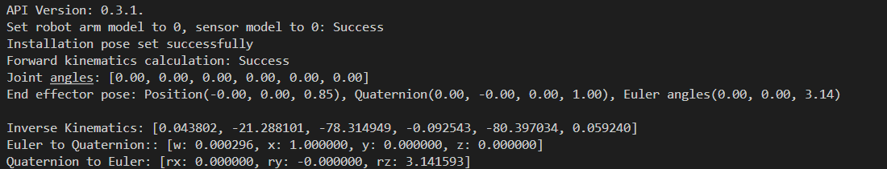

# <p class="hidden">Demo (C, C++): </p>Algorithm Demo

## 1. Project introduction

This project demonstrates the completion of the task independently via algorithms without connecting the robotic arm. It includes the forward and inverse kinematics of all robotic arm models under a specified work tool frame and installation angle, as well as the use of common algorithmic functions such as conversions between Euler angles and quaternions. It is built with CMake and utilizes the C language development package for the robotic arm provided by RealMan.

## 2. Code structure

```bash
RMDemo_AlgoInterface
├── build              # Output directory generated by CMake build (Makefile, build file, etc.)
├── include              # Custom header file storage directory
├── Robotic_Arm          RealMan robotic arm secondary development package
│   ├── include
│   │   ├── rm_define.h     # Header file of the robotic arm secondary development package, containing defined data types and structures
│   │   └── rm_interface.h  # Header file of the robotic arm secondary development package, declaring all operation interfaces of the robotic arm口
│   └── lib
│       ├── api_c.dll    # API library for Windows 64bit
│       ├── api_c.lib    # API library for Windows 64bit
│       └── libapi_c.so  # API library for Linux x86
├── src
│   └── main.c           # Source file of main functions
├── CMakeLists.txt       # Top-level CMake configuration file of the project
├── readme.md            # Project description document
├── run.bat              # Windows quick run script
└── run.sh               # linux quick run script

```

## 3. Project download

Download `RM_API2` locally via the link: [development package download](https://github.com/RealManRobot/RM_API2.git). Then, navigate to the `RM_API2\Demo\RMDemo_C` directory, where you will find RMDemo_AlgoInterface.

## 4. Environment configuration

Required environment and dependencies for running in Windows and Linux environments:

| Item | Linux | Windows |
| :-- | :-- | :-- |
| System architecture | x86 architecture | - |
| Compiler | GCC 7.5 or higher | MSVC2015 or higher 64bit |
| CMake version | 3.10 or higher | 3.10 or higher |
| Specific dependency | RMAPI Linux version library (located in the `Robotic_Arm/lib` directory) | RMAPI Windows version library (located in the `Robotic_Arm/lib`directory) |

### Linux configuration

**1. Compiler (GCC)**
In most Linux distributions, GCC is installed by default, but the version may not be the latest. If a specific version of GCC (such as 7.5 or higher) is required, it can be installed via the package manager. For example, on Ubuntu, you can use the following commands to install or update GCC:

```bash
# Check GCC version
gcc --version

sudo apt update
sudo apt install gcc-7 g++-7  
```

Note: If the GCC version installed by default on the system meets or exceeds the required version, no additional installation is necessary.

**2. CMake**
CMake can also be installed through the package manager in most Linux distributions. For example, on Ubuntu:

```bash
sudo apt update
sudo apt install cmake

# Check CMake version
cmake --version
```

### Windows configuration

- **Compiler (MSVC2015 or higher)**:
  The MSVC (Microsoft Visual C++) compiler is typically installed with Visual Studio. You can install it by following these steps:

   1. Visit the [Visual Studio official website](https://visualstudio.microsoft.com/) to download and install Visual Studio.
   2. During installation, select the "Desktop development with C++" workload, which will include the MSVC compiler.
   3. Select additional components as needed, such as CMake (if not already installed).
   4. After installation, open the Visual Studio command prompt (available in the start menu) and enter the `cl` command to check if the MSVC compiler is installed successfully.

- **CMake**:
  If CMake was not included during the Visual Studio installation, you can download and install CMake separately.

   1. Visit the [CMake official website](https://cmake.org/download/) to download the installer for Windows.
   2. Run the installer and follow the on-screen instructions to complete the installation.
   3. After installation, add the CMake bin directory to the system's PATH environment variable (this is typically asked during installation).
   4. Open the command prompt or PowerShell and enter `cmake --version` to check if CMake has been installed successfully.

## 5. User guide

### **5.1 Quick run**

**1. Running on Linux**
Navigate to the `RMDemo_AlgoInterface` directory in the terminal, and enter the following command to run the C program:

```bash
chmod +x run.sh
./run.sh
```

The running result is as follows:



**2. Running on Windows**
Enter the `RMDemo_AlgoInterface` directory and double-click to run the run.bat file.

The running result is as follows:

```bash
Run...
API Version: 1.0.0.
Set robot arm model to 0, sensor model to 0: Success
Installation pose set successfully
Forward kinematics calculation: Success
Joint angles: [0.00, 0.00, 0.00, 0.00, 0.00, 0.00]
End effector pose: Position(-0.00, 0.00, 0.85), Quaternion(0.00, -0.00, 0.00, 1.00), Euler angles(0.00, 0.00, 3.14)

Inverse Kinematics: [0.043802, -21.288101, -78.314949, -0.092543, -80.397034, 0.059240]
Euler to Quaternion:: [w: 0.000296, x: 1.000000, y: 0.000000, z: 0.000000]
Quaternion to Euler: [rx: 0.000000, ry: -0.000000, rz: 3.141593]
Press any key to continue. . .
```

### **5.2 Description of key codes**

The following are the main functions of the `main.c`:

- **Define parameters of different models of robotic arms**

  Initialization parameter array of different models of robotic arms

  ```c
  ArmModelData arm_data[9] = {
    [RM_MODEL_RM_65_E] = {
        .joint_angles = {0.0f, 0.0f, 0.0f, 0.0f, 0.0f, 0.0f},
        .q_in_joint = {0.0f, 0.0f, 0.0f, 0.0f, 0.0f, 0.0f},
        .pose = { .position = {0.3, 0, 0.3}, .euler = {3.14, 0, 0} }
    },
    [RM_MODEL_RM_75_E] = {
        .joint_angles = {0.0f, 0.0f, 0.0f, 0.0f, 0.0f, 0.0f},  
        .q_in_joint = {0.0f, 0.0f, 0.0f, 0.0f, 0.0f, 0.0f},
        .pose = { .position = {0.3, 0, 0.3}, .euler = {3.14, 0, 3.14} } 
    }, 
    [RM_MODEL_RM_63_II_E] = {  
        .joint_angles = {0.0f, 0.0f, 0.0f, 0.0f, 0.0f, 0.0f},  
        .q_in_joint = {0.0f, 0.0f, 0.0f, 0.0f, 0.0f, 0.0f},
        .pose = { .position = {0.3, 0, 0.3}, .euler = {3.14, 0, 0} }
    },
    [RM_MODEL_ECO_65_E] = {  
        .joint_angles = {0.0f, 0.0f, 0.0f, 0.0f, 0.0f, 0.0f},  
        .q_in_joint = {0.0f, 0.0f, 0.0f, 0.0f, 0.0f, 0.0f}, 
        .pose = { .position = {0.3, 0, 0.3}, .euler = {3.14, 0, 0} } 
    },
    [RM_MODEL_GEN_72_E] = {  
        .joint_angles = {0.0f, 0.0f, 0.0f, 0.0f, 0.0f, 0.0f, 0.0f},  
        .q_in_joint = {0.0f, 0.0f, 0.0f, 0.0f, 0.0f, 0.0f, 0.0f},  
        .pose = { .position = {0.3, 0, 0.3}, .euler = {3.14, 0, 0} } 
    },
    [RM_MODEL_ECO_63_E] = {  
        .joint_angles = {0.0f, 0.0f, 0.0f, 0.0f, 0.0f, 0.0f},  
        .q_in_joint = {0.0f, 0.0f, 0.0f, 0.0f, 0.0f, 0.0f},  
        .pose = { .position = {0.3, 0, 0.3}, .euler = {3.14, 0, 0} }
    }
  };
  ```

- **Initialize the algorithm interface**

  Initialize the robotic arm model RM65-B.

  ```c
  rm_robot_arm_model_e Mode = RM_MODEL_RM_65_E;
  rm_force_type_e Type = RM_MODEL_RM_B_E;
  printf("Set robot arm model to %d, sensor model to %d: Success\n", Mode, Type);
  rm_algo_init_sys_data(Mode, Type);
  ```

- **Manually set the work frame**

  Set the specified work frame for algorithm calculations with the frame pose as `[0, 0, 0, 0, 0, 0]`.
  
  ```C
  rm_frame_t coord_work;
  coord_work.pose.position.x = 0.0f;
  coord_work.pose.position.y = 0.0f;
  coord_work.pose.position.z = 0.0f;
  coord_work.pose.quaternion.w = 0.0f;
  coord_work.pose.quaternion.x = 0.0f;
  coord_work.pose.quaternion.y = 0.0f;
  coord_work.pose.quaternion.z = 0.0f;
  coord_work.pose.euler.rx = 0.0f;
  coord_work.pose.euler.ry = 0.0f;
  coord_work.pose.euler.rz = 0.0f;
  coord_work.payload = 0.0f;
  rm_algo_set_workframe(&coord_work);
  ```
  
- **Inverse kinematics**
  Implement the inverse kinematics from the previous joint angle `inverse_params.q_in` to the target pose `inverse_params.q_pose`, obtaining the inverse kinematics result `result` and target joint angle `q_out` Where the target pose `inverse_params.q_pose` is represented using Euler angles.
  
  ```C
  rm_inverse_kinematics_params_t inverse_params;
  float q_out[ARM_DOF] = {0.0f, 0.0f, 0.0f, 0.0f, 0.0f, 0.0f, 0.0f};
  memcpy(inverse_params.q_in, arm_data[Mode].q_in_joint, sizeof(arm_data[Mode].q_in_joint));
  inverse_params.q_pose = arm_data[Mode].pose;
  inverse_params.flag = 1;
  result = rm_algo_inverse_kinematics(NULL, inverse_params, q_out);
  ```

## 6. License information

- This project is subject to the MIT license.
