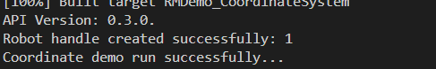

# <p class="hidden">Demo(C, C++): </p>Frame Operation Demo

## 1. Project introduction

This project demonstrates the use of interfaces for creating, deleting, modifying, and querying the robot arm's work frame, enabling the setting of a new work frame for the robotic arm. It is built with CMake and utilizes the C language development package for the robotic arm provided by RealMan.

## **2. Code structure**

```
RMDemo_CoordinateSystem/
├── build/                  # Output directory generated by CMake build
├── include/                # Custom header file storage directory
├── Robotic_Arm/               # RealMan robotic arm secondary development package
│   ├── include/
│   │   ├── rm_define.h        # Header file of the robotic arm secondary development package, containing defined data types and structures
│   │   └── rm_interface.h     # Header file of the robotic arm secondary development package, declaring all operation interfaces of the robotic arm
│   └── lib/
│       ├── api_c.dll          # API library for Windows 64bit
│       ├── api_c.lib          # API library for Windows 64bit
│       └── libapi_c.so        # API library for Linux x86
├── src/                     # Source file storage directory
│   └── main.c               # Source file of main functions
├── run.bat                  # Windows quick run script
├── run.sh                   # linux quick run script
├── CMakeLists.txt           # CMake configuration file of the project
├── README.md                # Project description document
```

## 3. Project download

Download `RM_API2` locally via the link: [development package download](https://github.com/RealManRobot/RM_API2.git). Then, navigate to the `RM_API2\Demo\RMDemo_C` directory, where you will find RMDemo_CoordinateSystem.

## 4. Environment configuration

Required environment and dependencies for running in Windows and Linux environments:

| Item      | Linux                                          | Windows                                          |
| :-------- | :--------------------------------------------- | :----------------------------------------------- |
| System architecture  | x86 architecture                                        | -                                                |
| Compiler    | GCC 7.5 or higher                              | MSVC2015 or higher 64bit                         |
| CMake version | 3.10 or higher                                 | 3.10 or higher                                   |
| Specific dependency  | RMAPI Linux version library (located in the `Robotic_Arm/lib` directory) | RMAPI Windows version library (located in the `Robotic_Arm/lib`directory) |

### Linux configuration

**1. Compiler (GCC)**
In most Linux distributions, GCC is installed by default, but the version may not be the latest. If a specific version of GCC (such as 7.5 or higher) is required, it can be installed via the package manager. For example, on Ubuntu, you can use the following commands to install or update GCC:

```bash
# Check GCC version
gcc --version

sudo apt update
sudo apt install gcc-7 g++-7  
```

Note: If the GCC version installed by default on the system meets or exceeds the required version, no additional installation is necessary.

**2. CMake**
CMake can also be installed through the package manager in most Linux distributions. For example, on Ubuntu:

```bash
sudo apt update
sudo apt install cmake

# Check CMake version
cmake --version
```

### Windows configuration

- **Compiler (MSVC2015 or higher)**:
  The MSVC (Microsoft Visual C++) compiler is typically installed with Visual Studio. You can install it by following these steps:

   1. Visit the [Visual Studio official website](https://visualstudio.microsoft.com/) to download and install Visual Studio.
   2. During installation, select the "Desktop development with C++" workload, which will include the MSVC compiler.
   3. Select additional components as needed, such as CMake (if not already installed).
   4. After installation, open the Visual Studio command prompt (available in the start menu) and enter the `cl` command to check if the MSVC compiler is installed successfully.

- **CMake**:
  If CMake was not included during the Visual Studio installation, you can download and install CMake separately.

   1. Visit the [CMake official website](https://cmake.org/download/) to download the installer for Windows.
   2. Run the installer and follow the on-screen instructions to complete the installation.
   3. After installation, add the CMake bin directory to the system's PATH environment variable (this is typically asked during installation).
   4. Open the command prompt or PowerShell and enter `cmake --version` to check if CMake has been installed successfully.

## **5. User guide**

Successfully set the new work frame for the RM65-B robotic arm. The process includes connecting the robotic arm, setting its work frame, updating and saving the configuration, and finally querying to confirm the settings.

### **5.1 Quick run**

Follow these steps to quickly run the code:

1. **Configuration of the IP address of the robotic arm**:
   Open the `main.c` file and modify the parameters of the `robot_ip_address` in the `main` function to the current IP address of the robotic arm. The default IP address is `"192.168.1.18"`.

   ```C
   const char *robot_ip_address = "192.168.1.18";
   int robot_port = 8080;
   rm_robot_handle *robot_handle = rm_create_robot_arm(robot_ip_address, robot_port);
   ```

2. **Running via linux command line**:
   Navigate to the `RMDemo_CoordinateSystem` directory in the terminal, and enter the following command to run the C program:

   ```bash
   chmod +x run.sh
   ./run.sh
   ```

   The running result is as follows:


3. **Running on Windows**: double-click the run.bat script to run
   The running result is as follows:

```bash
Run...
API Version: 1.0.0.
Robot handle created successfully: 1
Coordinate demo run successfully...
```

### **5.2 Description of key codes**

The following are the main functions of the `main.c`:

- **Connect the robotic arm**
  Connect the robotic arm to the specified IP address and port.

  ```C
  rm_robot_handle *robot_handle = rm_create_robot_arm(robot_ip_address, robot_port);
  ```

- **Get the API version**
  Get and display the API version.

    ```C
    char *api_version = rm_api_version();
    printf("API Version: %s.\n", api_version);
    ```

- **Manually set the work frame**
  Manually set the work frame named `"WorkTest"` with a pose of `[0, 0, 0, 0, 0, 0]`.

    ```C
    const char *workFrameName = "WorkTest";
    rm_pose_t initial_pose = {.position = {0, 0, 0}, .euler = {0, 0, 0}};
    rm_set_manual_work_frame(handle, workFrameName, initial_pose);
    ```

- **Update the work frame**
  Update the work frame named `"WorkTest"` with a pose of `[0.3, 0, 0.3, 3.142, 0, 0]`.

    ```C
    rm_pose_t updated_pose = {.position = {0.3, 0, 0.3}, .euler = {3.142, 0, 0}};
    rm_update_work_frame(handle, workFrameName, updated_pose);
    ```

- **Query the specified work frame**
  Query the work frame named `"WorkTest"` and display the result.

    ```C
    rm_get_given_work_frame(handle, workFrameName);
    ```

## **6. License information**

- This project is subject to the MIT license.
