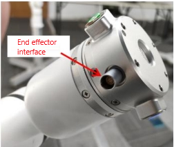
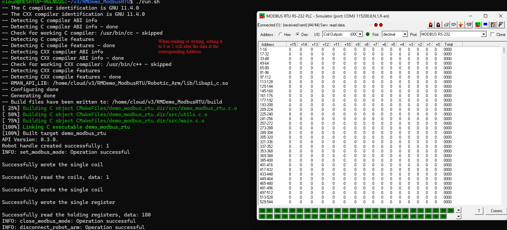

#  <p class="hidden">Demo (C, C++): </p>Usage Demo of ModbusRTU

## **1. Project introduction**

This project demonstrates how to configure the ModbusRTU mode of RS485 communication port and perform read/write operations with connected peripheral devices via the interface. The operation flow is as follows:

It configures the ModbusRTU mode of the communication port, writes single coil data, reads single coil data, writes a single register, reads holding registers, and closes the communication port in ModbusRTU mode.

It is built with CMake and utilizes the C language development package for the robotic arm provided by RealMan.

## **2. Code structure**

```
RMDemo_ModbusRTU
├── build              # Output directory generated by CMake build (Makefile, build file, etc.)
├── include              # Custom header file storage directory
├── Robotic_Arm          # RealMan robotic arm secondary development package
│   ├── include
│   │   ├── rm_define.h  # Header file of the robotic arm secondary development package, containing defined data types and structures
│   │   └── rm_interface.h # Header file of the robotic arm secondary development package, declaring all operation interfaces of the robotic arm口
│   └── lib
│       ├── api_c.dll    # API library for Windows 64bit
│       ├── api_c.lib    # API library for Windows 64bit
│       └── libapi_c.so  # API library for Linux x86
├── src
│   └── main.c           # Main function
├── CMakeLists.txt       # Top-level CMake configuration file of the project
├── readme.md            # Project description document
├── run.bat              # Windows quick run script
└── run.sh               # linux quick run script
```

## **3. Project download**

Download `RM_API2` locally via the link: [development package download](https://github.com/RealManRobot/RM_API2.git). Then, navigate to the `RM_API2\Demo\RMDemo_C` directory, where you will find RMDemo_ModbusRTU.

## **4. Environment configuration**

Required environment and dependencies for running in Windows and Linux environments:

| Item      | Linux                                          | Windows                                          |
| :-------- | :--------------------------------------------- | :----------------------------------------------- |
| System architecture  | x86 architecture                                        | -                                                |
| Compiler    | GCC 7.5 or higher                              | MSVC2015 or higher 64bit                         |
| CMake version | 3.10 or higher                                 | 3.10 or higher                                   |
| Specific dependency  | RMAPI Linux version library (located in the `Robotic_Arm/lib` directory) | RMAPI Windows version library (located in the `Robotic_Arm/lib`directory) |

### Linux configuration

**1. Compiler (GCC)**
In most Linux distributions, GCC is installed by default, but the version may not be the latest. If a specific version of GCC (such as 7.5 or higher) is required, it can be installed via the package manager. For example, on Ubuntu, you can use the following commands to install or update GCC:

```bash
# Check GCC version
gcc --version

sudo apt update
sudo apt install gcc-7 g++-7  
```

Note: If the GCC version installed by default on the system meets or exceeds the required version, no additional installation is necessary.

**2. CMake**
CMake can also be installed through the package manager in most Linux distributions. For example, on Ubuntu:

```bash
sudo apt update
sudo apt install cmake

# Check CMake version
cmake --version
```

### Windows configuration

- **Compiler (MSVC2015 or higher)**:
  The MSVC (Microsoft Visual C++) compiler is typically installed with Visual Studio. You can install it by following these steps:

   1. Visit the [Visual Studio official website](https://visualstudio.microsoft.com/) to download and install Visual Studio.
   2. During installation, select the "Desktop development with C++" workload, which will include the MSVC compiler.
   3. Select additional components as needed, such as CMake (if not already installed).
   4. After installation, open the Visual Studio command prompt (available in the start menu) and enter the `cl` command to check if the MSVC compiler is installed successfully.

- **CMake**:
  If CMake was not included during the Visual Studio installation, you can download and install CMake separately.

   1. Visit the [CMake official website](https://cmake.org/download/) to download the installer for Windows.
   2. Run the installer and follow the on-screen instructions to complete the installation.
   3. After installation, add the CMake bin directory to the system's PATH environment variable (this is typically asked during installation).
   4. Open the command prompt or PowerShell and enter `cmake --version` to check if CMake has been installed successfully.

## **5. User guide**

### **5.1 Quick run**

Follow these steps to quickly run the code:

1. **Configuration of the IP address of the robotic arm**:
   Open the `main.c` file and modify the parameters of the `robot_ip_address` in the `main` function to the current IP address of the robotic arm. The default IP address is `"192.168.1.18"`.

   ```C
   const char *robot_ip_address = "192.168.1.18";

   int robot_port = 8080;
   rm_robot_handle *robot_handle = rm_create_robot_arm(robot_ip_address, robot_port);
   ```

2. **Running via linux command line**:
   Navigate to the `RMDemo_ModbusRTU` directory in the terminal, and enter the following command to run the C program:

   ```bash
   chmod +x run.sh
   ./run.sh
   ```

   The running result is as follows:

   Refer to the running results on Windows.

3. **Running on Windows**: double-click the run.bat script to run
   The running result is as follows:

```bash
Run...
API Version: 1.0.0.
 send is: {"command":"get_arm_software_info"}


 thread_socket_receive len 315 robot_handle: 1 message:{"Product_version":"RM65-BI","algorithm_info":{"version":"1.4.4"},"command":"arm_software_info","ctrl_info":{"build_time":"2024/08/28 18:36:18","commit_id":"0315333","version":"V1.6.1"},"dynamic_info":{"model_version":"2"},"plan_info":{"build_time":"2024/08/28 18:36:33","commit_id":"166c4a8","version":"V1.6.1"}}

 [rm_get_arm_software_info] Product version: RM65-BI

 [rm_get_arm_software_info] Algorithm version: 1.4.4

 [rm_get_arm_software_info] Ctrl version: V1.6.1

 [rm_get_arm_software_info] Ctrl build Time: 2024/08/28 18:36:18

 [rm_get_arm_software_info] Dynamic model version: 2

 [rm_get_arm_software_info] Plan version: V1.6.1

 [rm_get_arm_software_info] Plan build Time: 2024/08/28 18:36:18

 send is: {"command":"get_realtime_push"}


 thread_socket_receive len 195 robot_handle: 1 message:{"command":"get_realtime_push","custom":{"expand_state":false,"joint_acc":false,"joint_speed":false,"lift_state":false,"tail_end":false},"cycle":5,"enable":true,"ip":"192.168.1.88","port":8089}

 [rm_get_realtime_push] cycle parse result: 5

 [rm_get_realtime_push] port parse result: 8089

 [rm_get_realtime_push] ip parse result: 192.168.1.88

 [rm_get_realtime_push] enable parse result: 1

 send is: {"command":"get_current_work_frame"}


 thread_socket_receive len 74 robot_handle: 1 message:{"frame_name":"World","pose":[0,0,0,0,0,0],"state":"current_work_frame"}

 [get_current_work_frame] Work frame Name: World

 [get_current_work_frame] Work frame pose: (0.000, 0.000, 0.000, 0.000, 0.000, 0.000)

 send is: {"command":"get_current_tool_frame"}


 thread_socket_receive len 106 robot_handle: 1 message:{"payload":0,"pose":[0,0,0,0,0,0],"position":[0,0,0],"state":"current_tool_frame","tool_name":"Arm_Tip"}

 [get_current_tool_frame] Tool frame Name: Arm_Tip

 [get_current_tool_frame] Tool frame pose: (0.000, 0.000, 0.000, 0.000, 0.000, 0.000)

 [get_current_tool_frame] Tool frame payloda: 0.000

 [get_current_tool_frame] Tool frame position: (0.000, 0.000, 0.000)

 send is: {"command":"get_install_pose"}


 thread_socket_receive len 41 robot_handle: 1 message:{"pose":[0,0,0],"state":"install_pose"}

 [rm_get_install_pose] pose parse result:

  0

  0

  0

 send is: {"command":"get_joint_min_pos"}


 thread_socket_receive len 87 robot_handle: 1 message:{"min_pos":[-178000,-130000,-135000,-178000,-128000,-360000],"state":"joint_min_pos"}

 [rm_get_joint_min_pos] min_pos parse result:

  -178000

  -130000

  -135000

  -178000

  -128000

  -360000

 send is: {"command":"get_joint_max_pos"}


 thread_socket_receive len 81 robot_handle: 1 message:{"max_pos":[178000,130000,135000,178000,128000,360000],"state":"joint_max_pos"}

 [rm_get_joint_max_pos] max_pos parse result:

  178000

  130000

  135000

  178000

  128000

  360000

 send is: {"command":"get_joint_max_acc"}


 thread_socket_receive len 83 robot_handle: 1 message:{"joint_acc":[100000,100000,100000,100000,100000,100000],"state":"joint_max_acc"}

 [rm_get_joint_max_acc] joint_acc parse result:

  100000

  100000

  100000

  100000

  100000

  100000

 send is: {"command":"get_joint_max_speed"}


 thread_socket_receive len 81 robot_handle: 1 message:{"joint_speed":[30000,30000,37500,37500,37500,37500],"state":"joint_max_speed"}

 [rm_get_joint_max_speed] joint_speed parse result:

  30000

  30000

  37500

  37500

  37500

  37500

Robot handle created successfully: 1
 send is: {"command":"set_modbus_mode","port":0,"baudrate":115200,"timeout":10}


 thread_socket_receive len 48 robot_handle: 1 message:{"command":"set_modbus_mode","set_state":true}

 [rm_set_modbus_mode] set_state: true

 send is: {"command":"write_single_coil","port":0,"address":0,"data":0,"device":2}


 thread_socket_receive len 52 robot_handle: 1 message:{"command":"write_single_coil","write_state":true}

 [rm_write_single_coil] write_state: true

 send is: {"command":"read_coils","port":0,"address":0,"num":1,"device":2}


 thread_socket_receive len 35 robot_handle: 1 message:{"command":"read_coils","data":0}

 [rm_read_coils] data parse result: 0

 send is: {"command":"write_single_coil","port":0,"address":0,"data":1,"device":2}


 thread_socket_receive len 52 robot_handle: 1 message:{"command":"write_single_coil","write_state":true}

 [rm_write_single_coil] write_state: true

 send is: {"command":"write_single_register","port":0,"address":0,"data":180,"device":2}


 thread_socket_receive len 56 robot_handle: 1 message:{"command":"write_single_register","write_state":true}

 [rm_write_single_register] write_state: true

 send is: {"command":"read_holding_registers","port":0,"address":0,"device":2}


 thread_socket_receive len 49 robot_handle: 1 message:{"command":"read_holding_registers","data":180}

 [rm_read_holding_registers] data parse result: 180

 send is: {"command":"close_modbus_mode","port":0}


 thread_socket_receive len 50 robot_handle: 1 message:{"command":"close_modbus_mode","set_state":true}

 [rm_close_modbus_mode] set_state: true

Press any key to continue...
```

### **5.2 Description of key codes**

The following are the main functions of the `main.c`:

- **Connect the robotic arm**

    ```C
    rm_robot_handle *robot_handle = rm_create_robot_arm(robot_ip_address, robot_port);
    ```

  Connect the robotic arm to the specified IP address and port.

- **Get the API version**

    ```C
    char *api_version = rm_api_version();
    printf("API Version: %s.\n", api_version);
    ```

  Get and display the API version.

- **Configure ModbusRTU mode.**

    ```C
    rm_set_modbus_mode(robot_handle, 0, 115200, 10);
    ```

- **Write single coil data**

    ```C
    rm_peripheral_read_write_params_t write_params = {0, 0, 2, 1};
    result = rm_write_single_coil(robot_handle, write_params, 1);
    ```

- **Read single coil data**

    ```C
    rm_peripheral_read_write_params_t read_params = {0, 0, 2, 1};
    int coil_data;
    result = rm_read_coils(robot_handle, read_params, &coil_data);
    ```

- **Write a single register**

    ```C
    rm_peripheral_read_write_params_t write_single_register_params = { 0, 0, 2, 1};
    result = rm_write_single_register(robot_handle, write_single_register_params, 180);
    if (check_result(result, "Failed to write single register") != 0) {
        return -1;
    }
    ```

- **Read holding registers**

    ```C
    rm_peripheral_read_write_params_t holding_registers_params = {0, 0, 2, 1};
    int holding_register_data;
    result = rm_read_holding_registers(robot_handle, holding_registers_params, &holding_register_data);
    ```

- **Close ModbusRTU mode**

    ```C
    rm_close_modbus_mode(robot_handle, 0);
    ```

- **Disconnect from the robotic arm**

    ```C
     rm_delete_robot_arm(robot_handle);
    ```

## **6. License information**

- This project is subject to the MIT license.

## Controller and End Interface Diagram

### Controller IO Interface Diagram

The voltage of digital I/O is determined based on the reference voltage connected, and the 16-core extension interface cable of robotic arm provides only 12 V and 24 V power supply voltages. If other output voltages are required for the digital I/O, then reference voltages need to be led in from the pins OUT_P_OUT+, OUT_P_IN+, and OUT_P_GND. For detailed interface definitions, please refer to [16-Pin Aviation Connector Cable](../../../quickUseManual/interfaceDescriptionArm/index.md#33111).

### End Effector IO Interface Diagram

The multiplexing functions in the table above are switched by program commands. Pin 3 and pin 4 are digital input channels (DI1 and DI2) by default before delivery, and the power output of pin 6 is 0 V (programmed). For detailed interface definitions, please refer to [6-Pin Aviation Connector Cable](../../../quickUseManual/interfaceDescriptionArm/index.md#33112).

### End IO Interface Diagram



### Simulated ModRTU Diagram


