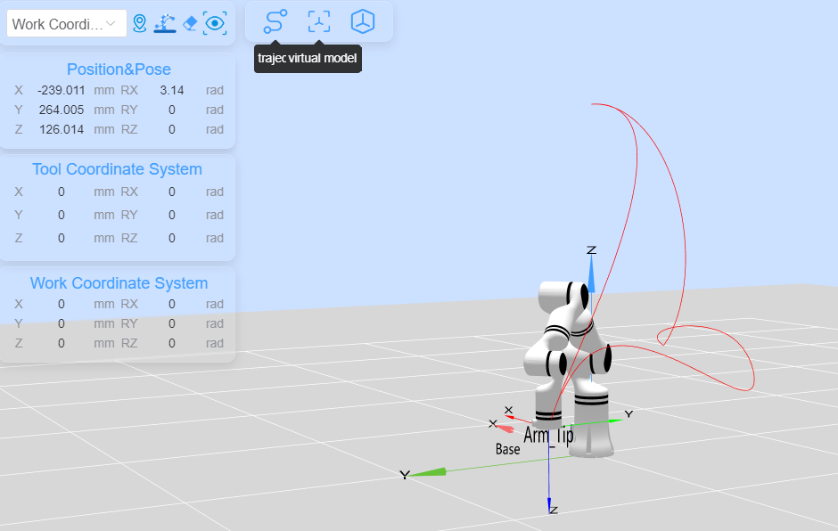
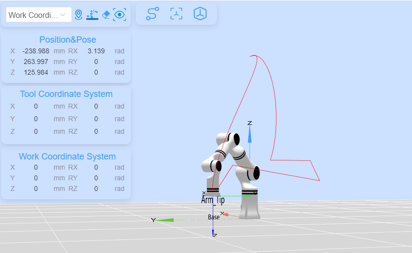

# <p class="hidden">Demo(C, C++): </p>Spline Curve Motion Demo

## **1. Project introduction**

This project demonstrates the use of spline curve motion. It is built with CMake and utilizes the C language development package for the robotic arm provided by RealMan.

## **2. Code structure**

```bash
RMDemo_Moves
├── build              # Output directory generated by CMake build (Makefile, build file, etc.)
├── include              # Custom header file storage directory
├── Robotic_Arm          # RealMan robotic arm secondary development package
│   ├── include
│   │   ├── rm_define.h  # Header file of the robotic arm secondary development package, containing defined data types and structures
│   │   └── rm_interface.h # Header file of the robotic arm secondary development package, declaring all operation interfaces of the robotic arm口
│   └── lib
│       ├── api_c.dll    # API library for Windows 64bit
│       ├── api_c.lib    # API library for Windows 64bit
│       └── libapi_c.so  # API library for Linux x86
├── src
│   └── main.c           # Main function
├── CMakeLists.txt       # Top-level CMake configuration file of the project
├── readme.md            # Project description document
├── run.bat              # Windows quick run script
└── run.sh               # linux quick run script

```

## **3. Project download**

Download `RM_API2` locally via the link: [development package download](https://github.com/RealManRobot/RM_API2.git). Then, navigate to the `RM_API2\Demo\RMDemo_C` directory, where you will find RMDemo_Moves.

## **4. Environment configuration**

Required environment and dependencies for running in Windows and Linux environments:

| Item      | Linux                                          | Windows                                          |
| :-------- | :--------------------------------------------- | :----------------------------------------------- |
| System architecture  | x86 architecture                                        | -                                                |
| Compiler    | GCC 7.5 or higher                              | MSVC2015 or higher 64bit                         |
| CMake version | 3.10 or higher                                 | 3.10 or higher                                   |
| Specific dependency  | RMAPI Linux version library (located in the `Robotic_Arm/lib` directory) | RMAPI Windows version library (located in the `Robotic_Arm/lib`directory) |

### Linux configuration

**1. Compiler (GCC)**
In most Linux distributions, GCC is installed by default, but the version may not be the latest. If a specific version of GCC (such as 7.5 or higher) is required, it can be installed via the package manager. For example, on Ubuntu, you can use the following commands to install or update GCC:

```bash
# Check GCC version
gcc --version

sudo apt update
sudo apt install gcc-7 g++-7  
```

Note: If the GCC version installed by default on the system meets or exceeds the required version, no additional installation is necessary.

**2. CMake**
CMake can also be installed through the package manager in most Linux distributions. For example, on Ubuntu:

```bash
sudo apt update
sudo apt install cmake

# Check CMake version
cmake --version
```

### Windows configuration

- **Compiler (MSVC2015 or higher)**:
  The MSVC (Microsoft Visual C++) compiler is typically installed with Visual Studio. You can install it by following these steps:

   1. Visit the [Visual Studio official website](https://visualstudio.microsoft.com/) to download and install Visual Studio.
   2. During installation, select the "Desktop development with C++" workload, which will include the MSVC compiler.
   3. Select additional components as needed, such as CMake (if not already installed).
   4. After installation, open the Visual Studio command prompt (available in the start menu) and enter the `cl` command to check if the MSVC compiler is installed successfully.

- **CMake**:
  If CMake was not included during the Visual Studio installation, you can download and install CMake separately.

   1. Visit the [CMake official website](https://cmake.org/download/) to download the installer for Windows.
   2. Run the installer and follow the on-screen instructions to complete the installation.
   3. After installation, add the CMake bin directory to the system's PATH environment variable (this is typically asked during installation).
   4. Open the command prompt or PowerShell and enter `cmake --version` to check if CMake has been installed successfully.

## **5. User guide**

### **5.1 Quick run**

Follow these steps to quickly run the code:

1. **Configuration of the IP address of the robotic arm**:
   Open the `main.c` file and modify the parameters of the `robot_ip_address` in the `main` function to the current IP address of the robotic arm. The default IP address is `"192.168.1.18"`.

   ```C
   const char *robot_ip_address = "192.168.1.18";

   int robot_port = 8080;
   rm_robot_handle *robot_handle = rm_create_robot_arm(robot_ip_address, robot_port);
   ```

2. **Running via linux command line**:
   Navigate to the `RMDemo_Moves` directory in the terminal, and enter the following command to run the C program:

   ```bash
   chmod +x run.sh
   ./run.sh
   ```

   The running result is as follows:

    ```bash
    API Version: 1.0.0.
    Robot handle created successfully: 1
    Trajectory Connect Value at Step 0: 1
    Trajectory Connect Value at Step 1: 1
    Trajectory Connect Value at Step 2: 1
    Trajectory Connect Value at Step 3: 1
    Trajectory Connect Value at Step 4: 0
    moves operation succeeded
    ```

3. **Running on Windows**: double-click the run.bat script to run
   The running result is as follows:

    ```bash
    Run...
    API Version: 1.0.0.
    Robot handle created successfully: 1
    Trajectory Connect Value at Step 0: 1
    Trajectory Connect Value at Step 1: 1
    Trajectory Connect Value at Step 2: 1
    Trajectory Connect Value at Step 3: 1
    Trajectory Connect Value at Step 4: 0
    moves operation succeeded
    Press any key to continue. . .
    ```

### **5.2 Description of key codes**

The following are the main functions of the `main.c`:

- **Define the initialization parameter array of different models of robotic arms**

    ```C
    ArmModelData arm_data[9] = {
        [RM_MODEL_RM_65_E] = {
            .joint_angles = {0, 0, 0, 0, 0, 0}, 
            .pose = { .position = {-0.3, 0, 0.3}, .euler = {3.14, 0, 0}},
            .point_list = { {.position = {-0.3, 0, 0.3}, .euler = {3.14, 0, 0}},
                            {.position = {-0.27, -0.22,0.3}, .euler = {3.14, 0, 0}},
                            {.position = {-0.314, -0.25, 0.2}, .euler = {3.14, 0, 0}},
                            {.position = {-0.239, 0.166, 0.276}, .euler = {3.14, 0, 0}},
                            {.position = {-0.239, 0.264, 0.126}, .euler = {3.14, 0, 0}},}
        },
        [RM_MODEL_RM_75_E] = {
            .joint_angles = {0, 20, 0, 70, 0, 90, 0},  
            .pose = { .position = {0.297557, 0, 0.337061}, .euler = {3.142, 0, 3.142} } ,
            .point_list = { {.position = {0.3, 0.1, 0.337061}, .euler = {3.142, 0, 3.142}},
                            {.position = {0.2, 0.3, 0.237061}, .euler = {3.142, 0, 3.142}},
                            {.position = {0.2, 0.25, 0.037061}, .euler = {3.142, 0, 3.142}},
                            {.position = {0.1, 0.3, 0.137061}, .euler = {3.142, 0, 3.142}},
                            {.position = {0.2, 0.25, 0.337061}, .euler = {3.142, 0, 3.142}}, }
        }, 
        [RM_MODEL_RM_63_II_E] = {  
            .joint_angles = {0, 20, 70, 0, 90, 0},
            .pose = { .position = {0.448968, 0, 0.345083}, .euler = {3.14, 0, 3.142} },
            .point_list = { {.position = {0.3, 0.3, 0.345083}, .euler = {3.142, 0, 3.142}},
                            {.position = {0.3, 0.4, 0.145083}, .euler = {3.142, 0, 3.142}},
                            {.position = {0.3, 0.2, 0.045083}, .euler = {3.142, 0, 3.142}},
                            {.position = {0.4, 0.1, 0.145083}, .euler = {3.142, 0, 3.142}},
                            {.position = {0.5, 0, 0.345083}, .euler = {3.142, 0, 3.142}}, }
        },
        [RM_MODEL_ECO_65_E] = {  
            .joint_angles = {0, 20, 70, 0, -90, 0},
            .pose = { .position = {0.352925, -0.058880, 0.327320}, .euler = {3.141, 0, -1.57} } ,
            .point_list = { {.position = {0.3, 0.3, 0.327320}, .euler = {3.141, 0, -1.57}},
                            {.position = {0.2, 0.4, 0.127320}, .euler = {3.141, 0, -1.57}},
                            {.position = {0.2, 0.2, 0.027320}, .euler = {3.141, 0, -1.57}},
                            {.position = {0.3, 0.1, 0.227320}, .euler = {3.141, 0, -1.57}},
                            {.position = {0.4, 0, 0.327320}, .euler = {3.141, 0, -1.57}}, }
        },
        [RM_MODEL_GEN_72_E] = {  
            .joint_angles = {0, 0, 0, -90, 0, 0, 0},
            .pose = { .position = {0.359500, 0, 0.426500}, .euler = {3.142, 0, 0} } ,
            .point_list = { {.position = {0.359500, 0, 0.426500}, .euler = {3.142, 0, 0}},
                            {.position = {0.2, 0.3, 0.426500}, .euler = {3.142, 0, 0}},
                            {.position = {0.2, 0.3, 0.3}, .euler = {3.142, 0, 0}},
                            {.position = {0.3, 0.3, 0.3}, .euler = {3.142, 0, 0}},
                            {.position = {0.3, -0.1, 0.4}, .euler = {3.142, 0, 0}} }
        },
        [RM_MODEL_ECO_63_E] = {  
            .joint_angles = {0, 20, 70, 0, -90, 0},
            .pose = { .position = {0.544228, -0.058900, 0.468274}, .euler = {3.142, 0, -1.571} },
            .point_list = { {.position = {0.3, 0.3, 0.468274}, .euler = {3.142, 0, -1.571}},
                            {.position = {0.3, 0.4, 0.168274}, .euler = {3.142, 0, -1.571}},
                            {.position = {0.3, 0.2, 0.268274}, .euler = {3.142, 0, -1.571}},
                            {.position = {0.4, 0.1, 0.368274}, .euler = {3.142, 0, -1.571}},
                            {.position = {0.5, 0, 0.468274}, .euler = {3.142, 0, -1.571}} }
        }
    };
    ```

- **Connect the robotic arm**

    ```C
    rm_robot_handle *robot_handle = rm_create_robot_arm(robot_ip_address, robot_port);
    ```

  Connect the robotic arm to the specified IP address and port.

- **Get the API version**

    ```C
    char *api_version = rm_api_version();
    printf("API Version: %s.\n", api_version);
    ```

  Get and display the API version.

- **Execute the movej motion**

    ```C
    rm_movej(robot_handle, arm_data[arm_info.arm_model].joint_angles, 20, 0, 0, 1);
    ```

- **Execute the movej_p motion**

    ```C
    rm_movej_p(robot_handle, arm_data[arm_info.arm_model].pose, 20, 0, 0, 1);
    ```

- **Execute the moves motion**

    ```C
    execute_moves(robot_handle, arm_data[arm_info.arm_model].point_list, POINT_NUM, 20, 1);
    ```
  
- Execute moves motion to perform spline curve motion along a multi-point trajectory. The trajectory is shown in the image below


- When trajectory_connect is 0, it is shown as follows:


- **Disconnect from the robotic arm**

    ```C
    disconnect_robot_arm(robot_handle);
    ```

## **6. License information**

- This project is subject to the MIT license.
