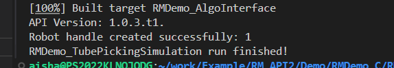
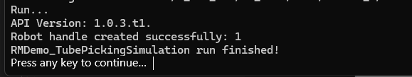
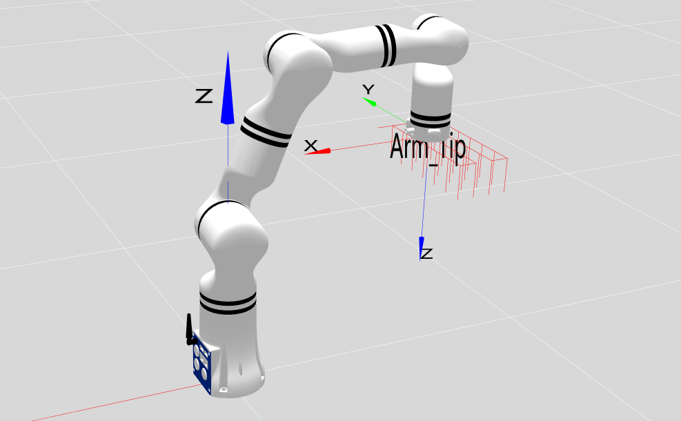

#  <p class="hidden">Demo (C, C++):</p>Test Tube Gripping Automation Simulation Demo

## 1. Project introduction

This project simulates a scenario where the RealMan robotic arm transfers test tubes on a test tube rack. The demo uses two methods to position the robotic arm for handling the test tubes: one involves moving step-by-step to each test tube's location, while the other calculates the starting point and directly moves to the target test tube's position. It is built with CMake and utilizes the C language development package for the robotic arm provided by RealMan.

## 2. Code structure

```
RMDemo_TubePickingSimulation
├── build              # Output directory generated by CMake build (Makefile, build file, etc.)
├── include              # Custom header file storage directory
├── Robotic_Arm          RealMan robotic arm secondary development package
│   ├── include
│   │   ├── rm_define.h     # Header file of the robotic arm secondary development package, containing defined data types and structures
│   │   └── rm_interface.h  # Header file of the robotic arm secondary development package, declaring all operation interfaces of the robotic arm
│   └── lib
│       ├── api_c.dll    # API library for Windows 64bit
│       ├── api_c.lib    # API library for Windows 64bit
│       └── libapi_c.so  # API library for Linux x86
├── src
│   └── main.c           # Source file of main functions
├── CMakeLists.txt       # Top-level CMake configuration file of the project
├── readme.md            # Project description document
├── run.bat              # Windows quick run script
└── run.sh               # linux quick run script

```

## 3. Project download

Download `RM_API2` locally via the link: [development package download](https://github.com/RealManRobot/RM_API2.git). Then, navigate to the `RM_API2\Demo\RMDemo_C` directory, where you will find RMDemo_TubePickingSimulation.

## 4. Environment configuration

Required environment and dependencies for running in Windows and Linux environments:

| Item | Linux | Windows |
| :-- | :-- | :-- |
| System architecture | x86 architecture | - |
| Compiler | GCC 7.5 or higher | MSVC2015 or higher 64bit |
| CMake version | 3.10 or higher | 3.10 or higher |
| Specific dependency | RMAPI Linux version library (located in the `Robotic_Arm/lib` directory) | RMAPI Windows version library (located in the `Robotic_Arm/lib`directory) |

### Linux configuration

**1. Compiler (GCC)**
In most Linux distributions, GCC is installed by default, but the version may not be the latest. If a specific version of GCC (such as 7.5 or higher) is required, it can be installed via the package manager. For example, on Ubuntu, you can use the following commands to install or update GCC:

```bash
# Check GCC version
gcc --version

sudo apt update
sudo apt install gcc-7 g++-7  
```

Note: If the GCC version installed by default on the system meets or exceeds the required version, no additional installation is necessary.

**2. CMake**
CMake can also be installed through the package manager in most Linux distributions. For example, on Ubuntu:

```bash
sudo apt update
sudo apt install cmake

# Check CMake version
cmake --version
```

### Windows configuration

- **Compiler (MSVC2015 or higher)**:
  The MSVC (Microsoft Visual C++) compiler is typically installed with Visual Studio. You can install it by following these steps:

   1. Visit the [Visual Studio official website](https://visualstudio.microsoft.com/) to download and install Visual Studio.
   2. During installation, select the "Desktop development with C++" workload, which will include the MSVC compiler.
   3. Select additional components as needed, such as CMake (if not already installed).
   4. After installation, open the Visual Studio command prompt (available in the start menu) and enter the `cl` command to check if the MSVC compiler is installed successfully.

- **CMake**:
  If CMake was not included during the Visual Studio installation, you can download and install CMake separately.

   1. Visit the [CMake official website](https://cmake.org/download/) to download the installer for Windows.
   2. Run the installer and follow the on-screen instructions to complete the installation.
   3. After installation, add the CMake bin directory to the system's PATH environment variable (this is typically asked during installation).
   4. Open the command prompt or PowerShell and enter `cmake --version` to check if CMake has been installed successfully.

## 5. User guide

### **5.1. Quick run**

**1. Running on Linux**
Navigate to the `RMDemo_TubePickingSimulation` directory in the terminal, and enter the following command to run the C program:

```bash
chmod +x run.sh
./run.sh
```

The running result is as follows:



**2. Running on Windows**
Enter the `RMDemo_TubePickingSimulation` and double-click to run the run.bat file.

The running result is as follows:



The trajectory of the end effector is shown in the image below:



### **5.2. Description of key codes**

The following are the main functions of the `main.c`:

- **Connect the robotic arm**

  Connect the robotic arm to the specified IP address and port.

  ```C
  rm_robot_handle *robot_handle = rm_create_robot_arm(robot_ip_address, robot_port);
  ```

- **Set the tool-end power output**
  Set the tool-end power output to 24 V

  ```C
  rm_set_tool_voltage(robot_handle, 3);
  ```

- **Move to the grasping start position**
  Call the movej_p function to control the robotic arm to move to the initial position

  ```C
    rm_pose_t pose;
    pose.position.x = -0.35f;
    pose.position.y = 0.0f;
    pose.position.z = 0.3f;
    pose.euler.rx = 3.14f;
    pose.euler.ry = 0.0f;
    pose.euler.rz = 0.0f;
    pose.quaternion = (rm_quat_t){0.0f, 0.0f, 0.0f, 0.0f};
    result = rm_movej_p(robot_handle, pose, 20, 0, 0, 1);
  ```

- **Move step-by-step to the test tube rack hole position**
  Use the position stepping function to step to each hole position of the test tube rack based on the length and width between the holes. Call the gripper's opening/closing interface to simulate transferring the test tube (only simulating the movement of the end effector to each hole position for grasping and placing the test tube, without the actual movement of the test tube itself).

  ```C
    result = rm_set_pos_step(robot_handle, RM_X_DIR_E, x_step, 20, 1);
    result = rm_set_gripper_pick_on(robot_handle, 500, 200, 0, 0);
    result = rm_set_gripper_release(robot_handle, 500, 0, 0);
  ```

- **Move in a straight line to the test tube rack hole position**
  Get the current position, calculate the target hole position, and call the movel command to move the robotic arm to the target position. Call the gripper's opening/closing interface to simulate transferring the test tube (only simulating the movement of the end effector to each hole position for grasping and placing the test tube, without the actual movement of the test tube itself).

  ```C
  rm_current_arm_state_t cur_state;
  result = rm_get_current_arm_state(robot_handle, &cur_state);
  cur_state.pose.position.x += 2*x_step;
  cur_state.pose.position.y += 2*y_step;
  result = rm_movel(robot_handle, cur_state.pose, 20, 0, 0, 1);
  ```

- **Disconnect from the robotic arm**

  ```C
  rm_delete_robot_arm(robot_handle);
  ```

## 6. License information

- This project is subject to the MIT license.
