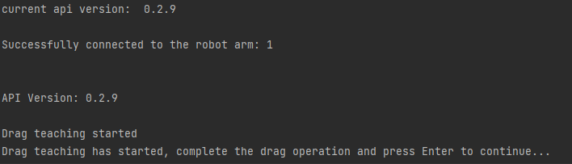

# <p class="hidden">Demo (python): </p>Usage Demo of Robotic Arm IO Function

## 1. Project introduction

This project, via the RealMan Python development package, implements drag teaching. It saves the trajectory to a folder, concatenates it into an online programming file, and then saves it to the online programming list. It is set as the programming file that the IO runs by default. The online programming can be run, paused, resumed, or emergency stopped through the IO multiplexing mode.

## 2. Code structure

```
RMDemo_IOControl/
│
├── README.md        <- Core project document
├── requirements.txt    <- List of project dependencies
├── setup.py        <- Project installation script
│
├── src/          <- Project source code
│  ├── main.py       <- Main procedure entry
│  └── core/        <- Core function or business logic code
│    └── demo_io_control.py     <- Demo that implements drag teaching. It saves the trajectory to a folder, concatenates it into an online programming file, and then saves it to the online programming list. It is set as the programming file that the IO runs by default. The online programming can be run, paused, resumed, or emergency stopped through the IO multiplexing mode.
└── Robotic_Arm/      <- RealMan robotic arm secondary development package
```

## 3. Project download

Download `RM_API2` locally via the link: [development package download](https://github.com/RealManRobot/RM_API2.git). Then, navigate to the `RM_API2\Demo\RMDemo_Python` directory, where you will find RMDemo_IOControl.

## 4. Environment configuration

Required environment and dependencies for running in Windows and Linux environments:

| Item         | Linux     | Windows   |
| :--          | :--       | :--       |
| System architecture     | x86 architecture   | -         |
| python       | 3.9 or higher   | 3.9 or higher   |
| Specific dependency     | -         | -         |

### Linux configuration

   1. Refer to the [python official website - linux](https://www.python.org/downloads/source/) to download and install python3.9.

   2. After entering the project directory, open the terminal and run the following command to install dependencies:

```bash
pip install -r requirements.txt
```

### Windows configuration

   1. Refer to the [python official website - Windows](https://www.python.org/downloads/windows/) to download and install python3.9.

   2. After entering the project directory, open the terminal and run the following command to install dependencies:

```bash
pip install -r requirements.txt
```

## 5. Notes

This demo uses the RM65-B robotic arm as an example. Please modify the data in the code according to your actual situation.

## 6. User guide

### 6.1 Quick run

1. **Parameter configuration**

   Open the `demo_algo_interface.py` file, and modify the following configurations in the main function:

   - Configure the IP address of the robotic arm to connect (`"192.168.1.18"` by default): If you have changed the IP address of the robotic arm, modify the initialization parameters of the `RobotArmController` class to the current IP address of the robotic arm.
   - Configure the id for saving the file to the online programming list (100 by default): modify the id used when saving the file to the online programming list by modifying the `test_id` parameter. Please check the online programming list and, if necessary, modify the id to ensure that the id is available in your online programming list.
   - Configure the controller IO multiplexing function (default settings: IO1: start running the online programming file, IO2: pause running the online programming file, IO3: resume running the online programming file, IO4: emergency stop): modify the multiplexing mode of each IO port through the `set_io_mode` method.

2. **Running via command line**

   Navigate to the `RMDemo_IOControl` directory in the terminal, and enter the following command to run the C program:

    ```python
    python ./src/main.py
    ```

3. **Drag the robotic arm for teaching**

   When the terminal prints the following information, the robotic arm has entered drag teaching mode. You can drag the robotic arm to complete the required trajectory. After finishing the drag, you can press the Enter key to exit drag teaching mode and save the trajectory to the trajectory.txt file in the data folder.

   

4. **Control the running, pause, resumption, and emergency stop of the trajectory file through the IO multiplexing mode**

   After the program finishes running, the trajectory file saved from drag teaching has been saved to the online programming file list with the specified id and set as the online programming file that the IO runs by default. At this point, the controller IO is set to:

   - IO1: start running the online programming file;
   - IO2: pause running the online programming file;
   - IO3: resume running the online programming file;
   - IO4: emergency stop;

   The IO is triggered by a high-level signal. After completing the IO wiring according to [Controller and end effector interface diagram](#42291), you can activate the corresponding IO function by applying a high-level signal to the respective IO port.

5. **Running result**

After running the script, the output result is as follows:

```python
Successfully connected to the robot arm: 1

API Version:  0.3.0 

Drag teaching started
Drag teaching has started, complete the drag operation and press Enter to continue...
Drag teaching stopped
Trajectory saved successfully, total number of points: 100
Project send successfully but not run, data length verification failed
Set default running program successfully: Program ID 100
IO mode set successfully: IO number 1
IO mode set successfully: IO number 2
IO mode set successfully: IO number 3
IO mode set successfully: IO number 4
Successfully disconnected from the robot arm
```

### 6.2 Code description

The following are the main functions of the `demo_io_control.py` file:

- **Drag for teaching**

    ```python
    robot_controller.drag_teach(1)
    ```

    Start drag teaching and record the trajectory.

- **Save the trajectory**

    ```python
    lines = robot_controller.save_trajectory(file_path_test)
    ```

    Save the recorded trajectory to a file.

- **Add header information to the file**

    ```python
    robot_controller.add_lines_to_file(file_path_test, 6, lines)
    ```

    Add the specified information to the trajectory file.

- **Send the project file**

    ```python
    robot_controller.send_project(file_path_test, only_save=1, save_id=test_id)
    ```

    Send the project file to the robotic arm.

- **Set the default running program**

    ```python
    robot_controller.set_default_run_program(test_id)
    ```

    Set the default online programming file.

- **Set the IO mode**

    ```python
    robot_controller.set_io_mode(1, 2)  # Set IO mode to input start function multiplexing mode
    robot_controller.set_io_mode(2, 3)  # Set IO mode to input pause function multiplexing mode
    robot_controller.set_io_mode(3, 4)  # Set IO mode to input continue function multiplexing mode
    robot_controller.set_io_mode(4, 5)  # Set IO mode to input emergency stop function multiplexing mode
    ```

    Set the mode of IO ports.

- **Set the digital IO output state**

    ```python
    robot_controller.set_do_state(io_num, io_state)
    ```

    Set the output state of digital IO ports.

- **Get the digital IO input state**

    ```python
    robot_controller.get_io_input(io_num)
    ```

    Get the input state of digital IO ports.

## 7. License information

- This project is subject to the MIT license.

## <div id = '42291'>8. Controller and end effector interface diagram</div>

### Controller IO Interface Diagram

The voltage of digital I/O is determined based on the reference voltage connected, and the 16-core extension interface cable of robotic arm provides only 12 V and 24 V power supply voltages. If other output voltages are required for the digital I/O, then reference voltages need to be led in from the pins OUT_P_OUT+, OUT_P_IN+, and OUT_P_GND. For detailed interface definitions, please refer to [16-Pin Aviation Connector Cable](../../../quickUseManual/interfaceDescriptionArm/index.md#33111).

### End Effector IO Interface Diagram

The multiplexing functions in the table above are switched by program commands. Pin 3 and pin 4 are digital input channels (DI1 and DI2) by default before delivery, and the power output of pin 6 is 0 V (programmed). For detailed interface definitions, please refer to [6-Pin Aviation Connector Cable](../../../quickUseManual/interfaceDescriptionArm/index.md#33112).
