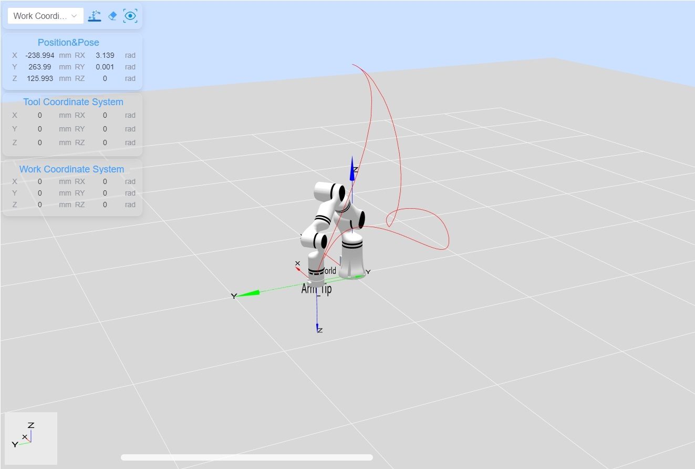

# <p class="hidden">Demo (python): </p>Spline Curve Motion Demo

## 1. Project introduction

This project, via the RealMan Python development package, completes the robotic arm connection, robotic arm version acquisition, API version acquisition, moveS motion, and disconnection.

## 2. Code structure

```
RMDemo_Moves/
│
├── README.md        <- Core project document
├── requirements.txt    <- List of project dependencies
├── setup.py        <- Project installation script
│
├── src/          <- Project source code
│  ├── main.py       <- Main procedure entry
│  └── core/        <- Core function or business logic code
│    └── demo_moves.py      <- Demo that completes robotic arm connection, robotic arm version acquisition, API version acquisition, movej motion, moveL motion, moveC motion, and disconnection.
└── Robotic_Arm/      <- RealMan robotic arm secondary development package
```

## 3. Project download

Download `RM_API2` locally via the link: [development package download](https://github.com/RealManRobot/RM_API2.git). Then, navigate to the `RM_API2\Demo\RMDemo_Python` directory, where you will find RMDemo_Moves.

## 4. Environment configuration

Required environment and dependencies for running in Windows and Linux environments:

| Item         | Linux     | Windows   |
| :--          | :--       | :--       |
| System architecture     | x86 architecture   | -         |
| python       | 3.9 or higher   | 3.9 or higher   |
| Specific dependency     | -         | -         |

### Linux configuration

   1. Refer to the [python official website - linux](https://www.python.org/downloads/source/) to download and install python3.9.

   2. After entering the project directory, open the terminal and run the following command to install dependencies:

```bash
pip install -r requirements.txt
```

### Windows configuration

   1. Refer to the [python official website - Windows](https://www.python.org/downloads/windows/) to download and install python3.9.

   2. After entering the project directory, open the terminal and run the following command to install dependencies:

```bash
pip install -r requirements.txt
```

## 5. Notes

1. This demo uses the RM65-B robotic arm as an example. Please modify the data in the code according to your actual situation.
2. Execute moves to perform spline curve motion, where the trajectory connection sign is 0 for the last segment and 1 for all preceding segments. If all signs are set to 0, it will be a movel straight-line motion.

## 6. User guide

### 1. Quick run

Follow these steps to quickly run the code:

1. **Configuration of the IP address of the robotic arm**: open the `demo_moves.py` file and modify the initialization parameters of the `RobotArmController` class in the `main` function to the current IP address of the robotic arm. The default IP address is `"192.168.1.18"`.

    ```python
    # Create a robot arm controller instance and connect to the robot arm
    robot_controller = RobotArmController("192.168.1.18", 8080, 3)
    ```

2. **Running via command line**: navigate to the `RMDemo_Moves` directory in the terminal and enter the following command to run the Python script:

    ```bash
    python ./src/main.py
    ```

3. **Running result**: The robotic arm's trajectory will be displayed in the terminal, along with the corresponding log information.

After running the script, the output result is as follows:

```
current api version:  0.2.9

Successfully connected to the robot arm: 1

API Version:  0.2.9 

movej motion succeeded

movej_p motion succeeded

moves operation succeeded

Successfully disconnected from the robot arm
```

### 2. Code description

The following are the main functions of the `demo_moves.py` file:

- **Define a parameter dictionary of different models of robotic arms**

    ```python
    arm_models_to_points = {  
        "RM_65": [  
            [0, 0, 0, 0, 0, 0],
            [-0.3, 0, 0.3, 3.14, 0, 0],
            [
                [-0.3, 0, 0.3, 3.14, 0, 0],
                [-0.27, -0.22, 0.3, 3.14, 0, 0],
                [-0.314, -0.25, 0.2, 3.14, 0, 0],
                [-0.239, 0.166, 0.276, 3.14, 0, 0],
                [-0.239, 0.264, 0.126, 3.14, 0, 0]
            ]  
        ],  
        "RM_75": [  
            [0, 20, 0, 70, 0, 90, 0],    
            [0.297557, 0, 0.337061, 3.142, 0, 3.142],    
            [
                [0.3, 0.1, 0.337061, 3.142, 0, 3.142],
                [0.2, 0.3, 0.237061, 3.142, 0, 3.142],
                [0.2, 0.25, 0.037061, 3.142, 0, 3.142],
                [0.1, 0.3, 0.137061, 3.142, 0, 3.142],
                [0.2, 0.25, 0.337061, 3.142, 0, 3.142]
            ]
        ], 
        "RML_63": [  
            [0, 20, 70, 0, 90, 0],
            [0.448968, 0, 0.345083, 3.142, 0, 3.142],
            [
                [0.3, 0.3, 0.345083, 3.142, 0, 3.142],
                [0.3, 0.4, 0.145083, 3.142, 0, 3.142],
                [0.3, 0.2, 0.045083, 3.142, 0, 3.142],
                [0.4, 0.1, 0.145083, 3.142, 0, 3.142],
                [0.5, 0, 0.345083, 3.142, 0, 3.142]
            ]  
        ], 
        "ECO_65": [  
            [0, 20, 70, 0, -90, 0],
            [0.352925, -0.058880, 0.327320, 3.141, 0, -1.57],
            [
                [0.3, 0.3, 0.327320, 3.141, 0, -1.57],
                [0.2, 0.4, 0.127320, 3.141, 0, -1.57],
                [0.2, 0.2, 0.027320, 3.141, 0, -1.57],
                [0.3, 0.1, 0.227320, 3.141, 0, -1.57],
                [0.4, 0, 0.327320, 3.141, 0, -1.57]
            ]
        ],
        "GEN_72": [  
            [0, 0, 0, -90, 0, 0, 0],
            [0.359500, 0, 0.426500, 3.142, 0, 0],
            [
                [0.359500, 0, 0.426500, 3.142, 0, 0],
                [0.2, 0.3, 0.426500, 3.142, 0, 0],
                [0.2, 0.3, 0.3, 3.142, 0, 0],
                [0.3, 0.3, 0.3, 3.142, 0, 0],
                [0.3, -0.1, 0.4, 3.142, 0, 0]
            ] 
        ],
        "ECO_63": [  
            [0, 20, 70, 0, -90, 0],
            [0.544228, -0.058900, 0.468274, 3.142, 0, -1.571],
            [
                [0.3, 0.3, 0.468274, 3.142, 0, -1.571],
                [0.3, 0.4, 0.168274, 3.142, 0, -1.571],
                [0.3, 0.2, 0.268274, 3.142, 0, -1.571],
                [0.4, 0.1, 0.368274, 3.142, 0, -1.571],
                [0.5, 0, 0.468274, 3.142, 0, -1.571]
            ]  
        ],
    } 
    ```

- **Connect the robotic arm**

    ```python
    robot_controller = RobotArmController("192.168.1.18", 8080, 3)
    ```

    Connect the robotic arm to the specified IP address and port.

- **Get the API version**

    ```python
    print("\nAPI Version: ", rm_api_version(), "\n")
    ```

    Get and display the API version.

- **Execute the movej motion**

    ```python
    robot_controller.movej(points[0])
    ```

- **Execute the movej_p motion**

    ```python
    robot_controller.movej_p(points[1])
    ```

- **Execute the moves motion**

    ```python
    robot_controller.moves(points[2])
    ```

    Execute moves motion to perform spline curve motion along a multi-point trajectory.
    The trajectory is shown in the image below:
    
- **Disconnect from the robotic arm**

    ```python
    robot_controller.disconnect()
    ```

## 7. License information

- This project is subject to the MIT license.
