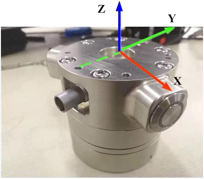
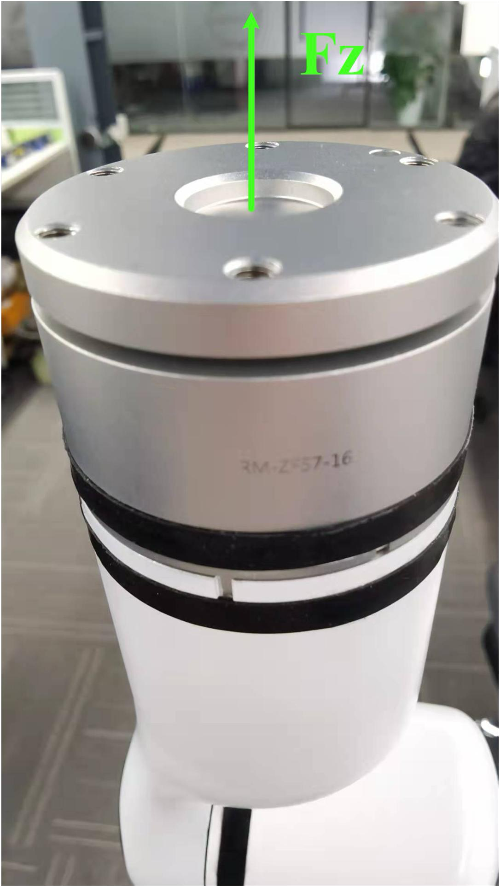

# <p class="hidden">JSON protocol: </p>Force Sensor Command Set (Optional)

## 6-DoF force

The 6-DoF force version of the RealMan robotic arm is equipped with an integrated 6-DoF force sensor, eliminating the need for external wiring and allowing the user to manipulate the 6-DoF force sensor and get 6-DoF force data directly through the protocol.

As shown in the image below, the Z-axis of the 6-DoF force is directly above, and the Y-axis of the 6-DoF force is in the opposite direction of the aviation connector, with the frame following the right-hand rule. When the robotic arm is in the zero pose, the tool frame is aligned with the 6-DoF force frame.

Additionally, the 6-DoF force sensor has a rated force of 200 N, a rated torque of 8 N.m, an overload capacity of 300%FS, an operating temperature range of 5°C to 80°C, and an accuracy of ±2%FS. During use, it is important to follow the operational requirements to prevent damage to the 6-DoF force sensor.



### Get the 6-DoF force data `get_force_data`

Get the current force and torque data obtained from the 6-DoF force sensor: Fx, Fy, Fz, Mx, My, and Mz.

- **Input parameter**

| Parameter             | Type     | Description             |
| :--- | :--- |:---|
| `get_force_data` | `string` |Get the force sensor data. For cyclic query of the force data, the query period of the Gen 2 robotic arm should not be less than 50 ms. |

- **Code demo**

**Input**

```json
{"command":"get_force_data"}
```

**Output**

Original force data force_data<br>
Fx=1 N, Fy=2 N, Fz=3 N, Mx=0.4 N.m, My=0.5 N.m, Mz=0.6 N.m;

External force data in the sensor frame zero_force_data<br>
Fx=0.5 N, Fy=1 N, Fz=1.5 N, Mx=0.2 N.m, My=0.25 N.m, Mz=0.3 N.m;

External force data in the current work frame work_zero_force_data<br>
Fx=0.5 N, Fy=1 N, Fz=1.5 N, Mx=0.2 N.m, My=0.25 N.m, Mz=0.3 N.m;

External force data in the current tool frame tool_zero_force_data<br>
Fx=0.5 N, Fy=1 N, Fz=1.5 N, Mx=0.2 N.m, My=0.25 N.m, Mz=0.3 N.m;

Data accuracy: 0.001.

```json
{
    "command": "get_force_data",
    "force_data": [
        1000,
        2000,
        3000,
        400,
        500,
        600
    ],
    "zero_force_data": [
        500,
        1000,
        1500,
        200,
        250,
        300
    ],
    "work_zero_force_data": [
        500,
        1000,
        1500,
        200,
        250,
        300
    ],
    "tool_zero_force_data": [
        500,
        1000,
        1500,
        200,
        250,
        300
    ]
}
```

### Clear the 6-DoF force data `clear_force_data`

Clear the 6-DoF force data and calibrate the zero position in the current state.

- **Input parameter**

| Parameter             | Type     | Description             |
| :--- | :--- |:---|
| `clear_force_data` | `string` |Calibrate the zero position in the current state. |

- **Code demo**

**Input**

```json
{"command":"clear_force_data"}
```

**Output**

Clearing succeeded:

```json
{
    "command": "clear_force_data",
    "clear_state": true
}
```

Clearing failed:

```json
{
    "command": "clear_force_data",
    "clear_state": false
}
```

### Set the 6-DoF force center of gravity automatically `set_force_sensor`

Set the 6-DoF force center of gravity. After reinstalling the 6-DoF force sensor, the initial force and center of gravity acting on the 6-DoF force sensor must be recalculated. Get the 6-DoF force data at different orientations to calculate the center of gravity. After this command is issued, the robotic arm moves to each calibration point at a fixed speed. This process must not be interrupted. Otherwise, the calibration must be restarted.

::: tip
Calibration must be performed while the robotic arm is stationary.
Take the RM65 robotic arm as an example, the joint angles for the four calibration points are as follows:
Pose 1 joint angle: `{0,0,-60,0,60,0}`
Pose 2 joint angle: `{0,0,-60,0,-30,0}`
Pose 3 joint angle: `{0,0,-60,0,-30,180}`
Pose 4 joint angle: `{0,0,-60,0,-120,0}`
:::

- **Input parameter**

| Parameter             | Type     | Description             |
| :--- | :--- |:---|
| `set_force_sensor` | `string` | Set the force sensor data at the given position. |

- **Code demo**

**Input**

```json
{"command":"set_force_sensor"}
```

**Output**
Setting succeeded:

```json
{
    "command": "set_force_sensor",
    "set_state": true
}
```

Setting failed:

```json
{
    "command": "set_force_sensor",
    "set_state": false
}
```

### Calibrate the 6-DoF force data manually `manual_set_force`

Set the 6-DoF force center of gravity. After reinstalling the 6-DoF force sensor, the initial force and center of gravity acting on the 6-DoF force sensor must be recalculated. This manual calibration is applicable to narrow working spaces to prevent the robotic arm from colliding during the automatic calibration. Users can manually select four poses to issue commands. Once all four poses are set, the robotic arm will automatically move toward the user-defined target, and the 6-DoF force center of gravity will be calculated during this movement.

- **Input parameter**

| Parameter             | Type     | Description             |
| :--- | :--- |:---|
| `manual_set_force` | `string` |Calibrate the center of gravity of the force sensor. |
| `pose1` | `int` |Pose 1 joint angle. |
| `pose2` | `int` |Pose 2 joint angle. |
| `pose3` | `int` |Pose 3 joint angle. |
| `pose4` | `int` |Pose 4 joint angle. |

::: warning
The commands for four poses must be issued in sequence. Once pose 4 is set, the robotic arm will automatically calculate the center of gravity, and return the value after the calculation is complete.
:::

- **Code demo**

**Input**
6-DoF robotic arm:

```json
 {"command":"manual_set_force_pose1","joint":[0,0,0,0,90000,0]}                                        
```

7-DoF robotic arm:

```json
{"command":"manual_set_force_pose1","joint":[0,0,0,0,0,90000,0]}                                            
```

**Output**
Calibration succeeded:

```json
{
    "command": "set_force_sensor",
    "set_state": true
}
```

Calibration failed:

```json
{
    "command": "set_force_sensor",
    "set_state": false
}
```

### Stop calibrating the center of gravity of the force sensor `stop_set_force_sensor`

During the calibration of the force sensor, if an unexpected event occurs, send this command to stop the robotic arm's movement and exit the calibration process.

- **Input parameter**

| Parameter             | Type     | Description             |
| :--- | :--- |:---|
| `stop_set_force_sensor` | `string` | Stop calculating the center of gravity of the force sensor. |

- **Code demo**

**Input**

```json
{"command":"stop_set_force_sensor"}
```

**Output**
Calculation succeeded:

```json
{
    "command": "stop_set_force_sensor",
    "stop_state": true
}
```

Calculation failed:

```json
{
    "command": "stop_set_force_sensor",
    "stop_state": false
}
```

## 1-DoF force

A 1-DoF force sensor is integrated into the end interface board of the RealMan robotic arm to measure the Z-axis force, with a measurement range of 200 N and an accuracy of ±2%FS.

<div>  </div>

### Get the 1-DoF force data `get_Fz`

::: tip
After the basic robotic arm issues the first frame command, the 1-DoF force data gets updated, and the returned data has lagged. Therefore, please start with the data in the second frame. For the cyclic query of the Fz data, the frequency cannot be higher than 40 Hz.
:::

- **Input parameter**

| Parameter             | Type     | Description             |
| :--- | :--- |:---|
| `get_Fz` | `string` |Get the 1-DoF force data. |

- **Code demo**

**Input**

```json
{"command":"get_Fz"}
```

**Output**

If successful, return the original Fz data, with an accuracy of 0.001 N. In the demo, the returned Fz is 0.1 N, which is the external force data in the sensor frame (12 N zero_Fz), with an accuracy of 0.001 N.

```json
{
    "command": "get_Fz",
    "Fz": 12000,
    "zero_Fz": 100,
    "work_zero_Fz ": 100,
    "tool_zero_Fz": 100
}
```

### Clear the 1-DoF force data `clear_Fz`

- **Input parameter**

| Parameter             | Type     | Description             |
| :--- | :--- |:---|
| `clear_Fz` | `string` |After clearing the 1-DoF force data, all subsequent data obtained is based on the current offset. |

- **Code demo**

**Input**

```json
{"command":"clear_Fz"}
```

**Output**

Setting succeeded:

```json
{
    "command": "clear_Fz",
    "set_state": true
}
```

Setting failed:

```json
{
    "command": "clear_Fz",
    "set_state": false
}
```

### Calibrate the 1-DoF force data automatically `auto_set_Fz`

Set the 1-DoF force center of gravity. After reinstalling the 1-DoF force sensor, the initial force and center of gravity acting on the 1-DoF force sensor must be recalculated. Get the 1-DoF force data at different orientations to calculate the center of gravity, which is of great significance for the force-position hybrid control based on 1-DoF force.

- **Input parameter**

| Parameter             | Type     | Description             |
| :--- | :--- |:---|
| `auto_set_Fz` | `string` |Calibrate the zero position of the force sensor. |

- **Code demo**

**Input**

```json
{"command":"auto_set_Fz"}
```

**Output**

Setting succeeded:

```json
{
    "command": "set_force_sensor",
    "set_state": true
}
```

Setting failed:

```json
{
    "command": "set_force_sensor",
    "set_state": false
}
```

### Calibrate the 1-DoF force data manually `manual_set_Fz`

Set the 1-DoF force center of gravity. After reinstalling the 1-DoF force sensor, the initial force and center of gravity acting on the 1-DoF force sensor must be recalculated. This manual calibration is applicable to narrow working spaces to prevent the robotic arm from colliding during the automatic calibration. Users can manually select two poses to issue commands. Once all two poses are set, the robotic arm will automatically move toward the user-defined target, and the 1-DoF force center of gravity will be calculated during this movement.

- **Input parameter**

| Parameter             | Type     | Description             |
| :--- | :--- |:---|
| `manual_set_Fz` | `string` |Calibrate the zero position of the force sensor. |
| `pose1` | `int` |Joint angle. |
| `pose2` | `int` |Joint angle. |

- **Code demo**

**Input**

pose1: joint angle, with an accuracy of 0.001°. For example, 90000 refers to 90°

6-DoF robotic arm:

```json
{"command":"manual_set_Fz", "pose1":[0, 0, 0, 0, 0, 0], "pos e2":[0, 0, 90000, 0, 90000, 0]}
```

7-DoF robotic arm:

```jsom
{"command":"manual_set_Fz", "pose1":[0, 0, 0, 0, 0, 0], "pos e2":[0, 0, 90000, 0, 0, 90000, 0]}
```

**Output**

Setting succeeded:

```json
{
    "command": "set_force_sensor",
    "set_state": true
}
```

Setting failed:

```json
{
    "command": "set_force_sensor",
    "set_state": false
}
```

### Stop calibrating the center of gravity of the force sensor `stop_set_force_sensor`

During the calibration of the force sensor, if an unexpected event occurs, send this command to stop the robotic arm's movement and exit the calibration process.

- **Input parameter**

| Parameter             | Type     | Description             |
| :--- | :--- |:---|
| `stop_set_force_sensor` | `string` | Stop calculating the center of gravity of the force sensor. |

- **Code demo**

**Input**

```json
{"command":"stop_set_force_sensor"}
```

**Output**

Calculation succeeded:

```json
{
    "command": "stop_set_force_sensor",
    "stop_state": true
}
```

Calculation failed:

```json
{
    "command": "stop_set_force_sensor",
    "stop_state": false
}
```
