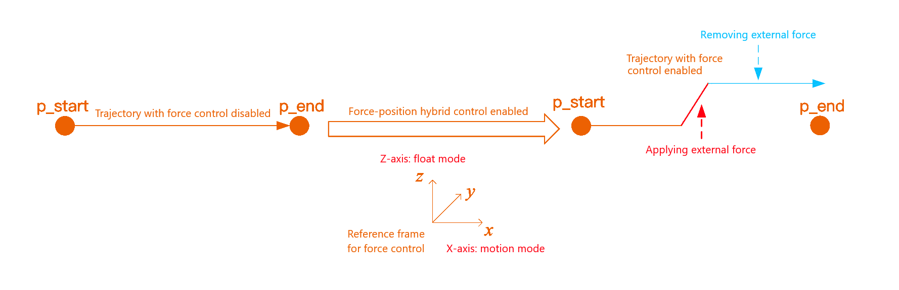
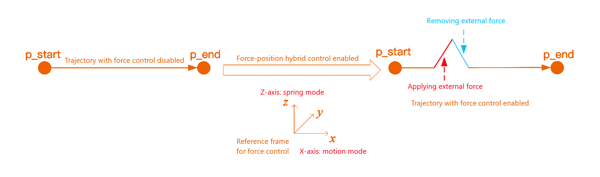
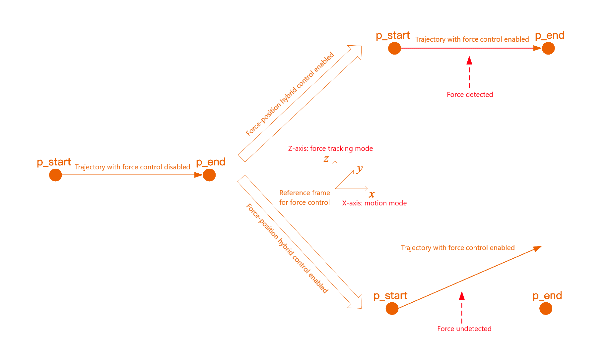
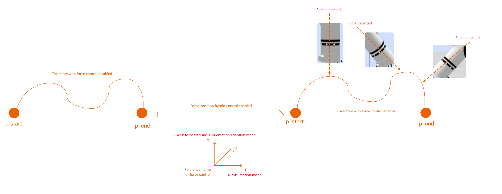

# <p class="hidden">JSON protocol: </p>Motion Command Set

## Trajectory motion

### Joint motion`movej`

- **Input parameter**

| Parameter                 | Type     | Description                                                                                                              |
| :------------------- | :------- | :---------------------------------------------------------------------------------------------------------------- |
| `movej`              | `string` | joint motion command.                                                                                                   |
| `joint`              | `int`    | Target joint angle, accuracy: 0.001°.                                                                                      |
| `v`                  | `int`    | Speed percentage coefficient, range: 0-100.                                                                                        |
| `r`                  | `int`    | Blend radius percentage coefficient, range: 0-100.                                                                                      |
| `trajectory_connect` | `int`    | Optional, indicating whether to plan the motion together with the next trajectory. 0: The motion is planned immediately, 1: It is planned together with the next trajectory. When set to 1, the trajectory will not execute immediately. |

::: warning
The blend radius is valid only when trajectory_connect is 1, and is invalid when trajectory_connect is 0
:::

- **Output parameter**

| Parameter        | Type    | Description                                   |
| :-------------- | :----- | :------------------------------------ |
| `receive_state` | `bool` | `true`: setting succeeded, `false`: setting failed. |

You can refer to [current_trajectory_state](#5439) for the output parameters of the motion completion return result.

- **Code demo**

**Input**

Execution: Joint motion with the following parameters:

6-DoF joint angle: [10.1°, 0.2°, 20.3°, 30.4°, 0.5°, 20.6°];<br>
7-DoF joint angle: [10.1°, 0.2°, 20.3°, 30.4°, 0.5°, 20.6°, 20.6°];<br>
Speed coefficient: 50%;<br>
Blend radius: no blending.

6-DoF robotic arm:

```json
{"command":"movej","joint":[10100,200,20300,30400,500,20600],"v":50,"r":0,"trajectory_connect":0}
```

7-DoF robotic arm:

```json
{"command":"movej","joint":[10100,200,20300,30400,500,20600,20600],"v":50,"r":0,"trajectory_connect":0}
```

**Output**

Instruction reception succeeded:

```json
{
    "command": "movej",
    "receive_state": true
}
```

Instruction reception failed:

```json
{
    "command": "movej",
    "receive_state": false
}
```

Motion completed succeeded:

```json
{
    "state": "current_trajectory_state",
    "trajectory_state": true,
    "device": 0,
    "trajectory_connect": 1
}
```

Motion completed failed:

```json
{
    "state": "current_trajectory_state",
    "trajectory_state": false,
    "device": 0,
    "trajectory_connect": 1
}
```

::: warning
trajectory_connect: whether to connect to the next trajectory, 0: all trajectories in position, 1: connected to the next trajectory.
:::

### Linear motion`movel`

- **Input parameter**

| Parameter                 | Type     | Description                                                                                                              |
| :------------------- | :------- | :---------------------------------------------------------------------------------------------------------------- |
| `movel`              | `string` | Linear motion execution.                                                                                                   |
| `pose`               | `int`    | Target pose, position accuracy: 0.001 mm, orientation accuracy: 0.001 rad.                                                                |
| `v`                  | `int`    | Speed percentage coefficient, range: 0-100.                                                                                        |
| `r`                  | `int`    | Blend radius percentage coefficient, range: 0-100.                                                                                      |
| `trajectory_connect` | `int`    | Optional, indicating whether to plan the motion together with the next trajectory. 0: The motion is planned immediately, 1: It is planned together with the next trajectory. When set to 1, the trajectory will not execute immediately. |

::: warning
The MOVEL command is also applicable when the target position remains unchanged, but the orientation changes<br>
The blend radius is valid only when trajectory_connect is 1, and is invalid when trajectory_connect is 0
:::

- **Output parameter**

| Parameter  | Type | Description  |
| :-------------- | :----- | :------------------------------------ |
| `receive_state` | `bool` | `true`: setting succeeded, `false`: setting failed. |

You can refer to [current_trajectory_state](#5439) for the output parameters of the motion completion return result.

- **Code demo**

**Input**

Execution: Linear motion with the following parameters:

Target position: x: 0.1 m, y: 0.2 m, z: 0.03 m<br>
Target orientation: rx: 0.4 rad, ry: 0.5 rad, rz: 0.6 rad<br>
Speed coefficient: 50%<br>
Blend radius: no blending.

```json
{"command":"movel","pose":[100000,200000,30000,400,500,600],"v":50,"r":0,"trajectory_connect":0}
```

**Output**

Instruction reception succeeded:

```json
{
    "command": "movel",
    "receive_state": true
}
```

Instruction reception failed:

```json
{
    "command": "movel",
    "receive_state": false
}
```

Motion completed succeeded:

```json
{
    "state": "current_trajectory_state",
    "trajectory_state": true,
    "device": 0,
    "trajectory_connect": 1
}
```

Motion completed failed:

```json
{
    "state": "current_trajectory_state",
    "trajectory_state": false,
    "device": 0,
    "trajectory_connect": 1
}
```

::: warning
trajectory_connect: whether to connect to the next trajectory, 0: all trajectories in position, 1: connected to the next trajectory.
:::

### Circular motion`movec`

- **Input parameter**

| Parameter                 | Type     | Description                                                                                                              |
| :------------------- | :------- | :---------------------------------------------------------------------------------------------------------------- |
| `movec`              | `string` | Circular motion                                                                                                          |
| `pose`               | `object`    | Pose.                                                                                                           |
| `pose_via`           | `int`    | Pose of via-point: position accuracy: 0.001 mm, orientation accuracy: 0.001 rad.                                                                |
| `pose_to`            | `int`    | Target pose: position accuracy: 0.001 mm, orientation accuracy: 0.001 rad.                                                                  |
| `v`                  | `int`    | Speed percentage coefficient, range: 0-100.                                                                                        |
| `r`                  | `int`    | Blend radius percentage coefficient, range: 0-100.                                                                                      |
| `loop`               | `int`    | Loop count, 0 by default.                                                                                               |
| `trajectory_connect` | `int`    | Optional, indicating whether to plan the motion together with the next trajectory. 0: The motion is planned immediately, 1: It is planned together with the next trajectory. When set to 1, the trajectory will not execute immediately. |

::: warning
The blend radius is valid only when trajectory_connect is 1, and is invalid when trajectory_connect is 0.
:::

- **Output parameter**

| Parameter        | Type    | Description                                   |
| :-------------- | :----- | :------------------------------------ |
| `receive_state` | `bool` | `true`: setting succeeded, `false`: setting failed. |

You can refer to [current_trajectory_state](#5439) for the output parameters of the motion completion return result.

- **Code demo**

**Input**

Execution: Circular motion with the following parameters:

Position of via-point: x: 0.1 m, y: 0.2 m, z: 0.03 m;<br>
Orientation of via-point: rx: 0.4 rad, ry: 0.5 rad, rz: 0.6 rad;<br>
Position of final point: x: 0.2 m, y: 0.3 m, z: 0.03 m;<br>
Orientation of final point: rx: 0.4 rad, ry: 0.5 rad, rz: 0.6 rad;<br>
Speed coefficient: 50%;<br>
Blend radius: no blending. <br>

```json
{"command":"movec","pose":{"pose_via":[100000,200000,30000,400,500,600],"pose_to":[200000,300000,30000,400,500,600]},"v":50,"r":0,"loop":0,"trajectory_connect":0}
```

**Output**

Instruction reception succeeded:

```json
{
    "command": "movec",
    "receive_state": true
}
```

Instruction reception failed:

```json
{
    "command": "movec",
    "receive_state": false
}
```

Motion completed succeeded:

```json
{
    "state": "current_trajectory_state",
    "trajectory_state": true,
    "device": 0,
    "trajectory_connect": 1
}
```

Motion completed failed:

```json
{
    "state": "current_trajectory_state",
    "trajectory_state": false,
    "device": 0,
    "trajectory_connect": 1
}
```

::: warning
trajectory_connect: whether to connect to the next trajectory, 0: all trajectories in position, 1: connected to the next trajectory.
:::

### Joint space planning to target orientation`movej_p`

Move to target pose through joint space planning.

- **Input parameter**

| Parameter                 | Type     | Description                                                                                                              |
| :------------------- | :------- | :---------------------------------------------------------------------------------------------------------------- |
| `movej_p`            | `string` | Joint space planning to target orientation command.                                                                                     |
| `pose`               | `int`    | Target pose, position accuracy: 0.001 mm, orientation accuracy: 0.001 rad.                                                                |
| `v`                  | `int`    | Speed percentage coefficient, range: 1-100.                                                                                          |
| `r`                  | `int`    | Blend radius percentage coefficient, range: 0-100.                                                                                      |
| `trajectory_connect` | `int`    | Optional, indicating whether to plan the motion together with the next trajectory. 0: The motion is planned immediately, 1: It is planned together with the next trajectory. When set to 1, the trajectory will not execute immediately. |

- **Output parameter**

| Parameter                 | Type   | Description                                                           |
| :------------------- | :----- | :------------------------------------------------------------- |
| `pose`    | `array`  | Current pose, position accuracy: 0.001 mm, orientation accuracy: 0.001 rad.                                           |
| `joint`   | `array`  | Current joint angle, accuracy: 0.001°.                                                            |
| `arm_err` | `number` | State code. If the value is 0, it indicates the system is functioning normally, and the command is executed successfully. If any other error occurs, the corresponding error code is returned, and the command is not executed. |

You can refer to [current_trajectory_state](#5439) for the output parameters of the motion completion return result.

- **Code demo**

**Input**

Execution: Linear motion with the following parameters:

Target position: x: 0.1 m, y: 0.2 m, z: 0.03;<br>
Target orientation: rx: 0.4 rad, ry: 0.5 rad, rz: 0.6 rad;<br>
Speed coefficient: 50%;<br>
Blend radius: no blending.

```json
{"command":"movej_p","pose":[100000,200000,30000,400,500,600],"v":50,"r":0,"trajectory_connect":0}
```

**Output**

Return command reception state:

```json
{
    "state": "pose_state",
    "pose": [
        10,
        20,
        30,
        40,
        50,
        60
    ],
    "joint": [
        10,
        20,
        30,
        40,
        50,
        60,
        70
    ],
    "arm_err": 0
}
```

Motion completed succeeded:

```json
{
    "state": "current_trajectory_state",
    "trajectory_state": true,
    "device": 0,
    "trajectory_connect": 1
}
```

Motion completed failed:

```json
{
    "state": "current_trajectory_state",
    "trajectory_state": false,
    "device": 0,
    "trajectory_connect": 1
}
```

::: warning
trajectory_connect: whether to connect to the next trajectory, 0: all trajectories in position, 1: connected to the next trajectory.
:::

### Spline curve motion`moves`

Spline curve motion is a smooth motion trajectory defined by control points, also known as nodes or key points. To achieve spline curve motion, at least three distinct data points are required to complete the reverse calculation of control points. These data points are entered sequentially via the moves command.

- **Input parameter**

| Parameter                 | Type     | Description                                                                                                              |
| :------------------- | :------- | :---------------------------------------------------------------------------------------------------------------- |
| `moves`              | `string` | Spline curve motion command.                                                                                               |
| `pose`               | `int`    | Target pose, position accuracy: 0.001 mm, orientation accuracy: 0.001 rad.                                                                |
| `v`                  | `int`    | Speed percentage coefficient, range: 0-100.                                                                                        |
| `r`                  | `int`    | Blend radius percentage coefficient, range: 0-100.                                                                                      |
| `trajectory_connect` | `int`    | Optional, indicating whether to plan the motion together with the next trajectory. 0: The motion is planned immediately, 1: It is planned together with the next trajectory. When set to 1, the trajectory will not execute immediately. |

::: warning
This motion currently does not support trajectory blending.
:::

- **Output parameter**

| Parameter  | Type | Description  |
| :-------------- | :----- | :------------------------------------ |
| `receive_state` | `bool` | `true`: setting succeeded, `false`: setting failed. |

You can refer to [current_trajectory_state](#5439) for the output parameters of the motion completion return result.

- **Code demo**

**Input**

Execution: Three-point spline curve motion with the following parameters:

Target position:<br>
x：0.1m，y：0.2m，z：0.03m；<br>
x：0.1m，y：0.3m，z：0.03m；<br>
x：0.1m，y：0.4m，z：0.03m；<br>
Target orientation: rx: 0.4 rad, ry: 0.5 rad, rz: 0.6 rad;<br>
Speed coefficient: 50%;<br>
Blend radius: no blending.

::: warning
The following commands should be run line by line.
:::

```json
{"command":"moves","pose":[100000,200000,30000,400,500,600],"v":50,"r":0,"trajectory_connect":1}
```

```json
{"command":"moves","pose":[100000,300000,30000,400,500,600],"v":50,"r":0,"trajectory_connect":1}
```

```json
{"command":"moves","pose":[100000,400000,30000,400,500,600],"v":50,"r":0,"trajectory_connect":0}
```

**Output**

Instruction reception succeeded:

```json
{
    "command": "moves",
    "receive_state": true
}
```

Instruction reception failed:

```json
{
    "command": "moves",
    "receive_state": false
}
```

Motion completed succeeded:

```json
{
    "state": "current_trajectory_state",
    "trajectory_state": true,
    "device": 0,
    "trajectory_connect": 1
}
```

Motion completed failed:

```json
{
    "state": "current_trajectory_state",
    "trajectory_state": false,
    "device": 0,
    "trajectory_connect": 1
}
```

::: warning
trajectory_connect: whether to connect to the next trajectory, 0: all trajectories in position, 1: connected to the next trajectory.
:::

### Pose pass-through `movep_canfd`

The target pose is passed-through to the robotic arm via CANFD, without the need of controller planning. The target pose is the numerical values of the current tool in the current work frame and tool frame.

- **Input parameter**

| Parameter          | Type     | Description                                                                                             |
| :------------ | :------- | :----------------------------------------------------------------------------------------------- |
| `movep_canfd` | `string` | Pose passed-through to CANFD. If the command is correct, the robotic arm will execute it immediately.                    |
| `pose`        | `int`    | Target pose. Position accuracy: 0.001 mm, orientation accuracy: 0.001 rad.                                               |
| `follow`      | `bool`   | Driver motion follow, true: high follow, false: low follow. If high follow is used, the pass-through cycle should not exceed 10 ms. |
|`trajectory_mode`|`int`|In high-following mode, multiple modes are supported: 0 - Full pass-through mode, 1 - Curve fitting mode, 2 - Filtering mode. |
|`radio`|`int`|trajectory_mode=0, Full pass-through mode: This is the default mode, where raw data is directly passed through to the joints, and the joints follow the sent trajectory exactly. <br>trajectory_mode=1, Curve fitting mode: In this mode, a smoothing coefficient (0-100) can be input. The larger the smoothing coefficient, the smoother the trajectory; however, the following lag effect will be more pronounced, with a maximum lag of approximately 15 cycles. <br>trajectory_mode=2, Filtering mode: In this mode, users can input filtering parameters (ranging from 0 to 1000). The larger the parameter value, the smoother the robotic arm's motion trajectory will be. Due to the use of filtering technology, after the user inputs the last target point, to ensure that the robotic arm accurately reaches the target position, the user needs to continuously send the command for the last target point until it is confirmed that the robotic arm has reached the final position.|

::: warning
The pass-through effect is related to the period and the smoothness of the trajectory. The period must be stable to prevent significant fluctuations. The Gen 2 WIFI and network port pass-through modes have the fastest cycle of 20 ms, while the USB and RS485 modes can achieve the fastest cycle of 10 ms.

The high-speed Ethernet port pass-through cycle can also reach 10 ms, but the configuration must be enabled with a command before using the high-speed network port.

Additionally, the Gen 3 Ethernet port can attain a pass-through cycle as fast as 2 ms.

When using this command, users should carefully plan the trajectory, as the smoothness of the trajectory planning determines the robotic arm's operating state. The maximum angle between frames for each joint must not exceed 10°, and the joint planning speed must not exceed 180°/s. Otherwise, the joint will not respond.
:::

- **Output parameter**

| Parameter      | Type     | Description                                                                                         |
| :-------- | :------- | :------------------------------------------------------------------------------------------- |
| `pose`    | `array`  | Current pose, position accuracy: 0.001 mm, orientation accuracy: 0.001 rad.                                           |
| `joint`   | `array`  | Current joint angle, accuracy: 0.001°.                                                            |
| `arm_err` | `number` | State code. If the value is 0, it indicates the system is functioning normally, and the command is executed successfully. If any other error occurs, the corresponding error code is returned, and the command is not executed. |

::: warning
The Gen 3 robotic arm no longer provides return values, and the real-time state is collected via the UDP state reporting interface.
:::

- **Code demo**

**Input**

Execution: Target pose pass-through with the following parameters:

Target position: x: 0.1 m, y: 0.2 m, z: 0.03;<br>
Target orientation (Euler angle): rx: 0.4 rad, ry: 0.5 rad, rz: 0.6 rad;<br>
Target orientation (quaternion): w: 0.4, x: 0.5, y: 0.6, z: 0.7.

- **Code demo**

**Input**

Pose pass-through via Euler angles:

```json
{"command":"movep_canfd","pose":[100000,200000,30000,400,500,600],"follow":true,"trajectory_mode":1,"radio":50}
```

Pose pass-through via quaternion:

```json
{"command":"movep_canfd","pose_quat":[100000,200000,30000,400000,500000,600000,700000],"follow":true,"trajectory_mode":1,"radio":50}
```

**Output**

Current 6-DoF pose: position accuracy: 0.001 mm, orientation accuracy: 0.001 rad;<br>
joint: current joint angle, accuracy: 0.001°;

```json
{
    "state": "pose_state",
    "pose": [
        10,
        20,
        30,
        40,
        50,
        60
    ],
    "joint": [
        10,
        20,
        30,
        40,
        50,
        60
    ],
    "arm_err": 0
}
```

Current 7-DoF pose: position accuracy: 0.001 mm, orientation accuracy: 0.001 rad;<br>
joint: current joint angle, accuracy: 0.001°;

```json
{
    "state": "pose_state",
    "pose": [
        10,
        20,
        30,
        40,
        50,
        60
    ],
    "joint": [
        10,
        20,
        30,
        40,
        50,
        60,
        70
    ],
    "arm_err": 0
}
```

### Angle pass-through `movej_canfd`

The angle is passed-through to the robotic arm via CANFD, without the need of controller planning.

- **Input parameter**

| Parameter          | Type     | Description                                                                                             |
| :------------ | :------- | :----------------------------------------------------------------------------------------------- |
| `movej_canfd` | `string` | Angle passed-through to CANFD. If the command is correct, the robotic arm will execute it immediately.                                                  |
| `joint`       | `int`    | Joint angle, accuracy: 0.001°.                                                                         |
| `follow`      | `bool`   | Driver motion follow, true: high follow, false: low follow. If high follow is used, the pass-through cycle should not exceed 10 ms. |
| `expand`      | `int`    | Optional field for sending. If a universal extension axis exists and pass-through is needed, this parameter can be used for pass-through.                    |
|`trajectory_mode`|`int`|In high-following mode, multiple modes are supported: 0 - Full pass-through mode, 1 - Curve fitting mode, 2 - Filtering mode. |
|`radio`|`int`|trajectory_mode=0, Full pass-through mode: This is the default mode, where raw data is directly passed through to the joints, and the joints follow the sent trajectory exactly. <br>trajectory_mode=1, Curve fitting mode: In this mode, a smoothing coefficient (0-100) can be input. The larger the smoothing coefficient, the smoother the trajectory; however, the following lag effect will be more pronounced, with a maximum lag of approximately 15 cycles. <br>trajectory_mode=2, Filtering mode: In this mode, users can input filtering parameters (ranging from 0 to 1000). The larger the parameter value, the smoother the robotic arm's motion trajectory will be. Due to the use of filtering technology, after the user inputs the last target point, to ensure that the robotic arm accurately reaches the target position, the user needs to continuously send the command for the last target point until it is confirmed that the robotic arm has reached the final position.|

::: warning
The pass-through effect is related to the period and the smoothness of the trajectory. The period must be stable to prevent significant fluctuations. The Gen 2 WIFI and network port pass-through modes have the fastest cycle of 20 ms, while the USB and RS485 modes can achieve the fastest cycle of 10 ms.

The high-speed Ethernet port pass-through cycle can also reach 10 ms, but the configuration must be enabled with a command before using the high-speed network port.

Additionally, the Gen 3 Ethernet port can attain a pass-through cycle as fast as 2 ms.

When using this command, users should carefully plan the trajectory, as the smoothness of the trajectory planning determines the robotic arm's operating state. The maximum angle between frames for each joint must not exceed 10°, and the joint planning speed must not exceed 180°/s. Otherwise, the joint will not respond.
:::

- **Output parameter**

| Parameter  | Type | Description  |
| :-------- | :------- | :--------- |
| `arm_err` | `number` | State code. If the value is 0, it indicates the system is functioning normally, and the command is executed successfully. If any other error occurs, the corresponding error code is returned, and the command is not executed |

- **Code demo**

**Input**

Execution: Target angle pass-through to the robotic arm via CANFD with the following parameters:

Target joint angle of the 6-DoF robotic arm: [1°, 0°, 20°, 30°, 0°, 20°], follow indicates the motion following effect of the driver, true means high following and false means low following;<br>
Target joint angle of the 7-DoF robotic arm: [1°, 0°, 20°, 30°, 0°, 20°, 20°], follow indicates the motion following effect of the driver, true means high following and false means low following.

6-DoF robotic arm:

```json
{"command":"movej_canfd","joint":[1000,0,20000,30000,0,20000],"follow":true,"expand":1000,"trajectory_mode":1,"radio":50}
```

7-DoF robotic arm:

```json
{"command":"movej_canfd","joint":[1000,0,20000,30000,0,20000,20000],"follow":true,"expand":1000,"trajectory_mode":1,"radio":50}
```

**Output**

6-DoF robotic arm:

```json
{
    "state": "joint_state",
    "joint": [
        10,
        20,
        30,
        40,
        50,
        60
    ],
    "arm_err": 0
}
```

7-DoF robotic arm:

```json
{
    "state": "joint_state",
    "joint": [
        10,
        20,
        30,
        40,
        50,
        60,
        70
    ],
    "arm_err": 0
}
```

### Joint following motion in space `movej_follow`

Update the target joint angles for the robotic arm, and the arm will automatically plan the trajectory motion to follow the target points.

- **Input parameter**

| Parameter          | Type     | Description                                                                                             |
| :------------ | :------- | :----------------------------------------------------------------------------------------------- |
| `movej_follow` | `string` | Update the target angle for the robotic arm.                                                 |
| `joint`       | `int`    | Joint angle, accuracy: 0.001°.                                                                         |

::: warning
The user does not need to plan the trajectory when issuing this command
:::

- **Code demo**

**Input**

Note: target angle, target joint angle of the 6-DoF robotic arm: [1°, 0°, 20°, 30°, 0°, 20°], target joint angle of the 7-DoF robotic arm: [1°, 0°, 20°, 30°, 0°, 20°, 20°].

6-DoF robotic arm:

```json
{"command":"movej_follow","joint":[1000,0,20000,30000,0,20000]}
```

7-DoF robotic arm:

```json
{"command":"movej_follow","joint":[1000,0,20000,30000,0,20000,20000]}
```

**Output**

Real-time joint information can be obtained through the [UDP reporting interface](../../json/udpConfig/index.md#udp-robotic-arm-state-active-reporting-interface)

### Following motion in Cartesian space `movep_follow`

Update the target joint angles for the robotic arm, and the arm will automatically plan the trajectory motion to follow the target points.

- **Input parameter**

| Parameter          | Type     | Description                                                                                             |
| :------------ | :------- | :----------------------------------------------------------------------------------------------- |
| `movep_follow` | `string` | Update the target angle for the robotic arm.                                               |
| `pose`       | `int`    | Target pose. Position accuracy: 0.001 mm, orientation accuracy: 0.001 rad         |

::: warning
The user does not need to plan the trajectory when issuing this command
:::

- **Code demo**

**Input**

Note: pose: target pose, position accuracy: 0.001 mm, orientation accuracy: 0.001 rad

1. Target position: x: 0.1 m, y: 0.2 m, z: 0.03
2. Target orientation (Euler angle): rx: 0.4 rad, ry: 0.5 rad, rz: 0.6 rad
3. Target orientation (quaternion): w: 0.4, x: 0.5, y: 0.6, z: 0.7
4. The target pose is the numerical values of the current tool in the current work frame and tool frame

Pose pass-through via Euler angles:

```json
{"command":"movep_follow","pose":[100000,200000,30000,400,500,600]}
```

Pose pass-through via quaternion:

```json
{"command":"movep_follow","pose_quat":[100000,200000,30000,400000,500000,600000,700000]}
```

**Output**

Real-time joint information can be obtained through the [UDP reporting interface](../../json/udpConfig/index.md#udp-robotic-arm-state-active-reporting-interface)

## Force-position hybrid motion (Optional)

### Force-position hybrid control`set_force_position`

When performing Cartesian space trajectory planning, enabling force-position hybrid control with this function allows multiple directions to be defined as force control directions within the force control reference frame. Each direction offers various selectable force control modes. <br>When using this function, the force control direction and the robotic arm's motion direction must not be in the same direction When enabling force-position hybrid control, Cartesian space motion will be executed.

- **Input parameter**

1. Unidirectional force control parameters

| Parameter             | Type     | Description             |
| :--- | :--- |:---|
| `set_force_position` | `string` |Set the force-position hybrid control mode. |
| `sensor` | `int` |Sensor, 0: 1-DoF force, 1: 6-DoF force. |
| `mode` | `int` |0: force control in the work frame, 1: force control in the tool frame. |
| `direction` | `int` |Force control direction, 0: along the X-axis, 1: along the Y-axis, 2: along the Z-axis, 3: along the RX orientation, 4: along the RY orientation, 5: along the RZ orientation. |
| `N` | `int` |Magnitude of the force, in N. |

2. Multi-directional force control parameters

| Parameter             | Type     | Description             |
| :--- | :--- |:---|
| `set_force_position` | `string` |Set the force-position hybrid control mode. |
| `sensor` | `int` |Sensor, 0: 1-DoF force, 1: 6-DoF force. |
| `mode` | `int` |0: force control in the work frame, 1: force control in the tool frame. |
| `control_mode` | `int` |6-DoF (Fx, Fy, Fz, Mx, My, Mz) mode, 0: fixed mode, 1: float mode, 2: spring mode, 3: motion mode, 4: force tracking mode, 8: force tracking + orientation adaption mode (effective only for the Fz direction of the tool frame)|
| `desired_force` | `int` |Desired force/torque maintained by the force control axis. When the force control mode of the axis is the force tracking mode, the desired force/torque setting will take effect, with an accuracy of N/Nm. |
| `limit_vel` | `int` |Maximum linear speed and maximum angular speed limits of the force control axis, effective only for the enabled force control direction. The accuracy of the maximum linear speed of axes (x, y, z) is m/s, and that of the maximum angular speed of axes (rx, ry, rz) is °/s|

**Remarks**  

control_mode: force control mode for the axes (x, y, z, rx, ry, rz), with a range of {0, 1, 2, 3, 4, 8}. 0: "fixed mode", 1: "float mode", 2: "spring mode", 3: "motion mode", 4: "force tracking mode", 8: "force tracking + orientation adaption mode". The default value is [3, 3, 4, 3, 3, 3], indicating that the Z-axis operates in constant force tracking mode, while the other axes are in motion control mode.

1. Fixed mode (0): The direction is in a locked-axis state, and no motion will occur.
2. Float mode (1): The direction behaves like a slider, where the end effector will move along the axis when subjected to an external force. Once the external force is removed, the position/orientation in that direction will remain unchanged.

1. Spring mode (2): The direction behaves like a spring, where the end effector will move along the axis when subjected to an external force. Once the external force is removed, the position/orientation in that direction will automatically return to its pre-force state.

1. Motion mode (3): The direction is controlled by Cartesian space trajectory planning commands.
2. Force tracking mode (4): The direction maintains the specified desired force/torque. For example, if the desired force in the Z direction is set to 10 N, the controller will maintain a force of 10 N in that direction, achieving constant force control.

1. Force tracking + orientation adaption mode (8): The direction maintains the specified desired force/torque, and the orientation of the Rx, Ry, and Rz directions in the force control reference frame can automatically adjust based on changes in the contact environment. This mode can only be enabled in the Z direction of the force control reference frame, and the force control reference frame must be the tool frame. After this mode is enabled, any mode set for the Rx, Ry, and Rz directions in the force control reference frame will not take effect.


- **Code demo**

**Input**

Unidirectional force control:

```json
{"command":"set_force_position","sensor":1,"mode":0,"direction":2,"N":10}
```

Multi-directional force control:

```json
{"command":"set_force_position","sensor":1,"mode":0,"control_mode":[3,3,4,3,3,3],"desired_force":[0,0,10,0,0,0],"limit_vel":[100,100,100,10000,10000,10000]}
```

**Output**

Setting succeeded:

```json
{
    "command": "set_force_position",
    "set_state": true
}
```

Setting failed:

```json
{
    "command": "set_force_position",
    "set_state": false
}
```

::: warning

1. This mode can only be enabled in the Z direction of the force control reference frame, and the force control reference frame must be the tool frame. After this mode is enabled, any mode set for the Rx, Ry, and Rz directions in the force control reference frame will not take effect.
2. Due to the coupling nature of the orientation directions, in the Rx, Ry, and Rz directions of the force control reference frame, if one or more force control axes are set to [Motion mode], the force control mode for all three axes must be set to [Motion mode].
3. desired_force: desired force/torque maintained by the force control axis, in N and N.m. axis_desired_force[6], the first three elements represent the desired forces, with a range of [-100, 100] N; the last three elements represent the desired torques, with a range of [-7, 7] N.m. The default value is [0, 0, 0, 0, 0, 0].
4. limit_vel: speed limit of the force control axis, in m/s and °/s. float axis_limit_vel[6], the first three elements represent linear speed limits, with a range of [0, 0.2] m/s; the last three elements represent angular speed limits, with a range of [0, 10] °/s. The default value is [0.1, 0.1, 0.1, 10, 10, 10]. The speed limit of the force control axis does not apply to "Motion mode."
:::

### Stop the force-position hybrid control.`stop_force_position`

Exit the force-position hybrid control mode.

- **Input parameter**

| Parameter             | Type     | Description             |
| :--- | :--- |:---|
| `stop_force_position` | `string` |Stop the force-position hybrid control mode. |

- **Code demo**

**Input**

```json
{"command":"stop_force_position"}
```

**Output**
Stop succeeded:

```json
{
    "command": "stop_force_position",
    "stop_state": true
}
```

Stop failed:

```json
{
    "command": "stop_force_position",
    "stop_state": false
}
```

### Pass-through force-position hybrid control compensation (optional)`Start_Force_Position_Move`

For RealMan robotic arms with both 1-DoF and 6-DoF force versions, in addition to directly using the teach pendant to call the underlying force-position hybrid control module, users can also use this interface to integrate custom trajectories with the underlying force-position hybrid control algorithm for compensation in a periodic pass-through form.

#### Enable the pass-through force-position hybrid control compensation mode

Enable the underlying force-position hybrid control module compensation mode. This command must be issued to enable the function before sending the pass-through trajectory.

- **Input parameter**

| Parameter             | Type     | Description             |
| :--- | :--- |:---|
| `Start_Force_Position_Move` | `string` |Enable the pass-through force-position hybrid control compensation mode. |

- **Code demo**

**Input**

```json
{"command":"Start_Force_Position_Move"}
```

**Output**
Setting succeeded (true: setting succeeded, pass-through can proceed. False: setting failed, the robotic arm has errors, and pass-through cannot proceed).

```json

{
    "command": "Start_Force_Position_Move",
    "set_state": true
}
```

#### Pass-through force-position hybrid compensation

Users periodically send target angles or target poses, utilizing the robotic arm's underlying force-position hybrid control module to achieve force-position compensation through a 1-DoF force sensor or a 6-DoF force sensor. <br>
When the protocol includes fields with new parameters, the new protocol is adopted by default while remaining compatible with the original protocol.

::: warning

1. This function is only applicable to robotic arm versions with 1-DoF force sensors and 6-DoF force sensors.
2. The pass-through effect is related to the period and the smoothness of the trajectory. The period must be stable to prevent significant fluctuations. When using this command, users should carefully plan the trajectory, as the smoothness of the trajectory planning determines the robotic arm's operating state. The basic WIFI and network port pass-through modes have the fastest cycle of 20 ms, while the USB and RS485 modes can achieve the fastest cycle of 10 ms. The high-speed Ethernet port pass-through cycle can also reach 10 ms, but the configuration must be enabled with a command before using the high-speed network port. Additionally, the basic Ethernet port can attain a pass-through cycle as fast as 2 ms.
:::

- **Input parameter**

| Parameter             | Type     | Description             |
| :--- | :--- |:---|
| `Force_Position_Move` | `string` |Pass-through force-position hybrid compensation. |
| `pose` | `int` |Target pose in the current frame, position accuracy: 0.001 mm, with orientation represented by Euler angles, orientation accuracy: 0.001 rad. |
| `pose_quat` | `int` |Target pose in the current frame, position accuracy: 0.001 mm, with orientation represented by quaternions, orientation accuracy: 0.000001. |
| `joint` | `int` |Target joint angle, accuracy: 0.001°. |
| `sensor` | `int` |Type of sensor used, 0: 1-DoF force, 1: 6-DoF force. |
| `mode` | `int` |Mode: 0: along the work frame, 1: along the tool frame. |
| `follow` | `int` |Driver motion follow, true: high follow, false: low follow. |
|`trajectory_mode`|`int`|In high-following mode, multiple modes are supported: 0 - Full pass-through mode, 1 - Curve fitting mode, 2 - Filtering mode. |
|`radio`|`int`|trajectory_mode=0, Full pass-through mode: This is the default mode, where raw data is directly passed through to the joints, and the joints follow the sent trajectory exactly. <br>trajectory_mode=1, Curve fitting mode: In this mode, a smoothing coefficient (0-100) can be input. The larger the smoothing coefficient, the smoother the trajectory; however, the following lag effect will be more pronounced, with a maximum lag of approximately 15 cycles. <br>trajectory_mode=2, Filtering mode: In this mode, users can input filtering parameters (ranging from 0 to 1000). The larger the parameter value, the smoother the robotic arm's motion trajectory will be. Due to the use of filtering technology, after the user inputs the last target point, to ensure that the robotic arm accurately reaches the target position, the user needs to continuously send the command for the last target point until it is confirmed that the robotic arm has reached the final position.|
| `dir` | `int` | Single-direction force-position hybrid compensation parameter, force control direction, 0~5 represent X/Y/Z/Rx/Ry/Rz respectively, with the default direction being the Z direction for one-dimensional force type. |
| `force` | `int` | Single-direction force-position hybrid compensation parameter, magnitude of force, with a precision of 0.1N or 0.1Nm. |
| `control_mode` | `int` |Multi-direction force-position hybrid compensation parameter, 6-DoF (Fx, Fy, Fz, Mx, My, Mz) mode, 0: fixed mode, 1: float mode, 2: spring mode, 3: motion mode, 4: force tracking mode, 8: force tracking + orientation adaption mode (effective only for the Fz direction of the tool frame). |
| `desired_force` | `int` |Multi-direction force-position hybrid compensation parameter, desired force/torque maintained by the force control axis. When the force control mode of the axis is the force tracking mode, the desired force/torque setting will take effect, with an accuracy of N/Nm. |
| `limit_vel` | `int` |Multi-direction force-position hybrid compensation parameter, maximum linear speed and maximum angular speed limits of the force control axis, effective only for the enabled force control direction. The accuracy of the maximum linear speed of axes (x, y, z) is m/s, and that of the maximum angular speed of axes (rx, ry, rz) is °/s. |

::: warning

1. Single-direction parameters and multi-direction parameters cannot be mixed. If both are included, the multi-direction force-position hybrid compensation parameters will be given priority.
2. This mode can only be enabled in the Z direction of the force control reference frame, and the force control reference frame must be the tool frame. After this mode is enabled, any mode set for the Rx, Ry, and Rz directions in the force control reference frame will not take effect.
3. Due to the coupling nature of the orientation directions, in the Rx, Ry, and Rz directions of the force control reference frame, if one or more force control axes are set to [Motion mode], the force control mode for all three axes must be set to [Motion mode].
4. desired_force: desired force/torque maintained by the force control axis, in N and N.m. axis_desired_force[6], the first three elements represent the desired forces, with a range of [-100, 100] N; the last three elements represent the desired torques, with a range of [-7, 7] N.m. The default value is [0, 0, 0, 0, 0, 0].
5. limit_vel: speed limit of the force control axis, in m/s and °/s. float axis_limit_vel[6], the first three elements represent linear speed limits, with a range of [0, 0.2] m/s; the last three elements represent angular speed limits, with a range of [0, 10] °/s. The default value is [0.1, 0.1, 0.1, 10, 10, 10].
6. control_mode: force control mode for the axes (x, y, z, rx, ry, rz), with a range of {0, 1, 2, 3, 4, 8}. 0: "fixed mode", 1: "float mode", 2: "spring mode", 3: "motion mode", 4: "force tracking mode", 8: "force tracking + orientation adaption mode". The default value is [3, 3, 4, 3, 3, 3], indicating that the Z-axis operates in constant force tracking mode, while the other axes are in motion control mode.
:::

- **Code demo**

**Input**

1. Single-direction force-position hybrid compensation demo

Pose (orientation represented by Euler angles) mode:

```json
{"command":"Force_Position_Move","pose":[100000,200000,30000,400,500,600],"sensor":0,"mode":0,"dir":0,"force":15,"follow":true,"trajectory_mode":1,"radio":50}
```

Pose (orientation represented by quaternions) mode:

```json
{"command":"Force_Position_Move","pose_quat":[100000,200000,30000,400000,500000,600000,700000],"sensor":0,"mode":0,"dir":0, "force":15,"follow":true,"trajectory_mode":1,"radio":50}
```

Angle mode:

```json
{"command":"Force_Position_Move","joint":[1000,2000,3000,4000,5000,6000],"sensor":0,"mode":0,"dir":0,"force":15,"follow":true,"trajectory_mode":1,"radio":50}
```

2. Multi-direction force-position hybrid compensation demo

Pass-through target pose for force-position hybrid control compensation:

- Target position (Euler angle mode): x: 0.1 m, y: 0.2 m, z: 0.03 m, Rx: 0.4 rad, Ry: 0.5 rad, Rz: 0.6 rad
- Target position (quaternion mode): x: 0.1 m, y: 0.2 m, z: 0.03 m, w: 0.4, x: 0.5, y: 0.6, z: 0.7.

Using a 6-DoF force sensor:

- "control_mode":[3,3,4,3,3,3], indicating that the Z-axis operates in constant force tracking mode, while the other axes are in motion control mode.
- "desired_force":[0,0,100,0,0,0], indicating a force of 10 N in the Z direction, with other directions set to 0.
- "limit_vel":[100,100,100,10000,10000,10000], indicating a speed limit of 0.1 m/s for the x, y, and z directions, and 10°/s for the rx, ry, and rz directions.

Pose (orientation represented by Euler angles) mode:

```json
{"command":"Force_Position_Move","pose":[100000,200000,30000,400,500,600],"sensor":1,"mode":0,"follow":true,"control_mode":[3,3,4,3,3,3],"desired_force":[0,0,100,0,0,0],"limit_vel":[100,100,100,10000,10000,10000]}
```

Pose (orientation represented by quaternions) mode:

```json
{"command":"Force_Position_Move","pose_quat":[100000,200000,30000,400000,500000,600000,700000],"sensor":1,"mode":0,"follow":true,"control_mode":[3,3,4,3,3,3],"desired_force":[0,0,100,0,0,0],"limit_vel":[100,100,100,10000,10000,10000]}
```

3. Pass-through target angle for force-position hybrid control compensation

Target angles for joints 1–6: 1°, 2°, 3°, 4°, 5°, 6°.

Using a 6-DoF force sensor:

- "control_mode":[3,3,4,3,3,3], indicating that the Z-axis operates in constant force tracking mode, while the other axes are in motion control mode.
- "desired_force":[0,0,100,0,0,0], indicating a force of 10 N in the Z direction, with other directions set to 0.
- "limit_vel":[100,100,100,10000,10000,10000], indicating a speed limit of 0.1 m/s for the x, y, and z directions, and 10°/s for the rx, ry, and rz directions.

Angle mode:

```json
{"command":"Force_Position_Move","joint":[1000,2000,3000,4000,5000,6000],"sensor":1,"mode":0,"follow":true,"control_mode":[3,3,4,3,3,3],"desired_force":[0,0,100,0,0,0],"limit_vel":[100,100,100,10000,10000,10000]}
```

**Output**

Planning succeeded: return the current angles of each joint and the forces or torques used in the force control method. If a 6-DoF force sensor is used, it also returns the forces and torques in all directions. Note that the Gen 3 robotic arm no longer provides return values, and the real-time state is collected via the UDP state reporting interface.

1-DoF force: The current angles of joints 1–6 range from 0.01° to 0.06°, and the force or torque applied is -1.5.

```json
{
    "state": "Force_Position_State",
    "joint": [
        10,
        20,
        30,
        40,
        50,
        60
    ],
    "force": -15,
    "arm_err": 0
}
```

6-DoF force: The current angles of joints 1–6 range from 0.01° to 0.06°. The force or torque applied in the force control direction is -1.5 N. The forces or torques in all directions are as follows: X: 1.1 N, Y: 2.1 N, Z: -1.5 N, Rx: 4.1 N.m, Ry: 5.1 N.m, Rz: 6.1 N.m. <br>

```json
{
    "state": "Force_Position_State",
    "joint": [
        10,
        20,
        30,
        40,
        50,
        60
    ],
    "force": -15,
    "all_direction_force": [
        11,
        21,
        -15,
        41,
        51,
        61
    ],
    "arm_err": 0
}
```

It should be noted that the Gen 3 controller robotic arm no longer provides return values via the TCP interface. Only the RS485 interface provides this return value. For TCP communication, the real-time robotic arm state can be collected via the [UDP state reporting interface](../../json/udpConfig/index.md#udp-robotic-arm-state-active-reporting-interface).

Planning failed: return an error

```json
{
    "command": "Force_Position_Move",
    "set_state": false
}
```

::: warning
The starting point of the pass-through must match the robotic arm's current pose, Otherwise, force-position compensation may fail, or the robotic arm may be unable to move!
:::

#### Disable the pass-through force-position hybrid control compensation mode

Disable the underlying force-position hybrid control module compensation mode. This command must be issued to disable the function after completing the pass-through trajectory.

- **Input parameter**

| Parameter             | Type     | Description             |
| :--- | :--- |:---|
| `Stop_Force_Position_Move` | `string` |Disable the pass-through force-position hybrid control compensation mode. |

- **Code demo**

**Input**

```json
{"command":"Stop_Force_Position_Move"}
```

**Output**
Setting succeeded (True: setting succeeded, False: setting failed).

```json
{
    "command": "Stop_Force_Position_Move",
    "set_state": true
}
```

## Motion control

### Set quick stop`set_arm_stop`

Set a quick stop.

- **Input parameter**

| Parameter           | Type     | Description           |
| :------------- | :------- | :------------- |
| `set_arm_stop` | `string` | Orientation step command. |

- **Output parameter**

| Parameter  | Type | Description  |
| :--------- | :----- | :------------------------------------ |
| `arm_stop` | `bool` | `true`: setting succeeded; `false`: setting failed. |

- **Code demo**

**Input**

Execution: Set quick stop.

```json
{ "command": "set_arm_stop" }
```

**Output**

```json
{
    "command": "set_arm_stop",
    "arm_stop": true
}
```

### Set slow stop`set_arm_slow_stop`

Stop on the currently running trajectory.

- **Input parameter**

| Parameter                | Type     | Description           |
| :------------------ | :------- | :------------- |
| `set_arm_slow_stop` | `string` | Slow stop command. |

- **Output parameter**

| Parameter  | Type | Description  |
| :-------------- | :----- | :------------------------------------ |
| `arm_slow_stop` | `bool` | `true`: setting succeeded; `false`: setting failed. |

- **Code demo**

**Input**

Execution: Set slow stop.

```json
{ "command": "set_arm_slow_stop" }
```

**Output**

```json
{
    "command": "set_arm_slow_stop",
    "arm_slow_stop": true
}
```

### Set pause`set_arm_pause`

Pause on the trajectory with a recoverable trajectory.

- **Input parameter**

| Parameter        | Type    | Description                                   |
| :-------------- | :------- | :------------- |
| `set_arm_pause` | `string` | Pause command. |

- **Output parameter**

| Parameter  | Type | Description  |
| :---------- | :----- | :------------------------------------ |
| `arm_pause` | `bool` | `true`: setting succeeded; `false`: setting failed. |

- **Code demo**

**Input**

Execution: Set pause.

```json
{ "command": "set_arm_pause" }
```

**Output**

```json
{
    "command": "set_arm_pause",
    "arm_pause": true
}
```

### Resume after pause`set_arm_continue`

- **Input parameter**

| Parameter        | Type    | Description                                   |
| :----------------- | :------- | :------------------- |
| `set_arm_continue` | `string` | Resumption after pause command. |

- **Output parameter**

| Parameter  | Type | Description  |
| :------------- | :----- | :------------------------------------ |
| `arm_continue` | `bool` | `true`: setting succeeded; `false`: setting failed. |

- **Code demo**

**Input**

Execution: Resume after pause.

```json
{ "command": "set_arm_continue" }
```

**Output**

```json
{
    "command": "set_arm_continue",
    "arm_continue": true
}
```

### Delete current trajectory`set_delete_current_trajectory`

Delete the current trajectory. This command must be executed after pausing!

- **Input parameter**

| Parameter                            | Type     | Description               |
| :------------------------------ | :------- | :----------------- |
| `set_delete_current_trajectory` | `string` | Current trajectory deletion command. |

- **Output parameter**

| Parameter  | Type | Description  |
| :-------------------------- | :----- | :------------------------------------ |
| `delete_current_trajectory` | `bool` | `true`: setting succeeded; `false`: setting failed. |

- **Code demo**

**Input**

Execution: Delete current trajectory.

```json
{ "command": "set_delete_current_trajectory" }
```

**Output**

```json
{
    "command": "set_delete_current_trajectory",
    "delete_current_trajectory": true
}
```

### Delete all trajectories`set_arm_delete_trajectory`

Delete all trajectories. This command must be executed after pausing!

- **Input parameter**

| Parameter        | Type    | Description                                   |
| :-------------------------- | :------- | :----------------- |
| `set_arm_delete_trajectory` | `string` | All trajectories' deletion command. |

- **Output parameter**

| Parameter  | Type | Description  |
| :---------------------- | :----- | :------------------------------------ |
| `arm_delete_trajectory` | `bool` | `true`: setting succeeded; `false`: setting failed. |

- **Code demo**

**Input**

Execution: Delete all trajectories.

```json
{ "command": "set_arm_delete_trajectory" }
```

**Output**

```json
{
    "command": "set_arm_delete_trajectory",
    "arm_delete_trajectory": true
}
```

### Get the current planning type`get_arm_current_trajectory`

- **Input parameter**

| Parameter                         | Type     | Description                   |
| :--------------------------- | :------- | :--------------------- |
| `get_arm_current_trajectory` | `string` | Current planning type getting command. |

- **Output parameter**

| Parameter                     | Type     | Description                     |
| :----------------------- | :------- | :----------------------- |
| `arm_current_trajectory` | `string` | Return the currently running trajectory. |

- **Code demo**

**Input**

Execution: Get the current planning type.

```json
{ "command": "get_arm_current_trajectory" }
```

**Output**

Currently running joint planning, with the array containing the current joint angles, accuracy: 0.001°.

6-DoF robotic arm:

```json
{
    "state": "arm_current_trajectory",
    "type": "movej",
    "data": [
        0,
        0,
        0,
        0,
        0,
        0
    ]
}
```

7-DoF robotic arm:

```json
{
    "state": "arm_current_trajectory",
    "type": "movej",
    "data": [
        0,
        0,
        0,
        0,
        0,
        0,
        0
    ]
}
```

Currently running linear planning, with the array containing the current end effector pose, position accuracy:0.001 mm, orientation accuracy: 0.001 rad.

```json
{"state":"arm_current_trajectory","type":"movel","data":[0,0,0,0,0,0]}
```

Currently running circular planning, with the array containing the current end effector pose, position accuracy:0.001 mm, orientation accuracy: 0.001 rad.

```json
{
    "state": "arm_current_trajectory",
    "type": "movec",
    "data": [
        0,
        0,
        0,
        0,
        0,
        0
    ]
}
```

No active planning, with the array containing the current joint angles, accuracy: 0.001°.

6-DoF robotic arm:

```json
{
    "state": "arm_current_trajectory",
    "type": "none",
    "data": [
        0,
        0,
        0,
        0,
        0,
        0
    ]
}
```

7-DoF robotic arm:

```json
{
    "state": "arm_current_trajectory",
    "type": "none",
    "data": [
        0,
        0,
        0,
        0,
        0,
        0,
        0
    ]
}
```

### <div id = '5439'>Trajectory completion return flag`current_trajectory_state`</div>

The trajectory is the current trajectory.

- **Output parameter**

| Parameter                       | Type     | Description                                                                |
| :------------------------- | :------- | :------------------------------------------------------------------ |
| `current_trajectory_state` | `string` | Current trajectory completion return flag.                                             |
|`trajectory_state`|`bool`|`true`: motion completed succeeded; `false`: motion completed failed.|
| `device`                   | `int`    | 0: joint, 1: gripper, 2: dexterous hand, 3: lift mechanism, 4: expansion joint, others: reserved. |
| `trajectory_connect` | `num`  | Whether to connect to the next trajectory, 0: all trajectories in position, 1: connected to the next trajectory. |

**Code demo**  

Execution: Current trajectory reached the target.

```json
{"state":"current_trajectory_state","trajectory_state":true,"device":0,"trajectory_connect": 1}
```

## Step motion

### Joint step`set_joint_step`

Control the step motion of a specific joint of the robotic arm.

- **Input parameter**

| Parameter             | Type     | Description                                                        |
| :--------------- | :------- | :---------------------------------------------------------- |
| `set_joint_step` | `string` | Joint step command.                                             |
| `joint_step`     | `int`    | (1) Step joint number; (2) Joint step angle, unit: °, accuracy: 0.001°. |
| `v`              | `int`    | Speed percentage coefficient, range: 0-10.                          |

- **Output parameter**

| Parameter  | Type | Description  |
| :-------------- | :----- | :------------------------------------ |
| `receive_state` | `bool` | `true`: setting succeeded, `false`: setting failed. |

You can refer to [current_trajectory_state](#5439) for the output parameters of the motion completion return result.

- **Code demo**

**Input**

Execution: Joint step, joint 1 steps backward by 10° at a speed of 30%.

```json
{ "command": "set_joint_step", "joint_step": [1, -10000], "v": 30 }
```

**Output**

Instruction reception succeeded:

```json
{
    "command": "set_joint_step",
    "receive_state": true
}
```

Instruction reception failed:

```json
{
    "command": "set_joint_step",
    "receive_state": true
}
```

Motion completed succeeded:

```json
{
    "state": "current_trajectory_state",
    "trajectory_state": true,
    "device": 0,
    "trajectory_connect": 1
}
```

Motion completed failed:

```json
{
    "state": "current_trajectory_state",
    "trajectory_state": false,
    "device": 0,
    "trajectory_connect": 1
}
```

::: warning
trajectory_connect: whether to connect to the next trajectory, 0: all trajectories in position, 1: connected to the next trajectory
:::

### Position step`set_pos_step`

Control the robotic arm to perform linear step motion along the x, y, and z axes.

- **Input parameter**

| Parameter           | Type     | Description                                                                   |
| :------------- | :------- | :--------------------------------------------------------------------- |
| `set_pos_step` | `string` | Position step command.                                                        |
| `step_type`    | `string` | Step type: x_step: X-axis direction, y_step: Y-axis direction, z_step: Z-axis direction. |
| `v`            | `int`    | Speed percentage coefficient, range: 0-100.                                             |
| `step`         | `int`    | Step distance unit: m, accuracy: 0.001 mm, equivalent to 0.000001 m.                        |

- **Output parameter**

| Parameter                 | Type   | Description                                                           |
| :------------------- | :----- | :------------------------------------------------------------- |
| `receive_state`      | `bool` | `true`: setting succeeded; `false`: setting failed.                         |

You can refer to [current_trajectory_state](#5439) for the output parameters of the motion completion return result.

- **Code demo**

**Input**

Execution: Position step, step 0.5 m backward along the x-axis at a speed of 30%.

```json
{"command":"set_pos_step","step_type":"x_step","step":-500000,"v":30}
```

**Output**

Instruction reception succeeded:

```json
{
    "command": "set_pos_step",
    "receive_state": true
}
```

Instruction reception failed:

```json
{
    "command": "set_pos_step",
    "receive_state": false
}
```

Motion completed succeeded:

```json
{
    "state": "current_trajectory_state",
    "trajectory_state": true,
    "device": 0,
    "trajectory_connect": 1
}
```

Motion completed failed:

```json
{
    "state": "current_trajectory_state",
    "trajectory_state": false,
    "device": 0,
    "trajectory_connect": 1
}
```

::: warning
trajectory_connect: whether to connect to the next trajectory, 0: all trajectories in position, 1: connected to the next trajectory
:::

### Orientation step`set_ort_step`

Control the robotic arm to perform rotation step motion along the x, y, and z axes.

- **Input parameter**

| Parameter           | Type     | Description                                                                       |
| :------------- | :------- | :------------------------------------------------------------------------- |
| `set_ort_step` | `string` | Orientation step command.                                                            |
| `step_type`    | `string` | Step direction: rx_step: rotation around the X-axis, ry_step: rotation around the Y-axis, rz_step: rotation around the Z-axis. |
| `v`            | `int`    | Speed percentage coefficient, range: 0-100.                                                 |
| `step`         | `int`    | Step angle: unit: rad, accuracy: 0.001 rad.                                      |

- **Output parameter**

| Parameter  | Type | Description  |
| :-------------- | :----- | :------------------------------------ |
| `receive_state` | `bool` | `true`: setting succeeded, `false`: setting failed. |

You can refer to [current_trajectory_state](#5439) for the output parameters of the motion completion return result.

- **Code demo**

**Input**

Execution: Orientation step, rotate 0.5 rad backward around the x-axis at a speed of 30%.

```json
{"command":"set_ort_step","step_type":"rx_step","step":-500,"v":30}
```

**Output**

Instruction reception succeeded:

```json
{
    "command": "set_ort_step",
    "receive_state": true
}
```

Instruction reception failed:

```json
{
    "command": "set_ort_step",
    "receive_state":  false
}
```

Motion completed succeeded:

```json
{
    "state": "current_trajectory_state",
    "trajectory_state": true,
    "device": 0,
    "trajectory_connect": 1
}
```

Motion completed failed:

```json
{
    "state": "current_trajectory_state",
    "trajectory_state": false,
    "device": 0,
    "trajectory_connect": 1
}
```

::: warning
trajectory_connect: whether to connect to the next trajectory, 0: all trajectories in position, 1: connected to the next trajectory
:::

## Teaching motion

### Joint teaching`set_joint_teach`

- **Input parameter**

| Parameter              | Type     | Description                                 |
| :---------------- | :------- | :----------------------------------- |
| `set_joint_teach` | `string` | Joint step command.                      |
| `teach_joint`     | `int`    | Joint number.                          |
| `direction`       | `string` | Direction, "pos": positive direction, “neg”: negative direction. |
| `v`               | `int`    | Speed coefficient                             |

- **Output parameter**

| Parameter  | Type | Description  |
| :------------ | :----- | :------------------------------------ |
| `joint_teach` | `bool` | `true`: setting succeeded; `false`: setting failed. |

- **Code demo**

**Input**

Execution: Joint 1 teaching, positive direction at a speed of 50%.

```json
{"command":"set_joint_teach","teach_joint":1,"direction":"pos","v":50}
```

**Output**

```json
{
    "command": "set_joint_teach",
    "joint_teach": true
}
```

### Position teaching`set_pos_teach`

- **Input parameter**

| Parameter            | Type     | Description                                 |
| :-------------- | :------- | :----------------------------------- |
| `set_pos_teach` | `string` | Position teaching command.                      |
| `teach_type`    | `string` | Coordinate axis, "x", "y", "z".             |
| `direction`     | `string` | Direction, "pos": positive direction, “neg”: negative direction. |
| `v`             | `int`    | Speed coefficient                             |

- **Output parameter**

| Parameter  | Type | Description  |
| :---------- | :----- | :------------------------------------ |
| `pos_teach` | `bool` | `true`: setting succeeded; `false`: setting failed. |

- **Code demo**

**Input**

Execution: Position teaching, x-axis negative direction at a speed of 50%.

```json
{"command":"set_pos_teach","teach_type":"x","direction":"neg","v":50}
```

**Output**

```json
{
    "command": "set_pos_teach",
    "pos_teach": true
}
```

### Orientation teaching`set_ort_teach`

- **Input parameter**

| Parameter            | Type     | Description                                 |
| :-------------- | :------- | :----------------------------------- |
| `set_ort_teach` | `string` | Orientation teaching command.                      |
| `teach_type`    | `string` | Rotation axis, "rx", "ry", "rz".  |
| `direction`     | `string` | Direction, "pos": positive direction, “neg”: negative direction. |
| `v`             | `int`    | Speed coefficient                             |

- **Output parameter**

| Parameter  | Type | Description  |
| :---------- | :----- | :------------------------------------ |
| `ort_teach` | `bool` | `true`: setting succeeded; `false`: setting failed. |

- **Code demo**

- **Output parameter**

| Parameter  | Type | Description  |
| :----------- | :----- | :------------------------------------ |
| `stop_teach` | `bool` | `true`: setting succeeded; `false`: setting failed. |

**Input**

Execution: Pose teaching, rx-axis negative direction at a speed of 50%.

```json
{"command":"set_ort_teach","teach_type":"rx","direction":"neg","v":50}
```

**Output**

```json
{
    "command": "set_ort_teach",
    "ort_teach": true
}
```

### Stop teaching`set_stop_teach`

- **Input parameter**

| Parameter             | Type     | Description           |
| :--------------- | :------- | :------------- |
| `set_stop_teach` | `string` | Teaching stop command. |

- **Code demo**

**Input**

Execution: Stop teaching.

```json
{ "command": "set_stop_teach" }
```

**Output**

```json
{
    "command": "set_stop_teach",
    "stop_teach": true
}
```

### Set teaching reference frame`set_teach_frame`

- **Input parameter**

| Parameter              | Type     | Description                                 |
| :---------------- | :------- | :----------------------------------- |
| `set_teach_frame` | `string` | Teaching reference frame setting command.            |
| `frame_type`      | `number` | 0: work frame, 1: tool frame. |

- **Output parameter**

| Parameter  | Type | Description  |
| :---------- | :----- | :------------------------------------ |
| `set_state` | `bool` | `true`: setting succeeded, `false`: setting failed. |

- **Code demo**

**Input**

Execution: Set the teaching reference frame to the work frame.

```json
{"command":"set_teach_frame","frame_type":0}
```

**Output**

```json
{
    "command": "set_teach_frame",
    "set_state": true
}
```

### Get the teaching reference frame`get_teach_frame`

- **Input parameter**

| Parameter              | Type     | Description                     |
| :---------------- | :------- | :----------------------- |
| `get_teach_frame` | `string` | Teaching reference frame acquisition command. |

- **Output parameter**

| Parameter  | Type | Description  |
| :----------- | :------- | :--------------------------------- |
| `frame_type` | `number` | 0: work frame, 1: tool frame. |

- **Code demo**

**Input**

 Execution: Get the teaching reference frame.

```json
{ "command": "get_teach_frame" }
```

**Output**

```json
{
    "command": "get_teach_frame",
    "frame_type": 0
}
```
