# <p class="hidden">Start Guide: </p>Optional Function

## Handle-manipulated robotic arm

This article mainly introduces the installation method and button definitions of the Microsoft X-Box 360 pad controller.

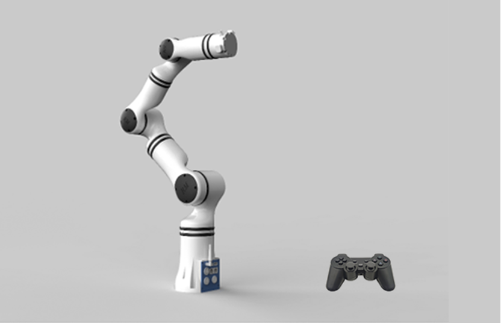

<center>Diagram</center>

### Overview of handle

The handle utilizes 2.4 GHz technology for wireless communication and is equipped with a receiver. It has a working radius of 15 m (this distance is dependent upon the service environment), and consists of 15 keys and two joysticks.

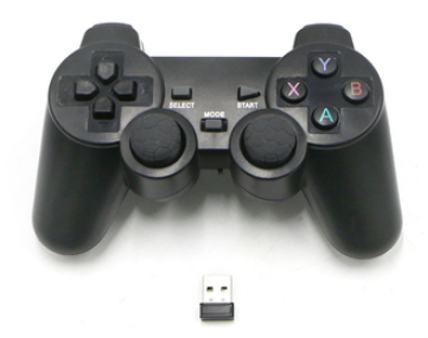

<center>Picture of handle</center>

### Control method

1. Make sure that the robotic arm is dis-energized, and install the 2.4 GHz receiver into USB port, as shown in follow Figure.

  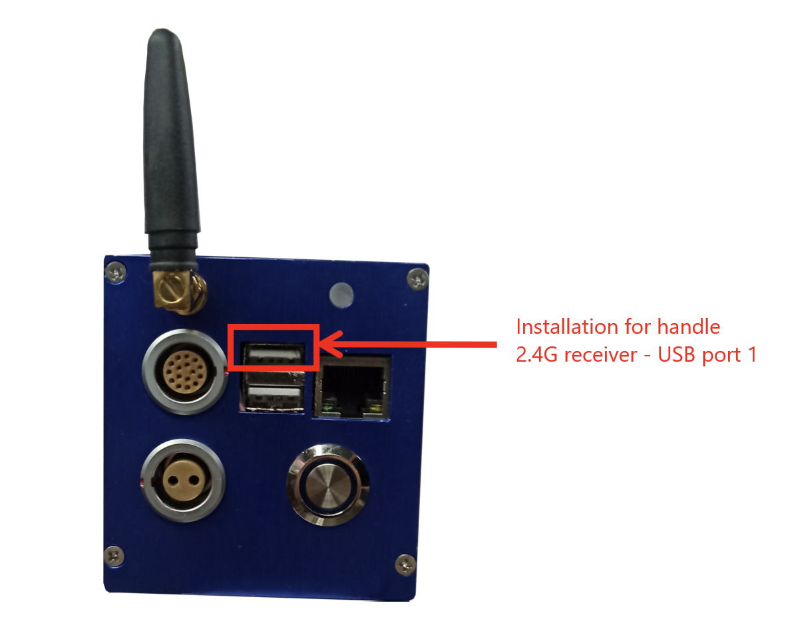

  <center>Installation of handle receiver</center>

2. Wait for the robotic arm to get started, and switch the handle's on/off key to "ON". Turn on the power supply to the handle. When the controller beeper emits a beep, it indicates that the connection is successful.

  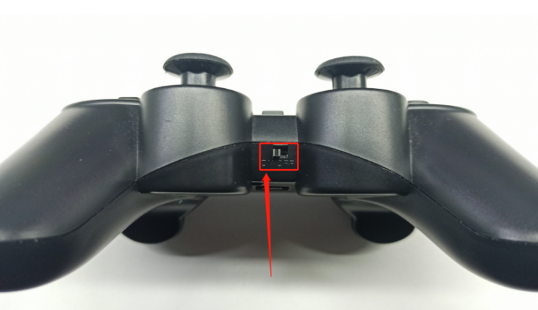

  <center>On/off key of handle</center>

3. Introduction to keys and control modes of the handle.

  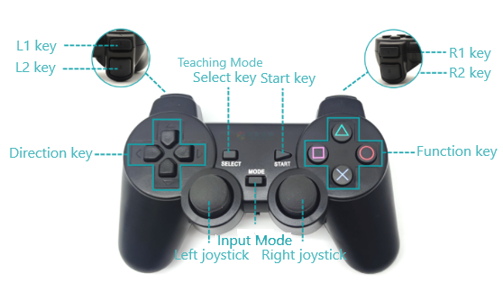

  <center>Keys on the handle</center>

  - **SELECT Button**: A short press toggles between position and attitude teaching and joint teaching control.
  - **MODE Button**: A long press switches the handle mode. The indicator light at the front of the handle can switch between red and green, representing XInput and DirectInput handle modes respectively. A successful mode switch is confirmed by a beep from the controller when the button is held down.

#### Position and orientation control mode

Before switching to the position and orientation control mode, it is necessary to adjust the robotic arm to resemble the configuration shown in Figure 12.6 either through drag-and-drop teaching or single-joint control mode, to facilitate position and orientation control. The left direction keys, and L1 and L2 keys on the handle shown in the position and attitude diagram respectively control the motions of the robotic arm in X+, X-, Y+, Y-, Z+, and Z- directions. See follow Table for details.

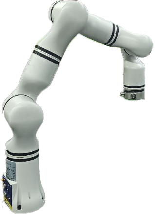

<center>Orientation of robotic arm before position and orientation control through the handle</center>

#### Single-joint control mode

After switching to the single-joint control mode, the left direction keys, L1 and L2 keys, the right function keys, and R1 and R2 keys on the handle respectively control the forward and reverse motions of each joint.

Functions of handle keys

<table>
  <tr>
    <th>Handle keys</th>
    <th>How to use</th>
    <th>Position and orientation control mode</th>
    <th>Single-joint control mode</th>
  </tr>
  <tr>
    <td>MODE key</td>
    <td>Press</td>
    <td colspan="2" style="text-align: center;">Switch between two modes</td>
  </tr>
  <tr>
    <td>Left direction key - Up</td>
    <td>Press/Hold</td>
    <td>Motion in Y+ direction on base frame</td>
    <td>Joint 1 moves in the forward direction</td>
  </tr>
  <tr>
    <td>Left direction key - Down</td>
    <td>Press/Hold</td>
    <td>Motion in Y- direction on base frame</td>
    <td>Joint 1 moves in the reverse direction</td>
  </tr>
  <tr>
    <td>Left direction key - Left</td>
    <td>Press/Hold</td>
    <td>Motion in X+ direction on base frame</td>
    <td>Joint 2 moves in the forward direction</td>
  </tr>
  <tr>
    <td>Left direction key - Right</td>
    <td>Press/Hold</td>
    <td>Motion in X- direction on base frame</td>
    <td>Joint 2 moves in the reverse direction</td>
  </tr>
  <tr>
    <td>Left L1 key</td>
    <td>Press/Hold</td>
    <td>Motion in Z+ direction on base frame</td>
    <td>Joint 3 moves in the forward direction</td>
  </tr>
  <tr>
    <td>Left L2 key</td>
    <td>Press/Hold</td>
    <td>Motion in Z- direction on base frame</td>
    <td>Joint 3 moves in the reverse direction</td>
  </tr>
  <tr>
    <td>Right function key - Y</td>
    <td>Press/Hold</td>
    <td>Orientation change in Y+ direction</td>
    <td>Joint 4 moves in the forward direction</td>
  </tr>
  <tr>
    <td>Right function key - A</td>
    <td>Press/Hold</td>
    <td>Orientation change in Y- direction</td>
    <td>Joint 4 moves in the reverse direction</td>
  </tr>
  <tr>
    <td>Right function key - X</td>
    <td>Press/Hold</td>
    <td>Orientation change in X+ direction</td>
    <td>Joint 5 moves in the forward direction</td>
  </tr>
  <tr>
    <td>Right function key - B</td>
    <td>Press/Hold</td>
    <td>Orientation change in X- direction</td>
    <td>Joint 5 moves in the reverse direction</td>
  </tr>
  <tr>
    <td>Right R1 key</td>
    <td>Press/Hold</td>
    <td>Orientation change in Z+ direction</td>
    <td>Joint 6 moves in the forward direction.</td>
  </tr>
  <tr>
    <td>Right R2 key</td>
    <td>Press/Hold</td>
    <td>Orientation change in Z- direction</td>
    <td>Joint 6 moves in the reverse direction</td>
  </tr>
</table>

## IO extension

### Function introduction

In different scenarios, the number of IOs of the robotic arm may not be enough to meet the actual demand. In this case, an external IO controller is needed. The external IO controller mentioned herein can connect eight external digital input sensors and eight external digital output signal ports.

Both the bottom controller of the robotic arm and the end of the robotic arm can connect external IO controllers. Here an example of a connection to the interface of the robotic arm controller is given. If customers wish to connect an external IO controller to the interface at the end of the robotic arm, please refer to the robotic arm protocol or interface document.

### Use of serial IO controller

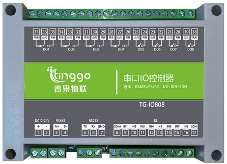

<center>Serial IO controller</center>

#### Equipment wiring

| Interface at end of robotic arm        | Serial IO controller |
|-----------------------|--------------|
| Power output (pink/brown) | DC12−24 V +   |
| Power supply GND (gray/purple)  | DC12−24 V -   |
| RS485_A (yellow)     | RS485A       |
| RS485_B (green and yellow)   | RS485B       |

The power supply to the IO controller has a wide-range voltage from 12 V to 24 V. After the wiring is completed, it is necessary to set the robotic arm controller to output the corresponding voltage according to the power supply required by the sensor.

**Serial IO controller and 16-wire cable**  

| 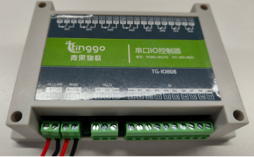 | 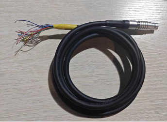 |
|---------------------------------------------------------------------------|-------------------------------------------|
| Wiring of controller: 485 interface and 24 V power supply                                              | Wiring of controller: connection of physical wires                  |

#### Setting of communication and power supply of robotic arm

The robotic arm supports multiple methods to start the end communication and power supply. In this document, the JSON protocol is used as an example.<br>

Use SocketTool to send the following JSON protocol string to the controller through TCP:

1. Configure the communication port ModbusRTU mode.

```json
{"command":"set_modbus_mode","port":0,"baudrate":9600,"timeout":20}
```

After the command is issued successfully, the SocketTool will receive feedback from the controller, as shown below:

```json
{"command":"set_modbus_mode","set_state":true}
```

- If the returned value of set_state is true, it indicates that the setting is successful.

- If the returned value of set_state is false, it indicates that the setting fails.

2. Set the power output (Gen 3 controller) with an output voltage of 24 V.

```json
{"command":"set_voltage","voltage_type":3}
```

After the command is issued successfully, the SocketTool will receive feedback from the controller, as shown below:

```json
{"command":"set_voltage","state":true}
```

3. Write single-coil data, and set relay 1 of serial IO controller to output.

```json
{"command":"write_single_coil","port":0,"address":1,"data":1,"device":1}
```

After the command is issued successfully, the SocketTool will receive feedback from the controller, as shown below:

```json
{"command":"write_single_coil","write_state":true}
```

4. Write single-coil data, and set relay 1 of serial IO controller to close the output.

```json
{"command":"write_single_coil","port":0,"address":1,"data":0,"device":1}
```

After the command is issued successfully, the SocketTool will receive feedback from the controller, as shown below:

```json
{"command":"write_single_coil","write_state":true} 
```

5. Read the discrete input, and read signal 0.

```json
{"command":"read_input_status","port":0,"address":0,"num":1,"device":1}
```

After the command is issued successfully, the SocketTool will receive feedback from the controller, as shown below:

```json
{"command":"input_status","read_state":true}
```

6. The test completes. Close the communication port ModbusRTU mode.

```json
{"command":"close_modbus_mode","port":0}
```

After the command is issued successfully, the SocketTool will receive feedback from the controller, as shown below:

```json
{"command":"close_modbus_mode","set_state":true}
```

7. Set the power output (Gen 3 controller) with an output voltage of 0 V.

```json
{"command":"set_voltage","voltage_type":0}
```

After the command is issued successfully, the SocketTool will receive feedback from the controller, as shown below:

```json
{"command":"set_voltage","state":true}
```

## Field-effect transistor module

### Function introduction

There are four channels of multiplexing digital IO at the controller position of the robotic arm, which can be switched to digital output through the teach pendant or commands, but the default output current is 2 mA only. For control of high-power equipment, such as motors, bulbs, relays, and solenoid valves, the field-effect transistor module can be optionally configured.

The controlled power at the output end of field-effect transistor module is within 100 W.

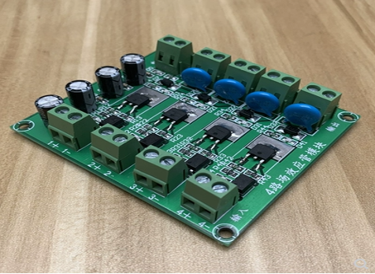

<center>Field-effect transistor module</center>

### Use of field-effect transistor module

The robotic arm IOs should be set to the output mode, and connect the input signals of the field-effect transistor module respectively.

The specific wiring method is as shown in the figure below:

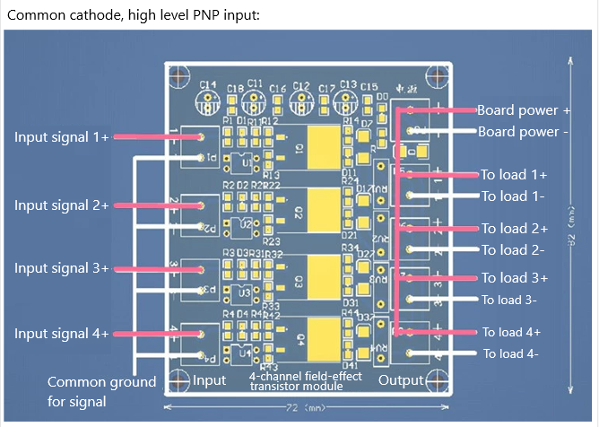

<center>Wiring diagram of field-effect transistor module</center>
