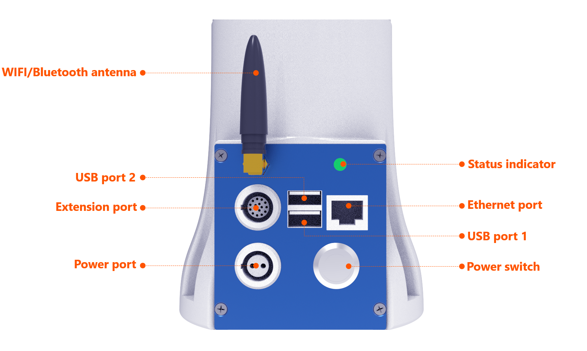
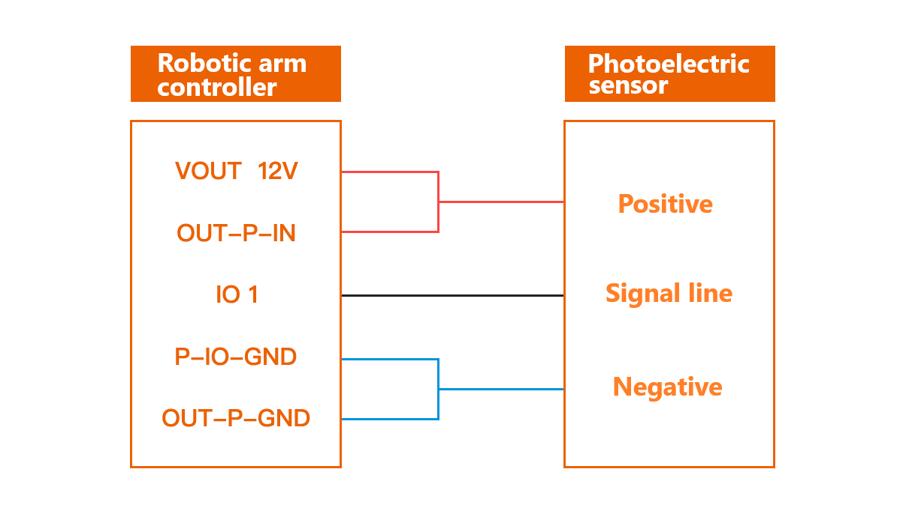
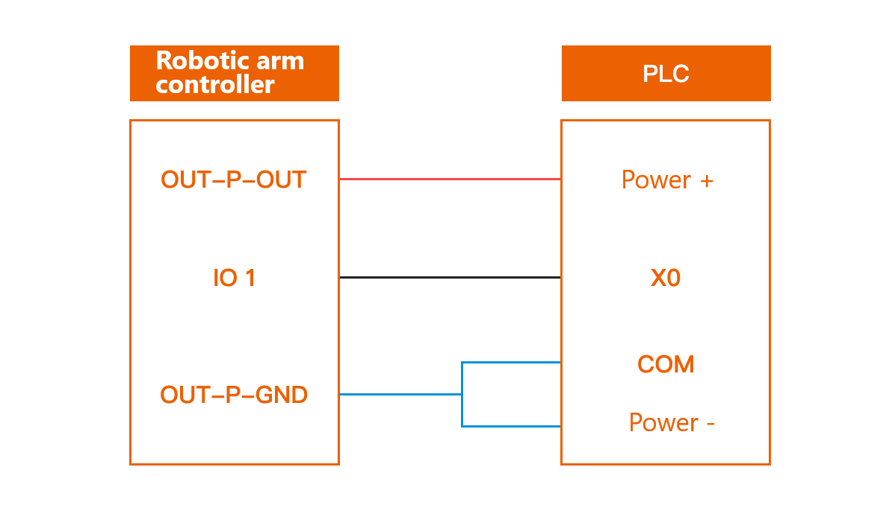
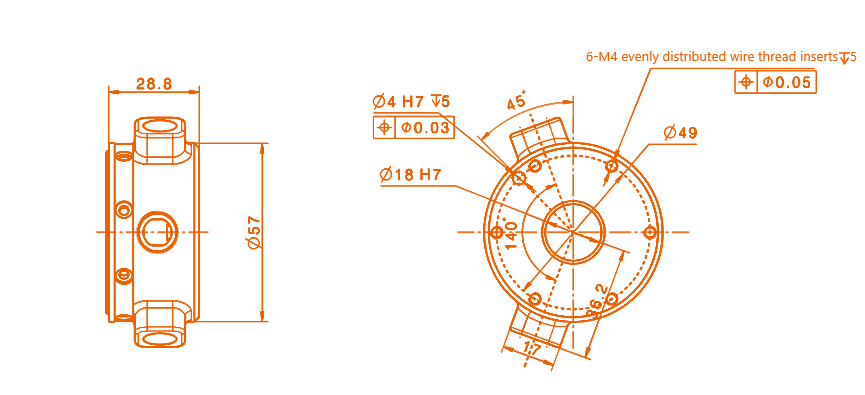
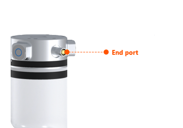
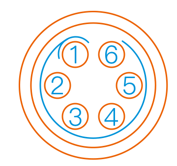

# 
Start Guide: 
Hardware Interfaces

## Components of robotic arm

Realman's collaborative robot system is mainly composed of the robot body, controller (integrated in the robot base), and teach pendant touch pad (optional).

### Controller

| **No.** | **Interface**      | **Function** |
|----------|---------------|-----|
| 1        | Power switch        | Control the power supply to the robot, and the blue indicator light is on after being turned on      |
| 2        | Power port      | Insert the power cord  |
| 3        | Extension port      | Lead out the RS485, I/O, and other interfaces of the controller        |
| 4        | WIFI/Bluetooth antenna | For wireless communication                     |
| 5        | USB port 1      | Extension interface, for connecting external handle receiver        |
| 6        | USB port 2      | Used as a virtual network interface                  |
| 7        | Ethernet port     | Gigabit wired network interface, Communication network interface                        |
| 8        | Status indicator    | Change among blue, white, green, yellow, and red with the status of robotic arm  ①Blue indicates controller start and initialization; ②White indicates joint start and initialization; ③Green indicates normal operation of robotic arm; ④Yellow indicates the warning of a common fault, which must be handled immediately; ⑤Red indicates a major fault, which must be handled immediately. |

#### 
16-Pin Aviation Connector Cable

There is a 16-core connector on the robot controller panel, from which all I/Os of the robot are led out, as shown in the figure below.

::: warning
Hot plugging of an aerial plug is not allowed during wiring. When inserting the aerial plug, make sure that the pin is aligned with the hole position and check whether the pin is normal.
:::

I/O interface diagram

The definitions of wires are explained in the table below.

| No. | First-generation cable wiring sequence |Second-generation cable wiring sequence| Definition  | Description |Wire number (for second-generation cables only) | Remarks    |
|------|------------|-----------|------------------|---------|-|-|
| 1    | Pink and brown |Black stripe brown/brown| VOUT      | External output +       |NO.1| 12 V/24 V |
| 2    | Gray and purple |Gray/purple| P_IO_GND  | External output -       |NO.2|         |
| 3    | Yellow       |Yellow| 485A      |                  |NO.3|         |
| 4    | Yellow and green     |Black stripe yellow| 485B      |                 |NO.4 |         |
| 5    | Purple and white       |Black stripe white| IO1       | Multiplexible IO         |NO.5|         |
| 6    | Red and white       |White stripe red| IO2       | Multiplexible IO         |NO.6|         |
| 7    | Green and white       |Black stripe green| IO3       | Multiplexible IO         |NO.7|         |
| 8    | Yellow and white       |White stripe black| IO4     | Multiplexible IO   |NO.8|         |
| 9    | Blue and white       |Black stripe orange| OUT_P_IN  | Digital power supply for external input |NO.9| 0−24 V  |
| 10   | Light blue       |Black stripe blue| OUT_P_OUT | Digital power supply for external output |NO.10| 0−24 V  |
| 11   | Deep blue       |Blue| OUT_P_GND | External digital ground      |NO.11 |         |
| 12   | Green         |Green| FDCAN_A   | CAN_H            |NO.12|         |
| 13   | Red         |Red| FDCAN_B   | CAN_L            |NO.13|         |
| 14   | White         |White|Blank | Reserved |NO.14|         |
| 15   | Black         |Black| Blank        | Reserved             |NO.15|         |
| 16   | Orange         |Orange| Blank        | Reserved             |NO.16|         |

::: warning

The voltage of digital I/O is determined based on the reference voltage connected, and the 16-core extension interface cable of robotic arm provides only 12 V and 24 V power supply voltages. If other output voltages are required for the digital I/O, then reference voltages need to be led in from the pins OUT_P_OUT+, OUT_P_IN+, and OUT_P_GND.
:::

#### Power output

The 16-core cable of robot outputs 12 V/24 V power (in the case of 24 V output voltage, the actual output voltage is the same as the power voltage of the robot, and if the power voltage is unstable, the output voltage will be affected). The power output type is configured and controlled through the teach pendant or JSON protocol. The electrical characteristics are listed in the following table.

| Parameter     | Minimum | Typical | Maximum | Unit |
|----------|--------|--------|--------|------|
| Power voltage | 0      | ——     | 24     | V    |
| Power current | ——     | 1,000   | 1,500   | mA   |

::: warning
When the controller power supply is used as the power supply to external devices, the current parameter limits specified in the above table must be followed to prevent overload and burning of the controller.
:::

#### Digital input

The controller interface has four channels of digital inputs, and users need to connect the external input digital power channel (OUT_P_IN+) and the external digital ground channel (OUT_P_GND) to provide level reference for the digital inputs. The electrical characteristics are listed in the following table.

| Digital input    | Minimum  | Typical | Maximum | Unit |
|-------------|---------|--------|--------|------|
| Input power Vin | 0       | —      | 24     | V    |
| Input voltage    | -0.5    |        | 24     | V    |
| Low logic level  |         |        | 1      | V    |
| High logic level  | Vin-0.5 |        |        | V    |

With the wiring of NPN photoelectric sensor as an example, the input reference level of robotic arm adopts the 12 V power supply of the 16-core aerial plug cord, and the wiring is as shown in the following figure:

Digital input with internal power supply

#### Digital output

The controller interface has four channels of digital outputs, and users need to connect the external output digital power channel (OUT_P_OUT+) and the external digital ground channel (OUT_P_GND) to provide level reference for the digital outputs. The electrical characteristics are listed in the following table.

| Digital output    | Minimum | Typical | Maximum | Unit |
|-------------|--------|--------|--------|------|
| Input power Vin | 0      | —      | 24     | V    |
| Input current    | —      | —      | 2      | mA   |

When the digital output signal of robotic arm is connected with an external device, the power supply to the external device can be used as the reference level of the output end of robotic arm, which shall be no higher than 24 V. The wiring mode is as shown in the figure below.

Digital output with external power supply

Note: The maximum output current of digital output signal is 2 mA, which can be amplified by installing field effect modules.

#### IO multiplexing

The I/O of 16-core cable supports the multiplexing function, which, through the program command or web-end teach pendant, can be switched to:

|NO.| Input (NPN type)                                      |
|--|----------------------------------------------------|
|1| Output (with a maximum current of 2 mA)                                |
|2| Input start function multiplexing mode                               |
|3| Input suspension function multiplexing mode                               |
|4| Input resumption function multiplexing mode                               |
|5| Input emergency stop function multiplexing mode                               |
|6| Input into current loop drag mode                             |
|7| Input into position-only drag mode (available for the six-axis force version)     |
|8| Input into orientation-only drag mode (available for the six-axis force version)     |
|9| Input into combined position and orientation drag multiplexing mode (available for the six-axis force version) |
|10| Input external axis maximum soft limit multiplexing mode (available in the external axis mode)   |
|11| Input external axis minimum soft limit multiplexing mode (available in the external axis mode)   |

### End extension

To make it easy for users to connect tools at the end of the robot, a mounting flange and a communication interface are reserved at the end. There are two buttons on the flange housing, which are used to control the drag teaching and trajectory reproduction, respectively. The following introduces the end dimensions and flange installation method:

The communication end interface is a 6-core connector, which provides power and control signals for the various grippers and sensors connected to the robot.

End tool interface

::: warning
When inserting and pulling out the aerial plug cable of end interface board, make sure that the power output at the end is turned off; otherwise, there is a risk of damage to the hardware. When inserting the aerial plug, make sure that the pin is aligned with the hole position and check whether the pin is normal.
:::

The functional interfaces are listed in the table below.

| No. | Interface type             | Quantity        | Function                                  |
|------|----------------------|-------------|---------------------------------------|
| 1    | Power output             | One channel         | 12 V/24 V available, on/off controlled        |
| 2    | Digital output             | A maximum of two channels supported | Reference level same as the power output, only 12 V/24 V supported |
| 3    | Digital input             | A maximum of two channels supported | Reference level same as the power output, only 12 V/24 V supported |
| 4    | RS485                | One channel         | Communicate with peripherals of RS485 interface                   |
| 5    | Drag teaching button (green) | One channel         | Press and hold the button, and the robot will enter the drag teaching mode      |
| 6    | Trajectory reproduction button (blue) | One channel         | Press the button, and the robot will reproduce the drag teaching trajectory   Press and hold to start the robotic arm moving to the initial position. Release to stop         |

#### 
6-Pin Aviation Connector Cable

The end tool interface connects external tools through a 6-core aerial plug. The pins and definitions of the aerial plug are as follows.

Definitions of external pins of tool end aerial plug

| **Pin No.** | **Wire color** | **Function**                                 |
|--------------|--------------|------------------------------------------|
| 1            | Yellow           | RS485_A                                  |
| 2            | White           | RS485_B                                  |
| 3            | Red           | Digital interface 1 (DI1/DO1)                     |
| 4            | Black           | Digital interface 2 (DI2/DO2)                     |
| 5            | Green           | Power GND                                  |
| 6            | Blue           | Power output: 0 V/12 V/24 V, controllable by program |

::: warning
The multiplexing functions in the table above are switched by program commands. Pin 3 and pin 4 are digital input channels (DI1 and DI2) by default before delivery, and the power output of pin 6 is 0 V (programmed).
:::

#### Digital I/O input

There are two digital input channels at the tool end, and the electrical characteristics are listed in the following table.

| Digital input    | Minimum  | Typical | Maximum | Unit |
|-------------|---------|--------|--------|------|
| Input power Vin | 0       | ——     | 24     | V    |
| Input voltage    | -0.5    |        | 24     | V    |
| Low logic level  |         |        | 1      | V    |
| High logic level  | Vin-0.5 |        |        | V    |

#### Digital I/O output

There are two digital output channels at the tool end, which is directly configured through the teach pendant or the controller based on the JSON protocol. The electrical characteristics are listed in the following table.

| Digital output    | Minimum | Typical | Maximum | Unit |
|-------------|--------|--------|--------|------|
| Input power Vin | 0      | ——     | 24     | V    |

#### Power output

The robot end outputs 12 V/24 V power (in the case of 24 V output voltage, the actual output voltage is the same as the power voltage of the robot, and if the power voltage is unstable, the output voltage will be affected). The power output type is configured and controlled through the teach pendant or JSON protocol. The electrical characteristics are listed in the following table.

| Parameter     | Minimum | Typical | Maximum | Unit |
|----------|--------|--------|--------|------|
| Power voltage | 0      | ——     | 24     | V    |
| Power current | ——     | 1,000   | 1,500   | mA   |

::: warning
When the robot end power supply is used as the power supply to end effector, the current parameter limits specified in the above table must be followed to prevent overload and burning of the end interface board.
:::

#### Communication interface

There is an RS485 communication interface respectively at the 16-core aerial plug of the controller and the 6-core aerial plug of the end interface board (they are only used for the robot to control external devices, but not for external devices to control the robot's motion). The two RS485 interfaces can be configured to standard Modbus RTU mode through the JSON protocol (to ensure the communication stability of RS485 interfaces, the devices shall be connected to the GND of the robotic arm as practical as possible). Then the peripherals connected to the interface can be read or written through the JSON protocol.
