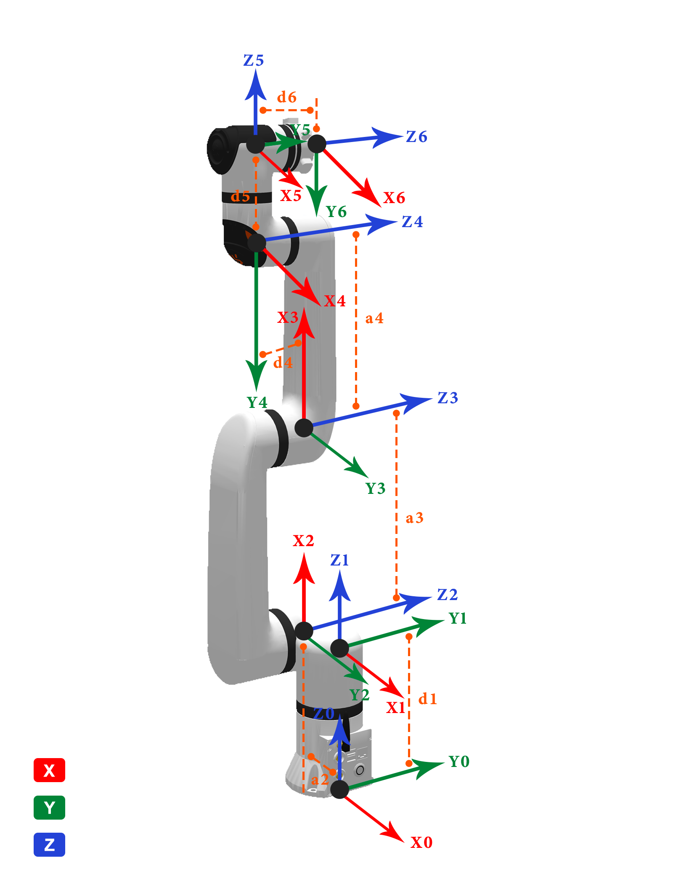
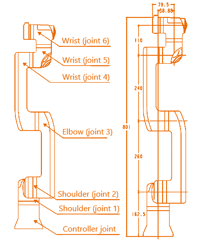
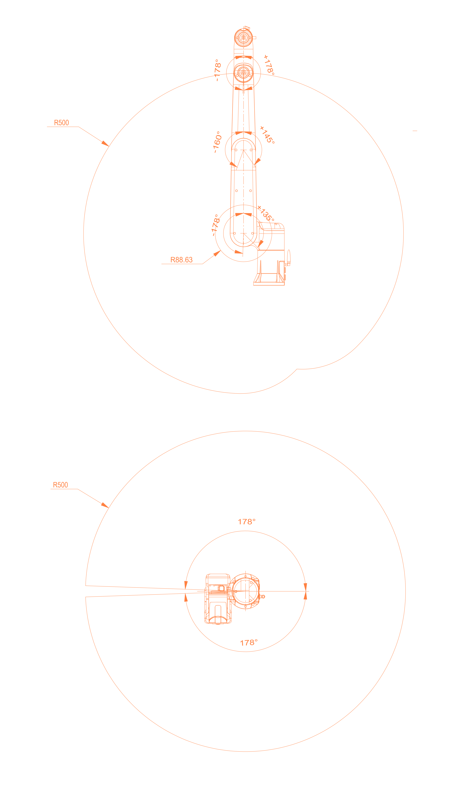
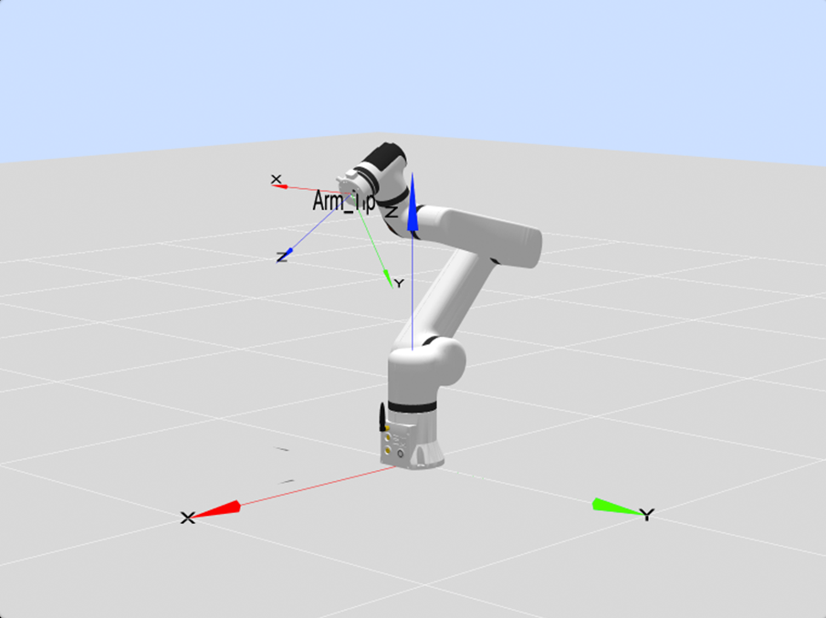
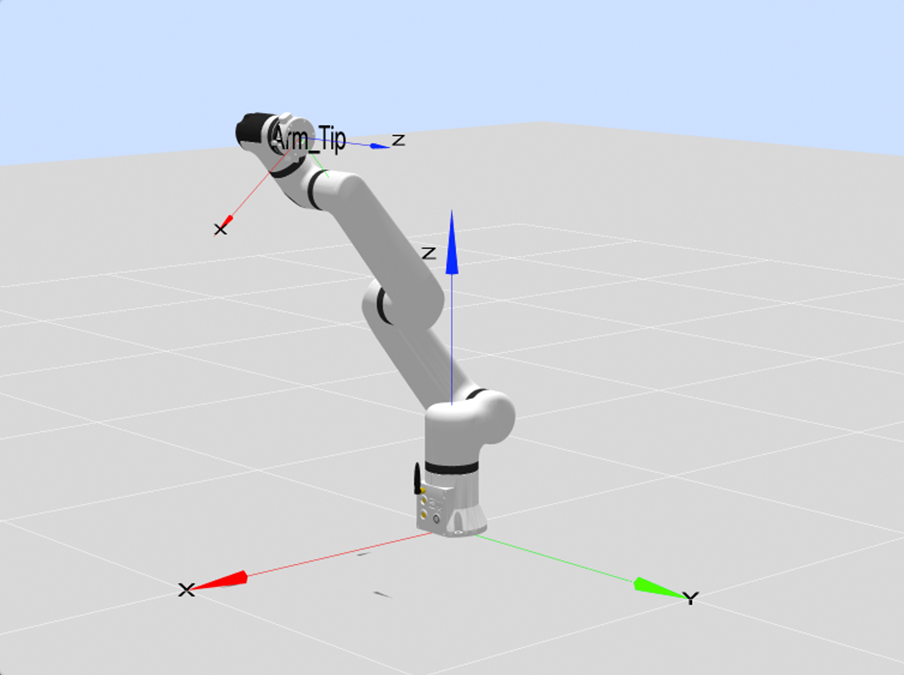
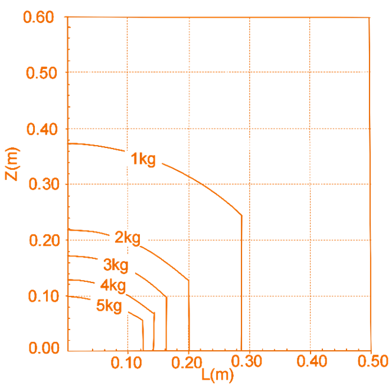
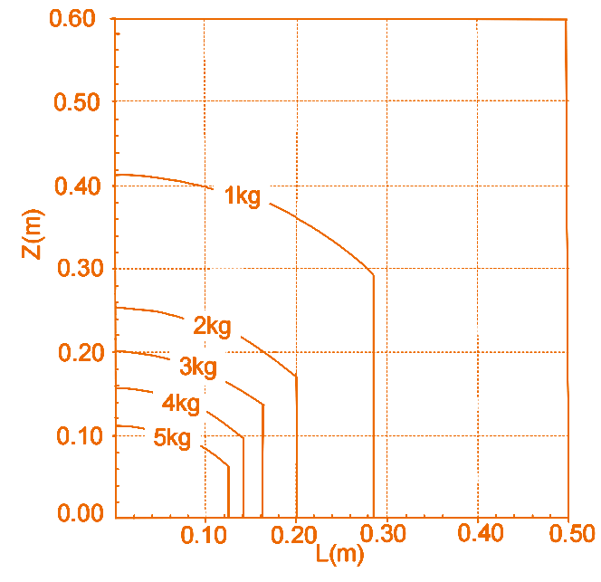

# 
Ontology Parameters: 
ECO65 Series Parameters and D-H Model

## Basic Parameters

<table>
    <tr>
        <th colspan="2">Parameter Name</th>
        <th>Parameter Value</th>
    </tr>
    <tr>
        <th rowspan="13">Basic Parameters</th>
        <th>Degrees of Freedom</th>
        <td>6</td>
    </tr>
    <tr>
        <th>Configuration</th>
        <td>Collaborative Arm Configuration</td>
    </tr>
    <tr>
        <th>Joint Brake Type</th>
        <td>Joints 1 to 6: Hard Brake</td>
    </tr>
    <tr>
        <th>Working Radius/mm</th>
        <td>610</td>
    </tr>
    <tr>
        <th>Payload/kg</th>
        <td>5</td>
    </tr>
    <tr>
        <th>Self-weight/kg</th>
        <td>Standard Version: 7.8 Six-Axis Force Version: 7.9</td>
    </tr>
    <tr>
        <th>Repeatability/mm</th>
        <td>±0.05</td>
    </tr>
    <tr>
        <th>TCP Line Speed/m/s</th>
        <td>≤1.8</td>
    </tr>
    <tr>
        <th>Typical Power/W</th>
        <td>≤100</td>
    </tr>
    <tr>
        <th>Peak Power/W</th>
        <td>≤200</td>
    </tr>
    <tr>
        <th>Installation Angle</th>
        <td>Any Angle</td>
    </tr>
    <tr>
        <th>Base Dimensions/mm</th>
        <td>φ107</td>
    </tr>
    <tr>
        <th>Material</th>
        <td>Aluminum Alloy/ABS</td>
    </tr>
    <tr>
        <th rowspan="3">Environmental Adaptability</th>
        <th>Operating Temperature/℃</th>
        <td>0-45</td>
    </tr>
    <tr>
        <th>Operating Humidity</th>
        <td>25~85% Non-condensing</td>
    </tr>
    <tr>
        <th>Protection Level</th>
        <td>Body IP54</td>
    </tr>
    <tr>
        <th rowspan="6">Motion Angle Range/°</th>
        <th>J1</th>
        <td>-178~+178</td>
    </tr>
    <tr>
        <th>J2</th>
        <td>-178~+135</td>
    </tr>
    <tr>
        <th>J3</th>
        <td>-160~+145</td>
    </tr>
    <tr>
        <th>J4</th>
        <td>-178~+178</td>
    </tr>
    <tr>
        <th>J5</th>
        <td>-178~+178</td>
    </tr>
    <tr>
        <th>J6</th>
        <td>-360~+360</td>
    </tr>
    <tr>
        <th rowspan="6">Maximum Angular Velocity/°/s</th>
        <th>J1</th>
        <td>180</td>
    </tr>
    <tr>
        <th>J2</th>
        <td>180</td>
    </tr>
    <tr>
        <th>J3</th>
        <td>225</td>
    </tr>
    <tr>
        <th>J4</th>
        <td>225</td>
    </tr>
    <tr>
        <th>J5</th>
        <td>225</td>
    </tr>
    <tr>
        <th>J6</th>
        <td>225</td>
    </tr>
    <tr>
        <th rowspan="2">Force Control Specifications (Supported only by 6-DoF sensors)</th>
        <th>Six-Axis Force Range</th>
        <td>200N/7N·m</td>
    </tr>
    <tr>
        <th>Six-Axis Force Accuracy</th>
        <td>±0.5%FS</td>
    </tr>
</table>

## Ontology Parameters

**MDH model frame:**

  

**MDH parameters of ECO65 (modified D-H parameters):**

|Joint No.(i)|$a_{i-1}$(mm)|$\alpha_{i -1}$(°)|$d_i$(mm)|$θ_i$ / $offset_i$(°)|
|:--|:--|:--|:--|:--|
|   1   |   0  |   0  | 162.5  |    0  |
|   2   | -86  | -90  |   0    |  -90  |
|   3   | 260  |   0  |   0    |    0  |
|   4   | 240  |   0  | -58.88 |   90  |
|   5   |   0  |  90  |  110   |    0  |
|   6   |   0  | -90  |  $d_6$ |    0  |

- ECO65-B &nbsp;&nbsp;&nbsp;&nbsp;: $d_6=79.5$ mm
- ECO63-6FB: $d_6=96.7$ mm
- ECO65-6F &nbsp;&nbsp;: $d_6=108$ mm

Note: offset refers to the offset of the joint zero position from the model zero position, that is, `model angle = joint angle + offset`.

### Kinetic parameters of ECO65 robot link

|   joint_id(i)   |  1    |  2    |  3    |  4    |  5    |  6    |  -    |-|
|:--   |:--    |:--    |:--    |:--    |:--    |:--    |:--    |:--|
| **$m$**       | 1.508  | 2.023  | 1.886  | 0.570  | 0.641  | 0.107  | 0.248  |0.189|
| **$x$**       | -11.055| 58.186 | 92.768 | -0.040 | -0.040 | -0.506 | -0.426 |-0.352|
| **$y$**       | 0.027  | -0.012 | -0.094 | -34.960| 22.647 | 0.255  | 0.237  |-0.067|
| **$z$**       | -33.473| -52.364| 1.811  | 3.802  | -7.366 | -10.801| -27.223|-18.302|
| **$L_{xx}$**  | 3648.222 | 7820.980 | 1922.701 | 1202.616 | 987.154 | 50.918 | 308.844 |133.613|
| **$L_{xy}$**  | -22.882 | -4.845  | 13.151| -0.267  | 0.046 | -3.136 | -3.781 |0.522|
| **$L_{xz}$**  | -25.494 |7604.590| -2010.953 | 0.705 | -0.749  | -0.699 | -1.468 |1.623|
| **$L_{yy}$**  |4975.281| 29709.375 | 38718.526 | 324.974 | 428.173 | 47.420 | 304.616 |130.260|
| **$L_{yz}$**  | 10.516| -4.192  | 4.827 | 0.000  | -6.408  | 0.388  | 0.888  |0.531|
| **$L_{zz}$**  | 2611.768 | 24073.795 | 38122.090 | 1163.421 | 886.381 | 60.350 | 122.620 |89.503|
| **Remarks**       |         |         |         |         |         | B       | 6F     |6FB|

Description:

- $m$ is the mass of the link, $kg$
- $x$ is the x-coordinate of the center of mass of link, $mm$
- $y$ is the y-coordinate of the center of mass of link, $mm$
- $z$ is the z-coordinate of the center of mass of link, $mm$
- $L_{xx}$,$L_{xy}$,$L_{xz}$,$L_{yy}$,$L_{yz}$,$L_{zz}$ is the principal moment of inertia described in the link frame, $kg·mm²$
- B: standard version, 6FB: Six-Axis Force L Version, 6F: six-axis force K version

Remarks:

- Source of data: CAD design values.
- If the inertial parameters in the center of mass frame are required, they can be calculated based on the parallel axis theorem, as stated below.

---

Assuming there is an output frame $\{i\}$, the center of mass frame coinciding with this coordinate system $\{i\}$ is $\{c\}$, and the coordinates of the center of mass in this frame $\{i\}$ are $P_c = [x_c  , y_c, z_c]^T$, then according to the parallel axis theorem:

$$I_c = L_i - m (P_{c}^{T}P_cI_{3×3} - P_cP_{c}^{T})$$

Where,
$$
L_i = \begin{bmatrix}L_{xx} & L_{xy} & L_{xz} \\ L_{xy} & L_{yy} & L_{yz} \\ L_{xz} & L_{yz} & L_{zz}\end{bmatrix}
$$

### Distribution and dimensions of joints

The ECO65-B humanoid robotic arm has six rotating joints, each of which represents one degree of freedom. As shown in the figure below, robot joints include the shoulders (joint 1 and joint 2), elbow (joint 3), and wrists (joint 4, joint 5, and joint 6).

#### Workspace

The workspace of ECO65-B is a sphere with a working radius of 610 mm, in addition to the cylindrical space directly above and below the base. When determining the installation position of the robot, due considerations must be given to the cylindrical space directly above and below the robot, to avoid moving tools to this cylindrical space as much as possible. Furthermore, in actual applications, the motion ranges of all joints are as follows: joint 1: ±178°; joint 2: -178° to +135°; joint 3: -160° to +145°; joint 4: ±178°; joint 5: ±178°; joint 6: ±360°.

Illustration of space within the reach of robot

#### Motion singularities

##### Shoulder singularity

This robotic arm has proper configuration to avoid shoulder singularities, but when the intersection of axis 5 and axis 6 is close to the axis of joint 1, the robot approaches a shoulder singularity, and will motion significantly. The indicated point is [0,-45,120,-45,-90,0], as shown in the figure below:

Shoulder singularity

##### Elbow singularity

q3=0, co-plane of axis of joint 2, joint 3, and joint 4, i.e. the point format is [x,x,0,x,x,x], indicated point [-90,-60,0,0,90,0], as shown in the figure below:

Elbow singularity

##### Wrist singularity

Axis of joint 4 parallel to axis of joint 6, q5=0, i.e. the point format is [x,x,x,x,0,x], indicated point [-90,-45,90,0,0,0], as shown in the figure below:

Wrist singularity

##### Boundary singularity

The special situation with the end of robotic arm reaching the farthest end, q3=0, and co-plane of axis of joint 2, joint 3, joint 4, and joint 6, i.e. the point format is [x,x,0,x,0,x]. The indicated point is [0,40,0,0,0,0], as shown in the figure below:

Boundary singularity 1

#### Load curves

Represent the curves of end load of ECO65-B and ECO65-6F and ECO65-6FB. Where, L refers to the radial distance of the center of mass of end load against the plane of end flange, and Z refers to the normal distance of the center of mass of end load against the plane of end flange.

End load curves of ECO65-B

End load curves of ECO65-6F

End load curves of ECO65-6FB

