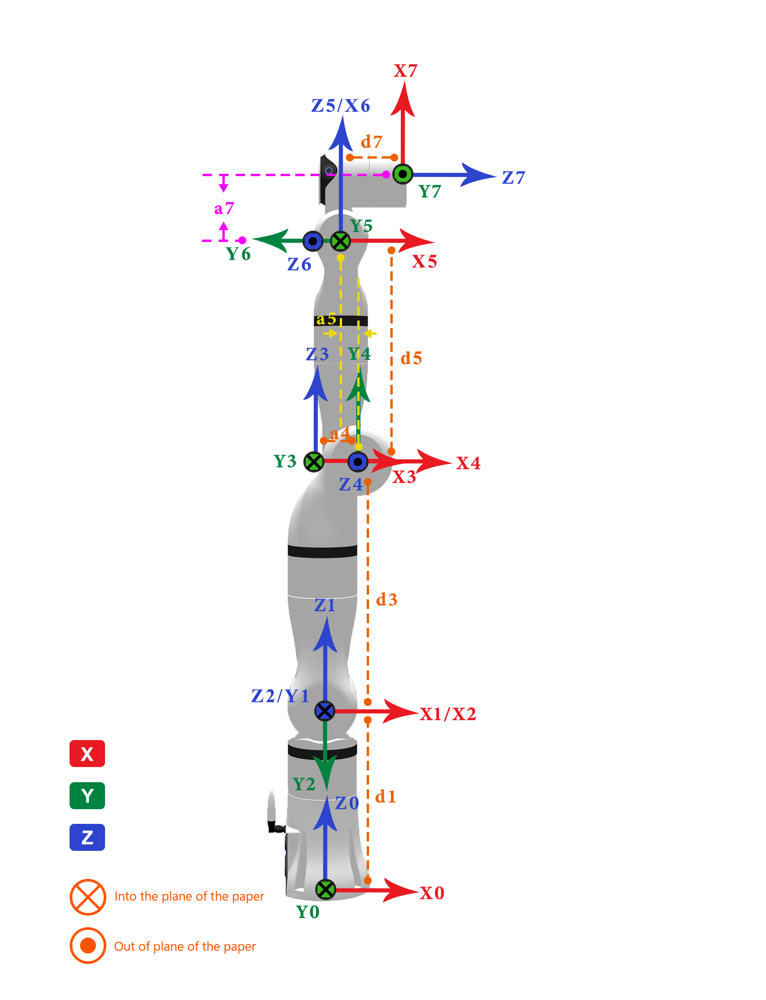
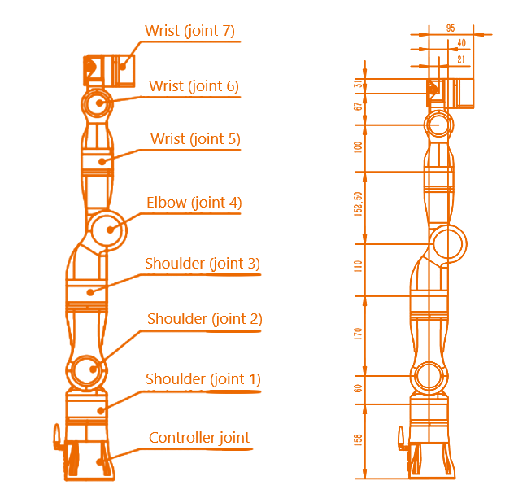

# 
Ontology Parameters: 
GEN72 Series Parameters and D-H Model

## Basic Parameters

<table>
    <tr>
        <th colspan="2">Parameter Name</th>
        <th>Parameter Value</th>
    </tr>
    <tr>
        <th rowspan="13">Basic Parameters</th>
        <th>Degrees of Freedom</th>
        <td>7</td>
    </tr>
    <tr>
        <th>Configuration</th>
        <td>Humanoid Configuration</td>
    </tr>
    <tr>
        <th>Joint Brake Type</th>
        <td>Joints 1 to 7: Soft Brake</td>
    </tr>
    <tr>
        <th>Working Radius/mm</th>
        <td>600</td>
    </tr>
    <tr>
        <th>Payload/kg</th>
        <td>2</td>
    </tr>
    <tr>
        <th>Self-weight/kg</th>
        <td>6.6</td>
    </tr>
    <tr>
        <th>Repeatability/mm</th>
        <td>±1</td>
    </tr>
    <tr>
        <th>TCP Line Speed/m/s</th>
        <td>≤1.8</td>
    </tr>
    <tr>
        <th>Typical Power/W</th>
        <td>≤100</td>
    </tr>
    <tr>
        <th>Peak Power/W</th>
        <td>≤200</td>
    </tr>
    <tr>
        <th>Installation Angle</th>
        <td>Any Angle</td>
    </tr>
    <tr>
        <th>Base Dimensions/mm</th>
        <td>φ107</td>
    </tr>
    <tr>
        <th>Material</th>
        <td>Aluminum Alloy/ABS</td>
    </tr>
    <tr>
        <th rowspan="3">Environmental Adaptability</th>
        <th>Operating Temperature/℃</th>
        <td>0-45</td>
    </tr>
    <tr>
        <th>Operating Humidity</th>
        <td>25~85% Non-condensing</td>
    </tr>
    <tr>
        <th>Protection Level</th>
        <td>Body IP54</td>
    </tr>
    <tr>
        <th rowspan="7">Motion Angle Range/°</th>
        <th>J1</th>
        <td>-172~+172</td>
    </tr>
    <tr>
        <th>J2</th>
        <td>-105~+105</td>
    </tr>
    <tr>
        <th>J3</th>
        <td>-172~+172</td>
    </tr>
    <tr>
        <th>J4</th>
        <td>-165~+55</td>
    </tr>
    <tr>
        <th>J5</th>
        <td>-172~+172</td>
    </tr>
    <tr>
        <th>J6</th>
        <td>-90~+120</td>
    </tr>
    <tr>
        <th>J7</th>
        <td>-172~+172</td>
    </tr>
    <tr>
        <th rowspan="7">Maximum Angular Velocity/°/s</th>
        <th>J1</th>
        <td>180</td>
    </tr>
    <tr>
        <th>J2</th>
        <td>180</td>
    </tr>
    <tr>
        <th>J3</th>
        <td>180</td>
    </tr>
    <tr>
        <th>J4</th>
        <td>180</td>
    </tr>
    <tr>
        <th>J5</th>
        <td>225</td>
    </tr>
    <tr>
        <th>J6</th>
        <td>225</td>
    </tr>
    <tr>
        <th>J7</th>
        <td>225</td>
    </tr>
</table>

## Ontology Parameters

**MDH model frame:**

  

**MDH parameters of GEN72 (modified D-H parameters):**

|Joint No.(i)|$a_{i-1}$(mm)|$\alpha_{i -1}$(°)|$d_i$(mm)|$θ_i$ / $offset_i$(°)|
|:--|:--|:--|:--|:--|
|   1   |   0   |   0   |   218  |  0  |
|   2   |   0   |   -90 |   0    |  0  |
|   3   |   0   |   90  |   280  |  0  |
|   4   |   40  |   90  |   0    |  0  |
|   5   |   -19 |   -90 |  252.5 |  0  |
|   6   |   0   |   90  |   0    |  90 |
|   7   |   67  |   90  |  90.5  |  0  |

Note: offset refers to the offset of the joint zero position from the model zero position, that is, `model angle = joint angle + offset`.

### Kinetic parameters of GEN72 robot link

|   joint_id(i)   |  1    |  2    |  3    |  4    |  5    |  6    |  7    |
|:--   |:--    |:--    |:--    |:--    |:--    |:--    |:--    |
| **$m$**       | 0.849  | 0.954  | 1.166  | 0.501  | 0.164  | 0.92   | 0     |
| **$x$**       | 0.018  | 0      | 32.035 | -0.101 | -0.012 | 33.677 | 0     |
| **$y$**       | 0.485  | -113.065| 1.405  | 121.531 | -0.835 | -24.499 | 0     |
| **$z$**       | -5.062 | 1.39   | -10.865 | -0.415 | -49.324 | -0.234 | 0     |
| **$L_{xx}$**  | 619.491  | 15830.405 | 1884.802 | 7780.748 | 687.831 | 1468.45 | 0     |
| **$L_{xy}$**  | -0.64   | -0.498 | -67.215 | 3.144  | 0.372  | 1506.848 | 0     |
| **$L_{xz}$**  | -0.349  | -0.274 | -13.467 | 0.053  | -0.062 | 14.523 | 0     |
| **$L_{yy}$**  | 758.741 | 831.213 | 3392.831 | 208.799 | 647.655 | 2422.923 | 0     |
| **$L_{yz}$**  | -0.727  | -2.038 | -1.356  | 24.787 | 2.089  | -10.309 | 0     |
| **$L_{zz}$**  | 454.962 | 15738.682 | 2238.137 | 7777.93 | 119.871 | 3549.823 | 0     |
| **Remarks**       |         |         |         |         |         |         |  |

Description:

- $m$ is the mass of the link, $kg$
- $x$ is the x-coordinate of the center of mass of link, $mm$
- $y$ is the y-coordinate of the center of mass of link, $mm$
- $z$ is the z-coordinate of the center of mass of link, $mm$
- $L_{xx}$,$L_{xy}$,$L_{xz}$,$L_{yy}$,$L_{yz}$,$L_{zz}$ is the principal moment of inertia described in the link frame, $kg·mm²$

Remarks:

- Source of data: CAD design values.
- If the inertial parameters in the center of mass frame are required, they can be calculated based on the parallel axis theorem, as stated below.

---

Assuming there is an output frame $\{i\}$, the center of mass frame coinciding with this coordinate system $\{i\}$ is $\{c\}$, and the coordinates of the center of mass in this frame $\{i\}$ are $P_c = [x_c  , y_c, z_c]^T$, then according to the parallel axis theorem:

$$I_c = L_i - m (P_{c}^{T}P_cI_{3×3} - P_cP_{c}^{T})$$

Where,
$$
L_i = \begin{bmatrix}L_{xx} & L_{xy} & L_{xz} \\ L_{xy} & L_{yy} & L_{yz} \\ L_{xz} & L_{yz} & L_{zz}\end{bmatrix}
$$

### Distribution and dimensions of joints

The GEN72-B robotic arm has seven rotating joints, each of which represents one degree of freedom. As shown in the figure below, robot joints include the shoulders (joint 1, joint 2, and joint 3), elbow (joint 4), and wrists (joint 5, joint 6, and joint 7).

#### Workspace

The workspace of GEN72-B is a sphere with a working radius of 600 mm, in addition to the cylindrical space directly above and below the base. When determining the installation position of the robot, due considerations must be given to the cylindrical space directly above and below the robot, to avoid moving tools to this cylindrical space as much as possible. Furthermore, in actual applications, the motion ranges of all joints are as follows: joint 1: ±172°; joint 2: ±105°; joint 3: ±172°; joint 4: -170° to 55°; joint 5: ±172°; joint 6: -90° to 120°; joint 7: ±172°.

Illustration of space within the reach of robot

Seen from the cross-section of the workspace, the area with good maneuverability of the 7-axis robot is as indicated by the yellow dotted line in the following figure, an annular area in the workspace as a whole.

Illustration of area with good maneuverability

#### Motion singularities

##### Shoulder singularity

Co-axis of joint 1 and joint 3, i.e. q2=0, indicated point [0,0,0,-90,0,0,0], as shown in the figure below:

Shoulder singularity

##### Elbow singularity

Co-line of origins of coordinates of joint 2, joint 4, and joint 6, i.e. q4=-12.4333582177677613, the point format is [x,x,x,-12.43,x,x,x], indicated point [0,30,0,-12.433,0,0,0], as shown in the figure below:

Elbow singularity

##### Other singularities

A shoulder singularity: joint 2: 0; joint 3: ±90°; joint 5: ±90°. The point format is s(q2)=0 ∧ c(q3)=0 ∧ c(q5)=0, indicated point [0,0,90,-90,90,0,0], as shown in the figure below:

Other singularities

#### Load curves

Represent the end load curves of GEN72-B. Where, L refers to the radial distance of the center of mass of end load against the plane of end flange, and Z refers to the normal distance of the center of mass of end load against the plane of end flange.

End load curves of GEN72-B

