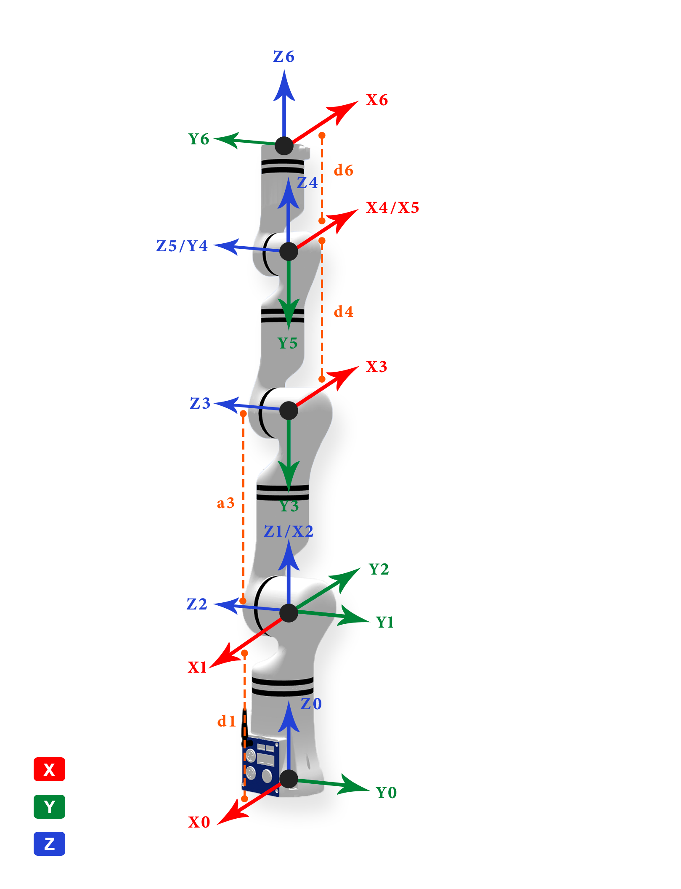
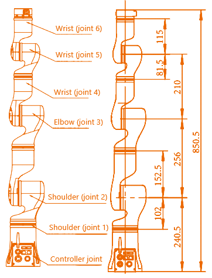
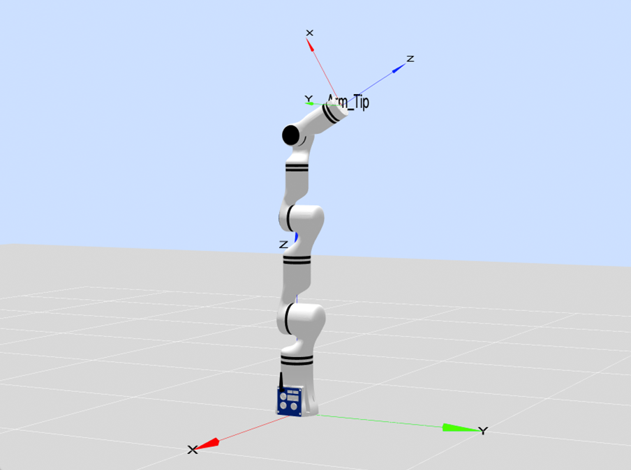
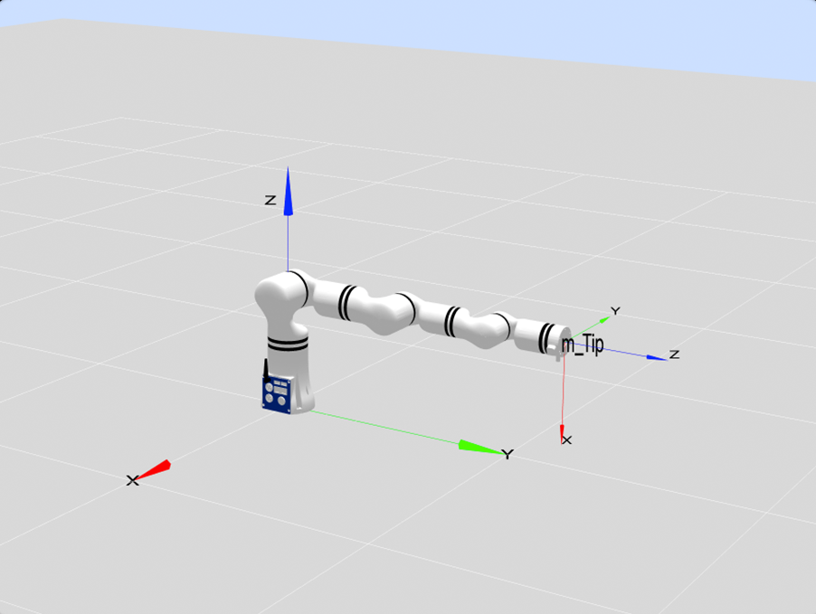
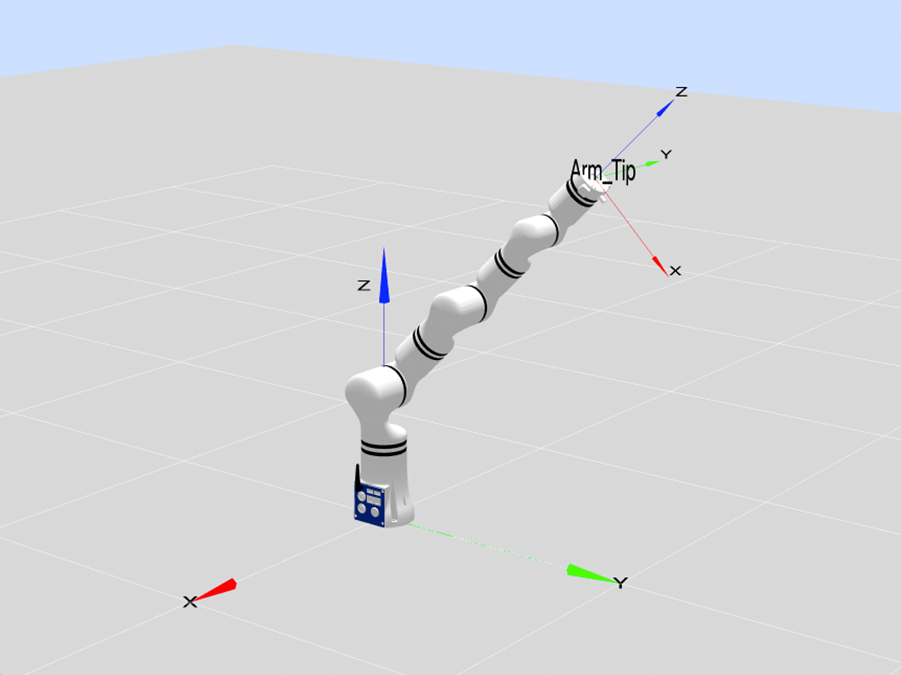
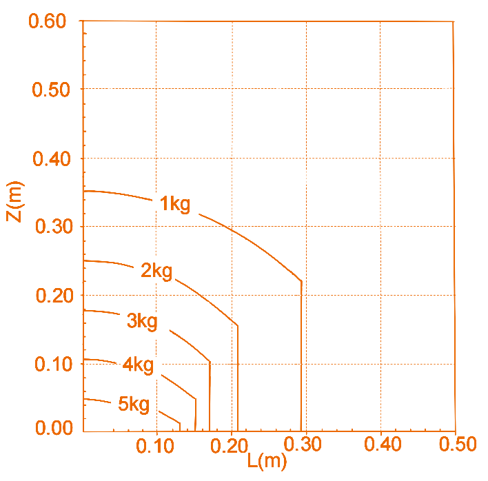

# 
Ontology Parameters: 
RM65 Series Parameters and D-H Model

## Basic Parameters

<table>
    <tr>
        <th colspan="2">Parameter Name</th>
        <th>Parameter Value</th>
    </tr>
    <tr>
        <th rowspan="13">Basic Parameters</th>
        <th>Degrees of Freedom</th>
        <td>6</td>
    </tr>
    <tr>
        <th>Configuration</th>
        <td>Humanoid Configuration</td>
    </tr>
    <tr>
        <th>Joint Brake Type</th>
        <td>Joints 1 to 3: Hard Brake Joints 4 to 6: Soft Brake</td>
    </tr>
    <tr>
        <th>Working Radius/mm</th>
        <td>Standard Version: 610 Six-Axis Force L Version: 627 Six-Axis Force K Version: 638.5</td>
    </tr>
    <tr>
        <th>Payload/kg</th>
        <td>5</td>
    </tr>
    <tr>
        <th>Self-weight/kg</th>
        <td>Standard Version: 7.2 Six-Axis Force Version: 7.3</td>
    </tr>
    <tr>
        <th>Repeatability/mm</th>
        <td>±0.05</td>
    </tr>
    <tr>
        <th>TCP Line Speed/m/s</th>
        <td>≤1.8</td>
    </tr>
    <tr>
        <th>Typical Power/W</th>
        <td>≤100</td>
    </tr>
    <tr>
        <th>Peak Power/W</th>
        <td>≤200</td>
    </tr>
    <tr>
        <th>Installation Angle</th>
        <td>Any Angle</td>
    </tr>
    <tr>
        <th>Base Dimensions/mm</th>
        <td>φ107</td>
    </tr>
    <tr>
        <th>Material</th>
        <td>Aluminum Alloy/ABS</td>
    </tr>
    <tr>
        <th rowspan="3">Environmental Adaptability</th>
        <th>Operating Temperature/℃</th>
        <td>0-45</td>
    </tr>
    <tr>
        <th>Operating Humidity</th>
        <td>25~85% Non-condensing</td>
    </tr>
    <tr>
        <th>Protection Level</th>
        <td>Body IP54</td>
    </tr>
    <tr>
        <th rowspan="6">Motion Angle Range/°</th>
        <th>J1</th>
        <td>-178~+178</td>
    </tr>
    <tr>
        <th>J2</th>
        <td>-130~+130</td>
    </tr>
    <tr>
        <th>J3</th>
        <td>-135~+135</td>
    </tr>
    <tr>
        <th>J4</th>
        <td>-178~+178</td>
    </tr>
    <tr>
        <th>J5</th>
        <td>-128~+128</td>
    </tr>
    <tr>
        <th>J6</th>
        <td>-360~+360</td>
    </tr>
    <tr>
        <th rowspan="6">Maximum Angular Velocity/°/s</th>
        <th>J1</th>
        <td>180</td>
    </tr>
    <tr>
        <th>J2</th>
        <td>180</td>
    </tr>
    <tr>
        <th>J3</th>
        <td>225</td>
    </tr>
    <tr>
        <th>J4</th>
        <td>225</td>
    </tr>
    <tr>
        <th>J5</th>
        <td>225</td>
    </tr>
    <tr>
        <th>J6</th>
        <td>225</td>
    </tr>
    <tr>
        <th rowspan="2">Force Control Specifications (Supported only by 6-DoF sensors)</th>
        <th>Six-Axis Force Range</th>
        <td>200N/7N·m</td>
    </tr>
    <tr>
        <th>Six-Axis Force Accuracy</th>
        <td>±0.5%FS</td>
    </tr>
</table>

## Ontology Parameters

**MDH model frame:**

  

**MDH parameters of RM65 (modified D-H parameters):**

|joint_id(i)|$a_{i-1}$(mm)|$\alpha_{i -1}$(°)|$d_i$(mm)|$θ_i$ / $offset_i$(°)|
|:--|:--|:--|:--|:--|
|   1   |   0   |   0   |  240.5|   0   |
|   2   |   0   |   90  |   0   |   90  |
|   3   |   256 |   0   |   0   |   90  |
|   4   |   0   |   90  |   210 |   0   |
|   5   |   0   |   -90 |   0   |   0   |
|   6   |   0   |   90  | $d_6$ |   0   |

- RM65-B &nbsp;&nbsp;&nbsp;&nbsp;: $d_6=144$ mm
- RM65-6FB: $d_6=161.2$ mm
- RM65-6F &nbsp;&nbsp;: $d_6=172.5$ mm

Note: offset refers to the offset of the joint zero position from the model zero position, that is, `model angle = joint angle + offset`.

### Kinetic parameters of RM65 robot link

|   joint_id(i)   |  1     |  2     |  3     |  4     |  5     |  6     |  -     |-|
|:--   |:--     |:--     |:--     |:--     |:--     |:--     |:--     |:--|
| **$m$**       | 1.51   | 1.653  | 0.726  | 0.671  | 0.647  | 0.107  | 0.248  |0.189|
| **$x$**       | 0.491  | 183.722 | 0.029  | 0.007  | 0.032  | -0.506 | -0.426 |-0.352|
| **$y$**       | 7.803  | 0.103  | -90.105 | -9.486 | -83.769 | 0.255  | 0.237  |-0.067|
| **$z$**       | -10.744 | -1.665 | 4.039  | -8.041 | 2.326  | -10.801 | -27.223 |-18.302|
| **$L_{xx}$**  | 2928.466 | 1711.553 | 7259.884 | 794.014 | 5375.604 | 50.918 | 308.844 |133.613|
| **$L_{xy}$**  | -32.63 | -38.271 | 2.994  | -0.821 | 2.665  | -3.136 | -3.781 |0.522|
| **$L_{xz}$**  | -5.816 | 2314.91 | -0.314 | -0.655 | -0.304 | -0.699 | -1.468 |1.623|
| **$L_{yy}$**  | 2506.35 | 70514.722 | 371.872 | 596.235 | 285.265 | 47.42 | 304.616 |130.260|
| **$L_{yz}$**  | 47.925 | 6.507  | 44.451  | -34.785 | 14.235 | 0.388  | 0.888  |0.531|
| **$L_{zz}$**  | 1756.017 | 70036.186 | 7228.758 | 486.228 | 5359.769 | 60.35 | 122.62 |89.503|
| **Remarks**       |        |        |        |        |        | B      | 6F    |6FB|

Description:

- $m$ is the mass of the link, $kg$
- $x$ is the x-coordinate of the center of mass of link, $mm$
- $y$ is the y-coordinate of the center of mass of link, $mm$
- $z$ is the z-coordinate of the center of mass of link, $mm$
- $L_{xx}$,$L_{xy}$,$L_{xz}$,$L_{yy}$,$L_{yz}$,$L_{zz}$ is the principal moment of inertia described in the link frame, $kg·mm²$
- B: standard version, 6FB: Six-Axis Force L Version, 6F: six-axis force K version

Remarks:

- Source of data: CAD design values.
- If the inertial parameters in the center of mass frame are required, they can be calculated based on the parallel axis theorem, as stated below.

---

Assuming there is an output frame $\{i\}$, the center of mass frame coinciding with this coordinate system $\{i\}$ is $\{c\}$, and the coordinates of the center of mass in this frame $\{i\}$ are $P_c = [x_c  , y_c, z_c]^T$, then according to the parallel axis theorem:

$$I_c = L_i - m (P_{c}^{T}P_cI_{3×3} - P_cP_{c}^{T})$$

Where,
$$
L_i = \begin{bmatrix}L_{xx} & L_{xy} & L_{xz} \\ L_{xy} & L_{yy} & L_{yz} \\ L_{xz} & L_{yz} & L_{zz}\end{bmatrix}
$$

### Distribution and dimensions of joints

The RM65-B humanoid robotic arm has six rotating joints, each of which represents one degree of freedom. As shown in the figure below, robot joints include the shoulders (joint 1 and joint 2), elbow (joint 3), and wrists (joint 4, joint 5, and joint 6).

#### Workspace

The workspace of RM65-B is a sphere with a working radius of 610 mm, in addition to the cylindrical space directly above and below the base. When determining the installation position of the robot, due considerations must be given to the cylindrical space directly above and below the robot, to avoid moving tools to this cylindrical space as much as possible. Furthermore, in actual applications, the motion ranges of all joints are as follows: joint 1: ±178°; joint 2: ±130°; joint 3: ±135°; joint 4: ±178°; joint 5: ±128°; joint 6: ±360°.

Illustration of space within the reach of robot

Seen from the cross-section of the workspace, the area with good maneuverability of the 6-axis robot is as indicated by the yellow dotted line in the following figure, an annular area in the workspace as a whole.

Illustration of area with good maneuverability

#### Motion singularities

##### Shoulder singularity

Co-line of wrist center point C (axis intersection of joint 5 and joint 6) with axis of joint 1, indicated point [0,43.4,-105.7,0,-30,0], as shown in the figure below:

Shoulder singularity

The special situation of co-axis of joint 1 with joint 6, and co-line of point C with axis of joint 1, indicated point [0,43.4,-105.7,0,62.3,0], as shown in the figure below:

Shoulder singularity

##### Elbow singularity

q3=0, i.e. the point format is [x,x,0,x,x,x], indicated point [-90,60,0,0,90,0], as shown in the figure below:

Elbow singularity

Co-axis of joint 1 and joint 4 (a special situation of q3=0), i.e. the point format is [x,0,0,x,x,x], indicated point [0,0,0,90,-60,0], as shown in the figure below:

**Elbow singularity**  

Co-axis of joint 1, joint 4, and joint 6 (a special situation of q3=0), i.e. the point format is [x,0,0,x,0,x], indicated point [0,0,0,90,0,0], as shown in the figure below:

Elbow singularity

##### Wrist singularity

Co-axis of joint 4 and joint 6, q5=0, i.e. the point format is [x,x,x,x,0,x], indicated point [0,60,30,0,0,0], as shown in the figure below:

Wrist singularity

##### Boundary singularity

The end of robotic arm reaches the farthest end (a special situation of q3=0), i.e. the point format is [x,x,x,0,x,0,x], indicated points [0,0,0,0,0,0], [-90,90,0,0,0,0], and [-90,45,0,0,0,0], as shown in the figure below:

Boundary singularity 1

Boundary singularity 2

Boundary singularity 3

#### Load curves

Represent the curves of end load of RM65-B and RM65-6F and RM65-6FB, respectively. Where, L refers to the radial distance of the center of mass of end load against the plane of end flange, and Z refers to the normal distance of the center of mass of end load against the plane of end flange.

End load curves of RM65-B

End load curves of RM65-6F

End load curves of RM65-6FB

