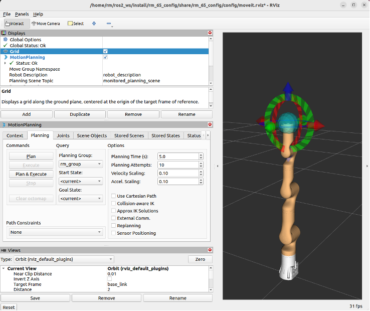

# <p class="hidden">ROS: </p>Introduction to the Rm_bringup Package

The rm_bringup package is intended to enable multiple launch files to run at the same time and is used to start a complex function combining multiple nodes with one command.

1. Package application.
2. Package structure description.
3. Package topic description.

The above three parts are provided for users to:

1. Learn how to use the package.
2. Understand the composition and function of files in the package.
3. Know the topics of the package for easy development and use.

Code link: [https://github.com/RealManRobot/rm\_robot/tree/main/rm\_bringup](https://github.com/RealManRobot/rm_robot/tree/main/rm_bringup)

## 1. Application of the rm_bringup package

### 1.1 Control of the real robotic arm with moveit

After the environment configuration and connection are complete, the node can be started directly by the following command to run the launch file in the rm_bringup package.

```ros
roslaunch rm_bringup rm_<arm_type>_robot.launch
```

Generally, the above `<arm_type>` is required for the actual type of the robotic arm and optional for 65, 63, ECO65, 75, 65_6f, 63_6f, ECO65_6f, 75_6f, and GEN72.

For the 65 robotic arm, its start command is as follows:

Firstly, run the rm_control node.

```ros
roslaunch rm_control rm_65_control.launch
```

Then, run the bringup node.

```ros
roslaunch rm_bringup rm_65_robot.launch
```

After the node is started successfully, the following screen will pop up.



The launch file enables the moveit to control the real robotic arm. Then, the control ball is available for planning and controlling the motion of the robotic arm. For details, please refer to [rm_moveit_config](../moveitConfig/index.md).

## 2. Structure description of the rm_bringup package

### 2.1 File overview

The current rm_bringup package consists of the following files.

```
├── CMakeLists.txt  # Build rule file
├── launch
│   ├── rm_63_6f_robot.launch        # RML63_6f launch file
│   ├── rm_63_robot.launch           # RML63 launch file
│   ├── rm_65_6f_robot.launch        # RM65_6f launch file
│   ├── rm_65_robot.launch           # RM65 moveit launch file
│   ├── rm_75_6f_robot.launch        # RM75_6f launch file
│   ├── rm_75_robot.launch           # RM75 moveit launch file
│   ├── rm_eco65_6f_robot.launch     # ECO65_6f launch file
│   ├── rm_eco65_robot.launch        # ECO65 moveit launch file
│   └── rm_gen72_robot.launch        # GEN72 moveit launch file
└── package.xml
```

## 3. Topic description of the rm_bringup package

The package does not have any topics at present, but it calls the topic from other packages. For topics about the moveit, please refer to [rm_moveit_config](../moveitConfig/index.md).
