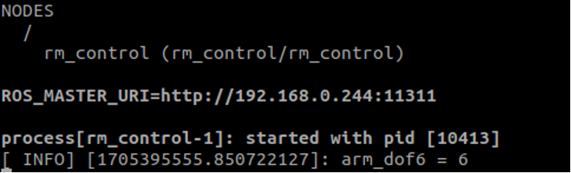
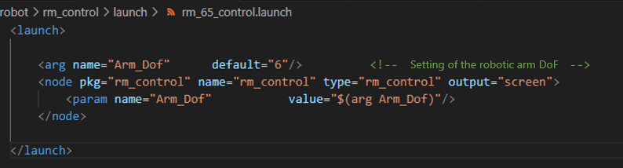

# <p class="hidden">ROS: </p>Introduction to the Rm_control Package

The rm_control package is essential for the moveit to control the real robotic arm. It is intended to subdivide the trajectory planned by the moveit and send the subdivided trajectory to the rm_driver in a pass-through manner to realize the planned motion of the robotic arm.

1. Package application.
2. Package structure description.
3. Package topic description.

The above three parts are provided for users to:

1. Learn how to use the package.
2. Understand the composition and function of files in the package.
3. Know the topics of the package for easy development and use.

Code link: [https://github.com/RealManRobot/rm_robot/tree/main/rm_control](https://github.com/RealManRobot/rm_robot/tree/main/rm_control)

## 1. Application of the rm_control package

### 1.1 Basic use of the package

After the environment configuration and connection are complete, the node can be started directly by the following command to run the rm_control package.

```ros
roslaunch rm_control rm_<arm_type>_control.launch
```

Generally, the above `<arm_type>` is required for the actual type of the robotic arm and optional for 65, 63, ECO65, 75, and GEN72.

For the 65 robotic arm, its start command is as follows:

```ros
roslaunch rm_control rm_65_control.launch
```

After the node is started successfully, the following screen will pop up.



The node is valid only with the rm_driver package and related nodes of the moveit. For details, please refer to [rm_moveit_config](../moveitConfig/index.md).

### 1.2 Advanced use of the package

Some parameters can be set in the rm_control package, which can be directly viewed in the launch file.



Currently, the file has only one parameter.

Arm_Dof: refers to the degree of freedom of the robotic arm, which should be set as 6 for RM65, RML63, ECO65, and 7 for RM75.

## 2. Structure description of the rm_control package

### 2.1 File overview

The current rm_control package consists of the following files.

```
├── CMakeLists.txt             #Build rule file
├── launch
│ ├── rm_63_control.launch     #RML63 launch file
│ ├── rm_65_control.launch     #RM65 launch file
│ ├── rm_75_control.launch     #RM75 launch file
│ ├──rm_eco65_control.launch   #ECO65 launch file
│ └── rm_gen72_control.launch  #GEN72 launch file
├── package.xml                       #Dependency declaration file
└── src
├── cubicSpline.h              #Cubic spline interpolation header file
└── rm_control.cpp             #Source code file
```

## 3. Topic description of the rm_control package

The following are the topics of the package.

```
    /joint_states
    /rm_driver/ArmError
    /rm_driver/Clear_System_Err
    /rm_driver/JointPos
    /rm_group/follow_joint_trajectory/cancel
    /rm_group/follow_joint_trajectory/feedback
    /rm_group/follow_joint_trajectory/goal
    /rm_group/follow_joint_trajectory/result
    /rm_group/follow_joint_trajectory/status
    /rosout
    /rosout_agg
```

The following topics require the most attention:

`Publishers`: refers to the topic currently published, mainly including /rm_driver/JointPos. Through this topic, the subdivided trajectory is published to the rm_driver, and then the rm_driver sends the trajectory to the robotic arm through a pass-through command.

Action Servers: refers to the action accepted and published. The rm_group/follow_joint_trajectory action is a communication bridge between the rm_control and the moveit. Through this action, the rm_control receives the trajectory planned by moveit, and then subdivides the trajectory and sends it to the rm_driver through the above topic.
