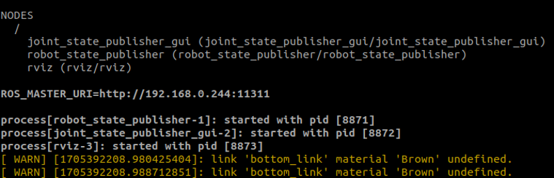
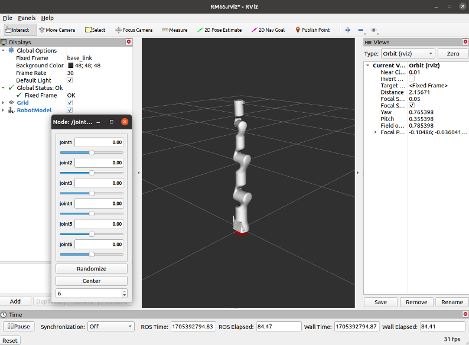
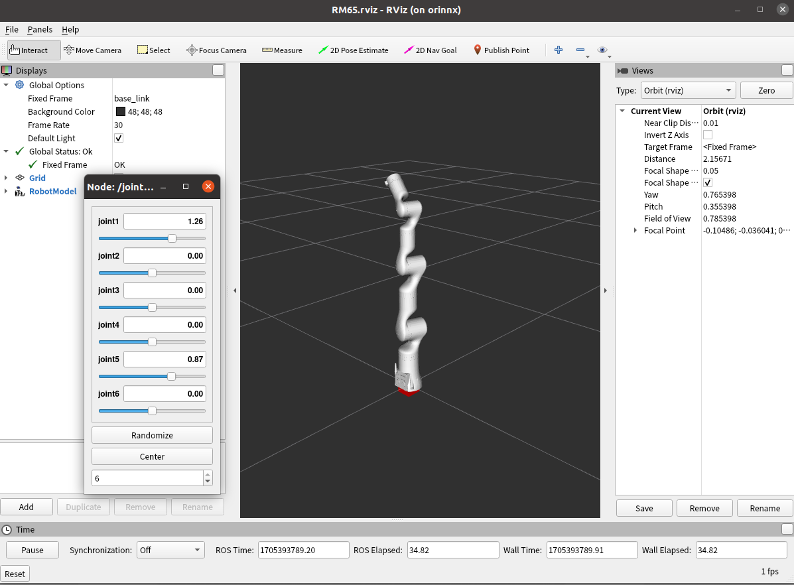

# <p class="hidden">ROS: </p>Introduction to the Rm_description Package

The rm_description package is intended to display the robot model and TF, through which, the virtual robotic arm in the computer is linked with the real robotic arm in reality. Additionally, it is important for the control of moveit2.

1. Package application.
2. Package structure description.
3. Package topic description.

The above three parts are provided for users to:

1. Learn how to use the package.
2. Understand the composition and function of files in the package.
3. Know the topics of the package for easy development and use.

Code link: [https://github.com/RealManRobot/rm/robot/tree/main/rm/description](https://github.com/RealManRobot/rm_robot/tree/main/rm_description)

## 1. Application of the rm_description package

After the environment configuration and connection are complete, the node can be started directly by the following command to run the rm_description package.

```ros
roslaunch rm_description rm_<arm_type>_display.launch
```

Generally, the above `<arm_type>` is required for the actual type of the robotic arm and optional for 65, 63, ECO65, 75, and GEN72.

For the 65 robotic arm, its start command is as follows:

```ros
roslaunch rm_description rm_65_display.launch
```

After the node is started successfully, the following screen will pop up.



If the start succeeds, you can check the state of the robotic arm in rviz.



You can also control the motion of the robotic arm by dragging the slider on the left.



## 2. Structure description of the rm_description package

### 2.1 File overview

The current m_description package consists of the following files.

```ros
├── CMakeLists.txt                               #Build rule file
├── config                                       #Display configuration file of the rviz
│ ├── ECO65.rviz
│ ├── GEN72.rviz
│ ├── joint_names_rm_65_description.yaml
│ ├── RM65.rviz
│ ├── RM75.rviz
│ └── RML63.rviz
├── launch                                       #URDF and XACRO loading display file
│ ├── ECO65
│ │ ├── rm_eco65_6f_display.launch
│ │ ├── rm_eco65_display.launch                  #Display of loading ECO65 launch node
│ │ ├── rm_eco65_display_xacro.launch
│ │ └── rm_eco65_gazebo.launch
│ ├── GEN72
│ │ ├──rm_gen72_gazebo.launch
│ │ ├── rm_gen72_display.launch                  #Display of loading GEN72 launch node
│ │ └── rm_gen72_display_xacro.launch
│ ├── RM65
│ │ ├── rm_65_6f_display.launch
│ │ ├── rm_65_display.launch                     #Display of loading RM65 launch node
│ │ ├── rm_65_display_y_90.launch
│ │ └── rm_65_gazebo.launch
│ ├── RM75
│ │ ├── rm_75_6f_display.launch
│ │ ├── rm_75_display.launch                  #Display of loading RM75 launch node
│ │ └── rm_75_display_urdf.launch
│ └── RML63
│ ├── display_rml63_bottom.launch
│ ├── rm_63_6f_display.launch
│ │ ├── rm_63_display.launch                     #Display of loading RML63 launch node
│ └── rm_63_gazebo.launch
├── meshes                                       #Location of the robotic arm model
│ ├── ECO65
│ │ ├── baselink.STL
│ │ ├── Link1.STL
│ │ ├── Link2.STL
│ │ ├── Link3.STL
│ │ ├── Link4.STL
│ │ ├── Link5.STL
│ │ └── Link6.STL
│ ├── ECO65_6F
│ │ ├── base_link.STL
│ │ ├── Link1.STL
│ │ ├── Link2.STL
│ │ ├── Link3.STL
│ │ ├── Link4.STL
│ │ ├── Link5.STL
│ │ └── Link6.STL
│ ├── GEN72
│ │ ├── base_link.STL
│ │ ├── Link1.STL
│ │ ├── Link2.STL
│ │ ├── Link3.STL
│ │ ├── Link4.STL
│ │ ├── Link5.STL
│ │ ├── Link6.STL
│ │ └── Link7.STL
│ ├── RM65
│ │ ├── base_link.STL
│ │ ├── link1.STL
│ │ ├── link2.STL
│ │ ├── link3.STL
│ │ ├── link4.STL
│ │ ├── link5.STL
│ │ └── link6.STL
│ ├── RM65_6F
│ │ ├── base_link.STL
│ │ ├── Link1.STL
│ │ ├── Link2.STL
│ │ ├── Link3.STL
│ │ ├── Link4.STL
│ │ ├── Link5.STL
│ │ └── Link6.STL
│ ├── RM75
│ │ ├── base_link.STL
│ │ ├── link1.STL
│ │ ├── link2.STL
│ │ ├── link3.STL
│ │ ├── link4.STL
│ │ ├── link5.STL
│ │ ├── link6.STL
│ │ └── link7.STL
│ ├── RM75_6F
│ │ ├── base_link.STL
│ │ ├── Link1.STL
│ │ ├── Link2.STL
│ │ ├── Link3.STL
│ │ ├── Link4.STL
│ │ ├── Link5.STL
│ │ ├── Link6.STL
│ │ └── Link7.STL
│ ├── RML63
│ │ ├── base_link.STL
│ │ ├── link1.STL
│ │ ├── link2.STL
│ │ ├── link3.STL
│ │ ├── link4.STL
│ │ ├── link5.STL
│ │ └── link6.STL
│ └── RML63_6F
│ ├── base_link.STL
│ ├── Link1.STL
│ ├── Link2.STL
│ ├── Link3.STL
│ ├── Link4.STL
│ ├── Link5.STL
│ └── Link6.STL
├── package.xml
└── urdf                                             #Location of the robotic arm URDF and XACRO model description file
├── ECO65
│ ├── eco65.csv
│ ├── eco65.urdf
│ ├── rm_eco65.gazebo.xacro
│ ├── rm_eco65.transmission.xacro
│ └── rm_eco65.urdf.xacro
├── ECO65_6F
│ ├── eco65.csv
│ ├── eco65.urdf
│ ├── rm_eco65_6f_description.urdf
│ └── rm_eco65_6f_description.urdf.xacro
├── GEN72
│ ├── GEN72.csv
│ ├── GEN72.urdf
│ ├── rm_gen72.gazebo.xacro
│ ├── rm_gen72.transmission.xacro
│ └── rm_gen72.urdf.xacro
├── RM65
│ ├── rm_65_description.csv
│ ├── rm_65.gazebo.xacro
│ ├── rm_65.transmission.xacro
│ ├── rm_65.urdf
│ ├── rm_65.urdf.xacro
│ ├── rm_65.urdf (copy).xacro
│ └── rm_65_y_90.urdf.xacro
├── RM65_6F
│ ├── rm_65_6f_description.csv
│ ├── rm_65_6f_description.urdf
│ └── rm_65_6f_description.urdf.xacro
├── RM75
│ ├── rm_75_bottom.urdf.xacro
│ ├── rm_75_description.csv
│ ├── rm_75.gazebo.xacro
│ ├── rm_75.transmission.xacro
│ └── rm_75.urdf
├── RM75_6F
│ ├── rm_75_6f_description.csv
│ ├── rm_75_6f_description.urdf
│ └── rm_75_6f_description.urdf.xacro
├── RML63
│ ├── rml_63_bottom.urdf.xacro
│ ├── rml_63_description.csv
│ ├── rml_63_description.urdf
│ ├── rml_63.gazebo.xacro
│ └── rml_63.transmission.xacro
└── RML63_6F
├── rm_63_6f_description.csv
├── rm_63_6f_description.urdf
└── rm_63_6f_descriptio.urdf.xacro
```

## 3. Topic description of the rm_description package

The following are the topics of the package.

```ros
    /clicked_point
    /initialpose
    /joint_states
    /move_base_simple/goal
    /rosout
    /rosout_agg
    /tf
    /tf_static
```

The following topics require the most attention.

/joint_states: refers to the topic subscribed, indicating the current state of the robotic arm. It is published when the rm_driver package runs, and then the model in rviz moves according to the actual state of the robotic arm. When the rm_<arm_type>_display.launch runs, a virtual topic of /joint_states is published for the robot_state_publisher to subscribe.

Publishers: refers to the topic currently published, mainly including /tf and /tf_static, which describe the frame transformation (TF) relationship between the joint of the robotic arm and the joint.

There is very little information on the remaining topics and their usage scenes, but you can do your own research.
